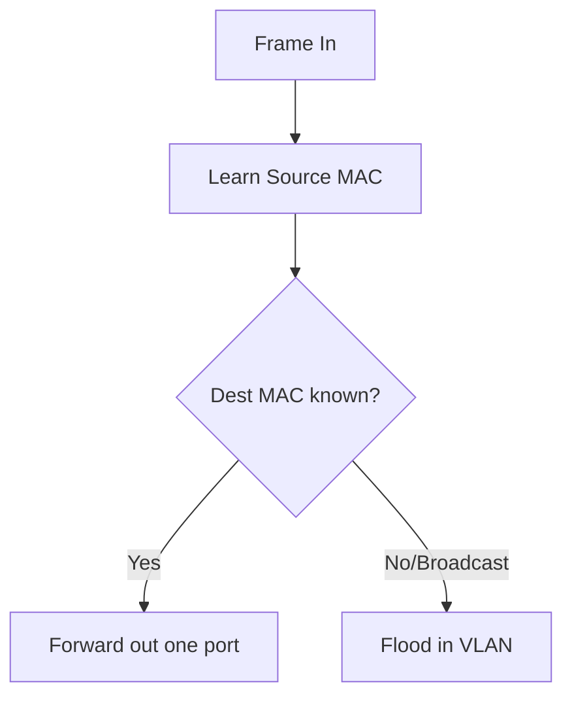

# 🌐 Layer 2 Switching — Master Knowledge Base


## 📑 Index

1. [What is Layer 2 Switching?](#1-what-is-layer-2-switching)
2. [Why do we need it? (The Problem it Solves)](#2-why-do-we-need-it-the-problem-it-solves)
3. [How it relates to the broader network](#3-how-it-relates-to-the-broader-network)
4. [Key Component 1 — The Ethernet Frame](#4-key-component-1--the-ethernet-frame)
5. [Key Component 2 — The MAC/CAM Table](#5-key-component-2--the-maccam-table)
6. [Key Component 3 — Switching Logic](#6-key-component-3--switching-logic)
7. [Safety & Security Features](#7-safety--security-features)
8. [Who created it / Standards](#8-who-created-it--standards)
9. [Types / Variations](#9-types--variations)
10. [Flow of Phases / How it Works](#10-flow-of-phases--how-it-works)
11. [States and Timers](#11-states-and-timers)
12. [Advanced / Extra Features](#12-advanced--extra-features)
13. [Configuration & Troubleshooting Workflow](#13-configuration--troubleshooting-workflow)

---

## 1. What is Layer 2 Switching?

- The process of **forwarding frames** within a LAN using **MAC addresses**, performed by switches at the Data Link Layer.
- **Analogy** 🏢: A switch is the **mailroom clerk** who reads the room number (MAC) on each envelope and hand-delivers it to the exact desk — never the whole floor.

## 2. Why do we need it? (The Problem it Solves)

- Replaces **hubs**, which flooded everything and shared one collision domain.
- Provides **dedicated bandwidth per port**, **microsegmentation**, and **intelligent forwarding**.

## 3. How it relates to the broader network

- The backbone of your Access layer (**ACC-SW1–4**) and collapsed core (**CORE-SW1/2**).
- Hands frames up to **L3** only when crossing VLANs (20/30/40).

## 4. Key Component 1 — The Ethernet Frame
- The L2 PDU carrying Src/Dst MAC + payload + FCS. *(Full detail in `ethernet-frame.md`.)*

## 5. Key Component 2 — The MAC/CAM Table
- The switch's forwarding database mapping **MAC ↔ Port ↔ VLAN**. *(Full detail in `mac-cam-table.md`.)*

## 6. Key Component 3 — Switching Logic
- **Learn** from source MAC → **Forward / Flood / Filter** based on destination.

## 7. Safety & Security Features
- **Port Security**, **BPDU Guard**, **DHCP Snooping**, **DAI**.

## 8. Who created it / Standards
- **IEEE 802.3** (Ethernet), **802.1D** (bridging), **802.1Q** (VLAN tagging).

## 9. Types / Variations
- **Store-and-Forward**, **Cut-Through**, **Fragment-Free** switching methods.

## 10. Flow of Phases / How it Works



## 11. States and Timers
- **CAM Aging** = 300s; **IFG** = 96 bit-times.

## 12. Advanced / Extra Features
- **QoS (CoS)** for Voice VLAN 40, **EtherChannel**, **STP** integration.

## 13. Configuration & Troubleshooting Workflow

### Phase 1: Port Selection & Preparation
```
ACC-SW1(config)# interface FastEthernet0/1
ACC-SW1(config-if)# no shutdown
```
### Phase 2: Base Configuration
```
ACC-SW1(config-if)# switchport mode access
ACC-SW1(config-if)# switchport access vlan 20
```
### Phase 3: Hardening & Security
```
ACC-SW1(config-if)# switchport port-security
ACC-SW1(config-if)# spanning-tree bpduguard enable
```
### Phase 4: Verification Flow
```
ACC-SW1# show mac address-table
ACC-SW1# show interfaces status
```
### Phase 5: Advanced Debugging
```
ACC-SW1# show interfaces FastEthernet0/1 counters errors
ACC-SW1# clear counters
```
