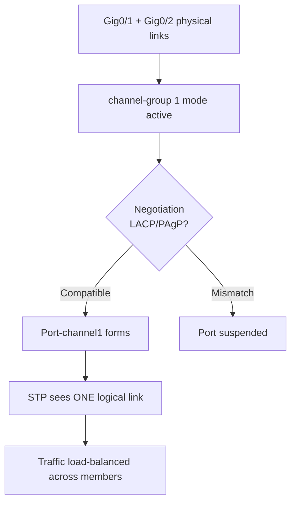

# `Etherchannel Concepts`

## Index

1. [What is EtherChannel?](#1-what-is-etherchannel)
2. [Why do we need it? (The Problem it Solves)](#2-why-do-we-need-it-the-problem-it-solves)
3. [How it relates to the broader network](#3-how-it-relates-to-the-broader-network)
4. [Key Component 1 — The Port-Channel Interface](#4-key-component-1--the-port-channel-interface)
5. [Key Component 2 — Member Ports](#5-key-component-2--member-ports)
6. [Key Component 3 — Consistency Requirements](#6-key-component-3--consistency-requirements)
7. [Safety & Security Features](#7-safety--security-features)
8. [Who created it / Standards](#8-who-created-it--standards)
9. [Types / Variations](#9-types--variations)
10. [Flow of Phases / How it Works](#10-flow-of-phases--how-it-works)
11. [States and Timers](#11-states-and-timers)
12. [Advanced / Extra Features](#12-advanced--extra-features)
13. [Configuration & Troubleshooting Workflow](#13-configuration--troubleshooting-workflow)

---

## 1. What is EtherChannel?

- **EtherChannel** (link aggregation) bundles **multiple physical links** into a **single logical link** — combining their bandwidth and providing redundancy.
- STP treats the bundle as **one port**, so it does **not block** any member links.
- **Analogy** 🛣️: Merging several **single-lane roads into one multi-lane highway**. Traffic control (STP) sees it as *one road*, so no lanes get closed — you get the combined capacity of all of them.

## 2. Why do we need it? (The Problem it Solves)

- **STP blocks** redundant links to prevent loops — meaning half your uplink bandwidth sits **idle**.
- EtherChannel solves:
  - **Bandwidth** → aggregate multiple links (e.g., 2× 1Gbps = 2Gbps logical).
  - **No wasted links** → STP won't block bundled members.
  - **Redundancy** → if one member fails, traffic instantly shifts to survivors (sub-second, no STP reconvergence).

## 3. How it relates to the broader network

- Perfect for the **redundant uplinks** between `ACC-SW1–4` and `CORE-SW1/2`.
- Turns two blocked-by-STP links into **one active high-bandwidth trunk**.
- Combines beautifully with trunking → a **Layer 2 EtherChannel trunk** carrying VLANs 20/30/40.

## 4. Key Component 1 — The Port-Channel Interface

- A **logical interface** (e.g., `Port-channel1`) representing the whole bundle.
- Configuration applied here (trunking, VLANs, etc.) is **inherited by all member ports**.
- Also called a **LAG (Link Aggregation Group)**.

## 5. Key Component 2 — Member Ports

- The **physical interfaces** assigned to the channel group (e.g., `Gig0/1` and `Gig0/2`).
- Assigned via the `channel-group <#> mode <mode>` command.
- The channel-group **number** must be locally consistent; it links the physical ports to the port-channel.

## 6. Key Component 3 — Consistency Requirements

All member ports **must match** or the bundle fails to form:

| Parameter | Must Match? |
|-----------|:---:|
| **Speed** | ✅ |
| **Duplex** | ✅ |
| **Switchport mode** (access/trunk) | ✅ |
| **Allowed VLANs / native VLAN** | ✅ |
| **STP settings** | ✅ |

- **Note:** Mismatches cause a port to be **suspended** from the channel.

## 7. Safety & Security Features

- **Consistency checks** → protect against misbundled links.
- **Misconfig Guard** → PAgP/LACP detect mismatched configs and refuse to bundle (safer than static "on").
- **STP still runs on the logical channel** → loop protection is preserved.

## 8. Who created it / Standards

- **LACP** → IEEE **802.3ad** (later **802.1AX**) — the open standard.
- **PAgP** → Cisco-proprietary negotiation protocol.
- **Static ("on")** → no protocol, manual bundling.

## 9. Types / Variations

| Type | Layer | Use Case |
|------|-------|----------|
| **Layer 2 EtherChannel** | L2 | Trunk/access bundles (your ACC↔CORE) |
| **Layer 3 EtherChannel** | L3 | Routed links (assign IP to port-channel) |
| **LACP** | — | Open-standard negotiation |
| **PAgP** | — | Cisco negotiation |
| **Static (on)** | — | No negotiation (risky) |

## 10. Flow of Phases / How it Works



## 11. States and Timers

| State / Timer | Detail |
|---------------|--------|
| **Bundled (P)** | Port is active in the channel |
| **Suspended (s)** | Config mismatch — excluded |
| **Standalone (I)** | Individual, not bundled |
| **LACP timer** | Fast (1s) or Slow (30s) keepalive |

## 12. Advanced / Extra Features

- **Load balancing** → distributes traffic across members via hashing (see `layer2-load-balancing.md`).
- **Min-links** → require a minimum number of active links or bring the channel down.
- **MEC / Cross-stack EtherChannel** → bundle across two physical switches (needs StackWise/VSS) — eliminates STP blocking on core uplinks entirely.
- **LACP max-bundle** → cap active links, keep others as hot standby.

---

## 13. Configuration & Troubleshooting Workflow

### Phase 1: Port Selection & Preparation
- Select the **matching redundant uplinks** on `ACC-SW1` toward `CORE-SW1` (e.g., `Gig0/1 - 2`). Ensure both ends are identical.
```
ACC-SW1> enable
ACC-SW1# configure terminal
ACC-SW1(config)# default interface range GigabitEthernet0/1 - 2
ACC-SW1(config)# interface range GigabitEthernet0/1 - 2
ACC-SW1(config-if-range)# description ** EtherChannel to CORE-SW1 **
ACC-SW1(config-if-range)# shutdown
```
- **Best practice:** `shutdown` members *before* bundling to avoid a transient loop, then `no shutdown` after.

### Phase 2: Base Configuration
- Bundle the ports (using **LACP** — the open standard) and configure the logical interface as a trunk:
```
ACC-SW1(config-if-range)# channel-group 1 mode active
ACC-SW1(config-if-range)# exit
ACC-SW1(config)# interface Port-channel1
ACC-SW1(config-if)# switchport trunk encapsulation dot1q
ACC-SW1(config-if)# switchport mode trunk
ACC-SW1(config-if)# switchport trunk allowed vlan 20,30,40
ACC-SW1(config-if)# exit
ACC-SW1(config)# interface range GigabitEthernet0/1 - 2
ACC-SW1(config-if-range)# no shutdown
```
> **Note:** Configure `CORE-SW1` with a compatible mode — `active` (LACP) on both, **or** `active`↔`passive`. Two `passive` ends will **never** form.

### Phase 3: Hardening & Security
- Enforce a minimum link count and disable DTP on the bundle:
```
ACC-SW1(config)# interface Port-channel1
ACC-SW1(config-if)# switchport nonegotiate
ACC-SW1(config-if)# port-channel min-links 1
ACC-SW1(config-if)# switchport trunk native vlan 999
```
- **Why:** `nonegotiate` prevents DTP-based attacks on the trunk; native VLAN 999 mitigates double-tagging.

### Phase 4: Verification Flow
Run these `show` commands **in this order**:
```
ACC-SW1# show etherchannel summary
ACC-SW1# show etherchannel 1 port-channel
ACC-SW1# show interfaces Port-channel1 switchport
ACC-SW1# show lacp neighbor
ACC-SW1# show spanning-tree interface Port-channel1
```
- **What to look for:**
  - `show etherchannel summary` → Port-channel state **`(SU)`** = in-use Layer 2; members show **`(P)`** = bundled.
  - Protocol column shows **LACP**.
  - `show spanning-tree` → STP sees a **single** `Po1` interface (not two separate links).

### Phase 5: Advanced Debugging
- If the channel won't form or members are suspended:
```
ACC-SW1# show etherchannel summary
ACC-SW1# show interfaces GigabitEthernet0/1 etherchannel
ACC-SW1# debug etherchannel
ACC-SW1# debug lacp events
```
- **Troubleshooting logic:**
  - **Member flagged `(s)` suspended** → config mismatch (speed/duplex/VLAN/trunk) between members.
  - **Channel down, both sides `passive`** → neither initiates LACP → set one to `active`.
  - **`(I)` individual / not bundling** → mode mismatch (e.g., one `on`, other `active`) — modes must be compatible.
  - **Loop / instability during setup** → members weren't shut before bundling → shut, bundle, unshut.
