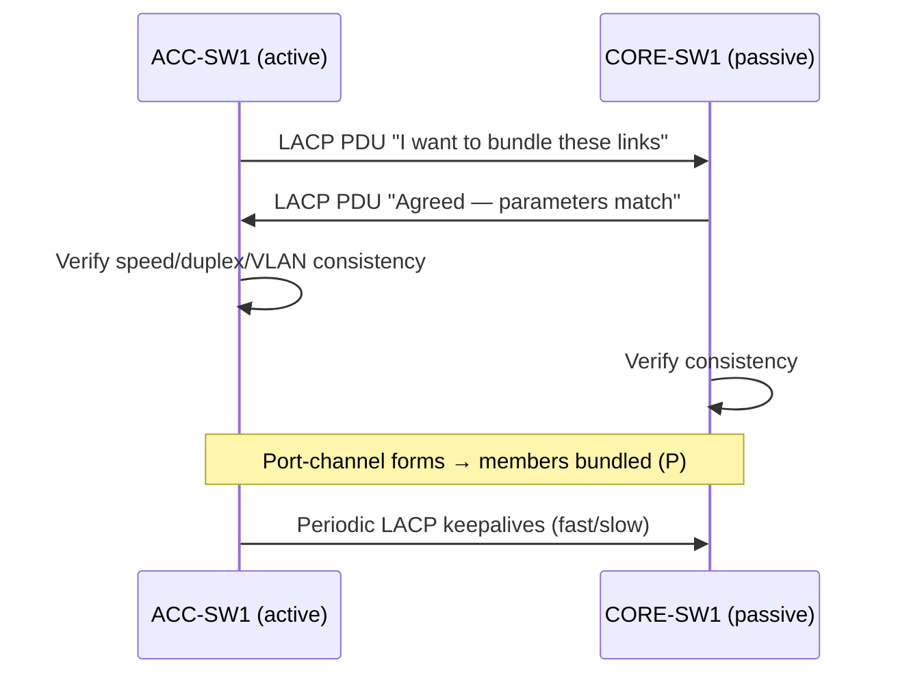

# `LACP VSD PAGP`

##  Index

1. [What are LACP and PAgP?](#1-what-are-lacp-and-pagp)
2. [Why do we need it? (The Problem it Solves)](#2-why-do-we-need-it-the-problem-it-solves)
3. [How it relates to the broader network](#3-how-it-relates-to-the-broader-network)
4. [Key Component 1 — PAgP Modes](#4-key-component-1--pagp-modes)
5. [Key Component 2 — LACP Modes](#5-key-component-2--lacp-modes)
6. [Key Component 3 — The Compatibility Matrix](#6-key-component-3--the-compatibility-matrix)
7. [Safety & Security Features](#7-safety--security-features)
8. [Who created it / Standards](#8-who-created-it--standards)
9. [Types / Variations](#9-types--variations)
10. [Flow of Phases / How it Works](#10-flow-of-phases--how-it-works)
11. [States and Timers](#11-states-and-timers)
12. [Advanced / Extra Features](#12-advanced--extra-features)
13. [Configuration & Troubleshooting Workflow](#13-configuration--troubleshooting-workflow)

---

## 1. What are LACP and PAgP?

- Both are **negotiation protocols** that dynamically form and manage an EtherChannel by exchanging control frames between switches.
- **LACP** = **Link Aggregation Control Protocol** → the **open IEEE standard** (multi-vendor).
- **PAgP** = **Port Aggregation Protocol** → **Cisco-proprietary** (Cisco-to-Cisco only).
- **Analogy** 🤝: Both are like two people agreeing to **carpool**. Before sharing the ride, they confirm the details ("Same destination? Same schedule?"). LACP is the *universal ride-share app* everyone uses; PAgP is a *private company shuttle* only Cisco employees can board.

## 2. Why do we need it? (The Problem it Solves)

- **Static ("on") bundling** blindly forces links together with **no verification** — a mismatch causes loops or black-holed traffic.
- LACP/PAgP solve this by:
  - **Verifying** both ends agree before bundling.
  - **Detecting** misconfigurations and refusing to form a broken channel.
  - **Adapting** when links fail (removing dead members automatically).

## 3. How it relates to the broader network

- Used on your redundant **ACC↔CORE uplink bundles**.
- Since your lab is all-Cisco, **either** works — but **LACP is the recommended default** (standards-based, portable, future-proof).

## 4. Key Component 1 — PAgP Modes

| Mode | Behavior | Sends PAgP? |
|------|----------|:---:|
| **`on`** | Forces channel, **no PAgP** | ❌ |
| **`desirable`** | Actively initiates negotiation | ✅ |
| **`auto`** | Passively waits to be asked | ✅ (only responds) |

- **Rule:** `auto` + `auto` = **no channel** (nobody initiates).

## 5. Key Component 2 — LACP Modes

| Mode | Behavior | Sends LACP? |
|------|----------|:---:|
| **`on`** | Forces channel, **no LACP** | ❌ |
| **`active`** | Actively initiates negotiation | ✅ |
| **`passive`** | Passively waits to be asked | ✅ (only responds) |

- **Rule:** `passive` + `passive` = **no channel** (nobody initiates).

## 6. Key Component 3 — The Compatibility Matrix

**LACP combinations:**
| Side A | Side B | Forms Channel? |
|--------|--------|:---:|
| active | active | ✅ |
| active | passive | ✅ |
| passive | passive | ❌ |

**PAgP combinations:**
| Side A | Side B | Forms Channel? |
|--------|--------|:---:|
| desirable | desirable | ✅ |
| desirable | auto | ✅ |
| auto | auto | ❌ |

**Static / cross-protocol:**
| Side A | Side B | Forms Channel? |
|--------|--------|:---:|
| on | on | ✅ |
| on | active/desirable | ❌ |
| LACP | PAgP | ❌ (never mix protocols) |

## 7. Safety & Security Features

- **Negotiation = built-in misconfig protection** → a broken bundle simply won't form (safer than `on`).
- **LACP fast-rate** → quicker failure detection (1s vs. 30s).
- **Avoid `on` mode** unless both ends are absolutely verified — it has *no* safety net.

## 8. Who created it / Standards

- **LACP** → IEEE **802.3ad**, later folded into **802.1AX**.
- **PAgP** → **Cisco-proprietary** (no open equivalent).

## 9. Types / Variations

| Protocol | Vendor | Standard | Default Choice? |
|----------|--------|----------|:---:|
| **LACP** | Multi-vendor | IEEE 802.1AX | ✅ Recommended |
| **PAgP** | Cisco only | Proprietary | Legacy Cisco networks |
| **Static (on)** | Any | None | Only when negotiation impossible |

## 10. Flow of Phases / How it Works



## 11. States and Timers

| Timer | LACP | PAgP |
|-------|------|------|
| **Slow keepalive** | 30 sec | 30 sec |
| **Fast keepalive** | 1 sec | — |
| **Timeout** | 3× keepalive | 3× keepalive |

- **Note:** LACP `rate fast` drops failure detection to ~3 seconds.

## 12. Advanced / Extra Features

- **LACP System Priority** → determines which switch controls bundling decisions (lower = preferred).
- **LACP Port Priority** → picks which links are active vs. standby when `max-bundle` limits are set.
- **max-bundle / min-links** → control active-link count and minimum viable links.
- **LACP is required** for multi-vendor and most cross-stack (MEC) scenarios.

---

## 13. Configuration & Troubleshooting Workflow

### Phase 1: Port Selection & Preparation
- Choose matching uplinks on `ACC-SW1` → `CORE-SW1` (`Gig0/1 - 2`), identical on both ends.
```
ACC-SW1> enable
ACC-SW1# configure terminal
ACC-SW1(config)# interface range GigabitEthernet0/1 - 2
ACC-SW1(config-if-range)# description ** LACP Bundle to CORE-SW1 **
ACC-SW1(config-if-range)# shutdown
```

### Phase 2: Base Configuration
- Set **LACP active** on ACC and **passive** (or active) on CORE:
```
! --- ACC-SW1 ---
ACC-SW1(config-if-range)# channel-group 1 mode active
ACC-SW1(config-if-range)# no shutdown

! --- CORE-SW1 ---
CORE-SW1(config)# interface range GigabitEthernet0/1 - 2
CORE-SW1(config-if-range)# channel-group 1 mode passive
CORE-SW1(config-if-range)# no shutdown
```

### Phase 3: Hardening & Security
- Speed up failure detection and set LACP priority for deterministic control:
```
ACC-SW1(config-if-range)# lacp rate fast
ACC-SW1(config)# lacp system-priority 100
ACC-SW1(config)# interface range GigabitEthernet0/1 - 2
ACC-SW1(config-if-range)# lacp port-priority 100
```
- **Why:** `rate fast` = ~3s failover; lower system-priority makes ACC-SW1 the decision-maker.

### Phase 4: Verification Flow
Run these `show` commands **in this order**:
```
ACC-SW1# show etherchannel summary
ACC-SW1# show lacp neighbor
ACC-SW1# show lacp internal
ACC-SW1# show lacp sys-id
ACC-SW1# show etherchannel 1 detail
```
- **What to look for:**
  - `show etherchannel summary` → protocol = **LACP**, members flagged **`(P)`**, Po1 = **`(SU)`**.
  - `show lacp neighbor` → the CORE switch appears as a valid partner with matching parameters.
  - `show lacp internal` → local ports in **`bndl`** (bundled) state, correct flags.

### Phase 5: Advanced Debugging
- If the bundle won't form:
```
ACC-SW1# show lacp neighbor
ACC-SW1# show lacp counters
ACC-SW1# debug lacp events
ACC-SW1# debug lacp packets
```
- **Troubleshooting logic:**
  - **No neighbor seen** → LACP PDUs not exchanged → both sides `passive`, or one side is PAgP/`on`.
  - **Protocol mismatch** → 🚨 one end **LACP**, other **PAgP** → *never* bundles. Standardize on LACP.
  - **Member won't bundle** → speed/duplex/VLAN mismatch → align member configs.
  - **Flapping bundle** → keepalive rate mismatch or a flaky physical link → check `show lacp counters` for errors.
