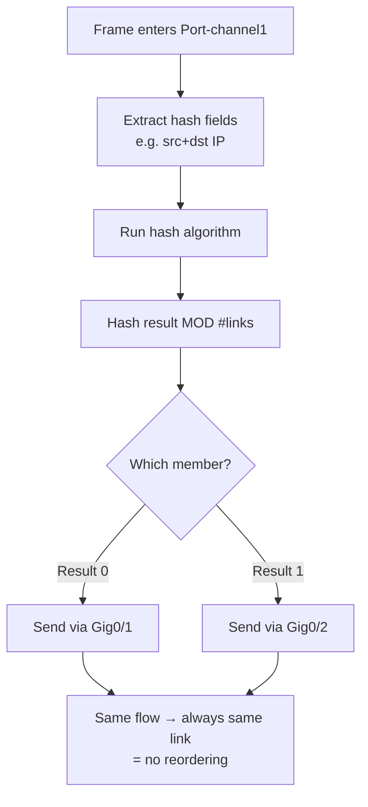

# `Layer2 Load Balancing`

## Index

1. [What is EtherChannel Load Balancing?](#1-what-is-etherchannel-load-balancing)
2. [Why do we need it? (The Problem it Solves)](#2-why-do-we-need-it-the-problem-it-solves)
3. [How it relates to the broader network](#3-how-it-relates-to-the-broader-network)
4. [Key Component 1 — The Hashing Algorithm](#4-key-component-1--the-hashing-algorithm)
5. [Key Component 2 — Hash Input Fields](#5-key-component-2--hash-input-fields)
6. [Key Component 3 — The "Per-Flow" Rule](#6-key-component-3--the-per-flow-rule)
7. [Safety & Security Features](#7-safety--security-features)
8. [Who created it / Standards](#8-who-created-it--standards)
9. [Types / Variations](#9-types--variations)
10. [Flow of Phases / How it Works](#10-flow-of-phases--how-it-works)
11. [States and Timers](#11-states-and-timers)
12. [Advanced / Extra Features](#12-advanced--extra-features)
13. [Configuration & Troubleshooting Workflow](#13-configuration--troubleshooting-workflow)

---

## 1. What is EtherChannel Load Balancing?

- The mechanism that decides **which physical member link** each frame travels over within the bundle.
- It uses a **deterministic hash** of frame header fields to pick a link — the *same conversation* always uses the *same link*.
- **Analogy** 🎟️: A **bouncer at a multi-door venue** assigns each guest to a door based on the first letter of their name. Everyone named "Smith" always uses Door 2. It's not about balancing headcount perfectly — it's a fast, consistent rule that keeps each group together.

## 2. Why do we need it? (The Problem it Solves)

- A bundle has multiple links — the switch must **choose one** per frame **without reordering** packets within a conversation (reordering breaks TCP performance).
- Solves:
  - **Frame ordering** → same flow → same link → no out-of-order delivery.
  - **Traffic distribution** → different flows spread across links.
  - **Speed/determinism** → hashing is a single fast hardware operation.

## 3. How it relates to the broader network

- Governs how traffic spreads across your **ACC↔CORE Port-channel** members.
- Choosing the **right hash** matters: if all your traffic goes to one server (same dst-MAC), a poor hash sends it **all down one link** — wasting the others.

## 4. Key Component 1 — The Hashing Algorithm

- The switch runs frame fields through a hash → produces a value → **modulo the number of links** → picks the member.
- **Key limitation:** With **2 links**, the hash uses **1 bit**; with **4 links**, **2 bits**; with **8 links**, **3 bits**.
- **Best practice:** Bundle links in **powers of 2 (2, 4, 8)** for *even* hash distribution. Odd numbers (3, 5, 6, 7) distribute **unevenly**.

## 5. Key Component 2 — Hash Input Fields

The hash can be based on **source, destination, or both** — at L2, L3, or L4:

| Method | Hash Input | Best When |
|--------|-----------|-----------|
| **`src-mac`** | Source MAC | Many clients → one gateway |
| **`dst-mac`** | Destination MAC | One source → many destinations |
| **`src-dst-mac`** | Both MACs | General L2 (good default) |
| **`src-ip` / `dst-ip`** | IP addresses | Routed / L3 traffic |
| **`src-dst-ip`** | Both IPs | ✅ Usually best for varied flows |
| **`src-dst-port`** | L4 ports | Best granularity (many flows same IPs) |

## 6. Key Component 3 — The "Per-Flow" Rule

- ⚠️ **The single most misunderstood EtherChannel fact:** A **single conversation cannot exceed the speed of one member link.**
- Two 1Gbps links = **2Gbps aggregate**, but **any one flow maxes at 1Gbps** — because that flow always hashes to the same link.
- You only benefit from aggregate bandwidth when you have **many simultaneous flows** that hash across different members.

## 7. Safety & Security Features

- **Consistent hashing** → prevents packet reordering (protects application/TCP integrity).
- **Configurable per-platform** → match the hash to your traffic pattern to avoid overloading one link (a self-inflicted bottleneck).
- **Load-balance method is switch-local** → the two ends can even use different methods (each hashes its own outbound traffic).

## 8. Who created it / Standards

- The **802.3ad/802.1AX** standard defines aggregation but leaves the **load-balancing algorithm to the vendor**.
- Cisco implements the hash in **hardware (ASIC)** — configured globally with `port-channel load-balance`.

## 9. Types / Variations

| Category | Options |
|----------|---------|
| **Layer 2** | `src-mac`, `dst-mac`, `src-dst-mac` |
| **Layer 3** | `src-ip`, `dst-ip`, `src-dst-ip` |
| **Layer 4** | `src-port`, `dst-port`, `src-dst-port` |
| **Mixed** | `src-dst-mixed-ip-port` (advanced platforms) |

## 10. Flow of Phases / How it Works



## 11. States and Timers

- Load balancing is a **stateless, per-frame hardware decision** — **no timers**.
- The hash result is **recomputed per frame**, but because inputs are constant for a flow, the *result* stays constant for that flow.

## 12. Advanced / Extra Features

- **Adaptive/Enhanced load balancing** → newer platforms rebalance when a member fails (avoids remapping *all* flows).
- **Per-platform granularity** → high-end switches support L4 port hashing for finer distribution.
- **`test etherchannel load-balance`** → a command to *predict* which link a given flow will use (huge for troubleshooting).
- **Flowlet switching** (data-center fabrics) → splits even single flows across links using tiny idle gaps — beyond classic EtherChannel.

---

## 13. Configuration & Troubleshooting Workflow

> ⚖️ Load balancing is configured **globally** (not per-interface) on most Catalyst switches — it applies to *all* EtherChannels on the switch.

### Phase 1: Port Selection & Preparation
- Confirm the Port-channel is already up and bundled (from prior files) before tuning the hash.
```
ACC-SW1> enable
ACC-SW1# show etherchannel summary
! Verify Po1 is (SU) and members are (P)
```

### Phase 2: Base Configuration
- Set the global load-balancing method appropriate for your traffic (IP-based is a strong default):
```
ACC-SW1# configure terminal
ACC-SW1(config)# port-channel load-balance src-dst-ip
```
- Apply the **same rationale** on CORE-SW1 (each switch balances its own outbound traffic):
```
CORE-SW1(config)# port-channel load-balance src-dst-ip
```

### Phase 3: Hardening & Security
- Ensure an **even member count (power of 2)** and set min-links so a half-failed bundle behaves predictably:
```
ACC-SW1(config)# interface Port-channel1
ACC-SW1(config-if)# port-channel min-links 1
```
- **Why:** Powers of 2 (2/4/8 members) guarantee even hash distribution; `min-links` defines the failure threshold.

### Phase 4: Verification Flow
Run these `show` commands **in this order**:
```
ACC-SW1# show etherchannel load-balance
ACC-SW1# show etherchannel summary
ACC-SW1# test etherchannel load-balance interface Port-channel1 ip 192.168.20.10 192.168.30.10
ACC-SW1# show interfaces Port-channel1 counters
```
- **What to look for:**
  - `show etherchannel load-balance` → confirms the active method (e.g., **Source Destination IP**).
  - `test etherchannel load-balance ...` → tells you **exactly which member** a given flow will use.
  - `show interfaces ... counters` → traffic should be spread across members (not all on one).

### Phase 5: Advanced Debugging
- If one link is saturated while others sit idle:
```
ACC-SW1# show interfaces GigabitEthernet0/1 | include rate
ACC-SW1# show interfaces GigabitEthernet0/2 | include rate
ACC-SW1# test etherchannel load-balance interface Port-channel1 ip <src> <dst>
```
- **Troubleshooting logic:**
  - **All traffic on one link** → traffic is a **single flow** (per-flow rule) → cannot be split; expected behavior.
  - **Uneven distribution** → hash method mismatched to traffic (e.g., using `dst-mac` when everything targets one gateway) → switch to `src-dst-ip` or `src-dst-port`.
  - **Odd number of links** → uneven by design → rebundle in powers of 2.
  - **Expected 2Gbps but seeing 1Gbps** → 🚨 the classic **per-flow misconception** — not a fault; you need multiple concurrent flows.
