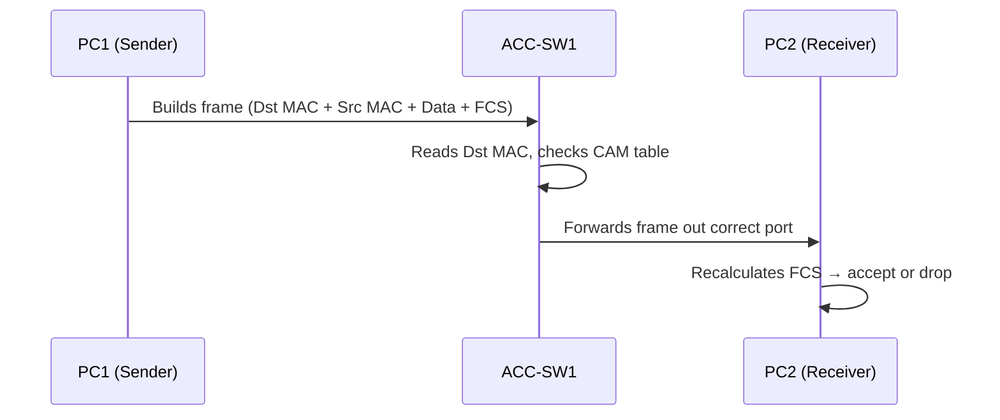

# `Ethernet Frame`

## 1. What is the Ethernet Frame?

- The **Ethernet frame** is the **Layer 2 Protocol Data Unit (PDU)** — the fundamental container that carries data across a local network segment.
- It's a precisely structured sequence of bits that wraps ("encapsulates") upper-layer data with the addressing and error-checking information switches need to forward it.
- **Analogy** : Think of it as an **envelope**. The letter inside (your data) doesn't change, but the envelope carries the *from* address, the *to* address, and a tamper-check seal so the postal system (the switch) knows exactly where to deliver it.

## 2. Why do we need it? (The Problem it Solves)

- Raw bits on a wire have **no meaning** without structure — where does one message end and the next begin?
- The frame solves three core problems:
  - **Addressing** → who is this for? (Destination MAC)
  - **Delimiting** → where does the frame start and stop? (Preamble / SFD)
  - **Integrity** → did the data arrive uncorrupted? (FCS)

## 3. How it relates to the broader network

- Sits at the **Data Link Layer (Layer 2)**, directly below IP (Layer 3).
- Your switches (**CORE-SW1/2, ACC-SW1–4**) make **all forwarding decisions** by reading frame headers — specifically the destination MAC — without ever looking at the IP inside.
- When traffic crosses VLANs (20, 30, 40), the frame is what gets tagged, forwarded, or dropped.

## 4. Key Component 1 — The Frame Fields

| Field | Size | Purpose |
|-------|------|---------|
| **Preamble** | 7 bytes | Synchronizes clocks between sender/receiver (`10101010`...) |
| **SFD** (Start Frame Delimiter) | 1 byte | Signals "frame starts now" (`10101011`) |
| **Destination MAC** | 6 bytes | Where the frame is going |
| **Source MAC** | 6 bytes | Where the frame came from |
| **Type / Length** | 2 bytes | EtherType (e.g., `0x0800` = IPv4, `0x8100` = 802.1Q tag) |
| **Payload / Data** | 46–1500 bytes | The actual encapsulated data |
| **FCS** | 4 bytes | Frame Check Sequence — CRC error detection |

## 5. Key Component 2 — The MAC Address

- **48-bit** hardware address, written in hex (e.g., `00:1A:2B:3C:4D:5E`).
- Split into two halves:
  - **OUI** (first 24 bits) → identifies the manufacturer.
  - **NIC-specific** (last 24 bits) → unique per device.
- **Broadcast** address = `FF:FF:FF:FF:FF:FF` → sent to everyone in the segment.

## 6. Key Component 3 — The FCS (Frame Check Sequence)

- A **4-byte CRC (Cyclic Redundancy Check)** calculated over the frame.
- The receiving switch recalculates the CRC; if it doesn't match, the frame is **silently dropped**.
- **Note**: Ethernet does *not* retransmit — that's left to upper layers (TCP).

## 7. Safety & Security Features

- **FCS** guards against accidental corruption (not malicious tampering).
- **MAC filtering / port security** can restrict which source MACs are accepted on a port (covered later in your switching notes).
- **Minimum frame size (64 bytes)** helps detect collisions on legacy shared media.

## 8. Who created it / Standards

- Originally invented at **Xerox PARC (1973)** by Robert Metcalfe.
- Standardized as **IEEE 802.3**.
- The tagged variant (VLANs) is defined by **IEEE 802.1Q**.

## 9. Types / Variations

- **Ethernet II (DIX)** → most common today; uses the *Type* field.
- **IEEE 802.3** → uses the *Length* field (older, with LLC/SNAP headers).
- **802.1Q-tagged frame** → adds a 4-byte VLAN tag (critical for your trunks between CORE and ACC switches).
- **Jumbo frames** → payloads up to ~9000 bytes (non-standard).

## 10. Flow of Phases / How it Works



## 11. States and Timers

- The frame itself is **stateless** — it's a one-shot container, not a session.
- Relevant timing concept: **Interframe Gap (IFG)** = minimum idle time (96 bit-times) between frames on the wire.

## 12. Advanced / Extra Features

- **Q-in-Q (802.1ad)** → stacking two VLAN tags (service provider use).
- **Runts** → frames smaller than 64 bytes (usually collision fragments).
- **Giants / Jumbos** → frames exceeding the standard MTU.
- **EtherType multiplexing** → lets one wire carry IPv4, IPv6, ARP, etc.

---

## 13. Configuration & Troubleshooting Workflow

> ⚠️ **Note:** The Ethernet frame is a **data structure, not a configurable feature** — you don't "turn it on." But you *can* configure frame-related behaviors (MTU, error counters, duplex/speed that affect framing) and troubleshoot frame-level errors. Here's how that maps to your lab.

### Phase 1: Port Selection & Preparation
- Select the **access ports** facing your PCs (e.g., PC1 → `ACC-SW1`) and the **trunk ports** between switches (where 802.1Q tagging happens).
- Reset an interface to a clean baseline:
```
ACC-SW1> enable
ACC-SW1# configure terminal
ACC-SW1(config)# default interface FastEthernet0/1
ACC-SW1(config)# interface FastEthernet0/1
ACC-SW1(config-if)# shutdown
```

### Phase 2: Base Configuration
- Bring the interface up cleanly so frames pass correctly:
```
ACC-SW1(config-if)# description ** PC1 Access Port **
ACC-SW1(config-if)# switchport mode access
ACC-SW1(config-if)# switchport access vlan 20
ACC-SW1(config-if)# no shutdown
```

### Phase 3: Hardening & Security
- Lock duplex/speed so framing errors from mismatches don't occur, and protect against rogue MACs:
```
ACC-SW1(config-if)# speed 100
ACC-SW1(config-if)# duplex full
ACC-SW1(config-if)# switchport port-security
ACC-SW1(config-if)# switchport port-security maximum 2
ACC-SW1(config-if)# switchport port-security violation restrict
```
- **Why:** Duplex mismatches are the #1 cause of **FCS errors and late collisions** on a link.

### Phase 4: Verification Flow
Run these `show` commands **in this order**:

```
ACC-SW1# show interfaces FastEthernet0/1
ACC-SW1# show interfaces FastEthernet0/1 counters errors
ACC-SW1# show mac address-table interface FastEthernet0/1
```

- **What to look for:**
  - In `show interfaces` → check for `runts`, `giants`, `CRC`, `input errors`, and `late collision` counters. These should be **0**.
  - Confirm **duplex/speed** matches on both ends.
  - In `show mac address-table` → verify PC1's MAC is learned on the correct port/VLAN.

### Phase 5: Advanced Debugging
- If frames are being dropped or corrupted:
```
ACC-SW1# show interfaces FastEthernet0/1 | include error|CRC|collision
ACC-SW1# clear counters FastEthernet0/1
```
- Then regenerate traffic and re-check counters to see if errors are **live or historical**.
- **Common culprits:**
  - Rising **CRC/FCS errors** → cabling fault or duplex mismatch.
  - Rising **runts** → collisions (half-duplex) or bad NIC.
  - **Giants** → MTU / tagging misconfiguration.

---
