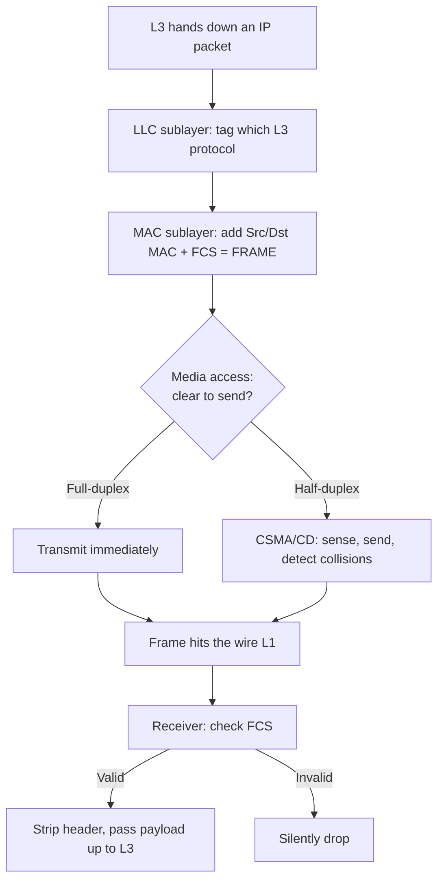

# `Layer-2 Responsibilities`

## 1. What is Layer 2 (The Data Link Layer)?

- **Layer 2** is the **Data Link Layer** of the OSI model — the layer responsible for **reliable, node-to-node delivery** of frames across a single physical or logical link.
- It sits **between the Physical Layer (L1, raw bits)** and the **Network Layer (L3, IP routing)**, translating messy electrical signals into structured, addressable frames.
- **Analogy** 🚚: If L1 is the *road* and L3 is the *nationwide postal routing plan*, then L2 is the **local delivery driver** — it knows every house on this street and hands each envelope to the right door, but it doesn't plan cross-country routes.

## 2. Why do we need it? (The Problem it Solves)

- L1 just pushes bits — it has **no concept of "who," "where," or "did it arrive intact."**
- L3 handles *global* addressing but relies on **something** to physically move a frame across each hop.
- Layer 2 fills that gap by solving:
  - **Local addressing** → MAC addresses identify devices on the segment.
  - **Framing** → grouping bits into meaningful, delimited units.
  - **Error detection** → the FCS catches corruption.
  - **Media access** → deciding *who transmits when* on shared media.

## 3. How it relates to the broader network

- Every device in your lab (**CORE-SW1/2, ACC-SW1–4, PC1–8**) relies on L2 to move traffic **within a VLAN/segment**.
- L2 hands frames up to **L3 only when crossing VLANs** (via inter-VLAN routing between VLAN 20/30/40).
- The two sublayers of L2 interface directly with the layers above and below (see Key Components).

## 4. Key Component 1 — The Two Sublayers (LLC & MAC)

The IEEE splits Layer 2 into two distinct sublayers:

| Sublayer | Standard | Responsibility |
|----------|----------|----------------|
| **LLC** (Logical Link Control) | IEEE 802.2 | Talks *upward* to L3; identifies which protocol (IP, IPv6…) the payload belongs to; optional flow/error control |
| **MAC** (Media Access Control) | IEEE 802.3 | Talks *downward* to L1; handles physical addressing, framing, and **who gets to transmit** on the media |

- **Analogy** 🏢: **LLC** is the *receptionist* directing mail to the right department (protocol); **MAC** is the *loading dock* managing which truck backs up to the door (media access).

## 5. Key Component 2 — Framing & Physical Addressing

- **Framing** → encapsulates L3 packets into frames with headers/trailers (Dst MAC, Src MAC, FCS).
- **MAC addressing** → provides the **48-bit hardware identity** used for all local forwarding decisions.
- This is the responsibility that directly produces the **Ethernet frame** (file 1) and populates the **CAM table** (file 2).

## 6. Key Component 3 — Media Access Control (Arbitration)

- Decides **who can transmit and when** to prevent chaos on shared media.
- **CSMA/CD** (Carrier Sense Multiple Access / Collision Detection) → the classic method for **half-duplex** shared segments:
  - *Carrier Sense* → listen before talking.
  - *Multiple Access* → everyone shares the wire.
  - *Collision Detection* → if two talk at once, detect it, back off, retry.
- **Modern note:** Full-duplex switched links (your entire lab) have **dedicated collision domains per port**, so CSMA/CD is effectively **disabled/irrelevant** — but it's essential legacy knowledge.

## 7. Safety & Security Features

- **FCS** → integrity check against corruption.
- **Port Security** → restricts MACs per port (defends the CAM table).
- **BPDU Guard / STP protections** → prevent loops and rogue switches (covered in the STP subfolder).
- **DHCP Snooping / DAI / IP Source Guard** → L2 security features that stop spoofing and rogue servers (advanced).

## 8. Who created it / Standards

- The OSI model was defined by **ISO** (ISO/IEC 7498-1).
- L2 sublayers standardized by the **IEEE 802 committee**:
  - **802.2** → LLC
  - **802.3** → Ethernet MAC
  - **802.1D** → bridging/STP
  - **802.1Q** → VLAN tagging

## 9. Types / Variations

- **Point-to-point L2 protocols** → PPP, HDLC (WAN links).
- **Multi-access L2** → Ethernet (your LAN), Wi-Fi (802.11).
- **Switched (bridged) Ethernet** → what your entire lab uses — full-duplex, microsegmented.

## 10. Flow of Phases / How it Works



## 11. States and Timers

- Layer 2 itself is largely **stateless per-frame**, but key timing concepts include:

| Concept | Value | Purpose |
|---------|-------|---------|
| **Interframe Gap (IFG)** | 96 bit-times | Mandatory idle gap between frames |
| **Slot Time** | 512 bit-times | Collision-detection window (half-duplex) |
| **Backoff (CSMA/CD)** | Random, exponential | Retry delay after a collision |

## 12. Advanced / Extra Features

- **QoS at L2** → CoS (Class of Service) bits in the 802.1Q tag prioritize traffic (critical for your **Voice VLAN 40**).
- **Flow control** → IEEE 802.3x **PAUSE frames** to prevent buffer overrun.
- **Link aggregation** → 802.3ad/LACP bundles links (your EtherChannel subfolder).
- **Frame prioritization** → voice frames (CoS 5) jump ahead of bulk data.

---

## 13. Configuration & Troubleshooting Workflow

> 🧩 "Layer 2 responsibilities" is a **conceptual umbrella**, not a single toggle. So this workflow shows how to **inspect and validate L2 behaviors** (duplex/framing, media access, error handling) holistically across your lab.

### Phase 1: Port Selection & Preparation
- Pick a representative **access port** (PC1 → `ACC-SW1 Fa0/1`) and a **trunk port** (`ACC-SW1 → CORE-SW1`) to observe L2 in both roles.
- Establish a clean baseline:
```
ACC-SW1> enable
ACC-SW1# configure terminal
ACC-SW1(config)# interface FastEthernet0/1
ACC-SW1(config-if)# description ** L2 Test - PC1 **
ACC-SW1(config-if)# no shutdown
```

### Phase 2: Base Configuration
- Explicitly define the L2 role and duplex/speed so framing and media access behave predictably:
```
ACC-SW1(config-if)# switchport mode access
ACC-SW1(config-if)# switchport access vlan 20
ACC-SW1(config-if)# duplex full
ACC-SW1(config-if)# speed auto
```

### Phase 3: Hardening & Security
- Layer 2 responsibilities include **protecting** the segment — apply the core L2 safeguards:
```
ACC-SW1(config-if)# switchport port-security
ACC-SW1(config-if)# switchport port-security maximum 2
ACC-SW1(config-if)# switchport port-security violation restrict
ACC-SW1(config-if)# spanning-tree portfast
ACC-SW1(config-if)# spanning-tree bpduguard enable
```
- **Why:** Port security guards MAC addressing; BPDU Guard protects the framing/topology role of L2 from rogue switches.

### Phase 4: Verification Flow
Run these `show` commands **in this order** to validate each L2 responsibility:

```
ACC-SW1# show interfaces FastEthernet0/1
ACC-SW1# show interfaces FastEthernet0/1 status
ACC-SW1# show interfaces FastEthernet0/1 counters errors
ACC-SW1# show mac address-table interface FastEthernet0/1
ACC-SW1# show interfaces trunk
```

- **What to look for:**
  - **Framing/integrity** → `CRC`, `input errors`, `runts`, `giants` should be **0**.
  - **Media access** → `collisions` / `late collisions` should be **0** on full-duplex (any value = duplex mismatch!).
  - **Addressing** → PC1's MAC learned correctly in `show mac address-table`.
  - **Duplex/speed** → both ends agree in `show interfaces status`.

### Phase 5: Advanced Debugging
- If L2 delivery is unreliable:
```
ACC-SW1# clear counters FastEthernet0/1
ACC-SW1# show interfaces FastEthernet0/1 | include duplex|error|CRC|collision
ACC-SW1# show interfaces status err-disabled
```
- **Troubleshooting logic:**
  - **Rising CRC + late collisions** → 🚨 **duplex mismatch** (one side full, one side half) — the #1 L2 fault.
  - **Port err-disabled** → a security/BPDU violation shut it down → investigate then `shutdown`/`no shutdown` to recover.
  - **No MAC learned + no errors** → host silent or wrong VLAN → verify L3/host config.
