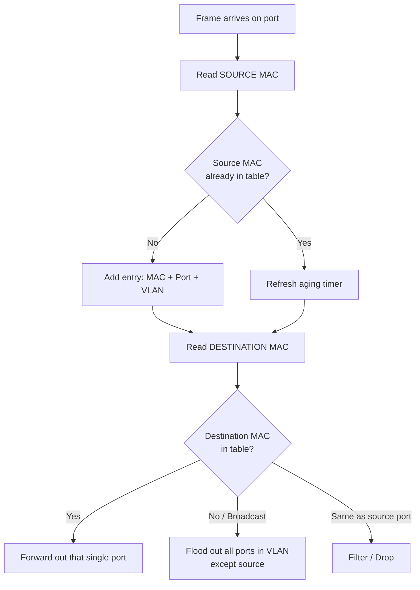

# `Mac Cam Table`

## 1. What is the MAC / CAM Table?

- The **MAC address table** (stored in **CAM — Content Addressable Memory**) is the switch's **forwarding database**: a live map of *"which MAC address lives behind which port, in which VLAN."*
- **CAM** is special high-speed memory that searches by **content (the MAC)** rather than by address/index — giving near-instant, single-clock-cycle lookups.
- **Analogy** 📖: It's the switch's **contact list**. When a frame arrives, the switch flips to the destination MAC and instantly sees "Ah, that person sits at port Fa0/3" — no scanning the whole book.

## 2. Why do we need it? (The Problem it Solves)

- Without it, a switch would behave like a **hub** — blindly flooding every frame out every port, wasting bandwidth and killing performance.
- The CAM table enables **selective forwarding**: send the frame **only** out the one port where the destination actually lives.
- Solves three problems:
  - **Efficiency** → no needless flooding.
  - **Segmentation** → each port is its own collision domain.
  - **Scale** → thousands of hosts handled with fast lookups.

## 3. How it relates to the broader network

- The CAM table is the **engine of Layer 2 forwarding** for every switch in your lab (**CORE-SW1/2, ACC-SW1–4**).
- It works **per-VLAN**: the same lookup logic runs independently for VLAN 20, 30, and 40.
- It feeds directly into **STP** (which ports are blocked), **port security** (which MACs are allowed), and **inter-VLAN routing** (the SVI/router MAC gets learned too).

## 4. Key Component 1 — Table Entries

| Field | Meaning |
|-------|---------|
| **MAC Address** | The 48-bit host hardware address |
| **VLAN** | Which VLAN the MAC was learned in |
| **Type** | `DYNAMIC` (learned) or `STATIC` (manually set / system) |
| **Port / Interface** | The physical port behind which the MAC lives |

- **Note:** The same MAC can appear in **different VLANs** as separate entries — the table key is effectively *(MAC + VLAN)*.

## 5. Key Component 2 — The Learning Process

- A switch learns by inspecting the **SOURCE MAC** of every incoming frame:
  1. Frame arrives on port Fa0/1.
  2. Switch reads **Source MAC** → records `MAC ↔ Fa0/1 ↔ VLAN 20`.
  3. Switch reads **Destination MAC** → looks it up to decide forwarding.
- **Golden rule:** *Learn from the source, forward by the destination.*

## 6. Key Component 3 — Forwarding Decisions

The switch makes one of three decisions per frame:

| Decision | When it happens |
|----------|-----------------|
| **Forward** | Destination MAC is **known** → send out that one port |
| **Flood** | Destination is **unknown (unicast)**, **broadcast**, or **multicast** → send out all ports in the VLAN *except* the source port |
| **Filter (Drop)** | Destination is on the **same port** the frame arrived on → discard |

## 7. Safety & Security Features

- **MAC Aging Timer** (default **300 seconds**) → stale entries are removed so the table stays current and doesn't fill up.
- **Port Security** → caps how many MACs a port can learn; blocks **CAM overflow / MAC flooding attacks** (e.g., `macof`).
- **Static MAC entries** → pin a specific MAC to a specific port so it can't be spoofed elsewhere.
- **MAC Address Table Overflow Attack** ⚠️: an attacker floods bogus MACs to fill the CAM table, forcing the switch to flood everything (turning it into a hub for sniffing). Port security is the defense.

## 8. Who created it / Standards

- Not a single named "inventor" — it's an intrinsic behavior of **transparent bridging**, formalized in **IEEE 802.1D** (the same standard family as STP).
- The learning/flooding/forwarding logic is the classic **transparent bridge** algorithm from **Radia Perlman–era bridging work**.

## 9. Types / Variations

- **Dynamic entries** → learned automatically, aged out.
- **Static entries** → manually configured, never age out.
- **Secure MAC entries** → learned/set via port security (`sticky` learning available).
- **Multicast/System entries** → reserved MACs used by protocols (STP, CDP, etc.).

## 10. Flow of Phases / How it Works



## 11. States and Timers

| Timer / State | Default | Purpose |
|---------------|---------|---------|
| **Aging Time** | 300 sec | How long an idle dynamic entry survives |
| **Learning** | Continuous | Every frame refreshes/creates entries |
| **Static** | No aging | Persists until manually removed |

- **Note:** When STP topology changes, the aging timer can be **temporarily shortened to 15 sec** (Forward Delay) to flush stale entries fast.

## 12. Advanced / Extra Features

- **Sticky MAC learning** → dynamically learned MACs get saved to running-config (great for access ports).
- **MAC move detection** → flags when a MAC flaps between ports (a loop or spoofing sign).
- **Unicast flood protection** → rate-limits flooding of unknown unicasts.
- **TCAM vs CAM** → MAC lookups use CAM (exact match); ACL/QoS lookups use **TCAM** (ternary, supports wildcards). Worth knowing the distinction at expert level.

---

## 13. Configuration & Troubleshooting Workflow

> ⚙️ The CAM table is largely **automatic**, but you configure aging, static entries, and security around it — and it's one of your most powerful **troubleshooting** tools.

### Phase 1: Port Selection & Preparation
- Target the **access ports** facing PCs (where MACs are learned) and the **trunk ports** (where multiple VLANs' MACs traverse).
- Confirm the interface is up and in the right VLAN before expecting entries:
```
ACC-SW1> enable
ACC-SW1# configure terminal
ACC-SW1(config)# interface FastEthernet0/1
ACC-SW1(config-if)# switchport mode access
ACC-SW1(config-if)# switchport access vlan 20
ACC-SW1(config-if)# no shutdown
```

### Phase 2: Base Configuration
- Set (or tune) the **global aging timer**, and add a **static entry** for a critical device (e.g., a server or the voice gateway on VLAN 40):
```
ACC-SW1(config)# mac address-table aging-time 300
ACC-SW1(config)# mac address-table static 000A.1122.3344 vlan 40 interface FastEthernet0/5
```

### Phase 3: Hardening & Security
- Protect the CAM table against flooding attacks using **port security with sticky learning**:
```
ACC-SW1(config)# interface FastEthernet0/1
ACC-SW1(config-if)# switchport port-security
ACC-SW1(config-if)# switchport port-security maximum 3
ACC-SW1(config-if)# switchport port-security mac-address sticky
ACC-SW1(config-if)# switchport port-security violation restrict
```
- **Why:** Caps learnable MACs → a `macof`-style flood can't overflow the table and force hub-like flooding.

### Phase 4: Verification Flow
Run these `show` commands **in this order**:

```
ACC-SW1# show mac address-table
ACC-SW1# show mac address-table dynamic
ACC-SW1# show mac address-table interface FastEthernet0/1
ACC-SW1# show mac address-table vlan 20
ACC-SW1# show mac address-table count
ACC-SW1# show mac address-table aging-time
```

- **What to look for:**
  - PC1's MAC appears as `DYNAMIC` on `Fa0/1` in `VLAN 20`.
  - `show ... count` → confirms the table isn't near capacity (overflow warning sign).
  - Static/voice-gateway MAC shows as `STATIC` on the correct port/VLAN.
  - A MAC appearing on a **trunk** port means the host lives on a *downstream* switch.

### Phase 5: Advanced Debugging
- If a PC can't be reached or you suspect a loop/spoof:
```
ACC-SW1# clear mac address-table dynamic
ACC-SW1# show mac address-table interface FastEthernet0/1
ACC-SW1# debug mac-address-table
```
- **Troubleshooting logic:**
  - **MAC missing entirely** → host silent, port down, or wrong VLAN.
  - **MAC on the wrong port** → cabling error or a Layer 2 loop.
  - **Same MAC flapping between two ports** → 🚨 classic **loop** or **spoofing** → check STP.
  - **Table full / constant flooding** → suspect a **MAC flooding attack** → enforce port security.
