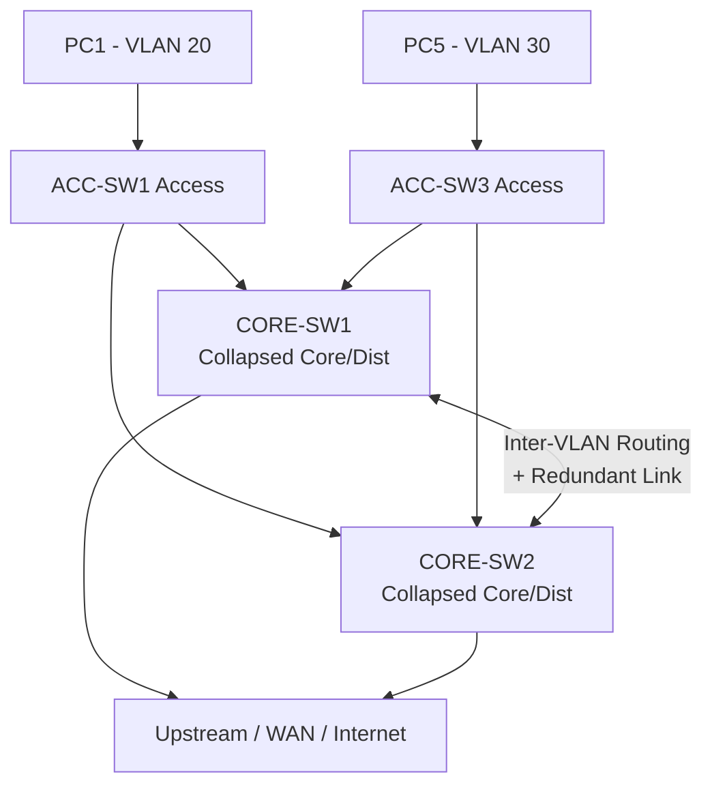

#  `Network Hierarchy`

## 1. What is Network Hierarchy?

- **Network hierarchy** is a structured design model that organizes a network into **distinct functional layers**, each with a specific job — rather than one flat, tangled mesh of switches.
- Cisco's classic model is the **three-tier hierarchy**: **Core → Distribution → Access**.
- **Analogy** 🏙️: Think of a city's road system. **Local streets** (Access) connect to your house. **Arterial roads** (Distribution) collect neighborhood traffic and enforce rules. **Highways** (Core) move huge volumes between districts as fast as possible — no stopping, no traffic lights.

## 2. Why do we need it? (The Problem it Solves)

- A **flat network** (everything plugged into everything) creates chaos: massive broadcast domains, unpredictable traffic paths, hard troubleshooting, and no scalability.
- Hierarchy solves:
  - **Scalability** → add access switches without redesigning the core.
  - **Redundancy** → predictable dual paths (your CORE-SW1 **and** CORE-SW2).
  - **Performance** → each layer optimized for its role (speed vs. policy vs. connectivity).
  - **Manageability** → faults isolate to a layer; troubleshooting is systematic.

## 3. How it relates to the broader network

- Your lab maps directly onto this model:
  - **Access** → `ACC-SW1–4` connect PC1–8 (endpoints, VLAN 20/30/40 assignment).
  - **Core/Distribution (collapsed)** → `CORE-SW1/2` provide redundant high-speed switching and inter-VLAN routing.
- It defines **where** features live: port security & PortFast at Access; STP root & routing at Core.

## 4. Key Component 1 — The Access Layer

- **Role:** The **entry point** for end devices (PCs, phones, APs, printers).
- **Responsibilities:**
  - Assigns ports to VLANs (data 20/30, voice 40).
  - Enforces **port-level security** (port security, BPDU Guard, PortFast).
  - Provides **PoE** for IP phones/APs.
- **In your lab:** `ACC-SW1–4` — every PC and phone plugs in here.

## 5. Key Component 2 — The Distribution Layer

- **Role:** The **aggregation and policy** layer — the boundary between L2 and L3.
- **Responsibilities:**
  - Aggregates uplinks from many access switches.
  - Performs **inter-VLAN routing** (routing between VLAN 20/30/40).
  - Enforces **policy**: ACLs, QoS, route filtering, STP root placement.
  - Contains the broadcast domain (VLANs typically don't span past here).
- **In your lab:** Handled by `CORE-SW1/2` in a **collapsed core** design.

## 6. Key Component 3 — The Core Layer

- **Role:** The **high-speed backbone** — "switch fast, do nothing else."
- **Responsibilities:**
  - Move maximum traffic between distribution blocks with **minimal latency**.
  - **No** heavy policy/ACLs/filtering (that would slow it down).
  - Maximum **redundancy and uptime**.
- **In your lab:** `CORE-SW1/2` — in a small topology, Core and Distribution merge (see §9).

## 7. Safety & Security Features

- **Access layer** → first line of defense: port security, DHCP Snooping, BPDU Guard, DAI.
- **Distribution layer** → ACLs, routing security, **STP Root Guard**, QoS trust boundaries.
- **Core layer** → hardened for **availability** (redundant links/supervisors) rather than filtering — keep it lean and fast.
- **Design principle:** *Filter at the edge/distribution, never bottleneck the core.*

## 8. Who created it / Standards

- This is a **Cisco design framework** (part of Cisco's Enterprise Campus Architecture / SAFE and CCDA/CCDP curricula).
- It's a **best-practice model**, not an IEEE/IETF protocol standard — so it's flexible and adapted to network size.

## 9. Types / Variations

| Model | Layers | When to use |
|-------|--------|-------------|
| **Three-Tier** | Core + Distribution + Access | Large enterprises/campuses |
| **Two-Tier (Collapsed Core)** | Combined Core-Distribution + Access | Small–medium networks **(your lab!)** |
| **Spine-Leaf** | Spine + Leaf | Modern data centers (east-west traffic) |

- **Your lab = Collapsed Core:** `CORE-SW1/2` perform *both* core and distribution roles; `ACC-SW1–4` are pure access.

## 10. Flow of Phases / How it Works



- Traffic flows **up** from Access → Core for inter-VLAN/external destinations, and the **dual CORE links** provide redundancy (managed by STP + FHRP).

## 11. States and Timers

- Hierarchy itself has **no timers** — but the layers *host* the protocols that do:

| Layer | Timed Protocols Living Here |
|-------|-----------------------------|
| **Access** | PortFast, BPDU Guard (STP edge timers) |
| **Distribution** | STP root/hello timers, HSRP/VRRP hello & hold timers |
| **Core** | Fast convergence (BFD, tuned routing timers) |

## 12. Advanced / Extra Features

- **Redundancy protocols:** **HSRP / VRRP / GLBP** provide a redundant default gateway across CORE-SW1/2 (first-hop redundancy for your VLANs).
- **Uplink resilience:** EtherChannel bundles Access→Core links (your `etherchannel` subfolder).
- **StackWise / VSS / StackWise Virtual:** make two physical core switches act as **one logical device**, eliminating STP blocking on uplinks.
- **Layer 3 to the access:** modern "routed access" designs push routing down to the access layer for faster convergence (advanced variation).

---

## 13. Configuration & Troubleshooting Workflow

> 🏗️ Network hierarchy is a **design concept**, not a single command. This workflow shows how to *implement the roles correctly per layer* and verify traffic flows through the hierarchy as intended in your collapsed-core lab.

### Phase 1: Port Selection & Preparation
- **Access ports** → PC-facing ports on `ACC-SW1–4`.
- **Uplink/trunk ports** → the redundant links from each ACC switch up to **both** CORE-SW1 and CORE-SW2.
- Prepare an access-layer uplink:
```
ACC-SW1> enable
ACC-SW1# configure terminal
ACC-SW1(config)# interface range GigabitEthernet0/1 - 2
ACC-SW1(config-if-range)# description ** Uplink to CORE-SW1/2 **
ACC-SW1(config-if-range)# no shutdown
```

### Phase 2: Base Configuration
- **Access layer** → configure host/uplink roles:
```
ACC-SW1(config)# interface FastEthernet0/1
ACC-SW1(config-if)# switchport mode access
ACC-SW1(config-if)# switchport access vlan 20
ACC-SW1(config-if)# exit
ACC-SW1(config)# interface range GigabitEthernet0/1 - 2
ACC-SW1(config-if-range)# switchport mode trunk
ACC-SW1(config-if-range)# switchport trunk allowed vlan 20,30,40
```
- **Core/Distribution layer** → enable routing and set STP root priority:
```
CORE-SW1(config)# ip routing
CORE-SW1(config)# spanning-tree vlan 20,30,40 root primary
CORE-SW2(config)# spanning-tree vlan 20,30,40 root secondary
```

### Phase 3: Hardening & Security
- **Harden per layer** — edge security at Access, policy/root protection at Core:
```
! --- ACCESS LAYER (edge protection) ---
ACC-SW1(config)# interface FastEthernet0/1
ACC-SW1(config-if)# spanning-tree portfast
ACC-SW1(config-if)# spanning-tree bpduguard enable
ACC-SW1(config-if)# switchport port-security

! --- CORE/DIST LAYER (root protection) ---
CORE-SW1(config)# interface range GigabitEthernet0/1 - 4
CORE-SW1(config-if-range)# spanning-tree guard root
```
- **Why:** BPDU Guard stops a rogue switch at the edge; Root Guard ensures the core stays the STP root.

### Phase 4: Verification Flow
Run these `show` commands **in this order** to validate the hierarchy:

```
ACC-SW1# show interfaces trunk
ACC-SW1# show spanning-tree vlan 20
CORE-SW1# show spanning-tree vlan 20 root
CORE-SW1# show ip route
CORE-SW1# show ip interface brief
CORE-SW1# show etherchannel summary
```

- **What to look for:**
  - **Trunks up** between Access and Core carrying VLANs 20/30/40.
  - **CORE-SW1 = Root Bridge** for the VLANs (`show spanning-tree root` shows *this bridge is the root*).
  - **Inter-VLAN routes** present in `show ip route` (connected SVIs for each VLAN).
  - Redundant uplinks visible — one forwarding, one blocking (or bundled via EtherChannel).

### Phase 5: Advanced Debugging
- If traffic doesn't flow correctly through the tiers:
```
CORE-SW1# show spanning-tree blockedports
CORE-SW1# traceroute 192.168.30.10
ACC-SW1# show cdp neighbors
ACC-SW1# show interfaces status err-disabled
```
- **Troubleshooting logic:**
  - **Suboptimal path** → wrong STP root elected → re-check `root primary/secondary` priorities on the core.
  - **No inter-VLAN connectivity** → `ip routing` missing on core, or SVI down.
  - **Uplink err-disabled** → BPDU Guard triggered by a misconfigured device on an uplink.
  - **Neighbor mismatch** → use `show cdp neighbors` to confirm ACC switches connect to the *correct* core ports.

---