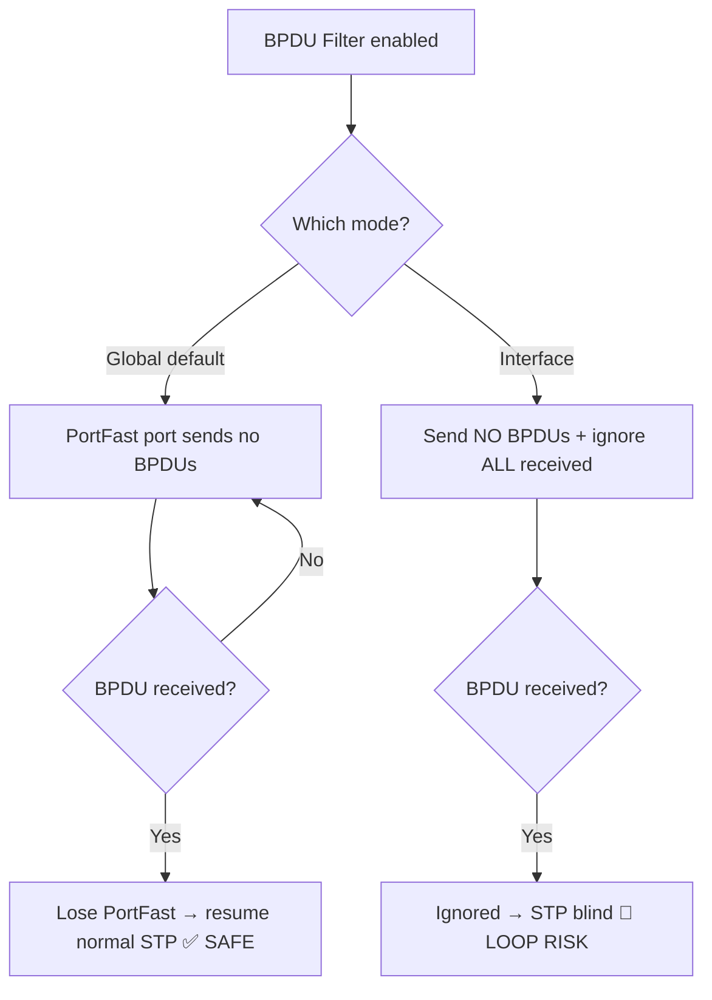

# `BPDU Filter`

## Index

1. [What is BPDU Filter?](#1-what-is-bpdu-filter)
2. [Why do we need it? (The Problem it Solves)](#2-why-do-we-need-it-the-problem-it-solves)
3. [How it relates to the broader network](#3-how-it-relates-to-the-broader-network)
4. [Key Component 1 — Global Mode](#4-key-component-1--global-mode)
5. [Key Component 2 — Interface Mode](#5-key-component-2--interface-mode)
6. [Key Component 3 — The Critical Difference](#6-key-component-3--the-critical-difference)
7. [Safety & Security Features](#7-safety--security-features)
8. [Who created it / Standards](#8-who-created-it--standards)
9. [Types / Variations](#9-types--variations)
10. [Flow of Phases / How it Works](#10-flow-of-phases--how-it-works)
11. [States and Timers](#11-states-and-timers)
12. [Advanced / Extra Features](#12-advanced--extra-features)
13. [Configuration & Troubleshooting Workflow](#13-configuration--troubleshooting-workflow)

---

## 1. What is BPDU Filter?

- A feature that **prevents BPDUs from being sent and/or processed** on a port — effectively making STP "go quiet" on that interface.
- Used to stop unnecessary BPDU chatter toward hosts (or, in rare cases, to isolate STP domains).
- **Analogy** 🔇: A **"do not disturb" sign** on a door. BPDU *Guard* is an alarm that locks the door if anyone knocks; BPDU *Filter* just **stops the knocking altogether** — the door stays open but no STP conversation happens. That silence is convenient... but it removes STP's ability to *notice a loop*.

## 2. Why do we need it? (The Problem it Solves)

- On **edge ports**, sending BPDUs toward a PC is pointless — the host ignores them anyway.
- BPDU Filter solves:
  - **Reducing BPDU noise** toward hosts (cosmetic/efficiency).
  - **STP domain isolation** (advanced service-provider scenarios).
- ⚠️ **But it introduces serious risk** → if it *fully* suppresses STP on a link where a switch is connected, **STP can't detect the loop** → meltdown. Handle with extreme care.

## 3. How it relates to the broader network

- Occasionally applied on `ACC-SW1–4` edge ports to silence BPDUs toward PCs/phones.
- In most modern designs, **BPDU Guard is preferred over BPDU Filter** for edge protection — Guard *fails safe* (shuts the port), Filter can *fail open* (silent loop).
- **Rule of thumb:** if you're unsure, use **BPDU Guard**, not Filter.

## 4. Key Component 1 — Global Mode

- Enabled with: `spanning-tree portfast bpdufilter default`.
- **Behavior (the "safe" mode):**
  - Applies **only to PortFast ports**.
  - Sends **no BPDUs** out the port **while it stays an edge port**.
  - **BUT** — if the port **receives** a BPDU, it **loses PortFast status**, **stops filtering**, and **reverts to normal STP**. ✅
- This receive-triggered fallback is what makes global mode relatively **safe**.

## 5. Key Component 2 — Interface Mode

- Enabled with: `spanning-tree bpdufilter enable` on a specific interface.
- **Behavior (the "dangerous" mode):**
  - **Unconditionally** stops **sending AND ignores received** BPDUs.
  - Does **NOT** revert if it receives a BPDU. ❌
  - Effectively **disables STP entirely** on that port.
- 🚨 If a switch is plugged into an interface-mode-filtered port → **STP is blind → guaranteed loop risk.**

## 6. Key Component 3 — The Critical Difference

| Aspect | **Global Mode** | **Interface Mode** |
|--------|:---:|:---:|
| Applies to | PortFast ports only | The specific port |
| On receiving a BPDU | **Reverts to normal STP** (safe) | **Ignores it** (dangerous) |
| STP still protective? | ✅ Yes (fails safe) | ❌ No (fails open) |
| Loop risk | Low | **High** |

- **⭐ Master takeaway:** *Global mode is a convenience with a safety net; interface mode completely removes STP protection on that port.* This distinction is the single most important thing about BPDU Filter.

## 7. Safety & Security Features

- **Global mode = fail-safe** (reverts on BPDU receipt).
- **Interface mode = NO safety net** → treat as "disable STP" and only use when you fully control both ends.
- **Best practice:** For edge protection, use **BPDU Guard** (definitive shutdown) rather than BPDU Filter.

## 8. Who created it / Standards

- **Cisco-proprietary** STP enhancement (not IEEE).
- Works across **PVST+, Rapid-PVST+, MST**.

## 9. Types / Variations

| Mode | Command | Trigger Behavior |
|------|---------|------------------|
| **Global** | `spanning-tree portfast bpdufilter default` | Reverts to STP on BPDU receipt |
| **Interface** | `spanning-tree bpdufilter enable` | Never reverts (full suppression) |
| **Explicit off** | `spanning-tree bpdufilter disable` | Disables filtering on the port |

## 10. Flow of Phases / How it Works



## 11. States and Timers

- BPDU Filter has **no dedicated timers** — it's a stateless send/receive suppression rule.
- **Global mode state change** is event-driven (BPDU receipt → PortFast loss → STP resumes).
- **Interface mode** has no state change — it's persistently "off."

## 12. Advanced / Extra Features

- **BPDU Guard + Global BPDU Filter interaction** → if both are configured on a PortFast port, behavior can be nuanced; Cisco best practice is to **pick one policy** for the edge (usually Guard).
- **Service provider use** → interface mode occasionally used to hide customer STP domains (with careful loop control elsewhere).
- **Verification is essential** → always confirm which mode is actually active before trusting it.

---

## 13. Configuration & Troubleshooting Workflow

> ⚠️ **Strong recommendation for your lab:** Prefer **BPDU Guard** for edge protection. Use BPDU Filter only to *learn its behavior* — and if you do, use **global mode** (safe), never interface mode on a port that could reach a switch.

### Phase 1: Port Selection & Preparation
- Target **edge/access ports** on `ACC-SW1` (PC/phone-facing). **Never** on switch-to-switch uplinks.
```
ACC-SW1> enable
ACC-SW1# configure terminal
ACC-SW1(config)# interface range FastEthernet0/1 - 24
ACC-SW1(config-if-range)# description ** Edge Ports **
ACC-SW1(config-if-range)# switchport mode access
```

### Phase 2: Base Configuration
- Enable the **safe global mode** (recommended) — applies only to PortFast ports and self-reverts:
```
ACC-SW1(config)# spanning-tree portfast default
ACC-SW1(config)# spanning-tree portfast bpdufilter default
```
- *(For learning only — the dangerous interface mode looks like this; use with caution:)*
```
! ACC-SW1(config-if)# spanning-tree bpdufilter enable   <-- interface mode: NO safety net
```

### Phase 3: Hardening & Security
- Because Filter removes visibility, **layer other protections** and keep Guard as the real defense:
```
ACC-SW1(config)# interface range FastEthernet0/1 - 24
ACC-SW1(config-if-range)# spanning-tree bpduguard enable
ACC-SW1(config-if-range)# switchport port-security
ACC-SW1(config-if-range)# switchport port-security maximum 2
ACC-SW1(config-if-range)# switchport port-security violation restrict
```
- **Why:** BPDU Guard provides the definitive fail-safe; port security guards MACs — together they cover what Filter alone cannot.

### Phase 4: Verification Flow
Run these `show` commands **in this order**:
```
ACC-SW1# show spanning-tree summary
ACC-SW1# show spanning-tree interface FastEthernet0/1 detail
ACC-SW1# show spanning-tree interface FastEthernet0/1 portfast
ACC-SW1# show running-config interface FastEthernet0/1
```
- **What to look for:**
  - `show spanning-tree summary` → confirms **"BPDU Filter is enabled"** and whether it's the **default (global)** form.
  - `show ... detail` → check whether the port shows **bpdu filter enabled** and still holds **PortFast**.
  - Confirm you are in **global (safe)** mode, not accidental **interface** mode → verify in `show running-config interface`.

### Phase 5: Advanced Debugging
- If you suspect a loop or STP isn't behaving on a filtered port:
```
ACC-SW1# show spanning-tree interface FastEthernet0/1 detail
ACC-SW1# show mac address-table count
ACC-SW1# debug spanning-tree bpdu
ACC-SW1# show processes cpu sorted | include STP
```
- **Troubleshooting logic:**
  - 🚨 **Loop / broadcast storm on a filtered edge port** → a **switch** was plugged into an **interface-mode** filtered port → STP is blind → **remove the device and disable interface-mode filter immediately.**
  - **STP unexpectedly resumed on an edge port** → **global mode** correctly reverted after receiving a BPDU (this is the safety net working — investigate *what* sent the BPDU).
  - **MAC flapping / high CPU** → classic loop signature → check for interface-mode filtering hiding a loop.
  - **Filter not behaving as expected** → confirm **global vs. interface** mode — they behave *completely differently* (see §6).
