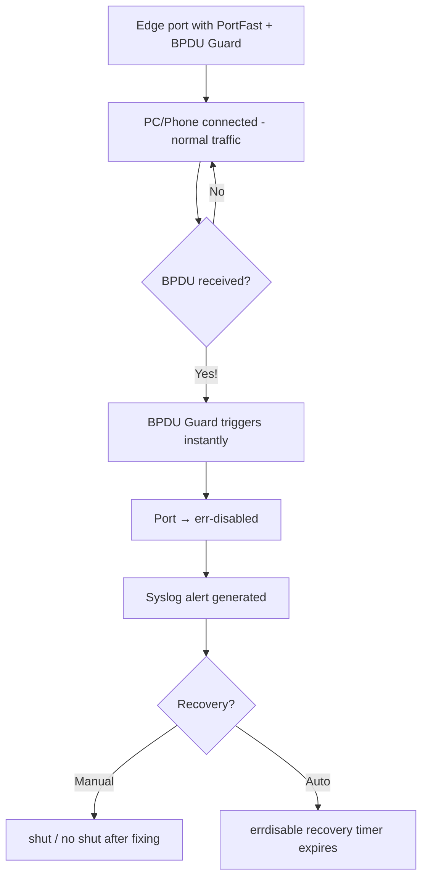

# `BPDu Guard`

## Index

1. [What is BPDU Guard?](#1-what-is-bpdu-guard)
2. [Why do we need it? (The Problem it Solves)](#2-why-do-we-need-it-the-problem-it-solves)
3. [How it relates to the broader network](#3-how-it-relates-to-the-broader-network)
4. [Key Component 1 — The Trigger](#4-key-component-1--the-trigger)
5. [Key Component 2 — The Err-Disabled State](#5-key-component-2--the-err-disabled-state)
6. [Key Component 3 — Error Recovery](#6-key-component-3--error-recovery)
7. [Safety & Security Features](#7-safety--security-features)
8. [Who created it / Standards](#8-who-created-it--standards)
9. [Types / Variations](#9-types--variations)
10. [Flow of Phases / How it Works](#10-flow-of-phases--how-it-works)
11. [States and Timers](#11-states-and-timers)
12. [Advanced / Extra Features](#12-advanced--extra-features)
13. [Configuration & Troubleshooting Workflow](#13-configuration--troubleshooting-workflow)

---

## 1. What is BPDU Guard?

- A protection feature that **shuts down (err-disables) a port** the instant it **receives a BPDU** — because a legitimate *edge* port (facing a PC/phone) should **never** hear STP messages.
- Designed to protect **PortFast-enabled access ports**.
- **Analogy** 🚪🔒: A **staff-only door** with an alarm. Employees (PCs) walk through fine. But if a *stranger with a company badge* (a rogue switch sending BPDUs) tries the door, the alarm **slams and locks it instantly** — no negotiation, no risk.

## 2. Why do we need it? (The Problem it Solves)

- **PortFast** ports skip STP's safety checks and forward immediately — great for hosts, but **dangerous if a switch is plugged in there** (instant loop risk + possible rogue root takeover).
- BPDU Guard solves:
  - **Rogue switch defense** → prevents an unauthorized switch from joining/altering the topology.
  - **Loop prevention** → kills the port before a loop can form.
  - **Root protection** → stops an attacker forcing a root re-election from an edge port.

## 3. How it relates to the broader network

- Applied to **all access/edge ports** on `ACC-SW1–4` (the PC/phone-facing ports).
- Forms the **classic security combo** with PortFast: *PortFast for speed + BPDU Guard for safety*.
- A key defense against **STP-based attacks** at the network edge.

## 4. Key Component 1 — The Trigger

- The **sole trigger** = receipt of **any BPDU** on a BPDU-Guard-enabled port.
- It does **not** matter if the BPDU is superior or inferior — **any** BPDU = immediate action.
- This makes it **binary and decisive** (unlike Root Guard, which only reacts to *superior* BPDUs).

## 5. Key Component 2 — The Err-Disabled State

- On trigger, the port goes to **`err-disabled`** — administratively down, passing **no traffic**.
- The port stays down until **manually recovered** or **auto-recovered** (see next component).
- A syslog message is generated (e.g., `%SPANTREE-2-BLOCK_BPDUGUARD`), giving you a clear audit trail.

## 6. Key Component 3 — Error Recovery

- **Manual recovery:** `shutdown` then `no shutdown` on the interface (after removing the offending device).
- **Automatic recovery:** enable **errdisable recovery** for the `bpduguard` cause with a configurable timer:
```
errdisable recovery cause bpduguard
errdisable recovery interval 300
```
- **Best practice:** In secure environments, prefer **manual recovery** so you *investigate* the cause first.

## 7. Safety & Security Features

- **It IS a security feature** — front-line edge defense.
- Pairs with **Port Security** (MAC-level) and **DHCP Snooping** for defense-in-depth.
- **Global vs. per-interface** config lets you enforce a network-wide policy on all PortFast ports at once.

## 8. Who created it / Standards

- **Cisco-proprietary enhancement** to STP (not part of the IEEE standard).
- Works with **all STP modes** (PVST+, Rapid-PVST+, MST).

## 9. Types / Variations

| Config Scope | Command | Behavior |
|--------------|---------|----------|
| **Global** | `spanning-tree portfast bpduguard default` | Auto-applies to **all** PortFast ports |
| **Per-interface** | `spanning-tree bpduguard enable` | Enables on a specific port (overrides global) |
| **Explicit disable** | `spanning-tree bpduguard disable` | Turns it off on a specific port |

## 10. Flow of Phases / How it Works



## 11. States and Timers

| Item | Value | Purpose |
|------|-------|---------|
| **Trigger time** | Immediate | Fires on first BPDU received |
| **err-disable state** | Until recovery | Port stays down |
| **Auto-recovery interval** | 300 sec (default, if enabled) | Time before auto re-enable attempt |

## 12. Advanced / Extra Features

- **BPDU Guard vs. BPDU Filter** → Guard *shuts down* on BPDU; Filter *ignores/suppresses* BPDUs (covered in `bpdu-filter.md`). **Never confuse them** — very different outcomes.
- **Global default** → the recommended enterprise approach (one command covers every PortFast port).
- **Integration with err-disable recovery** → lets you balance security vs. operational auto-healing.

---

## 13. Configuration & Troubleshooting Workflow

### Phase 1: Port Selection & Preparation
- Target **only edge/access ports** (PC/phone-facing) on `ACC-SW1`. **Never** enable on switch-to-switch uplinks (those *should* receive BPDUs!).
```
ACC-SW1> enable
ACC-SW1# configure terminal
ACC-SW1(config)# interface range FastEthernet0/1 - 24
ACC-SW1(config-if-range)# description ** Edge Ports - PC/Phone **
ACC-SW1(config-if-range)# switchport mode access
```

### Phase 2: Base Configuration
- Enable PortFast + BPDU Guard together (per-interface):
```
ACC-SW1(config-if-range)# spanning-tree portfast
ACC-SW1(config-if-range)# spanning-tree bpduguard enable
```
- **Or**, apply the recommended enterprise-wide global policy:
```
ACC-SW1(config)# spanning-tree portfast default
ACC-SW1(config)# spanning-tree portfast bpduguard default
```

### Phase 3: Hardening & Security
- Add error-disable recovery (optional) and layer in complementary edge defenses:
```
ACC-SW1(config)# errdisable recovery cause bpduguard
ACC-SW1(config)# errdisable recovery interval 300
! --- Defense in depth on the same ports ---
ACC-SW1(config)# interface range FastEthernet0/1 - 24
ACC-SW1(config-if-range)# switchport port-security
ACC-SW1(config-if-range)# switchport port-security maximum 2
ACC-SW1(config-if-range)# switchport port-security violation restrict
```
- **Why:** Auto-recovery avoids permanent lockout from accidental triggers; port security + BPDU Guard = layered edge protection.

### Phase 4: Verification Flow
Run these `show` commands **in this order**:
```
ACC-SW1# show spanning-tree summary
ACC-SW1# show spanning-tree interface FastEthernet0/1 detail
ACC-SW1# show spanning-tree interface FastEthernet0/1 portfast
ACC-SW1# show errdisable recovery
ACC-SW1# show interfaces status err-disabled
```
- **What to look for:**
  - `show spanning-tree summary` → confirms **"BPDU Guard is enabled"** (globally or per port).
  - `show ... detail` → the port shows **PortFast** and **bpdu guard enabled**.
  - `show errdisable recovery` → confirms whether auto-recovery for `bpduguard` is on and the interval.
  - `show interfaces status err-disabled` → lists any port currently shut down by a violation.

### Phase 5: Advanced Debugging
- If a port unexpectedly goes err-disabled:
```
ACC-SW1# show interfaces status err-disabled
ACC-SW1# show logging | include BPDUGUARD
ACC-SW1# show interfaces FastEthernet0/1
ACC-SW1# debug spanning-tree events
! --- After removing the offending device, recover: ---
ACC-SW1(config)# interface FastEthernet0/1
ACC-SW1(config-if)# shutdown
ACC-SW1(config-if)# no shutdown
```
- **Troubleshooting logic:**
  - **Port err-disabled right after plugging something in** → 🚨 a **switch/hub** (or a device sending BPDUs) was connected to an edge port → find and remove it.
  - **Recurring err-disable** → someone keeps plugging in an unauthorized switch → investigate physically before recovering.
  - **BPDU Guard on an uplink by mistake** → legitimate BPDUs trip it → **disable BPDU Guard** on switch-to-switch links.
  - **Never recovers** → auto-recovery not enabled and no manual `shut/no shut` → recover manually.
