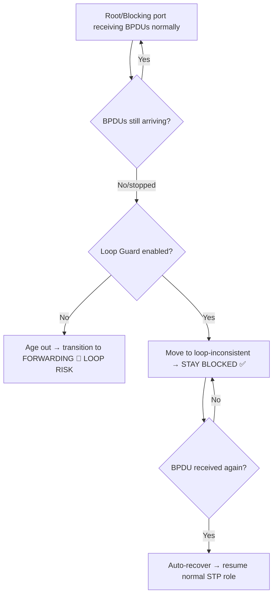

# `Loop Guard`

## Index

1. [What is Loop Guard?](#1-what-is-loop-guard)
2. [Why do we need it? (The Problem it Solves)](#2-why-do-we-need-it-the-problem-it-solves)
3. [How it relates to the broader network](#3-how-it-relates-to-the-broader-network)
4. [Key Component 1 — The Unidirectional Link Problem](#4-key-component-1--the-unidirectional-link-problem)
5. [Key Component 2 — The loop-inconsistent State](#5-key-component-2--the-loop-inconsistent-state)
6. [Key Component 3 — Automatic Recovery](#6-key-component-3--automatic-recovery)
7. [Safety & Security Features](#7-safety--security-features)
8. [Who created it / Standards](#8-who-created-it--standards)
9. [Types / Variations](#9-types--variations)
10. [Flow of Phases / How it Works](#10-flow-of-phases--how-it-works)
11. [States and Timers](#11-states-and-timers)
12. [Advanced / Extra Features](#12-advanced--extra-features)
13. [Configuration & Troubleshooting Workflow](#13-configuration--troubleshooting-workflow)

---

## 1. What is Loop Guard?

- A protection feature that prevents a **blocked (non-designated) port** from *mistakenly* transitioning to **forwarding** when it **stops receiving BPDUs** — because a blocked port going silent-then-forwarding is a classic recipe for a loop.
- It targets **Root Ports** and **Alternate/Blocking ports** on switch-to-switch links.
- **Analogy** 🚦: A blocked port is a **red light** holding traffic. Normally the light stays red because it keeps hearing "keep waiting" signals (BPDUs). If those signals mysteriously *stop*, a naive light would assume "the road's clear, go green!" — potentially causing a crash (loop). **Loop Guard says: "No signal? Something's wrong — stay red until I hear otherwise."**

## 2. Why do we need it? (The Problem it Solves)

- STP's fatal assumption: *"If a blocked port stops hearing BPDUs, the path must be gone, so I can safely start forwarding."*
- On a **unidirectional link** (transmit works, receive fails), that assumption is **wrong** — the neighbor is still there and still forwarding → both ends forward → **loop**.
- Loop Guard solves:
  - **Unidirectional link loops** → keeps the port safely blocked.
  - **Missing-BPDU loops** → treats BPDU loss as *suspicious*, not *safe*.

## 3. How it relates to the broader network

- Applied on **switch-to-switch links** between `ACC-SW1–4` and `CORE-SW1/2` — specifically the **root ports and blocking uplinks**.
- Complements **UDLD** (UniDirectional Link Detection) — Loop Guard reacts at the STP layer, UDLD detects the physical fault directly (they're best used *together*).

## 4. Key Component 1 — The Unidirectional Link Problem

- A **unidirectional link** = a link that transmits in one direction but **fails to receive** in the other (common with **fiber**: one strand breaks, or a bad transceiver/GBIC).
- The link stays **physically "up"** → STP doesn't see a hard failure → but BPDUs stop arriving on the receiving end.
- **Result without protection:** the blocked port ages out its BPDU info (Max Age) → assumes the path is clear → **transitions to forwarding → loop.**

## 5. Key Component 2 — The loop-inconsistent State

- When a Loop-Guard-protected port **stops receiving expected BPDUs**, instead of forwarding, it moves to a special **`loop-inconsistent`** blocking state.
- In this state the port **stays blocked** — it does **not** forward traffic → the loop is prevented.
- A syslog message is generated (e.g., `%SPANTREE-2-LOOPGUARD_BLOCK`).
- **Key contrast with BPDU Guard:** Loop Guard **blocks** the port (recoverable) rather than **err-disabling** it (shut down).

## 6. Key Component 3 — Automatic Recovery

- Loop Guard is **self-healing** — a major advantage.
- The moment the port **receives a BPDU again**, it **automatically** transitions back to its normal STP state (root/blocking) and resumes.
- **No manual intervention needed** (unlike BPDU Guard's err-disable, which often requires `shut/no shut`).

## 7. Safety & Security Features

- **Fails safe** → its default action is to **keep blocking** (never risk a loop).
- **Pairs with UDLD** → UDLD detects the physical unidirectional fault and can err-disable the link; Loop Guard prevents the loop at the logical/STP level. **Best practice = enable both.**
- **Global default** → can be enabled network-wide on all point-to-point links at once.

## 8. Who created it / Standards

- **Cisco-proprietary** STP enhancement.
- Works with **PVST+, Rapid-PVST+, and MST**.

## 9. Types / Variations

| Config Scope | Command | Behavior |
|--------------|---------|----------|
| **Global** | `spanning-tree loopguard default` | Applies to all point-to-point links |
| **Per-interface** | `spanning-tree guard loop` | Enables on a specific port |
| **Disable** | `spanning-tree guard none` | Removes loop guard on that port |

- **Note:** Loop Guard and Root Guard are **mutually exclusive** on the same port (`spanning-tree guard` accepts only one).

## 10. Flow of Phases / How it Works



## 11. States and Timers

| Item | Detail |
|------|--------|
| **Trigger** | Expected BPDU stops arriving (after Max Age on the port) |
| **State entered** | `loop-inconsistent` (blocking) |
| **Recovery** | Automatic on BPDU receipt (no timer needed) |
| **Relevant timer** | Max Age (20s) governs when BPDU info is considered lost |

## 12. Advanced / Extra Features

- **Loop Guard vs. UDLD:**

| Feature | Layer | Detects | Action |
|---------|-------|---------|--------|
| **Loop Guard** | STP/logical | Missing BPDUs on root/blocking ports | Blocks (loop-inconsistent) |
| **UDLD** | Physical/L1-L2 | Unidirectional fiber/copper fault directly | Err-disables the link |

- **Best practice:** run **both** — defense in depth against unidirectional failures.
- **Only useful on point-to-point links** — not on edge/host ports (use PortFast + BPDU Guard there).

---

## 13. Configuration & Troubleshooting Workflow

### Phase 1: Port Selection & Preparation
- Target **switch-to-switch uplinks** (root & blocking ports) between `ACC-SW1` and `CORE-SW1/2`. **Never** on edge/host ports.
```
ACC-SW1> enable
ACC-SW1# configure terminal
ACC-SW1(config)# interface range GigabitEthernet0/1 - 2
ACC-SW1(config-if-range)# description ** Uplinks - Loop Guard protected **
ACC-SW1(config-if-range)# no shutdown
```

### Phase 2: Base Configuration
- Enable Loop Guard — the **global default** is the recommended approach (covers all point-to-point links automatically):
```
ACC-SW1(config)# spanning-tree loopguard default
```
- **Or** enable it per-interface on specific uplinks:
```
ACC-SW1(config)# interface range GigabitEthernet0/1 - 2
ACC-SW1(config-if-range)# spanning-tree guard loop
```

### Phase 3: Hardening & Security
- Pair Loop Guard with **UDLD** for complete unidirectional-link defense:
```
! --- Global UDLD (aggressive mode err-disables faulty links) ---
ACC-SW1(config)# udld enable aggressive
! --- Or per fiber uplink ---
ACC-SW1(config)# interface range GigabitEthernet0/1 - 2
ACC-SW1(config-if-range)# udld port aggressive
```
- **Why:** Loop Guard prevents the *loop* (STP layer); UDLD detects and disables the *physical* unidirectional fault — together they cover both symptom and cause.

### Phase 4: Verification Flow
Run these `show` commands **in this order**:
```
ACC-SW1# show spanning-tree summary
ACC-SW1# show spanning-tree interface GigabitEthernet0/1 detail
ACC-SW1# show spanning-tree inconsistentports
ACC-SW1# show udld GigabitEthernet0/1
```
- **What to look for:**
  - `show spanning-tree summary` → confirms **"Loop Guard is enabled"** (globally).
  - `show ... interface detail` → the port shows **loop guard is enabled**.
  - `show spanning-tree inconsistentports` → **empty in normal operation**; a port listed here as **loop-inconsistent** means Loop Guard has *actively* blocked a suspected loop.
  - `show udld` → link status **bidirectional** (healthy) in normal operation.

### Phase 5: Advanced Debugging
- If a port enters `loop-inconsistent` or you suspect a unidirectional link:
```
ACC-SW1# show spanning-tree inconsistentports
ACC-SW1# show logging | include LOOPGUARD
ACC-SW1# show udld GigabitEthernet0/1
ACC-SW1# debug spanning-tree events
```
- **Troubleshooting logic:**
  - **Port stuck in `loop-inconsistent`** → 🚨 BPDUs stopped arriving → **suspect a unidirectional link** (bad fiber strand, faulty SFP/GBIC, or a dirty connector) → inspect the physical link.
  - **UDLD shows unidirectional** → confirms the physical fault → replace the fiber/transceiver.
  - **Auto-recovers on its own** → the BPDU flow returned → intermittent link issue → still investigate the physical layer.
  - **Loop Guard won't enable on a port** → check it isn't already set to **Root Guard** (they're mutually exclusive — `spanning-tree guard` takes only one).
  - **Loop Guard triggering on edge ports** → misapplied → remove it from host ports (use PortFast + BPDU Guard there instead).
