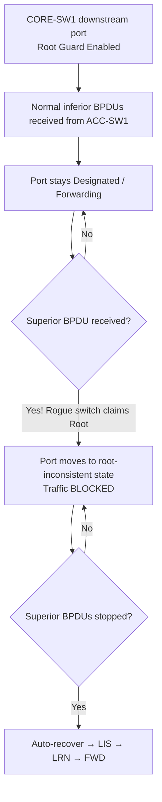

# `Root Guard`

## Index

1. [What is Root Guard?](#1-what-is-root-guard)
2. [Why do we need it? (The Problem it Solves)](#2-why-do-we-need-it-the-problem-it-solves)
3. [How it relates to the broader network](#3-how-it-relates-to-the-broader-network)
4. [Key Component 1 — The Trigger (Superior BPDUs)](#4-key-component-1--the-trigger-superior-bpdus)
5. [Key Component 2 — The root-inconsistent State](#5-key-component-2--the-root-inconsistent-state)
6. [Key Component 3 — Automatic Recovery](#6-key-component-3--automatic-recovery)
7. [Safety & Security Features](#7-safety--security-features)
8. [Who created it / Standards](#8-who-created-it--standards)
9. [Types / Variations](#9-types--variations)
10. [Flow of Phases / How it Works](#10-flow-of-phases--how-it-works)
11. [States and Timers](#11-states-and-timers)
12. [Advanced / Extra Features](#12-advanced--extra-features)
13. [Configuration & Troubleshooting Workflow](#13-configuration--troubleshooting-workflow)

---

## 1. What is Root Guard?

- A spanning-tree protection feature that **forces a port to remain a Designated Port**, preventing it from ever becoming a Root Port.
- It actively **rejects superior BPDUs** (BPDUs claiming a better Bridge ID than the current root).
- **Analogy** 🏢: Imagine the **CEO's office** (the Root Bridge). If a random employee walks into a branch office and hands the receptionist a fake badge claiming *they* are the new CEO (a superior BPDU), **Root Guard is the security team** — it immediately locks the door and refuses to acknowledge the claim, ensuring the real CEO stays in charge.

## 2. Why do we need it? (The Problem it Solves)

- By default, STP trusts *any* switch that advertises a lower Bridge ID (BID).
- If a user plugs in a dusty old switch (with a very low default MAC address) or a malicious attacker injects spoofed BPDUs, that rogue device will **hijack the Root Bridge role**.
- When the root moves to the edge, **all network traffic funnels through that weak/rogue link**, causing massive congestion, suboptimal routing, or a complete outage.
- Root Guard solves this by **enforcing your intended root placement**.

## 3. How it relates to the broader network

- In your lab, `CORE-SW1` and `CORE-SW2` are the intended roots for VLANs 20, 30, and 40.
- Root Guard is applied on the **downstream-facing ports of the CORE switches** (the ports pointing toward `ACC-SW1–4`).
- It guarantees that the Access layer can *never* dictate the STP topology to the Core layer.

## 4. Key Component 1 — The Trigger (Superior BPDUs)

- Root Guard **only** triggers when it receives a **superior BPDU** (one with a lower BID or better path cost to the root).
- It **ignores inferior BPDUs** (normal STP traffic) and allows them to process normally.
- This is a key difference from BPDU Guard, which triggers on *any* BPDU.

## 5. Key Component 2 — The root-inconsistent State

- When a superior BPDU is received, the port is immediately placed into a **`root-inconsistent`** state.
- In this state, the port is **blocked** — it does not forward data traffic, and it does not listen to the rogue BPDUs.
- A syslog message is generated (e.g., `%SPANTREE-2-ROOTGUARD_BLOCK`).

## 6. Key Component 3 — Automatic Recovery

- Like Loop Guard, Root Guard is **self-healing**.
- The switch continues to monitor the port. Once the rogue switch **stops sending superior BPDUs** (or is unplugged), the port automatically transitions back through the normal STP states (Listening → Learning → Forwarding).
- No manual `shut` / `no shut` is required.

## 7. Safety & Security Features

- **Topology Lock** → absolutely guarantees your Core switches remain the STP root.
- **Attack Mitigation** → neutralizes STP manipulation attacks (like `Yersinia` or `Ettercap` spoofing root BPDUs).
- **Fails Safe** → blocks the specific offending port while keeping the rest of the network stable.

## 8. Who created it / Standards

- **Cisco-proprietary** STP enhancement.
- Fully supported across **PVST+, Rapid-PVST+, and MST**.

## 9. Types / Variations

| Scope | Command | Behavior |
|-------|---------|----------|
| **Per-Interface** | `spanning-tree guard root` | The only way to configure Root Guard (no global default exists). |
| **Removal** | `spanning-tree guard none` | Disables Root Guard on the port. |

- **Note:** Root Guard and Loop Guard are **mutually exclusive** on the same interface.

## 10. Flow of Phases / How it Works



## 11. States and Timers

| Item | Detail |
|------|--------|
| **Trigger time** | Immediate upon receipt of a superior BPDU |
| **State entered** | `root-inconsistent` (blocking) |
| **Recovery** | Automatic, driven by the Max Age timer (when the superior BPDU info expires) |

## 12. Advanced / Extra Features

- **Root Guard vs. BPDU Guard:**
  - **BPDU Guard** goes on **host-facing edge ports** (blocks *all* BPDUs, err-disables).
  - **Root Guard** goes on **switch-to-switch downstream ports** (blocks only *superior* BPDUs, root-inconsistent state).
- **Per-VLAN operation** → In PVST+/Rapid-PVST+, Root Guard blocks the port *only for the specific VLAN* where the superior BPDU was received. Other VLANs on that trunk continue forwarding normally.

---

## 13. Configuration & Troubleshooting Workflow

### Phase 1: Port Selection & Preparation
- Target the **downstream ports** on your Core switches (`CORE-SW1` and `CORE-SW2`) that connect to your Access switches (`ACC-SW1–4`).
- **Never** enable Root Guard on an uplink port pointing *toward* the intended root.
```
CORE-SW1> enable
CORE-SW1# configure terminal
CORE-SW1(config)# interface range GigabitEthernet0/1 - 4
CORE-SW1(config-if-range)# description ** Downlinks to ACC-SW1-4 **
CORE-SW1(config-if-range)# no shutdown
```

### Phase 2: Base Configuration
- Enable Root Guard on the selected downstream interfaces:
```
CORE-SW1(config-if-range)# spanning-tree guard root
```

### Phase 3: Hardening & Security
- Combine Root Guard on the Core with explicit Root Bridge priority to create an unbreakable topology:
```
! --- Lock the Core as the Root ---
CORE-SW1(config)# spanning-tree vlan 20,30,40 root primary
! --- Ensure downstream ports enforce it ---
CORE-SW1(config)# interface range GigabitEthernet0/1 - 4
CORE-SW1(config-if-range)# spanning-tree guard root
```
- **Why:** `root primary` lowers the BID so the Core *should* win; `guard root` ensures that even if someone configures an Access switch with priority `0`, the Core will block them rather than surrender the root role.

### Phase 4: Verification Flow
Run these `show` commands **in this order**:
```
CORE-SW1# show spanning-tree summary
CORE-SW1# show spanning-tree interface GigabitEthernet0/1 detail
CORE-SW1# show spanning-tree inconsistentports
CORE-SW1# show spanning-tree vlan 20
```
- **What to look for:**
  - `show ... interface detail` → confirms **Root guard is enabled** on the port.
  - `show spanning-tree inconsistentports` → should be **empty** in a healthy network. If a port is listed here as `root-inconsistent`, an attack or misconfiguration is actively happening.
  - `show spanning-tree vlan 20` → CORE-SW1 should still say **"This bridge is the root"**.

### Phase 5: Advanced Debugging
- If a port gets blocked and enters the `root-inconsistent` state:
```
CORE-SW1# show spanning-tree inconsistentports
CORE-SW1# show logging | include ROOTGUARD
CORE-SW1# show spanning-tree interface GigabitEthernet0/1 detail
ACC-SW1# show spanning-tree vlan 20 bridge
```
- **Troubleshooting logic:**
  - **Port is `root-inconsistent`** → 🚨 A downstream switch is advertising a better BID.
  - **Find the culprit** → Log into the switch connected to that port (e.g., `ACC-SW1`) and check its priority (`show spanning-tree vlan 20 bridge`). Did someone accidentally type `spanning-tree vlan 20 priority 0`?
  - **Fix the rogue switch** → Remove the low priority config from the Access switch. Once it stops sending the superior BPDU, CORE-SW1 will automatically unblock the port.
  - **Root Guard on an uplink by mistake** → If you put Root Guard on ACC-SW1's uplink to CORE-SW1, ACC-SW1 will block the port (because CORE-SW1 *is* sending superior BPDUs). **Remove Root Guard from uplinks.**

