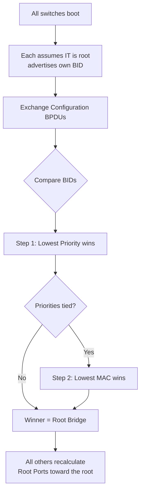

# `Root Bridge Election`

## Index

1. [What is Root Bridge Election?](#1-what-is-root-bridge-election)
2. [Why do we need it? (The Problem it Solves)](#2-why-do-we-need-it-the-problem-it-solves)
3. [How it relates to the broader network](#3-how-it-relates-to-the-broader-network)
4. [Key Component 1 — Bridge Priority](#4-key-component-1--bridge-priority)
5. [Key Component 2 — System ID Extension](#5-key-component-2--system-id-extension)
6. [Key Component 3 — The MAC Tiebreaker](#6-key-component-3--the-mac-tiebreaker)
7. [Safety & Security Features](#7-safety--security-features)
8. [Who created it / Standards](#8-who-created-it--standards)
9. [Types / Variations](#9-types--variations)
10. [Flow of Phases / How it Works](#10-flow-of-phases--how-it-works)
11. [States and Timers](#11-states-and-timers)
12. [Advanced / Extra Features](#12-advanced--extra-features)
13. [Configuration & Troubleshooting Workflow](#13-configuration--troubleshooting-workflow)

---

## 1. What is Root Bridge Election?

- The process by which all switches agree on **one single switch** to serve as the **Root Bridge** — the logical "center" of the spanning tree, from which all path/port roles are calculated.
- The switch with the **lowest Bridge ID (BID)** wins.
- **Analogy** 👑: A group of towns must pick **one capital city**. They compare credentials (BID) — whoever has the **lowest badge number** becomes the capital, and *all roads* are then measured by distance to *that* city.

## 2. Why do we need it? (The Problem it Solves)

- Without a common reference point, switches couldn't agree on *which* paths to block — every switch would compute a different topology → chaos.
- The election solves:
  - **A single source of truth** → all cost calculations are relative to the root.
  - **Deterministic topology** → predictable forwarding/blocking.
  - **Optimized paths** → good root placement = efficient traffic flow.

## 3. How it relates to the broader network

- **Root placement dictates traffic flow.** If an *access* switch accidentally becomes root, traffic takes bizarre, suboptimal paths.
- In your design, a **CORE switch should always be root** (it's central and high-bandwidth).
- Per-VLAN election lets you **load balance**: CORE-SW1 = root for VLAN 20, CORE-SW2 = root for VLAN 30.

## 4. Key Component 1 — Bridge Priority

- The **first and most significant** value compared in the BID.
- Default = **32768**; adjustable **only in multiples of 4096** (0, 4096, 8192, … 61440).
- **Lower = better.** This is your primary lever to *choose* the root.

## 5. Key Component 2 — System ID Extension

- The **VLAN ID** embedded into the BID (12-bit field).
- This is what makes STP **per-VLAN**: the *effective* priority = `Base Priority + VLAN ID`.
- **Example:** Priority 32768 in VLAN 20 → BID priority value shows as **32788** (32768 + 20).
- **Note:** This is why the configured priority *appears* offset in `show` output — it's the VLAN being added in.

## 6. Key Component 3 — The MAC Tiebreaker

- If **priorities are equal**, the switch with the **lowest MAC address** wins.
- ⚠️ **The hidden danger:** Older switches often have **lower MAC addresses**. Leave everything at default priority, and a **dusty old access switch** can silently become root — dragging all traffic through it.
- **Rule:** *Never* rely on the tiebreaker. Always set priority explicitly on your intended root.

## 7. Safety & Security Features

- **Root Guard** → blocks superior BPDUs on designated ports, preventing an unauthorized switch from winning the election. *(See `root-guard.md`.)*
- **Explicit priority config** → deterministic, attack-resistant root placement.
- **BPDU Guard** on edge ports → stops rogue switches from injecting election BPDUs at all.

## 8. Who created it / Standards

- Part of **IEEE 802.1D** (Radia Perlman's original algorithm).
- The **System ID Extension** (per-VLAN priority) was formalized in **802.1t** and adopted by Cisco's PVST+.

## 9. Types / Variations

| Method | Command | Result |
|--------|---------|--------|
| **Macro (primary)** | `spanning-tree vlan X root primary` | Sets priority **24576** |
| **Macro (secondary)** | `spanning-tree vlan X root secondary` | Sets priority **28672** |
| **Manual** | `spanning-tree vlan X priority <0-61440>` | Explicit multiple of 4096 |

## 10. Flow of Phases / How it Works



## 11. States and Timers

- Election completes within the **initial convergence window** (governed by Hello=2s, Max Age=20s, Forward Delay=15s).
- A **superior BPDU** arriving later triggers **re-election** at any time.
- **Note:** In stable operation, only the **root** originates Configuration BPDUs; others relay them.

## 12. Advanced / Extra Features

- **Per-VLAN load balancing:** split root duties across CORE-SW1/2 so *both* uplinks actively carry traffic (instead of one blocking).
- **Root priority + Root Guard combo** → the gold-standard for locking topology.
- **Diameter tuning** → `spanning-tree vlan X root primary diameter N` auto-adjusts timers for network size.

---

## 13. Configuration & Troubleshooting Workflow

### Phase 1: Port Selection & Preparation
- No specific ports — this is a **switch-wide (per-VLAN) BID** operation. Identify your intended roots: **CORE-SW1** and **CORE-SW2**.
```
CORE-SW1> enable
CORE-SW1# configure terminal
CORE-SW1# show spanning-tree vlan 20 root
! Check the CURRENT root before changing anything
```

### Phase 2: Base Configuration
- Implement **per-VLAN load balancing** — split root roles across the two core switches:
```
! --- CORE-SW1: Root for VLAN 20 & 40, Backup for 30 ---
CORE-SW1(config)# spanning-tree vlan 20,40 root primary
CORE-SW1(config)# spanning-tree vlan 30 root secondary

! --- CORE-SW2: Root for VLAN 30, Backup for 20 & 40 ---
CORE-SW2(config)# spanning-tree vlan 30 root primary
CORE-SW2(config)# spanning-tree vlan 20,40 root secondary
```
> **Result:** VLAN 20/40 traffic favors CORE-SW1's uplink; VLAN 30 favors CORE-SW2's — **both uplinks carry load** instead of one sitting idle/blocked.

### Phase 3: Hardening & Security
- Lock the election so no rogue/old switch can hijack root:
```
! --- On CORE, toward access switches: enforce root placement ---
CORE-SW1(config)# interface range GigabitEthernet0/1 - 4
CORE-SW1(config-if-range)# spanning-tree guard root

! --- On ACCESS edge ports: block election BPDUs entirely ---
ACC-SW1(config)# interface range FastEthernet0/1 - 24
ACC-SW1(config-if-range)# spanning-tree portfast
ACC-SW1(config-if-range)# spanning-tree bpduguard enable
```
- **Why:** Root Guard rejects superior BPDUs from below; BPDU Guard err-disables edge ports that receive any BPDU.

### Phase 4: Verification Flow
Run these `show` commands **in this order**:
```
CORE-SW1# show spanning-tree vlan 20 root
CORE-SW1# show spanning-tree vlan 30 root
CORE-SW1# show spanning-tree vlan 20 bridge
ACC-SW1# show spanning-tree vlan 20
CORE-SW2# show spanning-tree vlan 30 root
```
- **What to look for:**
  - On CORE-SW1 for VLAN 20 → **"This bridge is the root"**; priority shows **24576 + 20 = 24596**.
  - On CORE-SW2 for VLAN 30 → it is the root; for VLAN 20 it's *secondary* (28672-based).
  - On ACC-SW1 → the **Root ID** points to the correct core switch per VLAN, and the correct uplink is the **Root Port**.

### Phase 5: Advanced Debugging
- If the wrong switch is (or becomes) root:
```
ACC-SW1# show spanning-tree vlan 20 detail | include Root|priority|address
CORE-SW1# show spanning-tree inconsistentports
CORE-SW1# debug spanning-tree events
CORE-SW1# show spanning-tree vlan 20 bridge priority
```
- **Troubleshooting logic:**
  - **Access switch became root** → its BID is lowest → set core `root primary`; check for missing priority config.
  - **Root flapping between switches** → priorities tied → MAC tiebreaker in play → assign explicit distinct priorities.
  - **`root inconsistent` port** → 🚨 **Root Guard** blocked a superior BPDU → an unauthorized switch is advertising a better BID → locate and remove it.
  - **Priority looks "wrong" (e.g., 32788)** → not a fault → that's the **System ID Extension** (base + VLAN ID) working as designed.
