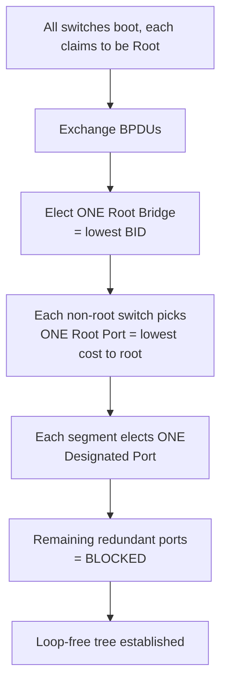

# 📄 `STP Overview`

## 📑 Index

1. [What is Spanning Tree Protocol?](#1-what-is-spanning-tree-protocol)
2. [Why do we need it? (The Problem it Solves)](#2-why-do-we-need-it-the-problem-it-solves)
3. [How it relates to the broader network](#3-how-it-relates-to-the-broader-network)
4. [Key Component 1 — BPDUs](#4-key-component-1--bpdus)
5. [Key Component 2 — The Bridge ID (BID)](#5-key-component-2--the-bridge-id-bid)
6. [Key Component 3 — Path Cost](#6-key-component-3--path-cost)
7. [Safety & Security Features](#7-safety--security-features)
8. [Who created it / Standards](#8-who-created-it--standards)
9. [Types / Variations](#9-types--variations)
10. [Flow of Phases / How it Works](#10-flow-of-phases--how-it-works)
11. [States and Timers](#11-states-and-timers)
12. [Advanced / Extra Features](#12-advanced--extra-features)
13. [Configuration & Troubleshooting Workflow](#13-configuration--troubleshooting-workflow)

---

## 1. What is Spanning Tree Protocol?

- **STP** is a Layer 2 protocol that **prevents loops** in networks with **redundant links** by intelligently **blocking** certain ports — creating a single loop-free logical tree while keeping backup paths ready.
- It builds a **"spanning tree"**: one active path to every destination, rooted at a single reference switch.
- **Analogy** 🌳: Imagine several roads forming a **circle** between towns — cars could drive in an endless loop forever. STP acts like a **traffic authority** that puts a "Road Closed" sign on *just enough* roads to break every circle, while keeping those roads on standby to reopen instantly if another road fails.

## 2. Why do we need it? (The Problem it Solves)

- Redundant links are **required** for reliability — but Layer 2 has **no TTL** (unlike IP), so a looping frame circulates **forever**.
- Without STP, a loop causes three catastrophic failures:
  - **Broadcast Storm** → broadcasts multiply endlessly, saturating all links → network meltdown in seconds.
  - **MAC Table Instability** → the same MAC appears on multiple ports, flapping constantly (CAM thrash).
  - **Duplicate Frames** → multiple copies of unicast frames reach the destination.
- **STP solves this** by blocking redundant paths *while keeping them available* for failover.

## 3. How it relates to the broader network

- Essential in your topology: `ACC-SW1–4` each have **redundant uplinks** to **both** `CORE-SW1` and `CORE-SW2` — a textbook loop.
- STP ensures only **one** uplink forwards at a time (unless bundled via EtherChannel).
- Works **per-VLAN** in Cisco's default (PVST+), so VLANs 20/30/40 each get their own tree.

## 4. Key Component 1 — BPDUs

- **BPDU (Bridge Protocol Data Unit)** = the STP "heartbeat" messages switches exchange to build and maintain the tree.
- Sent to the multicast MAC **`01:80:C2:00:00:00`**.
- Two types:

| BPDU Type | Purpose |
|-----------|---------|
| **Configuration BPDU** | Root election & topology info (sent by root, relayed downstream) |
| **TCN BPDU** (Topology Change Notification) | Signals a topology change so CAM tables age out faster |

## 5. Key Component 2 — The Bridge ID (BID)

- The value used to **elect the Root Bridge** — the lowest BID wins.
- **BID = Bridge Priority + System ID Extension (VLAN) + MAC Address** (8 bytes total):

| Field | Size | Detail |
|-------|------|--------|
| **Bridge Priority** | 4 bits (of 16) | Default **32768**; configurable in increments of **4096** |
| **System ID Extension** | 12 bits | The **VLAN ID** (enables per-VLAN STP) |
| **MAC Address** | 6 bytes | Tiebreaker — lowest MAC wins if priorities tie |

- **Note:** Because priority is compared first, you control root election by **lowering priority** — never rely on the MAC tiebreaker.

## 6. Key Component 3 — Path Cost

- Each port has a **cost** based on its bandwidth — switches sum costs along a path to the root; the **lowest total cost path** is preferred.

| Link Speed | Cost (short / IEEE 802.1D) |
|-----------|:---:|
| 10 Mbps | 100 |
| 100 Mbps | 19 |
| 1 Gbps | 4 |
| 10 Gbps | 2 |

- **Root Path Cost** = cumulative cost from a switch to the Root Bridge.

## 7. Safety & Security Features

- **BPDU Guard** → shuts down edge ports that unexpectedly receive BPDUs (rogue switch). *(See `bpdu-guard.md`.)*
- **Root Guard** → prevents a downstream switch from becoming root. *(See `root-guard.md`.)*
- **Loop Guard** → protects against loops from unidirectional link failures. *(See `loop-guard.md`.)*
- **BPDU Filter** → suppresses BPDUs on specified ports. *(See `bpdu-filter.md`.)*

## 8. Who created it / Standards

- Invented by **Radia Perlman** (1985) at DEC — she famously described the algorithm in a poem, *"Algorhyme."*
- Standardized as **IEEE 802.1D**.
- Later evolved into **802.1w (RSTP)** and **802.1s (MST)**.

## 9. Types / Variations

| Type | Standard | Note |
|------|----------|------|
| **STP** | 802.1D | Original, slow (~30–50s convergence) |
| **PVST+** | Cisco | Per-VLAN STP (Cisco default) |
| **RSTP** | 802.1w | Rapid convergence (~seconds) |
| **Rapid-PVST+** | Cisco | Per-VLAN RSTP (recommended default) |
| **MST** | 802.1s | Maps many VLANs to few instances (scalable) |

*(Each covered in depth in the `types-of-stp` subfolder.)*

## 10. Flow of Phases / How it Works



## 11. States and Timers

**Classic 802.1D Port States:**
| State | Forwards Data? | Learns MACs? | Duration |
|-------|:---:|:---:|----------|
| **Blocking** | ❌ | ❌ | 20s (max age) |
| **Listening** | ❌ | ❌ | 15s (forward delay) |
| **Learning** | ❌ | ✅ | 15s (forward delay) |
| **Forwarding** | ✅ | ✅ | — |
| **Disabled** | ❌ | ❌ | — |

**Timers:**
| Timer | Default | Purpose |
|-------|---------|---------|
| **Hello** | 2 sec | BPDU interval |
| **Forward Delay** | 15 sec | Time in listening + learning |
| **Max Age** | 20 sec | How long to keep BPDU info before reconverging |

- **Note:** Classic STP takes **~30–50 seconds** to converge — the pain point RSTP solves.

## 12. Advanced / Extra Features

- **PortFast** → skips listening/learning on edge ports for instant forwarding. *(See `portfast.md`.)*
- **UplinkFast / BackboneFast** → legacy Cisco convergence accelerators (superseded by RSTP).
- **Per-VLAN load balancing** → make CORE-SW1 root for VLAN 20, CORE-SW2 root for VLAN 30 → both uplinks carry traffic.

---

## 13. Configuration & Troubleshooting Workflow

### Phase 1: Port Selection & Preparation
- Identify the **redundant uplinks** creating the loop: `ACC-SW1 Gig0/1 → CORE-SW1` and `Gig0/2 → CORE-SW2`.
```
ACC-SW1> enable
ACC-SW1# configure terminal
ACC-SW1(config)# interface range GigabitEthernet0/1 - 2
ACC-SW1(config-if-range)# description ** Redundant Uplinks - STP managed **
ACC-SW1(config-if-range)# no shutdown
```

### Phase 2: Base Configuration
- STP runs by default, but **explicitly set the root** deterministically on the core (never leave it to the MAC tiebreaker):
```
! --- CORE-SW1 = Primary Root for all VLANs ---
CORE-SW1(config)# spanning-tree vlan 20,30,40 root primary

! --- CORE-SW2 = Secondary (backup) Root ---
CORE-SW2(config)# spanning-tree vlan 20,30,40 root secondary
```
> `root primary` sets priority to **24576**; `root secondary` sets **28672** (both below the 32768 default).

### Phase 3: Hardening & Security
- Protect the topology — edge ports and root placement:
```
! --- Access edge ports (facing PCs) ---
ACC-SW1(config)# interface range FastEthernet0/1 - 24
ACC-SW1(config-if-range)# spanning-tree portfast
ACC-SW1(config-if-range)# spanning-tree bpduguard enable

! --- Core: protect root role on downstream-facing ports ---
CORE-SW1(config)# interface range GigabitEthernet0/1 - 4
CORE-SW1(config-if-range)# spanning-tree guard root
```
- **Why:** BPDU Guard stops a rogue switch on an edge port; Root Guard ensures the core stays root.

### Phase 4: Verification Flow
Run these `show` commands **in this order**:
```
ACC-SW1# show spanning-tree summary
ACC-SW1# show spanning-tree vlan 20
CORE-SW1# show spanning-tree vlan 20 root
ACC-SW1# show spanning-tree blockedports
ACC-SW1# show spanning-tree interface GigabitEthernet0/1 detail
```
- **What to look for:**
  - `show spanning-tree vlan 20 root` (on CORE-SW1) → confirms **"This bridge is the root."**
  - On ACC-SW1 → one uplink = **Root Port (FWD)**, the other = **Alternate/Blocked (BLK)**.
  - `show spanning-tree blockedports` → confirms exactly which redundant port STP blocked.
  - Verify **Root ID** and **Bridge ID** — they should differ on non-root switches.

### Phase 5: Advanced Debugging
- If you see instability, loops, or wrong root:
```
ACC-SW1# show spanning-tree detail | include ieee|from|changes
ACC-SW1# debug spanning-tree events
ACC-SW1# show spanning-tree inconsistentports
ACC-SW1# show mac address-table count
```
- **Troubleshooting logic:**
  - **Wrong switch is root** → an access switch has a lower BID → set core priority with `root primary`.
  - **Frequent topology changes** → a flapping port or missing PortFast on an edge → check `show spanning-tree detail` for "changes."
  - **Broadcast storm / 100% CPU** → 🚨 a **loop is active** (STP disabled/failed on a link) → check `inconsistentports`.
  - **MAC flapping in logs** → same MAC on two ports → classic loop signature.
