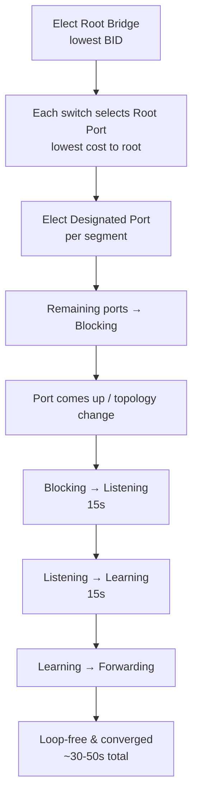

# `802.1d Classic STP`

## Index

1. [What is 802.1D Classic STP?](#1-what-is-8021d-classic-stp)
2. [Why do we need it? (The Problem it Solves)](#2-why-do-we-need-it-the-problem-it-solves)
3. [How it relates to the broader network](#3-how-it-relates-to-the-broader-network)
4. [Key Component 1 — Port Roles](#4-key-component-1--port-roles)
5. [Key Component 2 — The Five Port States](#5-key-component-2--the-five-port-states)
6. [Key Component 3 — The Three Timers](#6-key-component-3--the-three-timers)
7. [Safety & Security Features](#7-safety--security-features)
8. [Who created it / Standards](#8-who-created-it--standards)
9. [Types / Variations](#9-types--variations)
10. [Flow of Phases / How it Works](#10-flow-of-phases--how-it-works)
11. [States and Timers](#11-states-and-timers)
12. [Advanced / Extra Features](#12-advanced--extra-features)
13. [Configuration & Troubleshooting Workflow](#13-configuration--troubleshooting-workflow)

---

## 1. What is 802.1D Classic STP?

- The **original IEEE spanning tree standard** — the foundational loop-prevention algorithm that all modern variants evolved from.
- It builds **one single spanning tree** for the **entire network** (all VLANs share it — "Common Spanning Tree / CST").
- **Analogy** ⏳: The **original, cautious traffic controller**. Before opening any new road, it makes cars *wait a full 30–50 seconds* at every checkpoint to be *absolutely certain* no loop exists — safe, but painfully slow.

## 2. Why do we need it? (The Problem it Solves)

- It solves the fundamental Layer 2 problem: **loops in redundant topologies** (broadcast storms, MAC flapping, duplicate frames).
- Historically vital — it made **redundant LANs possible** for the first time without meltdown.
- **Today:** rarely run in pure form (superseded by Rapid-PVST+/MST), but it's the **conceptual bedrock** — every newer protocol is defined *relative to it*.

## 3. How it relates to the broader network

- In a Cisco environment, pure 802.1D is largely replaced by **PVST+** (per-VLAN version of the same algorithm).
- Its **slow convergence (30–50s)** is the exact pain point that drove RSTP's creation.
- Its **port states and timers** are the vocabulary you'll use across *all* STP discussions.

## 4. Key Component 1 — Port Roles

| Role | Description | Count |
|------|-------------|-------|
| **Root Port (RP)** | Best (lowest-cost) path *toward* the Root Bridge | **One per non-root switch** |
| **Designated Port (DP)** | Best port *for a given segment* (forwards onto it) | **One per segment** |
| **Non-Designated / Blocking** | Redundant port put into blocking to break the loop | Remaining ports |

- **Note:** The **Root Bridge has all Designated Ports** (it's the reference — no root port of its own).

## 5. Key Component 2 — The Five Port States

| State | Forwards Data? | Learns MACs? | Processes BPDUs? |
|-------|:---:|:---:|:---:|
| **Disabled** | ❌ | ❌ | ❌ (admin down) |
| **Blocking** | ❌ | ❌ | ✅ (listens only) |
| **Listening** | ❌ | ❌ | ✅ |
| **Learning** | ❌ | ✅ | ✅ |
| **Forwarding** | ✅ | ✅ | ✅ |

- A port marches: **Blocking → Listening → Learning → Forwarding** — and each transition *costs time*.

## 6. Key Component 3 — The Three Timers

| Timer | Default | Purpose |
|-------|---------|---------|
| **Hello Time** | 2 sec | Interval between BPDUs from the root |
| **Forward Delay** | 15 sec | Time spent in *each* of Listening **and** Learning |
| **Max Age** | 20 sec | How long a switch retains BPDU info before assuming failure |

- ⚠️ **The slow-convergence math:** Max Age (20s) + Forward Delay (15s listening) + Forward Delay (15s learning) = **up to 50 seconds** to move a blocked port to forwarding after a failure.

## 7. Safety & Security Features

- **Native loop prevention** is its entire purpose.
- Lacks *built-in* edge protections — Cisco added **BPDU Guard, Root Guard, PortFast** as enhancements (covered in their own files).
- **Timers are tunable** but must be **consistent network-wide** (the root dictates them).

## 8. Who created it / Standards

- **Radia Perlman**, 1985, at DEC.
- Standardized as **IEEE 802.1D** (1990, revised 1998).
- Officially **superseded** — 802.1D-2004 actually *incorporates RSTP* as the new default.

## 9. Types / Variations

| Variant | Relation to 802.1D |
|---------|--------------------|
| **CST** | The single-tree model 802.1D uses |
| **PVST+** | Cisco: runs a *separate* 802.1D instance per VLAN |
| **RSTP (802.1w)** | The rapid successor |
| **MST (802.1s)** | Groups VLANs into instances |

## 10. Flow of Phases / How it Works



## 11. States and Timers

- See §5 (states) and §6 (timers). The critical takeaway is the **cumulative delay**:

```
Failure detected (Max Age 20s)
        ↓
Listening (Forward Delay 15s)
        ↓
Learning (Forward Delay 15s)
        ↓
Forwarding  →  TOTAL ≈ 50 seconds
```

## 12. Advanced / Extra Features

- **UplinkFast** → Cisco enhancement: instant failover to a backup uplink on access switches (~1–5s).
- **BackboneFast** → speeds recovery from *indirect* link failures (skips Max Age).
- **PortFast** → bypasses Listening/Learning on edge ports (instant forwarding).
- These are **band-aids** for 802.1D's slowness — RSTP later built these behaviors in natively.

---

## 13. Configuration & Troubleshooting Workflow

> ⚙️ On modern Cisco switches you rarely run pure 802.1D — but you **can** force classic behavior via PVST+ mode and tune its timers. This workflow shows classic-mode operation and the legacy accelerators.

### Phase 1: Port Selection & Preparation
- Identify the redundant uplinks between `ACC-SW1` and `CORE-SW1/2` that STP will manage.
```
ACC-SW1> enable
ACC-SW1# configure terminal
ACC-SW1(config)# interface range GigabitEthernet0/1 - 2
ACC-SW1(config-if-range)# description ** 802.1D-managed uplinks **
ACC-SW1(config-if-range)# no shutdown
```

### Phase 2: Base Configuration
- Set the classic per-VLAN STP mode and establish the root:
```
ACC-SW1(config)# spanning-tree mode pvst
CORE-SW1(config)# spanning-tree mode pvst
CORE-SW1(config)# spanning-tree vlan 20,30,40 root primary
CORE-SW2(config)# spanning-tree vlan 20,30,40 root secondary
```

### Phase 3: Hardening & Security
- Apply the legacy accelerators and edge protection to offset 802.1D's slowness:
```
! --- Access edge ports ---
ACC-SW1(config)# interface range FastEthernet0/1 - 24
ACC-SW1(config-if-range)# spanning-tree portfast
ACC-SW1(config-if-range)# spanning-tree bpduguard enable
ACC-SW1(config-if-range)# exit
! --- Legacy fast-failover on access uplinks ---
ACC-SW1(config)# spanning-tree uplinkfast
ACC-SW1(config)# spanning-tree backbonefast
CORE-SW1(config)# spanning-tree backbonefast
```
- **Why:** UplinkFast/BackboneFast slash failover time; PortFast + BPDU Guard secure and speed up edge ports.

### Phase 4: Verification Flow
Run these `show` commands **in this order**:
```
ACC-SW1# show spanning-tree summary
ACC-SW1# show spanning-tree vlan 20
ACC-SW1# show spanning-tree vlan 20 detail
ACC-SW1# show spanning-tree uplinkfast
ACC-SW1# show spanning-tree blockedports
```
- **What to look for:**
  - `show spanning-tree summary` → mode = **pvst**, timers = Hello 2 / Fwd Delay 15 / Max Age 20.
  - `show spanning-tree vlan 20` → correct **Root ID**, one **Root Port (FWD)**, one **Alternate (BLK)**.
  - Port states progress **LIS → LRN → FWD** during convergence (watch the delay!).
  - `show spanning-tree uplinkfast` → confirms it's enabled and functioning.

### Phase 5: Advanced Debugging
- If convergence is painfully slow or a loop appears:
```
ACC-SW1# debug spanning-tree events
ACC-SW1# debug spanning-tree switch state
ACC-SW1# show spanning-tree vlan 20 detail | include changes|from
ACC-SW1# show processes cpu sorted | include STP
```
- **Troubleshooting logic:**
  - **~50s outage on link failure** → 🐌 expected 802.1D behavior → migrate to **Rapid-PVST+** (next files) or enable UplinkFast/BackboneFast.
  - **Ports stuck in Listening/Learning** → timers doing their job → confirm PortFast on edge ports.
  - **Timer mismatch warnings** → non-root switch has different timers → timers must be set on the **root** and propagate.
  - **Loop despite STP** → a link isn't processing BPDUs (unidirectional/filtered) → check cabling and BPDU filter misconfig.
