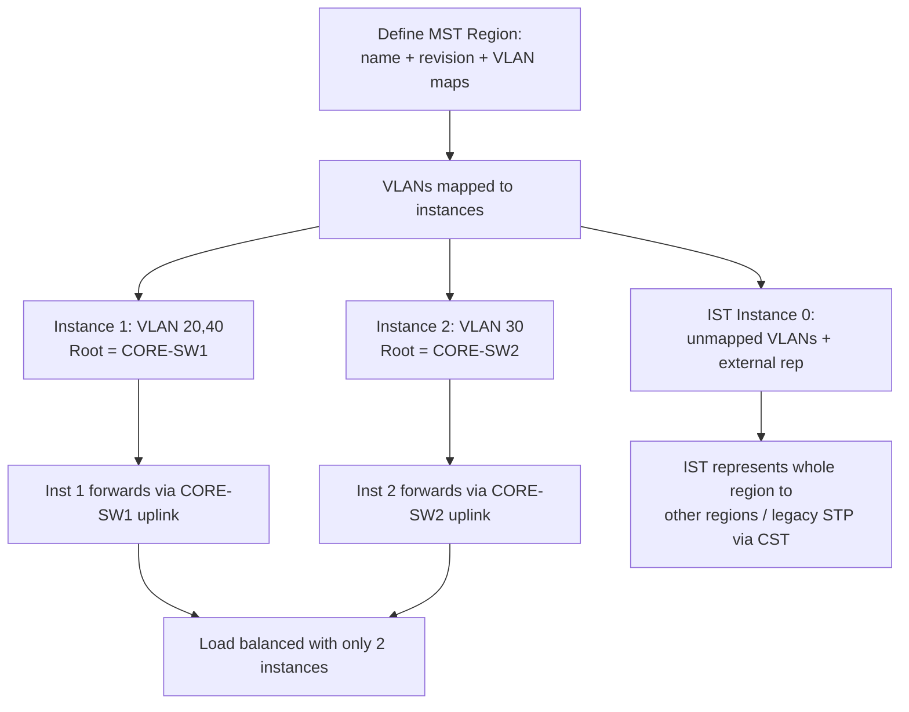

# `MST`

## Index

1. [What is MST?](#1-what-is-mst)
2. [Why do we need it? (The Problem it Solves)](#2-why-do-we-need-it-the-problem-it-solves)
3. [How it relates to the broader network](#3-how-it-relates-to-the-broader-network)
4. [Key Component 1 — MST Instances (MSTI)](#4-key-component-1--mst-instances-msti)
5. [Key Component 2 — MST Regions](#5-key-component-2--mst-regions)
6. [Key Component 3 — The IST (Instance 0)](#6-key-component-3--the-ist-instance-0)
7. [Safety & Security Features](#7-safety--security-features)
8. [Who created it / Standards](#8-who-created-it--standards)
9. [Types / Variations](#9-types--variations)
10. [Flow of Phases / How it Works](#10-flow-of-phases--how-it-works)
11. [States and Timers](#11-states-and-timers)
12. [Advanced / Extra Features](#12-advanced--extra-features)
13. [Configuration & Troubleshooting Workflow](#13-configuration--troubleshooting-workflow)

---

## 1. What is MST?

- **MST (Multiple Spanning Tree)** maps **multiple VLANs onto a small number of spanning-tree instances**, so you run (say) **2 instances for 1000 VLANs** instead of 1000 separate trees.
- Built on RSTP mechanics → **fast convergence** *and* **scalable**.
- **Analogy** 🚌: Instead of running a **separate bus for every single passenger** (PVST+ = one tree per VLAN), MST groups passengers heading the same direction onto **a few shared buses (instances)** — far fewer vehicles, same destinations covered.

## 2. Why do we need it? (The Problem it Solves)

- PVST+/Rapid-PVST+ run **one instance per VLAN** → with hundreds/thousands of VLANs, this **exhausts switch CPU and memory** (BPDU flood, logical-port limits).
- MST solves:
  - **Scalability** → dozens of VLANs share one instance → drastically fewer calculations.
  - **Efficiency** → fewer BPDUs, lower CPU.
  - **Retained load balancing** → different instances can have different roots (map VLAN groups to different paths).

## 3. How it relates to the broader network

- **Overkill for your 3-VLAN lab** — but it's the **standard in large enterprises and data centers** (and a CCNP/expert must-know).
- In your lab you *can* deploy it to learn: map VLAN 20/40 → Instance 1, VLAN 30 → Instance 2, and split roots across CORE-SW1/2 → same load-balancing outcome as Rapid-PVST+, but with only **2 instances**.

## 4. Key Component 1 — MST Instances (MSTI)

- An **MSTI** is a single spanning tree that carries a **group of VLANs**.
- You **explicitly map** VLANs to instances (e.g., `instance 1 vlan 20,40`).
- Each MSTI elects its **own root** and computes its **own topology** → different instances can forward down different links = **load balancing**.

## 5. Key Component 2 — MST Regions

- An **MST Region** is a group of switches that share **identical MST configuration**. To be in the same region, three attributes **must match exactly**:
  1. **Region name**
  2. **Revision number**
  3. **VLAN-to-instance mapping**
- If *any* differ, the switches are in **different regions** and treat each other as a boundary (falling back to CST between regions).
- **Analogy** 🗺️: A region is like a **country** — everyone inside follows the same internal map. At the border, a simplified "international" agreement (CST) takes over.

## 6. Key Component 3 — The IST (Instance 0)

- **IST (Internal Spanning Tree) = MST Instance 0** — always present.
- **Every VLAN not explicitly mapped** to an MSTI belongs to **IST (Instance 0)** by default.
- The IST is what **communicates with the outside world** (other regions / legacy STP) — it represents the *entire region* to external switches as a single virtual bridge.

## 7. Safety & Security Features

- All guards apply: **BPDU Guard, Root Guard, Loop Guard, BPDU Filter**.
- **Boundary consistency checks** → detects region-mismatch and PVST-simulation issues (prevents loops at region edges).
- **PVST simulation** → allows an MST region to interoperate safely with a Rapid-PVST+ domain.

## 8. Who created it / Standards

- **IEEE 802.1s** (originally standalone, later merged into **802.1Q-2005**).
- Uses **802.1w (RSTP)** as its convergence engine.
- **Interoperable** — being standards-based, it works in multi-vendor environments (unlike PVST+).

## 9. Types / Variations

| Model | Instances | Scalability | Vendor |
|-------|-----------|-------------|--------|
| **PVST+ / Rapid-PVST+** | One per VLAN | Poor at scale | Cisco |
| **MST (802.1s)** | Few (grouped) | Excellent | Open standard |
| **CST (802.1D)** | One total | N/A (no LB) | Open standard |

## 10. Flow of Phases / How it Works



## 11. States and Timers

- Uses **RSTP states**: **Discarding / Learning / Forwarding** (same rapid mechanics).
- **Proposal/Agreement handshake** drives fast convergence (inherited from 802.1w).
- Timers (Hello/Fwd Delay/Max Age) exist as fallback; adds **`max-hops`** (default **20**) to bound BPDU propagation *within* a region (replaces Max Age for internal aging).

## 12. Advanced / Extra Features

- **max-hops** → region-internal loop-bounding (BPDU discarded after N hops).
- **Region boundary port** → automatically handles the MST↔RSTP/PVST transition.
- **Massive scale** → map 1000s of VLANs into 2–16 instances → tiny CPU footprint.
- **Multi-vendor design** → the go-to choice in mixed Cisco/Juniper/Arista fabrics.

---

## 13. Configuration & Troubleshooting Workflow

### Phase 1: Port Selection & Preparation
- No special ports — MST is a **switch-wide mode + region** configuration applied to *all* switches identically. Confirm uplinks are up.
```
ACC-SW1> enable
ACC-SW1# configure terminal
ACC-SW1(config)# interface range GigabitEthernet0/1 - 2
ACC-SW1(config-if-range)# description ** MST uplinks **
ACC-SW1(config-if-range)# no shutdown
```

### Phase 2: Base Configuration
- Enable MST mode, then define an **identical region** on **every** switch (name + revision + VLAN maps MUST match):
```
! --- Apply this SAME block on ACC-SW1-4, CORE-SW1, CORE-SW2 ---
ACC-SW1(config)# spanning-tree mode mst
ACC-SW1(config)# spanning-tree mst configuration
ACC-SW1(config-mst)# name LAB_REGION
ACC-SW1(config-mst)# revision 1
ACC-SW1(config-mst)# instance 1 vlan 20,40
ACC-SW1(config-mst)# instance 2 vlan 30
ACC-SW1(config-mst)# exit
```
- Now split roots per **instance** for load balancing (on the cores):
```
CORE-SW1(config)# spanning-tree mst 1 root primary
CORE-SW1(config)# spanning-tree mst 2 root secondary
CORE-SW2(config)# spanning-tree mst 2 root primary
CORE-SW2(config)# spanning-tree mst 1 root secondary
```

### Phase 3: Hardening & Security
- Set max-hops, secure edges, and protect root per instance:
```
ACC-SW1(config)# spanning-tree mst max-hops 20
! --- Edge ports ---
ACC-SW1(config)# interface range FastEthernet0/1 - 24
ACC-SW1(config-if-range)# spanning-tree portfast
ACC-SW1(config-if-range)# spanning-tree bpduguard enable
ACC-SW1(config-if-range)# exit
! --- Core: root guard toward access ---
CORE-SW1(config)# interface range GigabitEthernet0/1 - 4
CORE-SW1(config-if-range)# spanning-tree guard root
```
- **Why:** Identical region config prevents accidental region boundaries; per-instance root split preserves load balancing with minimal instances.

### Phase 4: Verification Flow
Run these `show` commands **in this order**:
```
ACC-SW1# show spanning-tree summary
ACC-SW1# show spanning-tree mst configuration
ACC-SW1# show spanning-tree mst
ACC-SW1# show spanning-tree mst 1
ACC-SW1# show spanning-tree mst interface GigabitEthernet0/1
```
- **What to look for:**
  - `show spanning-tree summary` → mode = **mst**.
  - `show spanning-tree mst configuration` → **name/revision/VLAN maps identical** on every switch (the #1 thing to verify).
  - `show spanning-tree mst 1` → Instance 1 root = **CORE-SW1**; `mst 2` root = **CORE-SW2**.
  - Different instances forward down **different uplinks** = load balancing confirmed. ✅

### Phase 5: Advanced Debugging
- If switches unexpectedly form separate regions or VLANs aren't following instances:
```
ACC-SW1# show spanning-tree mst configuration
ACC-SW1# show spanning-tree mst configuration digest
ACC-SW1# show spanning-tree mst interface GigabitEthernet0/1 detail
ACC-SW1# debug spanning-tree mstp events
```
- **Troubleshooting logic:**
  - **Switches in different regions** → 🚨 name/revision/VLAN-map mismatch → compare the **`digest`** (must be identical across all switches in the region).
  - **A VLAN behaving unexpectedly** → it wasn't mapped → defaulted to **IST (Instance 0)** → add it to the correct instance.
  - **Boundary port acting as CST** → connected to a non-MST (Rapid-PVST+) neighbor → expected; verify PVST simulation isn't flagging inconsistency.
  - **Load balancing not working** → both instances elected the same root → fix per-instance `root primary/secondary`.
