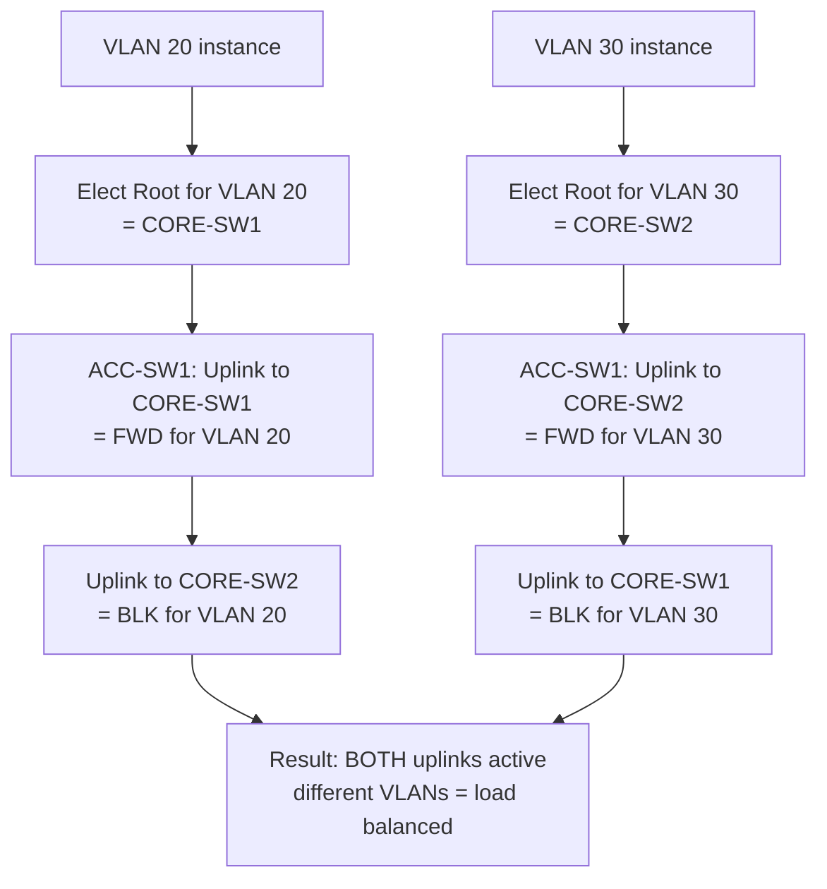

# `PVST Plus`

## Index

1. [What is PVST+?](#1-what-is-pvst)
2. [Why do we need it? (The Problem it Solves)](#2-why-do-we-need-it-the-problem-it-solves)
3. [How it relates to the broader network](#3-how-it-relates-to-the-broader-network)
4. [Key Component 1 — Per-VLAN Instances](#4-key-component-1--per-vlan-instances)
5. [Key Component 2 — System ID Extension](#5-key-component-2--system-id-extension)
6. [Key Component 3 — Per-VLAN BPDUs (SSTP)](#6-key-component-3--per-vlan-bpdus-sstp)
7. [Safety & Security Features](#7-safety--security-features)
8. [Who created it / Standards](#8-who-created-it--standards)
9. [Types / Variations](#9-types--variations)
10. [Flow of Phases / How it Works](#10-flow-of-phases--how-it-works)
11. [States and Timers](#11-states-and-timers)
12. [Advanced / Extra Features](#12-advanced--extra-features)
13. [Configuration & Troubleshooting Workflow](#13-configuration--troubleshooting-workflow)

---

## 1. What is PVST+?

- **PVST+ (Per-VLAN Spanning Tree Plus)** is Cisco's enhancement that runs a **separate, independent 802.1D spanning-tree instance for *each* VLAN**.
- It's the **default STP mode** on most Cisco Catalyst switches.
- **Analogy** 🚦: Instead of *one* city-wide traffic plan (classic CST), PVST+ gives **each neighborhood (VLAN) its own dedicated traffic controller** — each can route around its own roadblocks independently, and you can send different neighborhoods down different highways.

## 2. Why do we need it? (The Problem it Solves)

- Classic 802.1D builds **one tree for everything** → all VLANs are forced down the *same* forwarding path → the redundant uplink sits **100% idle** (blocked).
- PVST+ solves:
  - **Load balancing** → VLAN 20 uses uplink A, VLAN 30 uses uplink B → *both* links carry traffic.
  - **Fault isolation** → a topology change in VLAN 20 doesn't disturb VLAN 30's tree.
  - **Granular control** → per-VLAN root placement and tuning.

## 3. How it relates to the broader network

- This is what made your earlier **per-VLAN load balancing** design possible:
  - CORE-SW1 = root for VLAN 20/40, CORE-SW2 = root for VLAN 30.
- **Trade-off:** More instances = more **CPU/memory** and more **BPDUs** (one set per VLAN). With 3 VLANs it's trivial; with 1000+ VLANs it becomes a scaling problem → that's where **MST** comes in.

## 4. Key Component 1 — Per-VLAN Instances

- Each VLAN gets its **own** Root Bridge election, port roles, and port states — computed **independently**.
- A single physical port can be **Forwarding for VLAN 20** but **Blocking for VLAN 30** simultaneously.
- **This is the core superpower** of PVST+ (and the source of load balancing).

## 5. Key Component 2 — System ID Extension

- To keep BIDs unique per VLAN without needing 4096 MAC addresses, PVST+ uses the **12-bit System ID Extension** = the **VLAN ID**.
- **Effective Priority = Base Priority + VLAN ID.**
- **Example:** Base 32768 → VLAN 20 shows **32788**; VLAN 30 shows **32798**.
- Defined by IEEE **802.1t** (the "extended system ID").

## 6. Key Component 3 — Per-VLAN BPDUs (SSTP)

- PVST+ sends a **separate BPDU per VLAN**, using a Cisco format called **SSTP (Shared Spanning Tree Protocol)**.
- These are sent to a **Cisco multicast MAC `01:00:0C:CC:CC:CD`** (not the standard 802.1D `0180.C200.0000`).
- **Interoperability trick:** On the **native VLAN**, PVST+ sends *standard* 802.1D BPDUs too — so it can coexist with non-Cisco switches running CST.

## 7. Safety & Security Features

- All standard STP guards apply **per-VLAN**: **BPDU Guard, Root Guard, Loop Guard, BPDU Filter**.
- **PVST Simulation check** → detects inconsistencies when connecting to MST regions (prevents subtle loops).
- **Per-VLAN Root Guard** → lock the root independently for each VLAN.

## 8. Who created it / Standards

- **Cisco-proprietary** (built on the open 802.1D algorithm + 802.1t extended system ID).
- Successor: **Rapid-PVST+** (PVST+ using the faster 802.1w mechanics — next file).
- **PVST (original)** worked only over ISL; **PVST+** added 802.1Q support (hence the "+").

## 9. Types / Variations

| Variant | Underlying Algorithm | Speed |
|---------|---------------------|-------|
| **PVST** | 802.1D over ISL only | Slow |
| **PVST+** | 802.1D over 802.1Q | Slow (30–50s) |
| **Rapid-PVST+** | 802.1w per VLAN | Fast (seconds) |

## 10. Flow of Phases / How it Works



## 11. States and Timers

- Uses the **same 5 states and 3 timers as 802.1D** (Blocking→Listening→Learning→Forwarding; Hello 2s / Fwd Delay 15s / Max Age 20s).
- **Key difference:** these run **independently per VLAN**, so convergence is per-instance.
- **Still slow (~30–50s)** — because it's classic 802.1D mechanics, just replicated per VLAN.

## 12. Advanced / Extra Features

- **Per-VLAN cost/priority tuning** → `spanning-tree vlan X cost` / `port-priority` for fine path control.
- **Per-VLAN load balancing** → the headline feature (root split across cores).
- **UplinkFast/BackboneFast** → still available to speed up classic PVST+.
- **Scaling ceiling** → ~128 logical ports or heavy CPU with many VLANs → migrate to **Rapid-PVST+** or **MST**.

---

## 13. Configuration & Troubleshooting Workflow

### Phase 1: Port Selection & Preparation
- Identify the redundant uplinks that will forward/block **differently per VLAN**.
```
ACC-SW1> enable
ACC-SW1# configure terminal
ACC-SW1(config)# interface range GigabitEthernet0/1 - 2
ACC-SW1(config-if-range)# description ** PVST+ per-VLAN uplinks **
ACC-SW1(config-if-range)# no shutdown
```

### Phase 2: Base Configuration
- Set PVST+ mode and split roots per VLAN for load balancing:
```
! --- All switches: PVST+ (classic per-VLAN) mode ---
ACC-SW1(config)# spanning-tree mode pvst
CORE-SW1(config)# spanning-tree mode pvst
CORE-SW2(config)# spanning-tree mode pvst

! --- Split roots across the two cores ---
CORE-SW1(config)# spanning-tree vlan 20,40 root primary
CORE-SW1(config)# spanning-tree vlan 30 root secondary
CORE-SW2(config)# spanning-tree vlan 30 root primary
CORE-SW2(config)# spanning-tree vlan 20,40 root secondary
```

### Phase 3: Hardening & Security
- Apply per-VLAN protections and edge safeguards:
```
! --- Optional: fine-tune a specific VLAN's path cost on ACC ---
ACC-SW1(config)# interface GigabitEthernet0/1
ACC-SW1(config-if)# spanning-tree vlan 20 cost 3
ACC-SW1(config-if)# exit
! --- Core: protect root role ---
CORE-SW1(config)# interface range GigabitEthernet0/1 - 4
CORE-SW1(config-if-range)# spanning-tree guard root
! --- Access edge ---
ACC-SW1(config)# interface range FastEthernet0/1 - 24
ACC-SW1(config-if-range)# spanning-tree portfast
ACC-SW1(config-if-range)# spanning-tree bpduguard enable
```
- **Why:** Per-VLAN cost steers specific VLANs down chosen links; Root Guard + BPDU Guard lock the topology.

### Phase 4: Verification Flow
Run these `show` commands **in this order**:
```
ACC-SW1# show spanning-tree summary
ACC-SW1# show spanning-tree vlan 20
ACC-SW1# show spanning-tree vlan 30
ACC-SW1# show spanning-tree vlan 20 bridge
ACC-SW1# show spanning-tree blockedports
```
- **What to look for:**
  - `show spanning-tree summary` → mode = **pvst**.
  - `show spanning-tree vlan 20` → uplink to **CORE-SW1 = Root Port (FWD)**; uplink to CORE-SW2 = **Alternate (BLK)**.
  - `show spanning-tree vlan 30` → the **opposite** — uplink to CORE-SW2 forwards, CORE-SW1 blocks.
  - **Priority shows base + VLAN ID** (e.g., 24596 for VLAN 20) — confirming System ID Extension.
  - `show spanning-tree blockedports` → *different* ports blocked for different VLANs = load balancing confirmed. ✅

### Phase 5: Advanced Debugging
- If load balancing isn't happening or CPU is high:
```
ACC-SW1# show spanning-tree vlan 20 detail | include Root|cost|priority
ACC-SW1# show spanning-tree inconsistentports
ACC-SW1# show processes cpu sorted | include STP
ACC-SW1# debug spanning-tree events
```
- **Troubleshooting logic:**
  - **Same uplink forwards for ALL VLANs** → roots not split → both VLANs elected the same root → fix per-VLAN `root primary/secondary`.
  - **High CPU with many VLANs** → PVST+ instance overload → migrate to **MST** (fewer instances).
  - **PVST simulation inconsistency** → connected to an MST region with mismatched config → align boundary settings.
  - **Priority values look offset** → normal (System ID Extension = base + VLAN ID), not a fault.
