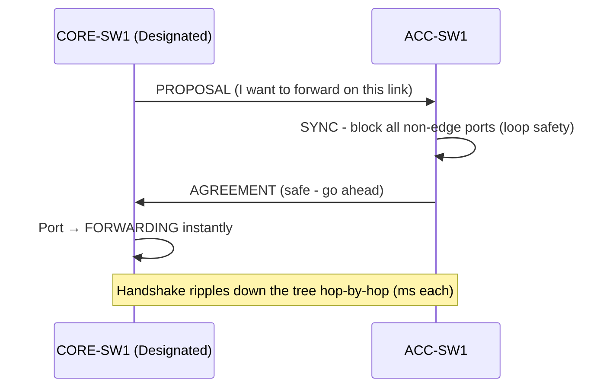

# `Rapid PVST`

## Index

1. [What is Rapid-PVST+?](#1-what-is-rapid-pvst)
2. [Why do we need it? (The Problem it Solves)](#2-why-do-we-need-it-the-problem-it-solves)
3. [How it relates to the broader network](#3-how-it-relates-to-the-broader-network)
4. [Key Component 1 — New Port Roles](#4-key-component-1--new-port-roles)
5. [Key Component 2 — New Port States](#5-key-component-2--new-port-states)
6. [Key Component 3 — Proposal/Agreement Handshake](#6-key-component-3--proposalagreement-handshake)
7. [Safety & Security Features](#7-safety--security-features)
8. [Who created it / Standards](#8-who-created-it--standards)
9. [Types / Variations](#9-types--variations)
10. [Flow of Phases / How it Works](#10-flow-of-phases--how-it-works)
11. [States and Timers](#11-states-and-timers)
12. [Advanced / Extra Features](#12-advanced--extra-features)
13. [Configuration & Troubleshooting Workflow](#13-configuration--troubleshooting-workflow)

---

## 1. What is Rapid-PVST+?

- **Rapid-PVST+** is Cisco's implementation of **RSTP (802.1w)** run **per VLAN** — combining PVST+'s per-VLAN independence with RSTP's **rapid (sub-second to few-second) convergence**.
- It's the **recommended default STP mode** for modern Cisco networks.
- **Analogy** ⚡: If classic STP is the cautious controller making everyone wait 50 seconds, Rapid-PVST+ is a **modern controller with live sensors** — it *confirms with the next intersection* (proposal/agreement) that a road is safe and opens it **almost instantly**.

## 2. Why do we need it? (The Problem it Solves)

- Classic PVST+ takes **~30–50 seconds** to recover from a topology change — an eternity for VoIP (VLAN 40) and modern apps.
- Rapid-PVST+ solves:
  - **Fast convergence** → seconds (often <1s on point-to-point links).
  - **Active negotiation** → ports transition via a *handshake*, not blind timers.
  - **Backward compatibility** → falls back to 802.1D if it detects a legacy neighbor.

## 3. How it relates to the broader network

- Ideal for your topology's **redundant ACC↔CORE uplinks** — failover is nearly seamless.
- Critical for **Voice VLAN 40** → sub-second recovery means calls don't drop on a link failure.
- Retains all PVST+ **per-VLAN load balancing** (roots split across CORE-SW1/2).

## 4. Key Component 1 — New Port Roles

RSTP refines roles and adds **backup roles** so replacements are pre-computed:

| Role | Purpose |
|------|---------|
| **Root Port** | Best path to root *(same as STP)* |
| **Designated Port** | Forwarding port for a segment *(same as STP)* |
| **Alternate Port** | A **backup to the Root Port** — a pre-computed alternate path to root (was "blocking" in STP) |
| **Backup Port** | A backup to a **Designated Port** on the *same* segment (rare — shared media) |

- **Key idea:** Alternate/Backup ports are **ready to activate instantly** — no waiting.

## 5. Key Component 2 — New Port States

RSTP collapses the **five** classic states into **three**:

| RSTP State | Equivalent 802.1D States | Forwards? | Learns? |
|-----------|--------------------------|:---:|:---:|
| **Discarding** | Disabled + Blocking + Listening | ❌ | ❌ |
| **Learning** | Learning | ❌ | ✅ |
| **Forwarding** | Forwarding | ✅ | ✅ |

- Simpler + faster: there's no separate slow "Listening" phase to sit through.

## 6. Key Component 3 — Proposal/Agreement Handshake

- The **engine of rapid convergence**. Instead of timers, adjacent switches **negotiate**:
  1. A new/recovered **Designated Port** sends a **Proposal**.
  2. To accept, the neighbor **blocks all its non-edge ports** (a "sync") to guarantee no loop.
  3. The neighbor replies with an **Agreement**.
  4. The proposing port **immediately goes to Forwarding**.
- This ripples switch-by-switch down the tree — each hop converges in **milliseconds**.
- **Requires point-to-point (full-duplex) links** — which all your switch uplinks are.

## 7. Safety & Security Features

- All guards apply: **BPDU Guard, Root Guard, Loop Guard, BPDU Filter** (per-VLAN).
- **Edge ports (PortFast)** are integral — they transition instantly and don't trigger topology changes.
- **RSTP BPDU handling** → *every* switch generates its own BPDUs every Hello (not just relaying the root's) → faster failure detection.

## 8. Who created it / Standards

- Based on **IEEE 802.1w** (RSTP), authored to fix 802.1D's slowness.
- 802.1w was later **rolled into 802.1D-2004** as the new default.
- **Rapid-PVST+** = Cisco-proprietary per-VLAN application of 802.1w.

## 9. Types / Variations

| Protocol | Standard | Instances | Speed |
|----------|----------|-----------|-------|
| **RSTP** | 802.1w | One (CST) | Fast |
| **Rapid-PVST+** | Cisco (802.1w per VLAN) | Per-VLAN | Fast ✅ |
| **MST** | 802.1s | Per-instance group | Fast + scalable |

## 10. Flow of Phases / How it Works



## 11. States and Timers

- Timers still exist (**Hello 2s / Fwd Delay 15s / Max Age 20s**) but serve mainly as **backup/fallback** — convergence is driven by the **handshake**, not timers.
- **Rapid link failure detection:** loss of **3 consecutive BPDUs** (~6s) = neighbor down (vs. waiting Max Age 20s in classic STP).
- **Edge ports** → immediate forwarding, zero delay.

## 12. Advanced / Extra Features

- **Link Type** → RSTP auto-detects `point-to-point` (full-duplex, enables handshake) vs `shared` (half-duplex, falls back to timers). Can be forced with `spanning-tree link-type`.
- **Topology Change (TC) improvement** → TCs are simpler and don't flood the whole network's CAM flush like 802.1D.
- **Compatibility mode** → auto-downgrades a port to 802.1D if it hears legacy BPDUs (then that port loses rapid convergence).

---

## 13. Configuration & Troubleshooting Workflow

### Phase 1: Port Selection & Preparation
- Identify the point-to-point uplinks (full-duplex — required for the handshake) between `ACC-SW1` and `CORE-SW1/2`.
```
ACC-SW1> enable
ACC-SW1# configure terminal
ACC-SW1(config)# interface range GigabitEthernet0/1 - 2
ACC-SW1(config-if-range)# description ** Rapid-PVST+ uplinks (P2P) **
ACC-SW1(config-if-range)# duplex full
ACC-SW1(config-if-range)# no shutdown
```

### Phase 2: Base Configuration
- Enable Rapid-PVST+ on **all** switches and retain per-VLAN root split:
```
ACC-SW1(config)# spanning-tree mode rapid-pvst
CORE-SW1(config)# spanning-tree mode rapid-pvst
CORE-SW2(config)# spanning-tree mode rapid-pvst

! --- Keep per-VLAN load balancing ---
CORE-SW1(config)# spanning-tree vlan 20,40 root primary
CORE-SW1(config)# spanning-tree vlan 30 root secondary
CORE-SW2(config)# spanning-tree vlan 30 root primary
CORE-SW2(config)# spanning-tree vlan 20,40 root secondary
```

### Phase 3: Hardening & Security
- Force link types for guaranteed handshake, and secure the edge:
```
! --- Force point-to-point on uplinks (ensures rapid transition) ---
ACC-SW1(config)# interface range GigabitEthernet0/1 - 2
ACC-SW1(config-if-range)# spanning-tree link-type point-to-point
ACC-SW1(config-if-range)# exit
! --- Edge ports: PortFast + BPDU Guard ---
ACC-SW1(config)# interface range FastEthernet0/1 - 24
ACC-SW1(config-if-range)# spanning-tree portfast
ACC-SW1(config-if-range)# spanning-tree bpduguard enable
! --- Core: Root Guard on downstream ports ---
CORE-SW1(config)# interface range GigabitEthernet0/1 - 4
CORE-SW1(config-if-range)# spanning-tree guard root
```
- **Why:** `point-to-point` guarantees the proposal/agreement handshake fires; PortFast edge ports transition instantly and won't cause TCs.

### Phase 4: Verification Flow
Run these `show` commands **in this order**:
```
ACC-SW1# show spanning-tree summary
ACC-SW1# show spanning-tree vlan 20
ACC-SW1# show spanning-tree interface GigabitEthernet0/1 detail
ACC-SW1# show spanning-tree vlan 20 detail | include role|state|Link
ACC-SW1# show spanning-tree blockedports
```
- **What to look for:**
  - `show spanning-tree summary` → mode = **rapid-pvst**.
  - Port **roles** now show **Root / Designated / Alt / Backup**; states show **FWD / LRN / DISC** (Discarding — not "Blocking").
  - The redundant uplink = **Alternate (DISC)** rather than the classic "Blocking."
  - `show ... interface detail` → confirms **Link type: point-to-point** (handshake capable).

### Phase 5: Advanced Debugging
- If convergence is still slow or falling back to 802.1D:
```
ACC-SW1# show spanning-tree interface GigabitEthernet0/1 detail | include type|BPDU|802
ACC-SW1# debug spanning-tree events
ACC-SW1# debug spanning-tree rstp
ACC-SW1# show spanning-tree vlan 20 detail | include changes|from
```
- **Troubleshooting logic:**
  - **Convergence still ~50s** → port ran into a **legacy 802.1D neighbor** → RSTP downgraded that port → find/upgrade the old switch.
  - **No rapid handshake** → link detected as **shared** (half-duplex) → set full duplex + `link-type point-to-point`.
  - **Frequent TCs** → an edge port lacks PortFast → each host reboot triggers a TC → enable PortFast on all access ports.
  - **"Blocking" instead of "Discarding" shown** → switch is actually in **pvst** mode, not rapid-pvst → re-check `spanning-tree mode`.
