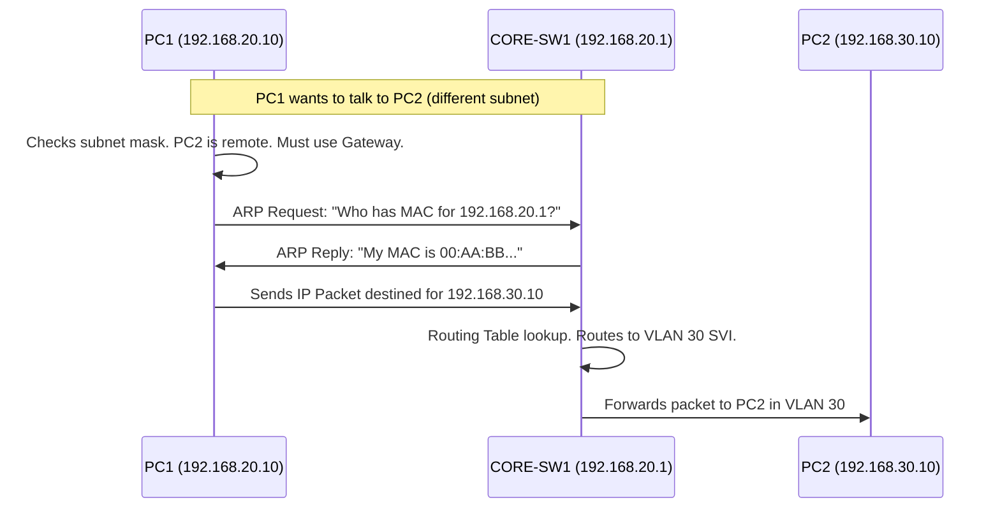

# `IP & VLAN Schema`

## Index

1. [What is the IP & VLAN Schema?](#1-what-is-the-ip--vlan-schema)
2. [Why do we need it? (The Problem it Solves)](#2-why-do-we-need-it-the-problem-it-solves)
3. [How it relates to the broader network](#3-how-it-relates-to-the-broader-network)
4. [Key Component 1 — VLAN to Subnet Mapping](#4-key-component-1--vlan-to-subnet-mapping)
5. [Key Component 2 — Default Gateways (SVIs)](#5-key-component-2--default-gateways-svis)
6. [Key Component 3 — Endpoint Addressing](#6-key-component-3--endpoint-addressing)
7. [Safety & Security Features](#7-safety--security-features)
8. [Who created it / Standards](#8-who-created-it--standards)
9. [Types / Variations](#9-types--variations)
10. [Flow of Phases / How it Works](#10-flow-of-phases--how-it-works)
11. [States and Timers](#11-states-and-timers)
12. [Advanced / Extra Features](#12-advanced--extra-features)
13. [Configuration & Troubleshooting Workflow](#13-configuration--troubleshooting-workflow)

---

## 1. What is the IP & VLAN Schema?

- The **schema** is the master logical blueprint that explicitly maps every Layer 2 broadcast domain (VLAN) to a specific Layer 3 network (IP Subnet).
- It defines the network addresses, subnet masks, default gateways, and usable host ranges for the entire lab.
- **Analogy** 📮: If VLANs are different **cities**, the IP schema is the **ZIP code and street address system** that allows the postal service (the router) to deliver mail between them.

## 2. Why do we need it? (The Problem it Solves)

- Layer 2 switches forward frames based on MAC addresses, but MAC addresses cannot cross VLAN boundaries.
- To move traffic from VLAN 20 to VLAN 30, you need Layer 3 routing. Routing requires IP addresses.
- Solves:
  - **Inter-VLAN Communication** → Provides the IP structure needed for routing.
  - **Address Exhaustion / Overlap** → Ensures no two VLANs use the same IP space.
  - **Management** → Provides a predictable IP structure for troubleshooting (e.g., the 3rd octet matches the VLAN ID).

## 3. How it relates to the broader network

- **Access Layer (`ACC-SW1-4`)**: Enforces the L2 VLAN boundaries.
- **Core Layer (`CORE-SW1/2`)**: Hosts the Layer 3 Default Gateways (SVIs) defined in this schema.
- **Endpoints (`PC1-8`)**: Receive IPs from this schema via DHCP or static assignment to communicate.

## 4. Key Component 1 — VLAN to Subnet Mapping

A best-practice design aligns the 3rd octet of the IP subnet with the VLAN ID for instant recognition:

| VLAN ID | Name | Subnet | Subnet Mask | Usable Host Range |
|:---:|---|---|---|---|
| **20** | DATA-A | `192.168.20.0` | `/24` (255.255.255.0) | `.2` - `.254` |
| **30** | DATA-B | `192.168.30.0` | `/24` (255.255.255.0) | `.2` - `.254` |
| **40** | VOICE | `192.168.40.0` | `/24` (255.255.255.0) | `.2` - `.254` |
| **99** | MGMT | `10.0.99.0` | `/24` (255.255.255.0) | `.2` - `.254` |

## 5. Key Component 2 — Default Gateways (SVIs)

- The **SVI (Switch Virtual Interface)** is the virtual Layer 3 router interface residing on the Core switches.
- Endpoints point to this IP as their default gateway.
- In this lab, `CORE-SW1` will hold the `.1` address for every subnet.

| VLAN | Gateway IP (CORE-SW1) |
|:---:|---|
| 20 | `192.168.20.1` |
| 30 | `192.168.30.1` |
| 40 | `192.168.40.1` |
| 99 | `10.0.99.1` |

## 6. Key Component 3 — Endpoint Addressing

- **PCs (VLAN 20/30)**: Can be statically assigned or use DHCP.
- **IP Phones (VLAN 40)**: Rely on DHCP (Option 150) to get their IP and the address of the Call Manager / TFTP server.
- **Switches (VLAN 99)**: `ACC-SW1-4` need a management IP in VLAN 99 to be reachable via SSH.

## 7. Safety & Security Features

- **DHCP Snooping** → Prevents rogue DHCP servers from handing out incorrect IPs that violate this schema.
- **Dynamic ARP Inspection (DAI)** → Uses the DHCP Snooping binding database to prevent IP/MAC spoofing (Man-in-the-Middle attacks).
- **IP Source Guard** → Blocks traffic from an IP address not assigned to that specific switch port.

## 8. Who created it / Standards

- **IPv4 Addressing:** Defined by IETF RFC 791.
- **Private IP Space:** Defined by RFC 1918 (e.g., 192.168.x.x, 10.x.x.x).
- **ARP (Address Resolution Protocol):** RFC 826.

## 9. Types / Variations

| Allocation Method | Use Case |
|---|---|
| **Static IP** | Servers, Default Gateways, Switch Management interfaces. |
| **Dynamic (DHCP)** | PCs, Laptops, IP Phones. |
| **SLAAC / DHCPv6** | IPv6 equivalent schema designs. |

## 10. Flow of Phases / How it Works



## 11. States and Timers

- **ARP Cache Timeout:** Default 4 hours (14400 seconds) on Cisco switches. Maps the schema's IPs to L2 MACs.
- **DHCP Lease Time:** Typically 1 to 8 days. How long an endpoint owns its dynamically assigned IP from the schema.

## 12. Advanced / Extra Features

- **FHRP (HSRP/VRRP):** In a highly redundant lab, `CORE-SW1` and `CORE-SW2` would share a Virtual IP (e.g., `192.168.20.254`). PCs use the Virtual IP as their gateway, allowing seamless L3 failover if `CORE-SW1` dies.
- **Subnetting (VLSM):** Breaking a `/24` into smaller chunks (e.g., `/26`) to conserve IP space.

---

## 13. Configuration & Troubleshooting Workflow

> ⚙️ **Note:** This workflow implements the Layer 3 SVIs on the Core switch to bring the schema to life, and secures the schema at the Access layer.

### Phase 1: Port Selection & Preparation
- Ensure the Layer 2 VLANs exist on the Core switch before creating the Layer 3 SVIs.
```
CORE-SW1> enable
CORE-SW1# configure terminal
CORE-SW1(config)# vlan 20,30,40,99
CORE-SW1(config-vlan)# exit
```

### Phase 2: Base Configuration
- Enable global routing, then create and assign IPs to the SVIs based on the schema.
```
CORE-SW1(config)# ip routing
CORE-SW1(config)# interface vlan 20
CORE-SW1(config-if)# description ** Gateway for DATA-A **
CORE-SW1(config-if)# ip address 192.168.20.1 255.255.255.0
CORE-SW1(config-if)# no shutdown

CORE-SW1(config)# interface vlan 30
CORE-SW1(config-if)# description ** Gateway for DATA-B **
CORE-SW1(config-if)# ip address 192.168.30.1 255.255.255.0
CORE-SW1(config-if)# no shutdown

CORE-SW1(config)# interface vlan 40
CORE-SW1(config-if)# description ** Gateway for VOICE **
CORE-SW1(config-if)# ip address 192.168.40.1 255.255.255.0
CORE-SW1(config-if)# no shutdown
```

### Phase 3: Hardening & Security
- Protect the schema on the Access switches so rogue devices can't hijack the IP space.
```
! --- On ACC-SW1 ---
ACC-SW1(config)# ip dhcp snooping
ACC-SW1(config)# ip dhcp snooping vlan 20,30,40
! Trust the uplink to the Core (where the real DHCP server/router lives)
ACC-SW1(config)# interface GigabitEthernet0/1
ACC-SW1(config-if)# ip dhcp snooping trust
```

### Phase 4: Verification Flow
Run these `show` commands **in this order**:

```
CORE-SW1# show ip interface brief | exclude unassigned
CORE-SW1# show ip route
CORE-SW1# show ip arp
ACC-SW1# show ip dhcp snooping binding
```

- **What to look for:**
  - `show ip interface brief` → Vlan20, Vlan30, Vlan40 should show **Status: up** and **Protocol: up**.
  - `show ip route` → You should see **"C" (Connected)** routes for `192.168.20.0/24`, `30.0/24`, and `40.0/24`.
  - `show ip arp` → Confirms the Core switch is successfully resolving the MAC addresses of the PCs in each subnet.

### Phase 5: Advanced Debugging
- If PC1 (VLAN 20) cannot ping PC2 (VLAN 30):
```
CORE-SW1# show ip interface brief
CORE-SW1# debug arp
CORE-SW1# debug ip icmp
PC1> ping 192.168.20.1
```
- **Troubleshooting logic:**
  - **SVI is "up/down"** → The L3 interface is up, but the L2 VLAN doesn't exist in the VLAN database, or no active ports/trunks are carrying that VLAN.
  - **PC cannot ping its own gateway** → Check L2 first (is the PC port in the right access VLAN? Is the trunk to the core allowing the VLAN?).
  - **PC can ping gateway, but not the other PC** → `ip routing` is missing on CORE-SW1, or the destination PC has a firewall blocking ICMP (very common with Windows VMs in Packet Tracer).
  - **IP Conflict** → Two devices have the same IP. Check `show ip arp` for MAC address flapping on a single IP.
