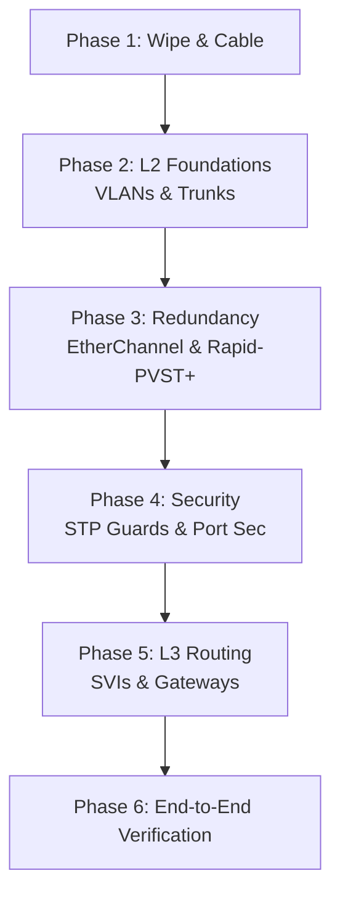

# `Lab Tasks`

## Index

1. [What are the Lab Tasks?](#1-what-are-the-lab-tasks)
2. [Why do we need it? (The Problem it Solves)](#2-why-do-we-need-it-the-problem-it-solves)
3. [How it relates to the broader network](#3-how-it-relates-to-the-broader-network)
4. [Key Component 1 — Layer 2 Build (VLANs & Trunks)](#4-key-component-1--layer-2-build-vlans--trunks)
5. [Key Component 2 — Redundancy (EtherChannel & STP)](#5-key-component-2--redundancy-etherchannel--stp)
6. [Key Component 3 — Security & Routing (Guards & SVIs)](#6-key-component-3--security--routing-guards--svis)
7. [Safety & Security Features](#7-safety--security-features)
8. [Who created it / Standards](#8-who-created-it--standards)
9. [Types / Variations](#9-types--variations)
10. [Flow of Phases / How it Works](#10-flow-of-phases--how-it-works)
11. [States and Timers](#11-states-and-timers)
12. [Advanced / Extra Features](#12-advanced--extra-features)
13. [Configuration & Troubleshooting Workflow](#13-configuration--troubleshooting-workflow)

---

## 1. What are the Lab Tasks?

- The **Lab Tasks** are a structured set of engineering objectives designed to build, secure, and verify your Collapsed Core network from a blank slate to a fully converged, production-ready state.
- **Analogy** 📋: It’s the **flight pre-check sequence** for a pilot. You don't just turn the key and fly; you methodically test the flaps (VLANs), the redundant engines (EtherChannel), the navigation (Routing), and the emergency alarms (STP Guards) in a specific order.

## 2. Why do we need it? (The Problem it Solves)

- Configuring a network randomly leads to race conditions, broadcast storms, and untroubleshootable errors (e.g., bundling an EtherChannel *after* plugging in redundant links without shutting them down first = instant loop).
- Solves:
  - **Order of Operations** → Ensures foundational layers (L1/L2) are stable before building L3.
  - **Comprehensive Testing** → Leaves no protocol unverified.
  - **Skill Validation** → Proves CCNA/CCNP-level mastery of the technologies.

## 3. How it relates to the broader network

- These tasks apply to **every device** in your topology: `CORE-SW1/2`, `ACC-SW1-4`, and `PCs 1-8`.
- It forces the integration of the entire knowledge base: Ethernet Frames → MAC Tables → VLANs → Trunks → EtherChannel → Rapid-PVST+ → STP Guards.

## 4. Key Component 1 — Layer 2 Build (VLANs & Trunks)

- **Objective:** Establish the broadcast domains and the paths between them.
- **Tasks:**
  - Create VLANs 20, 30, 40, and 99 on all switches.
  - Configure 802.1Q trunks on all uplinks.
  - Disable DTP (`nonegotiate`) and set Native VLAN to 999.
  - Assign PC ports to access VLANs and IP Phone ports to Voice VLAN 40.

## 5. Key Component 2 — Redundancy (EtherChannel & STP)

- **Objective:** Maximize bandwidth and eliminate loops deterministically.
- **Tasks:**
  - Bundle the `CORE-SW1` to `CORE-SW2` link using LACP (Active/Passive).
  - Enable **Rapid-PVST+** globally.
  - Configure Per-VLAN Load Balancing: `CORE-SW1` = Root for 20/40; `CORE-SW2` = Root for 30.

## 6. Key Component 3 — Security & Routing (Guards & SVIs)

- **Objective:** Protect the topology from rogue devices and enable inter-VLAN communication.
- **Tasks:**
  - Enable **PortFast** and **BPDU Guard** on all edge ports.
  - Enable **Root Guard** on CORE downlinks.
  - Enable **Loop Guard** on ACC uplinks.
  - Configure SVIs on `CORE-SW1` and enable `ip routing`.

## 7. Safety & Security Features

- The tasks explicitly require implementing **defense-in-depth**:
  - Unused ports must be placed in a parking lot VLAN and shut down.
  - Port Security must be applied to edge ports (Max 2 for Data, Max 3 for Voice).

## 8. Who created it / Standards

- These tasks validate adherence to **IEEE Standards** (802.1Q, 802.3ad, 802.1w) and **Cisco Best Practices** (SAFE architecture, hierarchical design).

## 9. Types / Variations

| Task Type | Description |
|-----------|-------------|
| **Provisioning** | Creating VLANs, assigning IP addresses. |
| **Optimization** | Tuning STP priority, configuring EtherChannel load-balancing. |
| **Hardening** | Applying BPDU Guard, Root Guard, disabling DTP. |
| **Verification** | Using `show` commands and `ping` to prove success. |

## 10. Flow of Phases / How it Works



## 11. States and Timers

- **Execution Time:** A skilled engineer should complete this lab in **45–60 minutes**.
- **Convergence Targets:** Upon completing the Rapid-PVST+ tasks, link failover testing should result in **< 2 seconds** of downtime (1-2 dropped pings max).

## 12. Advanced / Extra Features

- **Bonus Challenge 1:** Implement VTPv3 (if supported in your Packet Tracer version) to propagate VLANs securely with a hidden password.
- **Bonus Challenge 2:** Configure DHCP pools on `CORE-SW1` for VLANs 20, 30, and 40, and configure DHCP Snooping on the Access switches.

---

## 13. Configuration & Troubleshooting Workflow

> 🛠️ **Note:** This section serves as your master execution script for the lab. Follow these phases strictly in order.

### Phase 1: Port Selection & Preparation
- **Task:** Baseline the lab environment.
- **Commands:** Erase old configs and reload. Ensure cables match the topology diagram.
```
Switch# erase startup-config
Switch# delete vlan.dat
Switch# reload
```
- *Wait for reboot, then shut down all switch-to-switch uplinks to prevent loops while building:*
```
ACC-SW1(config)# interface range GigabitEthernet0/1 - 2
ACC-SW1(config-if-range)# shutdown
```

### Phase 2: Base Configuration
- **Task:** Build VLANs, Trunks, and EtherChannels.
- **Commands (Example for ACC-SW1):**
```
ACC-SW1(config)# vlan 20,30,40,99,999
ACC-SW1(config)# interface range GigabitEthernet0/1 - 2
ACC-SW1(config-if-range)# switchport trunk encapsulation dot1q
ACC-SW1(config-if-range)# switchport mode trunk
ACC-SW1(config-if-range)# switchport nonegotiate
ACC-SW1(config-if-range)# switchport trunk native vlan 999
ACC-SW1(config-if-range)# switchport trunk allowed vlan 20,30,40,99
```
- *Build the Core EtherChannel:*
```
CORE-SW1(config)# interface range GigabitEthernet0/1 - 2
CORE-SW1(config-if-range)# channel-group 1 mode active
```

### Phase 3: Hardening & Security
- **Task:** Apply Rapid-PVST+, STP Guards, and Edge Security.
- **Commands:**
```
! --- Global STP ---
CORE-SW1(config)# spanning-tree mode rapid-pvst
CORE-SW1(config)# spanning-tree vlan 20,40 root primary
CORE-SW1(config)# spanning-tree vlan 30 root secondary

! --- Core Downlinks (Root Guard) ---
CORE-SW1(config)# interface range GigabitEthernet0/3 - 6
CORE-SW1(config-if-range)# spanning-tree guard root

! --- Access Uplinks (Loop Guard) ---
ACC-SW1(config)# spanning-tree loopguard default

! --- Access Edge Ports (PortFast, BPDU Guard, Port Sec) ---
ACC-SW1(config)# interface range FastEthernet0/1 - 24
ACC-SW1(config-if-range)# switchport mode access
ACC-SW1(config-if-range)# spanning-tree portfast
ACC-SW1(config-if-range)# spanning-tree bpduguard enable
ACC-SW1(config-if-range)# switchport port-security
ACC-SW1(config-if-range)# switchport port-security maximum 2
ACC-SW1(config-if-range)# switchport port-security violation restrict
```
- *Now, safely bring up the uplinks:*
```
ACC-SW1(config)# interface range GigabitEthernet0/1 - 2
ACC-SW1(config-if-range)# no shutdown
```

### Phase 4: Verification Flow
Run these `show` commands **in this order** to prove the lab is successful:

```
CORE-SW1# show etherchannel summary
ACC-SW1# show interfaces trunk
CORE-SW1# show spanning-tree vlan 20 root
ACC-SW1# show spanning-tree blockedports
PC1> ping 192.168.30.10
```

- **What to look for:**
  - `show etherchannel summary` → `Po1` is `(SU)` and ports are `(P)`.
  - `show interfaces trunk` → Native VLAN is 999, DTP is off.
  - `show spanning-tree vlan 20 root` → CORE-SW1 is root for 20; CORE-SW2 is root for 30.
  - `show spanning-tree blockedports` → ACC-SW1 blocks the link to CORE-SW2 for VLAN 20, but forwards on it for VLAN 30 (Load Balancing achieved).
  - `ping` → PC1 (VLAN 20) successfully pings PC2 (VLAN 30) via the CORE-SW1 SVIs.

### Phase 5: Advanced Debugging
- **Task:** Fault Injection. Intentionally break the network to test your guards.
- **Test 1 (BPDU Guard):** Connect a rogue switch to `ACC-SW1 Fa0/1`.
  - *Expected:* Port instantly goes `err-disabled`. Verify with `show interfaces status err-disabled`.
- **Test 2 (Root Guard):** Lower the STP priority of `ACC-SW1` to `4096`.
  - *Expected:* `CORE-SW1` blocks the downlink. Verify with `show spanning-tree inconsistentports` (should show `root-inconsistent`).
- **Test 3 (Rapid Convergence):** Start a continuous ping from PC1 to PC2 (`ping -t 192.168.30.10`). Shut down `ACC-SW1`'s active uplink.
  - *Expected:* The alternate port transitions to Forwarding instantly. Only 1 or 2 pings should drop.
