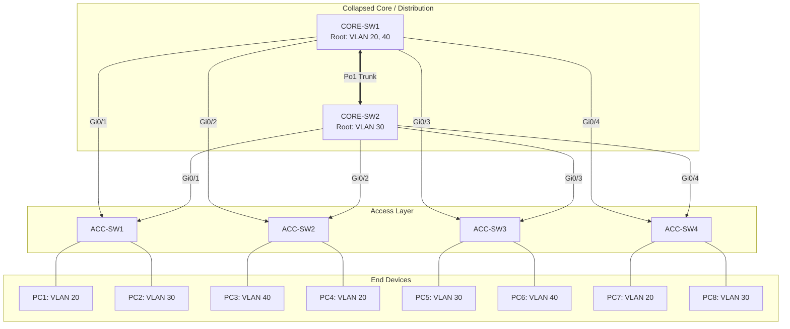

# `Topology Diagram`

## Index

1. [What is the Lab Topology?](#1-what-is-the-lab-topology)
2. [Why do we need it? (The Problem it Solves)](#2-why-do-we-need-it-the-problem-it-solves)
3. [How it relates to the broader network](#3-how-it-relates-to-the-broader-network)
4. [Key Component 1 — The Collapsed Core](#4-key-component-1--the-collapsed-core)
5. [Key Component 2 — The Access Layer](#5-key-component-2--the-access-layer)
6. [Key Component 3 — Endpoints & VLANs](#6-key-component-3--endpoints--vlans)
7. [Safety & Security Features](#7-safety--security-features)
8. [Who created it / Standards](#8-who-created-it--standards)
9. [Types / Variations](#9-types--variations)
10. [Flow of Phases / How it Works](#10-flow-of-phases--how-it-works)
11. [States and Timers](#11-states-and-timers)
12. [Advanced / Extra Features](#12-advanced--extra-features)
13. [Configuration & Troubleshooting Workflow](#13-configuration--troubleshooting-workflow)

---

## 1. What is the Lab Topology?

- The **Topology** is the physical and logical blueprint of your network. It defines exactly how `CORE-SW1/2`, `ACC-SW1-4`, and `PCs 1-8` are cabled together, and how VLANs and STP instances flow across those cables.
- **Analogy** 🗺️: It’s the **architectural floor plan** of a building. You can't install the plumbing (VLANs) or the security doors (STP Guards) until you know exactly where the walls and hallways (links and switches) are located.

## 2. Why do we need it? (The Problem it Solves)

- Without a strict topology map, a network is just a tangled mess of cables ("spaghetti networking"), making it impossible to predict STP blocking or troubleshoot loops.
- Solves:
  - **Predictability** → You know exactly which path traffic *should* take.
  - **Redundancy planning** → Ensures no single point of failure exists between Access and Core.
  - **Documentation** → The ultimate source of truth for troubleshooting.

## 3. How it relates to the broader network

- This topology implements the **Collapsed Core** hierarchical model (covered in `network-hierarchy.md`).
- It serves as the physical canvas for every protocol we've covered: 802.1Q trunks, EtherChannel bundles, Rapid-PVST+ elections, and edge security.

## 4. Key Component 1 — The Collapsed Core

- **Devices:** `CORE-SW1` and `CORE-SW2`.
- **Role:** Acts as the high-speed backbone and the Layer 3 inter-VLAN routing boundary.
- **Interconnect:** Bonded together via a Layer 2 EtherChannel (`Po1`) to prevent STP from blocking their direct link, ensuring fast state synchronization.

## 5. Key Component 2 — The Access Layer

- **Devices:** `ACC-SW1`, `ACC-SW2`, `ACC-SW3`, `ACC-SW4`.
- **Role:** Connects end-users. 
- **Uplinks:** Each Access switch has **two** uplinks—one to `CORE-SW1` and one to `CORE-SW2`—creating the intentional physical loops that STP will manage.

## 6. Key Component 3 — Endpoints & VLANs

- **Devices:** `PC1` through `PC8` (plus simulated IP Phones).
- **VLAN Schema:** 
  - **VLAN 20 (Data-A)**
  - **VLAN 30 (Data-B)**
  - **VLAN 40 (Voice)**
- Distributed across the 4 access switches to test inter-VLAN routing and STP per-VLAN load balancing.

## 7. Safety & Security Features

- **Topology-based security:** The physical layout dictates where guards go.
  - **Core downlinks:** Root Guard.
  - **Access edge ports:** BPDU Guard, PortFast, Port Security.
  - **Access uplinks:** Loop Guard, UDLD.

## 8. Who created it / Standards

- Based on **Cisco's Enterprise Campus Architecture** best practices for small-to-medium businesses (SMBs).
- Relies on TIA/EIA-568 cabling standards (straight-through vs. crossover, though modern Auto-MDIX handles this).

## 9. Types / Variations

| View Type | Description |
|-----------|-------------|
| **Physical Topology** | How the cables are actually plugged in (L1). |
| **Logical Topology** | How data flows (L2/L3) — e.g., which links STP blocks, where SVIs live. |

## 10. Flow of Phases / How it Works

*(This is your master lab diagram)*



## 11. States and Timers

- **Link State:** Up/Up (Line protocol up).
- **CDP Timer:** 60 seconds (Hello), 180 seconds (Hold-time). CDP is the primary tool for verifying the physical topology matches the diagram.

## 12. Advanced / Extra Features

- **Auto-MDIX:** Automatically detects the required cable connection type (straight-through vs crossover), simplifying physical lab cabling.
- **LLDP (802.1AB):** The vendor-neutral alternative to CDP, useful if non-Cisco devices are introduced to the topology.

---

## 13. Configuration & Troubleshooting Workflow

> 🏗️ **Note:** You cannot "configure" a diagram, but you **must** verify that your physical Packet Tracer cabling matches your intended topology before configuring protocols. This workflow uses CDP to validate the physical build.

### Phase 1: Port Selection & Preparation
- Ensure all cables are connected according to the diagram.
- Turn on all switch ports to allow discovery protocols to map the network.
```
CORE-SW1> enable
CORE-SW1# configure terminal
CORE-SW1(config)# interface range GigabitEthernet0/1 - 4
CORE-SW1(config-if-range)# no shutdown
CORE-SW1(config-if-range)# exit
```

### Phase 2: Base Configuration
- Set the hostnames so discovery protocols return readable data, and ensure CDP is running globally.
```
Switch(config)# hostname CORE-SW1
CORE-SW1(config)# cdp run
```

### Phase 3: Hardening & Security
- Disable CDP on edge ports facing PCs. You only want topology discovery active on switch-to-switch links to prevent reconnaissance attacks.
```
ACC-SW1(config)# interface range FastEthernet0/1 - 24
ACC-SW1(config-if-range)# no cdp enable
```

### Phase 4: Verification Flow
Run these `show` commands **in this order** to prove your physical lab matches the diagram:

```
CORE-SW1# show cdp neighbors
CORE-SW1# show cdp neighbors detail
ACC-SW1# show lldp neighbors
```

- **What to look for:**
  - In `show cdp neighbors`, `CORE-SW1` should see `ACC-SW1` on `Gig0/1`, `ACC-SW2` on `Gig0/2`, etc.
  - Ensure the **Local Intrfce** and **Port ID** (remote interface) match your documentation exactly. If they are crossed, your STP calculations will be wrong later.

### Phase 5: Advanced Debugging
- If a switch is missing from the topology map:
```
CORE-SW1# show interfaces status
CORE-SW1# show controllers
CORE-SW1# debug cdp packets
```
- **Troubleshooting logic:**
  - **Neighbor not showing up** → Check `show interfaces status`. Is the port `err-disabled` or `down/down`? 
  - **Port is down/down** → Physical cabling issue in Packet Tracer (wrong cable type used, or port is administratively shut).
  - **Neighbor shows up but wrong port** → You clicked the wrong port when cabling in Packet Tracer. Delete the cable and re-patch it to match the diagram perfectly.
