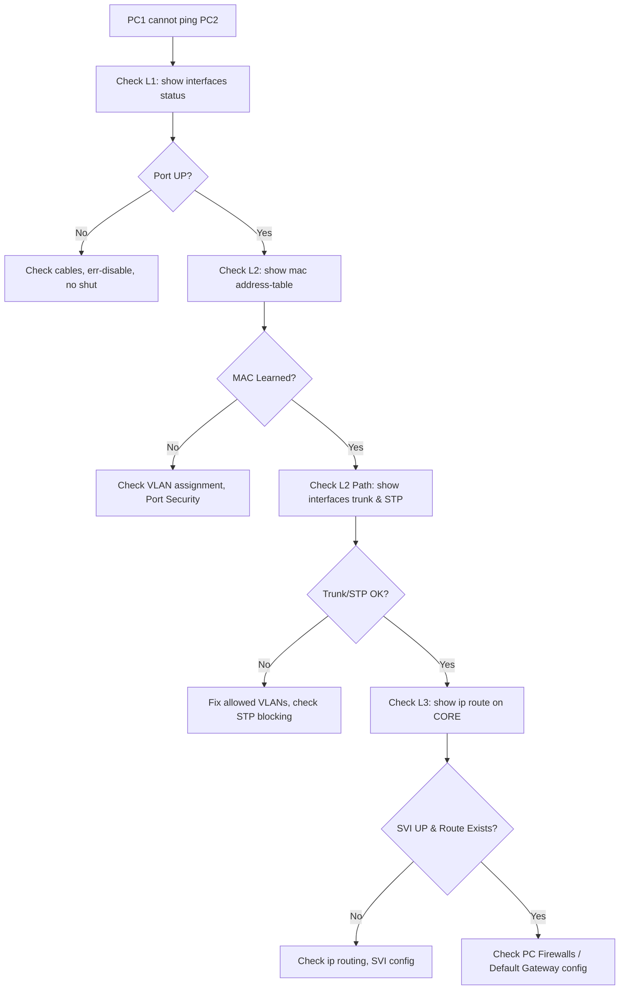

# `Troubleshooting Guide`

## Index

1. [What is the Troubleshooting Guide?](#1-what-is-the-troubleshooting-guide)
2. [Why do we need it? (The Problem it Solves)](#2-why-do-we-need-it-the-problem-it-solves)
3. [How it relates to the broader network](#3-how-it-relates-to-the-broader-network)
4. [Key Component 1 — The Bottom-Up Approach](#4-key-component-1--the-bottom-up-approach)
5. [Key Component 2 — The "Follow the Path" Method](#5-key-component-2--the-follow-the-path-method)
6. [Key Component 3 — Security Feature Isolation](#6-key-component-3--security-feature-isolation)
7. [Safety & Security Features](#7-safety--security-features)
8. [Who created it / Standards](#8-who-created-it--standards)
9. [Types / Variations](#9-types--variations)
10. [Flow of Phases / How it Works](#10-flow-of-phases--how-it-works)
11. [States and Timers](#11-states-and-timers)
12. [Advanced / Extra Features](#12-advanced--extra-features)
13. [Configuration & Troubleshooting Workflow](#13-configuration--troubleshooting-workflow)

---

## 1. What is the Troubleshooting Guide?

- A **structured, step-by-step methodology** to isolate, identify, and resolve network failures in your Collapsed Core topology.
- It moves away from "guessing" and relies on verifying the OSI model layer by layer.
- **Analogy** 🩺: It’s a **doctor's diagnostic checklist**. If a patient complains of a headache, you don't immediately perform brain surgery (Layer 3 routing). You check their vitals first (Layer 1 physical link), then their reflexes (Layer 2 MAC/VLANs), and *then* move to complex systems.

## 2. Why do we need it? (The Problem it Solves)

- "Shotgun troubleshooting" (typing random commands hoping something fixes the issue) causes more outages than it solves.
- Solves:
  - **Wasted Time** → A structured approach finds the root cause in minutes, not hours.
  - **Misdiagnosis** → Prevents you from troubleshooting a routing issue when the cable is actually unplugged.
  - **Self-Inflicted Outages** → Ensures you don't accidentally break STP while trying to fix an EtherChannel.

## 3. How it relates to the broader network

- This guide applies to the entire path from **PC1** → **ACC-SW1** → **CORE-SW1** → **PC2**.
- It integrates your knowledge of **Frames, CAM Tables, VLANs, Trunks, EtherChannel, STP, and SVIs** into one cohesive workflow.

## 4. Key Component 1 — The Bottom-Up Approach

- **Layer 1 (Physical):** Is the port up? Is the cable connected? Is it err-disabled?
- **Layer 2 (Data Link):** Is the port in the right VLAN? Is the MAC address learned? Is the trunk allowing the VLAN? Is STP blocking the port?
- **Layer 3 (Network):** Does the PC have an IP/Gateway? Is the SVI up? Is routing enabled?

## 5. Key Component 2 — The "Follow the Path" Method

- Start at the source (e.g., PC1) and verify the configuration at **every single hop** along the path to the destination.
- Check the Access switch ingress port, the Access switch egress uplink, the Core switch ingress downlink, the Core routing table, and the egress path to the destination.

## 6. Key Component 3 — Security Feature Isolation

- In a highly secured lab, **security features are the #1 cause of lost connectivity**.
- If a port is down, you must immediately check if **BPDU Guard**, **Port Security**, **Root Guard**, or **Loop Guard** intentionally killed the traffic to protect the network.

## 7. Safety & Security Features

- **Err-disable recovery:** Helps identify flapping security violations.
- **Syslog:** The ultimate truth-teller. Always check the logs (`show logging`) before typing any configuration commands.

## 8. Who created it / Standards

- Based on **Cisco's official troubleshooting methodologies** (taught in CCNP TSHOOT / ENARSI).
- Relies heavily on the **OSI Model** (ISO/IEC 7498-1).

## 9. Types / Variations

| Methodology | Best Used For |
|-------------|---------------|
| **Bottom-Up** | Physical/cabling issues, new deployments (your lab). |
| **Top-Down** | Application-layer issues (e.g., DNS/HTTP failing but ping works). |
| **Divide & Conquer** | Large networks. Ping the default gateway (halfway). If it works, L1/L2 are fine. |

## 10. Flow of Phases / How it Works



## 11. States and Timers

- **STP Timers:** If a PC takes 30 seconds to get an IP, **PortFast** is missing.
- **ARP Timers:** If an IP was moved to a new MAC, the switch might be holding a stale ARP entry (clear it with `clear ip arp`).
- **LACP Timers:** If an EtherChannel is flapping, check for LACP timeout mismatches.

## 12. Advanced / Extra Features

- **SPAN (Switched Port Analyzer):** Mirror traffic from an uplink to a packet capture PC running Wireshark to see exactly what frames are entering/leaving.
- **Packet Tracer Simulation Mode:** The ultimate cheat code for the lab. Watch the ICMP/ARP packets move hop-by-hop to see exactly which switch drops them.

---

## 13. Configuration & Troubleshooting Workflow

> 🚨 **Scenario:** PC1 (VLAN 20) cannot ping PC2 (VLAN 30). Follow this exact workflow to find the fault.

### Phase 1: Port Selection & Preparation
- Identify the exact path. PC1 connects to `ACC-SW1 Fa0/1`. PC2 connects to `ACC-SW3 Fa0/1`. The traffic must flow through `CORE-SW1` or `CORE-SW2`.
- Open the CLI on `ACC-SW1` first.

### Phase 2: Base Configuration (Layer 1 & 2 Verification)
- Verify the physical port and VLAN assignment on the access switch:
```
ACC-SW1# show interfaces status
ACC-SW1# show interfaces FastEthernet0/1 switchport
ACC-SW1# show mac address-table interface FastEthernet0/1
```
- *What to look for:* Is Fa0/1 `connected`? Is it in `VLAN 20`? Is PC1's MAC address in the table?

### Phase 3: Hardening & Security (Guard Verification)
- If the port is down, check if a security feature killed it:
```
ACC-SW1# show interfaces status err-disabled
ACC-SW1# show port-security interface FastEthernet0/1
ACC-SW1# show logging | include ERR_DISABLE
```
- *Fix:* If err-disabled by BPDU Guard or Port Security, fix the violation, then `shutdown` and `no shutdown` the port.

### Phase 4: Verification Flow (Trunks & STP)
- Verify the uplink path to the Core:
```
ACC-SW1# show interfaces trunk
ACC-SW1# show spanning-tree vlan 20
CORE-SW1# show spanning-tree vlan 20
```
- *What to look for:* Is VLAN 20 allowed on the trunk? Is the uplink `FWD` (Forwarding) or `BLK` (Blocking) in STP? If both uplinks are blocked, check for `loop-inconsistent` or `root-inconsistent` states.

### Phase 5: Advanced Debugging (Layer 3 & Routing)
- If L2 is perfect, the issue is at the Core (Layer 3):
```
CORE-SW1# show ip interface brief
CORE-SW1# show ip route
CORE-SW1# debug ip icmp
CORE-SW1# debug arp
```
- *Troubleshooting logic:*
  - **SVI Down** → `Vlan20` is `down/down`. Ensure VLAN 20 exists in the `vlan.dat` database (`show vlan brief`).
  - **No Route** → `ip routing` was forgotten on the Core switch.
  - **ARP Fails** → Core switch sends ARP request for PC2 but gets no reply. Check PC2's L2 connection on `ACC-SW3`.
  - **PC Firewall** → If the Core can ping PC2, but PC1 cannot, Windows Firewall on PC2 is blocking ICMP echo requests.


