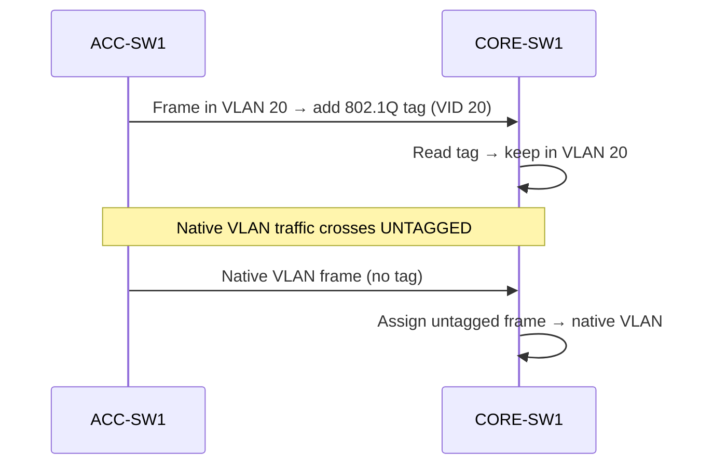

# `Trunking and Dtp`

## Index

1. [What is Trunking?](#1-what-is-trunking)
2. [Why do we need it? (The Problem it Solves)](#2-why-do-we-need-it-the-problem-it-solves)
3. [How it relates to the broader network](#3-how-it-relates-to-the-broader-network)
4. [Key Component 1 — 802.1Q Encapsulation](#4-key-component-1--8021q-encapsulation)
5. [Key Component 2 — The Native VLAN](#5-key-component-2--the-native-vlan)
6. [Key Component 3 — DTP (Dynamic Trunking Protocol)](#6-key-component-3--dtp-dynamic-trunking-protocol)
7. [Safety & Security Features](#7-safety--security-features)
8. [Who created it / Standards](#8-who-created-it--standards)
9. [Types / Variations](#9-types--variations)
10. [Flow of Phases / How it Works](#10-flow-of-phases--how-it-works)
11. [States and Timers](#11-states-and-timers)
12. [Advanced / Extra Features](#12-advanced--extra-features)
13. [Configuration & Troubleshooting Workflow](#13-configuration--troubleshooting-workflow)

---

## 1. What is Trunking?

- A **trunk** is a single physical link configured to carry **traffic for multiple VLANs simultaneously**, using tags to keep each VLAN's frames distinct.
- Contrasts with an **access port**, which carries just one VLAN.
- **Analogy** 🚆: A trunk is a **multi-carriage train** on one track. Each carriage (VLAN) carries different passengers, and a **color-coded label (tag)** on each carriage tells the station (switch) which platform (VLAN) it belongs to.

## 2. Why do we need it? (The Problem it Solves)

- Without trunks, you'd need **one physical cable per VLAN** between every pair of switches — wasteful and unscalable.
- Trunking solves:
  - **Efficiency** → many VLANs over one link.
  - **Scalability** → add VLANs without adding cables.
  - **VLAN continuity** → a VLAN can span the whole campus (ACC-SW1–4 ↔ CORE-SW1/2).

## 3. How it relates to the broader network

- Every **uplink** from `ACC-SW1–4` to `CORE-SW1/2` is a trunk carrying VLANs 20, 30, and 40.
- Trunks are what let your **collapsed core** perform inter-VLAN routing — the tagged frames arrive at the core's SVIs.

## 4. Key Component 1 — 802.1Q Encapsulation

- The IEEE standard that **inserts a 4-byte tag** into the Ethernet frame between the Source MAC and the EtherType.
- Recomputes the **FCS** after tagging (since the frame changed).
- Tag contents: **TPID (0x8100)**, **PCP/CoS (3 bits)**, **DEI (1 bit)**, **VID (12 bits)**.
- **Note:** Adds overhead → max tagged frame = **1522 bytes** (vs. 1518 untagged).

## 5. Key Component 2 — The Native VLAN

- The **one VLAN** on a trunk whose traffic is sent **untagged** (default = VLAN 1).
- Both ends of a trunk **must agree** on the native VLAN, or you get a mismatch (and a CDP warning).
- **Security note** ⚠️: The native VLAN is the vector for **double-tagging attacks** → always change it to an **unused** VLAN.

## 6. Key Component 3 — DTP (Dynamic Trunking Protocol)

- Cisco-proprietary protocol that lets two switches **auto-negotiate** whether a link becomes a trunk.
- **Modes:**

| Mode | Behavior |
|------|----------|
| **`trunk` (on)** | Forces trunk; sends DTP |
| **`dynamic desirable`** | Actively tries to form a trunk |
| **`dynamic auto`** | Forms a trunk only if asked |
| **`access`** | Forces access; never trunks |
| **`nonegotiate`** | Disables DTP entirely |

- **Security note** ⚠️: DTP is the enabler of **switch-spoofing** attacks → best practice is to **hardcode trunks** and use `nonegotiate`.

## 7. Safety & Security Features

- **`switchport nonegotiate`** → disables DTP frames (stops switch spoofing).
- **Change native VLAN** → defeats double-tagging.
- **VLAN pruning / allowed-list** → only permit required VLANs (20/30/40) on the trunk.
- **Hardcode mode** → never rely on `dynamic auto`/`desirable` on inter-switch links.

## 8. Who created it / Standards

- **802.1Q** → IEEE open standard (tagging).
- **ISL** → Cisco proprietary, legacy (encapsulates the whole frame; deprecated).
- **DTP** → Cisco proprietary negotiation protocol.

## 9. Types / Variations

| Concept | Detail |
|---------|--------|
| **802.1Q trunk** | Standard, tags all VLANs except native |
| **ISL trunk** | Legacy Cisco, tags all VLANs |
| **Manual trunk** | Statically forced (`switchport mode trunk`) |
| **Negotiated trunk** | Formed via DTP |

## 10. Flow of Phases / How it Works



## 11. States and Timers

| Timer / State | Value | Purpose |
|---------------|-------|---------|
| **DTP timer** | ~30 sec | Interval between DTP negotiation frames |
| **Trunk state** | up/down | Depends on negotiation + link |

## 12. Advanced / Extra Features

- **VTP Pruning** → dynamically removes unneeded VLANs from trunks (see `vtp-configuration.md`).
- **Allowed VLAN list** → `switchport trunk allowed vlan` for manual pruning.
- **CoS preservation** → trunk carries the 802.1Q priority bits end-to-end (vital for Voice VLAN 40 QoS).

---

## 13. Configuration & Troubleshooting Workflow

### Phase 1: Port Selection & Preparation
- Target the **uplink ports** between `ACC-SW1` and `CORE-SW1/2` (e.g., `Gig0/1 - 2`).
```
ACC-SW1> enable
ACC-SW1# configure terminal
ACC-SW1(config)# default interface range GigabitEthernet0/1 - 2
ACC-SW1(config)# interface range GigabitEthernet0/1 - 2
ACC-SW1(config-if-range)# description ** TRUNK to CORE **
ACC-SW1(config-if-range)# no shutdown
```

### Phase 2: Base Configuration
- Hardcode the trunk and set encapsulation (on switches that support ISL/802.1Q choice):
```
ACC-SW1(config-if-range)# switchport trunk encapsulation dot1q
ACC-SW1(config-if-range)# switchport mode trunk
ACC-SW1(config-if-range)# switchport trunk allowed vlan 20,30,40
```

### Phase 3: Hardening & Security
- Disable DTP and change the native VLAN to an unused ID:
```
ACC-SW1(config-if-range)# switchport nonegotiate
ACC-SW1(config-if-range)# switchport trunk native vlan 999
```
- **Why:** `nonegotiate` kills switch-spoofing; native VLAN 999 (unused) defeats double-tagging.

### Phase 4: Verification Flow
Run these `show` commands **in this order**:
```
ACC-SW1# show interfaces trunk
ACC-SW1# show interfaces GigabitEthernet0/1 switchport
ACC-SW1# show dtp interface GigabitEthernet0/1
ACC-SW1# show vlan brief
```
- **What to look for:**
  - `show interfaces trunk` → status **trunking**, encapsulation **802.1q**, allowed VLANs = **20,30,40**, native = **999**.
  - `show ... switchport` → `Operational Mode: trunk`, `Negotiation of Trunking: Off`.
  - Native VLAN matches on **both** ends.

### Phase 5: Advanced Debugging
- If the trunk won't form or VLANs don't cross:
```
ACC-SW1# debug spanning-tree events
ACC-SW1# show interfaces trunk
CORE-SW1# show interfaces trunk
```
- **Troubleshooting logic:**
  - **Native VLAN mismatch** → CDP logs `%CDP-4-NATIVE_VLAN_MISMATCH` → align both ends.
  - **Trunk won't come up** → one side `access`, other `dynamic auto` → both auto = no trunk; hardcode one side.
  - **VLAN missing across link** → not in `allowed vlan` list → add it.
  - **Encapsulation mismatch** → one side ISL, other 802.1Q → force `dot1q` on both.