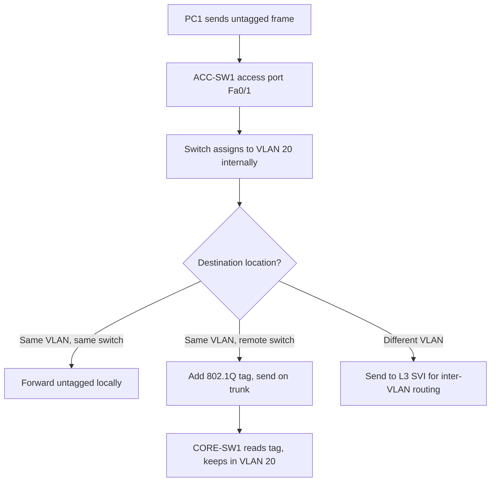

# `Vlans Overview`

## Index

1. [What is a VLAN?](#1-what-is-a-vlan)
2. [Why do we need it? (The Problem it Solves)](#2-why-do-we-need-it-the-problem-it-solves)
3. [How it relates to the broader network](#3-how-it-relates-to-the-broader-network)
4. [Key Component 1 — The VLAN Database](#4-key-component-1--the-vlan-database)
5. [Key Component 2 — Access Ports](#5-key-component-2--access-ports)
6. [Key Component 3 — The VLAN Tag (802.1Q)](#6-key-component-3--the-vlan-tag-8021q)
7. [Safety & Security Features](#7-safety--security-features)
8. [Who created it / Standards](#8-who-created-it--standards)
9. [Types / Variations](#9-types--variations)
10. [Flow of Phases / How it Works](#10-flow-of-phases--how-it-works)
11. [States and Timers](#11-states-and-timers)
12. [Advanced / Extra Features](#12-advanced--extra-features)
13. [Configuration & Troubleshooting Workflow](#13-configuration--troubleshooting-workflow)

---

## 1. What is a VLAN?

- A **VLAN (Virtual Local Area Network)** is a **logical broadcast domain** created in software on a switch — it groups ports together as if they were on their own separate physical switch, regardless of where they physically sit.
- One physical switch can host **many** VLANs; one VLAN can **span many** switches (via trunks).
- **Analogy** 🏢: One office building (the physical switch) divided into separate **floors by keycard access** (VLANs). People on Floor 20 can freely talk to each other but can't wander onto Floor 30 without going through the *elevator + security desk* (a Layer 3 router).

## 2. Why do we need it? (The Problem it Solves)

- Without VLANs, one switch = **one giant broadcast domain** → every broadcast hits every device → noise, waste, and no isolation.
- VLANs solve:
  - **Broadcast containment** → smaller broadcast domains = less flooding.
  - **Security/segmentation** → separate Data (20/30) from Voice (40); isolate departments.
  - **Flexibility** → group users logically (by role), not by physical location.
  - **Cost** → segment without buying separate physical switches.

## 3. How it relates to the broader network

- VLANs live at the **Access layer** (`ACC-SW1–4`) where PCs/phones are assigned to them.
- They traverse the network over **trunks** to **CORE-SW1/2**.
- Communication *between* VLANs requires **Layer 3 (inter-VLAN routing)** on the core.
- Your scheme: **VLAN 20 & 30 = Data**, **VLAN 40 = Voice**.

## 4. Key Component 1 — The VLAN Database

- The switch stores VLAN definitions in `vlan.dat` (in flash), **not** the running-config.
- Contains: **VLAN ID (1–4094)**, **VLAN name**, and **state**.
- **Note:** Because it lives in `vlan.dat`, an `erase startup-config` does **not** delete VLANs — you must delete `vlan.dat` separately.

## 5. Key Component 2 — Access Ports

- An **access port** carries traffic for **exactly one** (untagged) data VLAN.
- Frames enter/leave untagged — the end device (PC) is unaware of VLANs.
- **In your lab:** PC1 on `ACC-SW1 Fa0/1` → access port in VLAN 20.

## 6. Key Component 3 — The VLAN Tag (802.1Q)

- To carry multiple VLANs over one link (a **trunk**), frames get a **4-byte 802.1Q tag** inserted.

| Tag Field | Size | Purpose |
|-----------|------|---------|
| **TPID** | 16 bits | `0x8100` → marks the frame as 802.1Q-tagged |
| **PCP (CoS)** | 3 bits | Priority (QoS) — critical for Voice VLAN 40 |
| **DEI** | 1 bit | Drop eligibility |
| **VID** | 12 bits | The **VLAN ID** (0–4095) |

## 7. Safety & Security Features

- **VLAN separation** = a security boundary (traffic can't cross without L3 policy/ACLs).
- **VLAN Hopping attacks** ⚠️: *Switch Spoofing* (attacker pretends to be a trunk) and *Double Tagging* (nested tags). Defenses:
  - Set unused ports to `switchport mode access` + `shutdown`.
  - **Change the native VLAN** to an unused ID; never leave it as VLAN 1.
  - Explicitly prune VLANs on trunks.

## 8. Who created it / Standards

- **IEEE 802.1Q** — the open standard for VLAN tagging.
- **ISL** — Cisco's older, proprietary tagging method (now deprecated).

## 9. Types / Variations

| VLAN Type | Purpose |
|-----------|---------|
| **Default VLAN** | VLAN 1 — all ports belong by default (avoid using it) |
| **Data VLAN** | Carries user traffic (your VLAN 20, 30) |
| **Voice VLAN** | Dedicated to IP phone traffic (your VLAN 40) |
| **Native VLAN** | Untagged traffic on a trunk (default VLAN 1) |
| **Management VLAN** | Reserved for switch management (SSH/SVI) |

## 10. Flow of Phases / How it Works



## 11. States and Timers

- VLANs are **stateless configuration objects** — no timers of their own.
- Relevant states: a VLAN can be **active** or **suspended**; a port's operational VLAN depends on its link state.

## 12. Advanced / Extra Features

- **Voice VLAN + CoS** → phones tag voice with CoS 5 for priority (detailed in `voice-vlans.md`).
- **Private VLANs (PVLANs)** → isolate ports *within* the same VLAN.
- **VLAN pruning** → VTP or manual, limits which VLANs cross a trunk.
- **Extended VLAN range** → 1006–4094 (requires transparent mode on legacy VTP).

---

## 13. Configuration & Troubleshooting Workflow

### Phase 1: Port Selection & Preparation
- Identify **access ports** (PC/phone-facing) vs. **trunk uplinks** (to CORE).
- Default and prepare a PC-facing port:
```
ACC-SW1> enable
ACC-SW1# configure terminal
ACC-SW1(config)# default interface FastEthernet0/1
ACC-SW1(config)# interface FastEthernet0/1
ACC-SW1(config-if)# no shutdown
```

### Phase 2: Base Configuration
- Create the VLANs, then assign the access port:
```
ACC-SW1(config)# vlan 20
ACC-SW1(config-vlan)# name DATA_USERS
ACC-SW1(config-vlan)# vlan 30
ACC-SW1(config-vlan)# name DATA_MGMT
ACC-SW1(config-vlan)# vlan 40
ACC-SW1(config-vlan)# name VOICE
ACC-SW1(config-vlan)# exit
ACC-SW1(config)# interface FastEthernet0/1
ACC-SW1(config-if)# switchport mode access
ACC-SW1(config-if)# switchport access vlan 20
```

### Phase 3: Hardening & Security
- Lock down the port and shut unused ports to prevent VLAN hopping:
```
ACC-SW1(config-if)# switchport port-security
ACC-SW1(config-if)# switchport port-security maximum 2
ACC-SW1(config-if)# switchport port-security violation restrict
ACC-SW1(config-if)# exit
! --- Park unused ports in a black-hole VLAN and disable ---
ACC-SW1(config)# vlan 999
ACC-SW1(config-vlan)# name PARKING_LOT
ACC-SW1(config-vlan)# exit
ACC-SW1(config)# interface range FastEthernet0/10 - 24
ACC-SW1(config-if-range)# switchport mode access
ACC-SW1(config-if-range)# switchport access vlan 999
ACC-SW1(config-if-range)# shutdown
```

### Phase 4: Verification Flow
Run these `show` commands **in this order**:
```
ACC-SW1# show vlan brief
ACC-SW1# show interfaces FastEthernet0/1 switchport
ACC-SW1# show mac address-table vlan 20
ACC-SW1# show interfaces status
```
- **What to look for:**
  - `show vlan brief` → VLANs 20/30/40 exist and Fa0/1 is listed under VLAN 20.
  - `show ... switchport` → `Administrative Mode: static access`, `Access Mode VLAN: 20`.
  - `show mac address-table vlan 20` → PC1's MAC learned in the correct VLAN.

### Phase 5: Advanced Debugging
- If a PC can't communicate within its VLAN:
```
ACC-SW1# show vlan id 20
ACC-SW1# show interfaces FastEthernet0/1 switchport
ACC-SW1# show interfaces trunk
```
- **Troubleshooting logic:**
  - **Port in wrong VLAN** → re-check `switchport access vlan`.
  - **VLAN missing from `vlan.dat`** → recreate it (remember it survives `erase startup-config`).
  - **VLAN not reaching remote switch** → verify the VLAN is **allowed on the trunk** (`show interfaces trunk`).
  - **Port shows `inactive`** → the VLAN was deleted but the port still references it.
