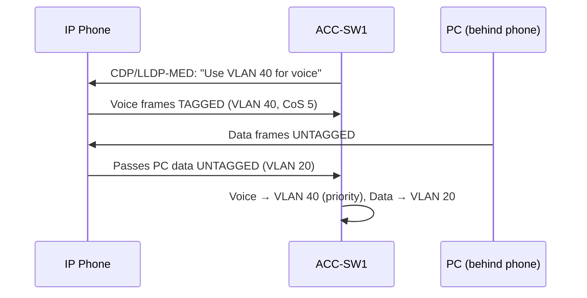

# `Voice Vlans`

## Index

1. [What is a Voice VLAN?](#1-what-is-a-voice-vlan)
2. [Why do we need it? (The Problem it Solves)](#2-why-do-we-need-it-the-problem-it-solves)
3. [How it relates to the broader network](#3-how-it-relates-to-the-broader-network)
4. [Key Component 1 — The Access + Voice Port](#4-key-component-1--the-access--voice-port)
5. [Key Component 2 — CDP / LLDP-MED](#5-key-component-2--cdp--lldp-med)
6. [Key Component 3 — CoS / QoS Trust](#6-key-component-3--cos--qos-trust)
7. [Safety & Security Features](#7-safety--security-features)
8. [Who created it / Standards](#8-who-created-it--standards)
9. [Types / Variations](#9-types--variations)
10. [Flow of Phases / How it Works](#10-flow-of-phases--how-it-works)
11. [States and Timers](#11-states-and-timers)
12. [Advanced / Extra Features](#12-advanced--extra-features)
13. [Configuration & Troubleshooting Workflow](#13-configuration--troubleshooting-workflow)

---

## 1. What is a Voice VLAN?

- A **Voice VLAN** is a special VLAN that lets an access port carry **two VLANs at once**: **untagged data** (for the PC) and **tagged voice** (for the IP phone) — without being a full trunk.
- The IP phone has a **built-in 3-port switch**: uplink to the switch, a port to the PC, and its internal voice engine.
- **Analogy** 🎧: One office desk phone with a **pass-through jack** — your computer plugs into the *back of the phone*, and the phone politely keeps its own calls (voice) on a separate "priority lane" from your emails (data), all over one cable.

## 2. Why do we need it? (The Problem it Solves)

- Voice (VoIP) is **real-time and delay-sensitive** — jitter or delay = choppy calls.
- Solves:
  - **Separation** → voice traffic isolated from bursty data on its own VLAN (40).
  - **QoS priority** → voice frames marked CoS 5 jump ahead of data.
  - **Cabling economy** → one cable serves both phone and PC.
  - **Simplified addressing** → phones get their own DHCP scope in VLAN 40.

## 3. How it relates to the broader network

- Lives at the **Access layer** (`ACC-SW1–4`) where phones connect.
- Voice frames are **tagged (VLAN 40)**; data frames stay **untagged** (VLAN 20/30).
- The uplink **trunk** to `CORE-SW1/2` must carry VLAN 40, and the core provides **DHCP/routing** for the phones.

## 4. Key Component 1 — The Access + Voice Port

- A hybrid port that operates as an **access port for data** plus a **tagged voice VLAN**.
- Configured with `switchport voice vlan 40` **alongside** `switchport access vlan 20`.
- **Not** a true trunk — the switch instructs the phone (via CDP/LLDP) to tag only voice.

## 5. Key Component 2 — CDP / LLDP-MED

- The switch tells the phone which VLAN to use for voice via a **discovery protocol**:
  - **CDP** → Cisco Discovery Protocol (Cisco phones).
  - **LLDP-MED** → open standard (multi-vendor phones).
- Without this, the phone wouldn't know to tag its traffic with VLAN 40.

## 6. Key Component 3 — CoS / QoS Trust

- The phone marks voice with **CoS 5** (and DSCP EF / 46).
- The switch must **trust** these markings (`mls qos trust`) so priority is honored end-to-end.
- **Trust boundary:** extend trust to the *phone*, but **not** to the PC behind it (a PC could spoof high priority).

## 7. Safety & Security Features

- **Port Security** → allow enough MACs (phone + PC = at least 2).
- **QoS trust boundary** → trust the phone's CoS, re-mark the PC's traffic to 0.
- **DHCP Snooping** → protects the phone's DHCP process in VLAN 40.
- **BPDU Guard + PortFast** → still applies; the port is an edge port.

## 8. Who created it / Standards

- **Voice VLAN** = a Cisco feature (also called "auxiliary VLAN").
- **CDP** = Cisco proprietary; **LLDP-MED** = IEEE 802.1AB + TIA-1057 (open standard).
- **QoS marking** = IEEE 802.1p (CoS) / IETF DiffServ (DSCP).

## 9. Types / Variations

| Approach | Behavior |
|----------|----------|
| **`switchport voice vlan 40`** | Standard — phone tags voice VLAN 40, PC untagged |
| **`switchport voice vlan dot1p`** | Phone tags with VLAN 0 but keeps CoS priority |
| **`switchport voice vlan untagged`** | Phone sends voice untagged (rare) |

## 10. Flow of Phases / How it Works



## 11. States and Timers

| Timer / State | Value | Purpose |
|---------------|-------|---------|
| **CDP timer** | 60 sec | How often the switch advertises voice VLAN info |
| **LLDP timer** | 30 sec | LLDP-MED advertisement interval |
| **PortFast** | Immediate | Phone/PC port transitions instantly to forwarding |

## 12. Advanced / Extra Features

- **Power over Ethernet (PoE)** → the switch powers the IP phone over the same cable (802.3af/at).
- **Auto-QoS** → `auto qos voip` auto-configures QoS queues/trust for voice.
- **Voice VLAN + DHCP Option 150** → tells phones where the TFTP/call-manager server is.
- **CoS-to-DSCP mapping** → ensures priority survives the L2→L3 boundary at the core.

---

## 13. Configuration & Troubleshooting Workflow

### Phase 1: Port Selection & Preparation
- Target ports where an **IP phone + PC** connect (e.g., `ACC-SW1 Fa0/5`).
```
ACC-SW1> enable
ACC-SW1# configure terminal
ACC-SW1(config)# default interface FastEthernet0/5
ACC-SW1(config)# interface FastEthernet0/5
ACC-SW1(config-if)# description ** Phone + PC **
ACC-SW1(config-if)# no shutdown
```

### Phase 2: Base Configuration
- Assign the data (access) VLAN and the voice VLAN together:
```
ACC-SW1(config-if)# switchport mode access
ACC-SW1(config-if)# switchport access vlan 20
ACC-SW1(config-if)# switchport voice vlan 40
```

### Phase 3: Hardening & Security
- Set QoS trust, port security for two MACs, and edge protection:
```
ACC-SW1(config-if)# mls qos trust device cisco-phone
ACC-SW1(config-if)# mls qos trust cos
ACC-SW1(config-if)# switchport port-security
ACC-SW1(config-if)# switchport port-security maximum 3
ACC-SW1(config-if)# switchport port-security violation restrict
ACC-SW1(config-if)# spanning-tree portfast
ACC-SW1(config-if)# spanning-tree bpduguard enable
```
- **Why:** Trust honors the phone's CoS 5; `maximum 3` accommodates phone + PC (+margin); PortFast/BPDU Guard secure the edge.

> **Note:** Ensure the uplink trunk to CORE carries VLAN 40 → `switchport trunk allowed vlan 20,30,40`.

### Phase 4: Verification Flow
Run these `show` commands **in this order**:
```
ACC-SW1# show interfaces FastEthernet0/5 switchport
ACC-SW1# show vlan brief
ACC-SW1# show cdp neighbors detail
ACC-SW1# show mac address-table interface FastEthernet0/5
ACC-SW1# show mls qos interface FastEthernet0/5
```
- **What to look for:**
  - `show ... switchport` → `Access Mode VLAN: 20`, `Voice VLAN: 40`.
  - `show mac address-table` → **two** MACs on the port — one in **VLAN 20** (PC), one in **VLAN 40** (phone).
  - `show cdp neighbors detail` → phone detected with the correct voice VLAN.
  - `show mls qos` → trust state confirmed.

### Phase 5: Advanced Debugging
- If the phone won't register or calls are choppy:
```
ACC-SW1# show cdp neighbors detail
ACC-SW1# show power inline FastEthernet0/5
ACC-SW1# debug cdp packets
ACC-SW1# show interfaces trunk
```
- **Troubleshooting logic:**
  - **Phone gets no IP** → DHCP for VLAN 40 missing, or VLAN 40 not on the uplink trunk.
  - **No power to phone** → check `show power inline` (PoE budget/config).
  - **Phone in wrong VLAN** → CDP/LLDP not advertising voice VLAN → verify CDP is enabled.
  - **Choppy audio** → QoS trust not applied → voice CoS 5 being stripped/ignored.
