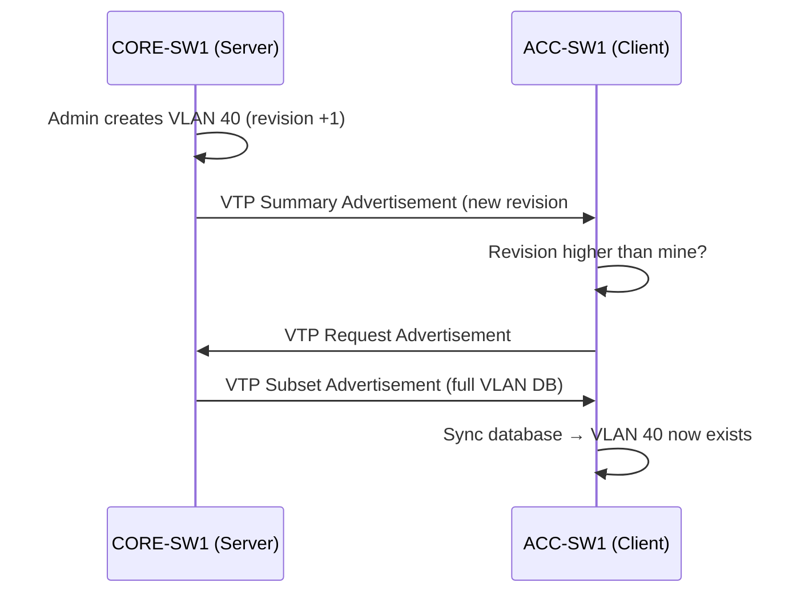

# `VTP Configuration`

## Index

1. [What is VTP?](#1-what-is-vtp)
2. [Why do we need it? (The Problem it Solves)](#2-why-do-we-need-it-the-problem-it-solves)
3. [How it relates to the broader network](#3-how-it-relates-to-the-broader-network)
4. [Key Component 1 — VTP Domain](#4-key-component-1--vtp-domain)
5. [Key Component 2 — Configuration Revision Number](#5-key-component-2--configuration-revision-number)
6. [Key Component 3 — VTP Modes](#6-key-component-3--vtp-modes)
7. [Safety & Security Features](#7-safety--security-features)
8. [Who created it / Standards](#8-who-created-it--standards)
9. [Types / Variations](#9-types--variations)
10. [Flow of Phases / How it Works](#10-flow-of-phases--how-it-works)
11. [States and Timers](#11-states-and-timers)
12. [Advanced / Extra Features](#12-advanced--extra-features)
13. [Configuration & Troubleshooting Workflow](#13-configuration--troubleshooting-workflow)

---

## 1. What is VTP?

- **VTP (VLAN Trunking Protocol)** is a Cisco-proprietary protocol that **synchronizes the VLAN database** across all switches in a common domain — create a VLAN once on a server, and it propagates to every switch automatically.
- **Analogy** 📢: A **company-wide memo system**. The HR director (VTP Server) posts an announcement ("New VLAN 40 exists!"), and every branch office (VTP Clients) instantly updates their records — no one has to type it out individually.

## 2. Why do we need it? (The Problem it Solves)

- In a large network, manually creating the *same* VLANs on **every** switch is tedious and error-prone.
- Solves:
  - **Consistency** → identical VLAN database everywhere.
  - **Efficiency** → configure once, propagate everywhere.
  - **Reduced errors** → no VLAN ID typos across switches.
- ⚠️ **But:** it introduces a serious risk (the revision-number disaster — see §5).

## 3. How it relates to the broader network

- Runs **only over trunk links** (your ACC↔CORE uplinks).
- In your lab, `CORE-SW1/2` would typically act as **Servers** and `ACC-SW1–4` as **Clients** (or all set to **Transparent** for safety).
- Directly affects which VLANs (20/30/40) exist on each switch.

## 4. Key Component 1 — VTP Domain

- A **VTP domain** is a group of switches sharing the same **domain name** — updates only propagate *within* the same domain name.
- Switches ignore VTP advertisements from a different domain.
- An optional **password** authenticates domain membership.

## 5. Key Component 2 — Configuration Revision Number

- **The single most dangerous concept in VTP.** ⚠️
- Every VLAN change **increments** a revision counter. Switches always adopt the database with the **highest revision number**.
- **The Disaster Scenario:** You plug an old switch (with a **higher revision** but **empty/wrong VLAN database**) into the domain → it *overwrites every switch's VLANs* → **the entire network's VLANs vanish instantly.**
- **The Fix:** Before adding any switch, **reset its revision to 0** — set it to `transparent` mode then back, or change its domain name and back.

## 6. Key Component 3 — VTP Modes

| Mode | Creates/Deletes VLANs? | Forwards VTP ads? | Syncs from others? | Stores in vlan.dat? |
|------|:---:|:---:|:---:|:---:|
| **Server** | ✅ | ✅ | ✅ | ✅ |
| **Client** | ❌ | ✅ | ✅ | ❌ (RAM only, v1/2) |
| **Transparent** | ✅ (local only) | ✅ (passes through) | ❌ | ✅ |
| **Off** (v3) | ❌ | ❌ | ❌ | — |

- **Transparent** is the **safest** mode — it ignores the domain's database entirely and only keeps local VLANs.

## 7. Safety & Security Features

- **VTP Password** → `vtp password` authenticates the domain (prevents rogue servers).
- **Transparent Mode** → immune to the revision-number disaster.
- **VTP v3 Primary Server** → only one designated server can make changes (a major safety improvement).
- **Golden rule:** Always **reset revision to 0** before introducing any switch to production.

## 8. Who created it / Standards

- **Cisco-proprietary** (no IEEE equivalent).
- Versions: **VTPv1, v2, v3** (v3 adds security, extended VLANs, and MST/private-VLAN support).

## 9. Types / Variations

| Version | Key Additions |
|---------|---------------|
| **VTPv1** | Base functionality |
| **VTPv2** | Token Ring support, transparent-mode consistency checks |
| **VTPv3** | Primary server concept, extended VLANs (1006–4094), password hiding, propagates MST/PVLAN config |

## 10. Flow of Phases / How it Works



## 11. States and Timers

| Timer / Advertisement | Value | Purpose |
|-----------------------|-------|---------|
| **Summary Advertisement** | Every **300 sec** (5 min) | Announces domain + current revision |
| **On change** | Immediate | Triggered advertisement when a VLAN changes |
| **Subset Advertisement** | On request | Carries the actual VLAN details |

## 12. Advanced / Extra Features

- **VTP Pruning** → automatically removes unneeded VLANs from trunks (saves bandwidth by not flooding a VLAN where no ports need it).
- **VTP v3 hidden password** → stores the secret securely.
- **Primary vs. Secondary server (v3)** → only the *primary* can alter the DB, neutralizing the revision disaster.

---

## 13. Configuration & Troubleshooting Workflow

> ⚠️ **Recommendation for your lab:** Given the revision-number danger, many engineers run **all switches in `transparent` mode** for a small, controlled topology. Below shows a **Server/Client** setup (to learn the mechanics) **plus** the critical safety step.

### Phase 1: Port Selection & Preparation
- VTP only works over **trunks** → confirm ACC↔CORE uplinks are trunking first.
```
CORE-SW1> enable
CORE-SW1# configure terminal
CORE-SW1(config)# interface range GigabitEthernet0/1 - 4
CORE-SW1(config-if-range)# switchport mode trunk
CORE-SW1(config-if-range)# switchport trunk allowed vlan 20,30,40
```

### Phase 2: Base Configuration
- Configure **CORE-SW1 as Server**, **ACC-SW1 as Client**:
```
! --- CORE-SW1 (Server) ---
CORE-SW1(config)# vtp domain LAB_DOMAIN
CORE-SW1(config)# vtp version 2
CORE-SW1(config)# vtp mode server
CORE-SW1(config)# vlan 20
CORE-SW1(config-vlan)# name DATA_USERS
CORE-SW1(config-vlan)# vlan 30
CORE-SW1(config-vlan)# name DATA_MGMT
CORE-SW1(config-vlan)# vlan 40
CORE-SW1(config-vlan)# name VOICE

! --- ACC-SW1 (Client) ---
ACC-SW1(config)# vtp domain LAB_DOMAIN
ACC-SW1(config)# vtp mode client
```

### Phase 3: Hardening & Security
- Set a domain password and (critically) **reset revision before adding switches**:
```
CORE-SW1(config)# vtp password Cisco123!
ACC-SW1(config)# vtp password Cisco123!

! --- CRITICAL SAFETY STEP: reset revision on any NEW switch to 0 ---
ACC-SW2(config)# vtp mode transparent
ACC-SW2(config)# vtp mode client
! (Flipping to transparent and back zeroes the revision counter)
```
- **Why:** The password blocks rogue servers; the transparent flip **prevents a high-revision switch from wiping every VLAN.**

### Phase 4: Verification Flow
Run these `show` commands **in this order**:
```
CORE-SW1# show vtp status
CORE-SW1# show vtp password
ACC-SW1# show vtp status
ACC-SW1# show vlan brief
```
- **What to look for:**
  - `show vtp status` → matching **Domain Name**, **Version**, correct **Mode**, and **Configuration Revision** numbers in sync.
  - On the **Client**, VLANs 20/30/40 appear in `show vlan brief` **without being manually created**.
  - **Number of existing VLANs** matches between server and client.

### Phase 5: Advanced Debugging
- If VLANs aren't propagating:
```
ACC-SW1# show vtp status
ACC-SW1# show interfaces trunk
CORE-SW1# debug sw-vlan vtp events
```
- **Troubleshooting logic:**
  - **VLANs not syncing** → domain name mismatch (case-sensitive!) or password mismatch.
  - **No propagation at all** → no trunk between switches (VTP needs trunks).
  - **VLANs suddenly disappeared everywhere** → 🚨 **revision disaster** — a switch with higher revision + empty DB was added → restore from server, reset revisions.
  - **Client can't create VLANs** → expected behavior; switch to Server or Transparent.
  - **Version mismatch** → align `vtp version` across all switches.
