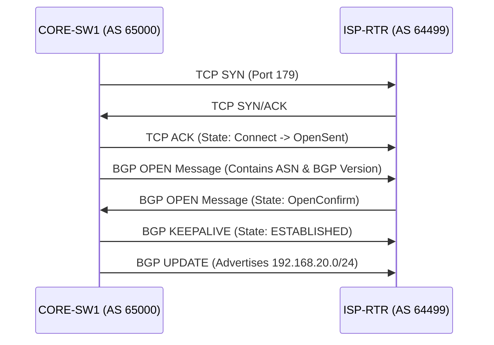

# `BGP`

## Index

1. [What is BGP?](#1-what-is-bgp)
2. [Why do we need it? (The Problem it Solves)](#2-why-do-we-need-it-the-problem-it-solves)
3. [How it relates to the broader network](#3-how-it-relates-to-the-broader-network)
4. [Key Component 1 — Autonomous System Number (ASN)](#4-key-component-1--autonomous-system-number-asn)
5. [Key Component 2 — Path Attributes (PA)](#5-key-component-2--path-attributes-pa)
6. [Key Component 3 — TCP Port 179](#6-key-component-3--tcp-port-179)
7. [Safety & Security Features](#7-safety--security-features)
8. [Who created it / Standards](#8-who-created-it--standards)
9. [Types / Variations](#9-types--variations)
10. [Flow of Phases / How it Works](#10-flow-of-phases--how-it-works)
11. [States and Timers](#11-states-and-timers)
12. [Advanced / Extra Features](#12-advanced--extra-features)
13. [Configuration & Troubleshooting Workflow](#13-configuration--troubleshooting-workflow)

---

## 1. What is BGP?

- **BGP (Border Gateway Protocol)** is a **Path-Vector** routing protocol used to exchange routing and reachability information between different organizations on the internet.
- Instead of routing based on link speed (like OSPF), BGP routes based on network policies, business rules, and the path of ASNs a packet must traverse.
- **Analogy** 🌍: If OSPF is your **local city transit system** finding the fastest road, BGP is the **international freight shipping network**. BGP doesn't care if a specific road is fast; it cares about which countries (Autonomous Systems) the cargo must pass through, customs agreements (policies), and avoiding embargoed zones.

## 2. Why do we need it? (The Problem it Solves)

- IGPs (OSPF/EIGRP) crash if you feed them the global internet routing table (over 900,000+ routes). They cannot scale.
- Solves:
  - **Massive Scalability** → BGP can hold millions of routes without crashing.
  - **Policy-Based Routing** → Allows an ISP to say, "Send traffic through Provider A because they are cheaper, even if Provider B is technically faster."
  - **Loop Prevention at Internet Scale** → By tracking the exact list of ASNs a route has passed through, loops are instantly detected and dropped.

## 3. How it relates to the broader network

- In your lab, `CORE-SW1` and `CORE-SW2` run your internal network. If you connect this lab to an ISP or a massive corporate WAN, you would run BGP on the uplinks of `CORE-SW1/2` to advertise your internal subnets (VLANs 20, 30, 40) to the outside world.

## 4. Key Component 1 — Autonomous System Number (ASN)

- An **ASN** is a globally unique number assigned to an organization by IANA (e.g., Google, AT&T, or your enterprise).
- **eBGP (External BGP):** Peering between two *different* ASNs (e.g., Your Core to the ISP).
- **iBGP (Internal BGP):** Peering between routers in the *same* ASN (e.g., CORE-SW1 to CORE-SW2).

## 5. Key Component 2 — Path Attributes (PA)

BGP does not use a simple "metric." It uses a complex 13-step algorithm based on Path Attributes. The most important are:
- **Weight (Cisco Proprietary):** Highest wins. Local to the router.
- **Local Preference:** Highest wins. Tells your internal AS how to exit to the internet.
- **AS-Path:** Shortest wins. The list of ASNs the route traversed. (If a router sees its own ASN in this list, it drops the route to prevent a loop).
- **MED (Multi-Exit Discriminator):** Lowest wins. Tells an external AS how to enter your network.

## 6. Key Component 3 — TCP Port 179

- Unlike OSPF/EIGRP which use multicast to auto-discover neighbors, **BGP requires manual configuration**.
- It establishes a reliable **TCP session on Port 179** with its peer before exchanging any routes.
- Because it uses TCP, BGP neighbors do not even need to be directly connected (especially true for iBGP).

## 7. Safety & Security Features

- **Prefix-Lists & Route-Maps:** BGP's primary security. You must strictly filter what you advertise and what you receive. If you accidentally advertise the entire internet routing table back to your ISP, you become a transit provider and your network crashes.
- **Maximum-Prefix Limit:** Automatically tears down the BGP session if the ISP sends you too many routes, protecting your router's RAM.
- **TTL Security / eBGP Multihop:** Ensures attackers cannot spoof BGP TCP packets from remote networks.

## 8. Who created it / Standards

- Maintained by the **IETF**.
- Current version is **BGP-4**, defined in **RFC 4271**.

## 9. Types / Variations

| Type | AD | Use Case |
|------|:---:|----------|
| **eBGP** | 20 | Connecting to an external organization (ISP). Extremely trusted. |
| **iBGP** | 200 | Passing internet routes across your internal enterprise. Less trusted than IGPs. |
| **MP-BGP** | N/A | Multiprotocol BGP. Used to carry IPv6, VRFs, and MPLS VPN traffic. |

## 10. Flow of Phases / How it Works



## 11. States and Timers

| BGP State | Meaning |
|-----------|---------|
| **Idle** | Process is down or administratively shut. |
| **Connect** | Waiting for the TCP 3-way handshake to complete. |
| **Active** | TCP failed. Actively trying to initiate the TCP connection again. *(Active is BAD in BGP).* |
| **Established** | Peering is up. Routes are being exchanged. *(This is the only good state).* |

- **Keepalive Timer:** 60 seconds.
- **Hold Timer:** 180 seconds.

## 12. Advanced / Extra Features

- **iBGP Split Horizon Rule:** To prevent loops, an iBGP router will *never* forward a route learned from one iBGP peer to another iBGP peer. This requires a **Full Mesh** of iBGP peers.
- **Route Reflectors (RR):** Solves the full-mesh problem. A designated router (the RR) is allowed to reflect iBGP routes to other iBGP clients, drastically reducing configuration overhead.

---

## 13. Configuration & Troubleshooting Workflow

> ⚙️ **Note:** In this workflow, we configure `CORE-SW1` (AS 65000) to peer via eBGP with an upstream ISP (AS 64499) and safely advertise our local Data VLANs.

### Phase 1: Port Selection & Preparation
- Target the physical uplink connecting `CORE-SW1` to the ISP. Ensure IP connectivity (TCP 179 requires basic IP reachability first).
```
CORE-SW1> enable
CORE-SW1# configure terminal
CORE-SW1(config)# interface GigabitEthernet1/1
CORE-SW1(config-if)# description ** UPLINK TO ISP **
CORE-SW1(config-if)# no switchport
CORE-SW1(config-if)# ip address 203.0.113.2 255.255.255.252
CORE-SW1(config-if)# no shutdown
CORE-SW1(config-if)# exit
```

### Phase 2: Base Configuration
- Start the BGP process, define the neighbor, and advertise the local SVIs.
- *Crucial:* In BGP, the `network` command does NOT enable BGP on an interface. It tells BGP to look in the routing table for an *exact match* of that subnet and advertise it.
```
CORE-SW1(config)# router bgp 65000
CORE-SW1(config-router)# bgp router-id 1.1.1.1
! Define the eBGP neighbor
CORE-SW1(config-router)# neighbor 203.0.113.1 remote-as 64499
! Advertise our internal VLANs
CORE-SW1(config-router)# network 192.168.20.0 mask 255.255.255.0
CORE-SW1(config-router)# network 192.168.30.0 mask 255.255.255.0
CORE-SW1(config-router)# network 192.168.40.0 mask 255.255.255.0
```

### Phase 3: Hardening & Security
- Secure the peering with a password.
- Apply a **Prefix-List** outbound to ensure we *only* advertise our specific VLANs, preventing accidental internet route leaks.
```
! Create the prefix-list (Only allow our subnets)
CORE-SW1(config)# ip prefix-list MY_INTERNAL_NETS permit 192.168.20.0/24
CORE-SW1(config)# ip prefix-list MY_INTERNAL_NETS permit 192.168.30.0/24
CORE-SW1(config)# ip prefix-list MY_INTERNAL_NETS permit 192.168.40.0/24

CORE-SW1(config)# router bgp 65000
! Apply password
CORE-SW1(config-router)# neighbor 203.0.113.1 password CiscoBGP!
! Apply outbound filter
CORE-SW1(config-router)# neighbor 203.0.113.1 prefix-list MY_INTERNAL_NETS out
! Protect RAM from ISP sending too many routes
CORE-SW1(config-router)# neighbor 203.0.113.1 maximum-prefix 1000
```

### Phase 4: Verification Flow
Run these `show` commands **in this order**:

```
CORE-SW1# show ip bgp summary
CORE-SW1# show ip bgp
CORE-SW1# show ip bgp neighbor 203.0.113.1 advertised-routes
```

- **What to look for:**
  - `show ip bgp summary` → Look at the **State/PfxRcd** column. If it shows a number (like `0` or `15`), the state is **Established** (Success!). If it says `Active` or `Idle`, it is failing.
  - `show ip bgp` → Look for the `*>` (Valid and Best) symbols next to your routes.
  - `show ip bgp neighbor ... advertised-routes` → Confirms exactly what you are sending to the ISP (verifying your prefix-list worked).

### Phase 5: Advanced Debugging
- If the BGP session won't establish or routes aren't advertising:
```
CORE-SW1# show ip bgp summary
CORE-SW1# ping 203.0.113.1
CORE-SW1# debug ip bgp events
CORE-SW1# show ip route 192.168.20.0
```
- **Troubleshooting logic:**
  - **Stuck in IDLE** → The router doesn't even know how to reach the neighbor IP. Check your routing table; you might need a static route to the peer.
  - **Stuck in ACTIVE** → The router can reach the IP, but TCP Port 179 is being blocked by an ACL, or the neighbor has the wrong ASN configured for you.
  - **Session is Established, but network isn't advertising** → BGP requires an **exact match** in the routing table. If you type `network 192.168.20.0 mask 255.255.255.0` in BGP, but the routing table only has a `/25` or the SVI is down, BGP will refuse to advertise it.
  - **iBGP Next-Hop Issue** → If passing routes internally via iBGP, the next-hop IP doesn't change by default. Internal routers might drop the route because they can't reach the external ISP IP. Fix with `neighbor x.x.x.x next-hop-self`.
