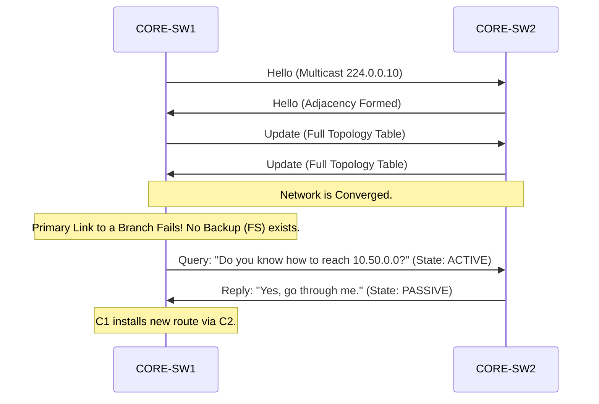

# `EIGRP`

## Index

1. [What is EIGRP?](#1-what-is-eigrp)
2. [Why do we need it? (The Problem it Solves)](#2-why-do-we-need-it-the-problem-it-solves)
3. [How it relates to the broader network](#3-how-it-relates-to-the-broader-network)
4. [Key Component 1 — DUAL Algorithm](#4-key-component-1--dual-algorithm)
5. [Key Component 2 — Successor & Feasible Successor](#5-key-component-2--successor--feasible-successor)
6. [Key Component 3 — The Composite Metric](#6-key-component-3--the-composite-metric)
7. [Safety & Security Features](#7-safety--security-features)
8. [Who created it / Standards](#8-who-created-it--standards)
9. [Types / Variations](#9-types--variations)
10. [Flow of Phases / How it Works](#10-flow-of-phases--how-it-works)
11. [States and Timers](#11-states-and-timers)
12. [Advanced / Extra Features](#12-advanced--extra-features)
13. [Configuration & Troubleshooting Workflow](#13-configuration--troubleshooting-workflow)

---

## 1. What is EIGRP?

- **EIGRP (Enhanced Interior Gateway Routing Protocol)** is an Advanced Distance-Vector (sometimes called "Hybrid") routing protocol primarily used in Cisco networks.
- Instead of building a full map of the network (like OSPF), EIGRP routers rely on their neighbors to tell them the best paths, but they keep backup paths pre-calculated and ready to use instantly.
- **Analogy** 📻: If OSPF is a **GPS map** where you see every road, EIGRP is like a **convoy with walkie-talkies**. You don't know the whole map, but the truck in front of you says, "The destination is 10 miles ahead through me, and my backup truck says it's 15 miles through him." You trust your neighbors completely.

## 2. Why do we need it? (The Problem it Solves)

- OSPF can be CPU-intensive and complex to design (requiring strict Area 0 hierarchies). EIGRP is incredibly efficient and easy to deploy.
- Solves:
  - **Lightning-Fast Convergence** → Backup routes are pre-calculated. If the primary link dies, failover is instantaneous (no algorithm needs to run).
  - **Unequal-Cost Load Balancing** → The *only* IGP that can send traffic across a 10Gbps link and a 1Gbps link simultaneously, proportional to their speeds.
  - **Low Overhead** → Only sends partial, bounded updates when a change occurs, rather than flooding the whole area.

## 3. How it relates to the broader network

- In an all-Cisco enterprise, EIGRP is often chosen over OSPF for the `CORE-SW1/2` routing domain due to its simplicity and speed.
- It dynamically advertises your VLAN 20, 30, and 40 SVIs to upstream routers, ensuring the rest of the network knows how to reach your endpoints.

## 4. Key Component 1 — DUAL Algorithm

- **DUAL (Diffusing Update Algorithm)** is the mathematical engine behind EIGRP.
- It guarantees 100% loop-free routing by strictly tracking the "distance" reported by neighbors.
- If a primary route fails and no backup exists, DUAL actively sends **Query** packets to neighbors asking, "Do you have an alternate path to this subnet?"

## 5. Key Component 2 — Successor & Feasible Successor

EIGRP keeps three tables: Neighbor Table, Topology Table, and Routing Table. The Topology Table holds these key roles:
- **Successor:** The absolute best path to a destination. This route is installed in the Routing Table.
- **Feasible Successor (FS):** A valid, loop-free **backup path**. It is kept in the Topology Table and can take over *instantly* if the Successor fails.
- **Feasibility Condition (FC):** To become an FS, a neighbor's advertised distance to the destination (Reported Distance) MUST be strictly less than your current total distance (Feasible Distance). This mathematically proves the neighbor isn't routing *through* you (preventing loops).

## 6. Key Component 3 — The Composite Metric

- EIGRP does not use simple hop-count (like RIP) or just bandwidth (like OSPF). It uses a composite metric based on **K-Values**.
- By default, it uses **Bandwidth (K1)** and **Delay (K3)**.
- *Formula:* `[10^7 / Minimum Bandwidth (Kbps) + Total Delay (tens of microseconds)] * 256`
- It can also factor in Reliability (K2) and Load (K4/K5), but these are disabled by default because they cause constant route flapping.

## 7. Safety & Security Features

- **Passive-Interface:** Prevents EIGRP Hellos from forming unauthorized adjacencies on edge ports (VLAN 20/30/40).
- **Cryptographic Authentication:** Supports MD5 and SHA-256 to ensure routers only accept updates from trusted peers.
- **EIGRP Stub:** Configured on branch routers to prevent the Core from sending them DUAL Queries. This prevents the network from freezing in a "Stuck-in-Active" (SIA) state during a failure.

## 8. Who created it / Standards

- Created by **Cisco** in 1992 to replace IGRP.
- In 2013, Cisco opened a portion of EIGRP to the IETF, published as **RFC 7868** (2016), allowing other vendors to implement basic EIGRP, though it remains predominantly a Cisco technology.

## 9. Types / Variations

| Mode | Configuration Style | Features |
|------|---------------------|----------|
| **Classic EIGRP** | `router eigrp [AS-Number]` | The traditional IPv4 configuration method. |
| **Named EIGRP** | `router eigrp [NAME]` | Modern, hierarchical config. Supports IPv4/IPv6 under one process, Wide Metrics (for 100Gbps+ links), and SHA-256. |

## 10. Flow of Phases / How it Works



## 11. States and Timers

- **Hello Timer:** 5 seconds (on high-speed links).
- **Hold Timer:** 15 seconds (3x Hello). If no Hello is received, neighbor is dropped.
- ⚠️ **Active vs. Passive State:** In EIGRP, **Passive is good** (the route is stable and usable). **Active is bad** (the route failed, and DUAL is actively querying neighbors for a replacement).

## 12. Advanced / Extra Features

- **Variance:** The command that enables unequal-cost load balancing. If `variance 2` is set, EIGRP will load-balance traffic across any Feasible Successor whose metric is less than 2x the primary Successor's metric.
- **Summarization:** EIGRP can summarize routes at *any* interface (unlike OSPF, which can only summarize at ABRs/ASBRs).

---

## 13. Configuration & Troubleshooting Workflow

> ⚙️ **Note:** In this workflow, we will configure Classic EIGRP on `CORE-SW1` to form an adjacency with `CORE-SW2` and securely advertise the local SVIs.

### Phase 1: Port Selection & Preparation
- Target the dedicated Layer 3 transit link between the cores (e.g., `GigabitEthernet1/1`).
```
CORE-SW1> enable
CORE-SW1# configure terminal
CORE-SW1(config)# interface GigabitEthernet1/1
CORE-SW1(config-if)# description ** L3 EIGRP Transit to CORE-SW2 **
CORE-SW1(config-if)# no switchport
CORE-SW1(config-if)# ip address 10.0.0.1 255.255.255.252
CORE-SW1(config-if)# no shutdown
CORE-SW1(config-if)# exit
```

### Phase 2: Base Configuration
- Enable the EIGRP process using an Autonomous System (AS) number. **The AS number MUST match on all routers.**
- Advertise the transit link and the SVIs using wildcard masks.
```
CORE-SW1(config)# router eigrp 100
CORE-SW1(config-router)# eigrp router-id 1.1.1.1
! Advertise the transit link
CORE-SW1(config-router)# network 10.0.0.0 0.0.0.3
! Advertise the SVIs (VLAN 20, 30, 40)
CORE-SW1(config-router)# network 192.168.20.0 0.0.0.255
CORE-SW1(config-router)# network 192.168.30.0 0.0.0.255
CORE-SW1(config-router)# network 192.168.40.0 0.0.0.255
```

### Phase 3: Hardening & Security
- Make the SVIs **Passive Interfaces** to prevent rogue adjacencies on the access layer.
- Apply MD5 Authentication to the transit link. (EIGRP requires a key-chain).
```
CORE-SW1(config)# router eigrp 100
CORE-SW1(config-router)# passive-interface default
CORE-SW1(config-router)# no passive-interface GigabitEthernet1/1
CORE-SW1(config-router)# exit

! Create the Key Chain
CORE-SW1(config)# key chain EIGRP_KEYS
CORE-SW1(config-keychain)# key 1
CORE-SW1(config-keychain-key)# key-string Cisco123!
CORE-SW1(config-keychain-key)# exit
CORE-SW1(config-keychain)# exit

! Apply to the interface
CORE-SW1(config)# interface GigabitEthernet1/1
CORE-SW1(config-if)# ip authentication mode eigrp 100 md5
CORE-SW1(config-if)# ip authentication key-chain eigrp 100 EIGRP_KEYS
```

### Phase 4: Verification Flow
Run these `show` commands **in this order**:

```
CORE-SW1# show ip eigrp neighbors
CORE-SW1# show ip eigrp interfaces
CORE-SW1# show ip route eigrp
CORE-SW1# show ip eigrp topology
```

- **What to look for:**
  - `show ip eigrp neighbors` → You MUST see `CORE-SW2`'s IP address. The **Q Cnt** (Queue Count) should be `0` (meaning no updates are stuck waiting to be sent).
  - `show ip route eigrp` → Look for routes marked with **"D"** (DUAL). These are your EIGRP-learned routes.
  - `show ip eigrp topology` → Look for routes with state **"P"** (Passive/Good). If you see an **"A"** (Active), the network is currently failing and searching for a path.

### Phase 5: Advanced Debugging
- If the EIGRP neighbor relationship fails to form or routes are missing:
```
CORE-SW1# show ip eigrp neighbors
CORE-SW1# debug eigrp packets hello
CORE-SW1# show ip protocols
```
- **Troubleshooting logic:**
  - **No Neighbors** → The AS Number (`router eigrp 100`) does not match on both switches. EIGRP will silently ignore Hellos from a different AS.
  - **K-Value Mismatch** → If someone manually changed the metric weights (`metric weights` command), the adjacency will instantly drop. K-values must match exactly.
  - **Authentication Failure** → Check `debug eigrp packets`. If the key-strings don't match, the router will drop the Hello packets.
  - **Neighbor is UP, but routes are missing** → Check if the interface connecting to the missing subnet is in `passive-interface` mode AND missing a `network` statement. (Passive interface only stops Hellos; you still need the `network` command to advertise the subnet).
