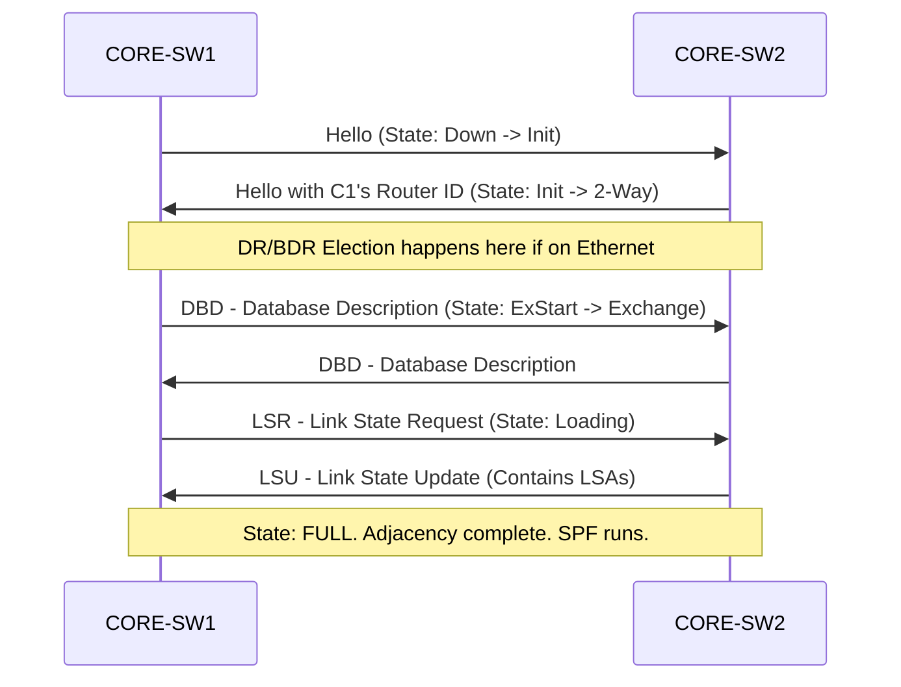

# `OSPF`

## Index

1. [What is OSPF?](#1-what-is-ospf)
2. [Why do we need it? (The Problem it Solves)](#2-why-do-we-need-it-the-problem-it-solves)
3. [How it relates to the broader network](#3-how-it-relates-to-the-broader-network)
4. [Key Component 1 — Link-State Database (LSDB)](#4-key-component-1--link-state-database-lsdb)
5. [Key Component 2 — Hierarchical Areas](#5-key-component-2--hierarchical-areas)
6. [Key Component 3 — The SPF Algorithm (Dijkstra)](#6-key-component-3--the-spf-algorithm-dijkstra)
7. [Safety & Security Features](#7-safety--security-features)
8. [Who created it / Standards](#8-who-created-it--standards)
9. [Types / Variations](#9-types--variations)
10. [Flow of Phases / How it Works](#10-flow-of-phases--how-it-works)
11. [States and Timers](#11-states-and-timers)
12. [Advanced / Extra Features](#12-advanced--extra-features)
13. [Configuration & Troubleshooting Workflow](#13-configuration--troubleshooting-workflow)

---

## 1. What is OSPF?

- **OSPF (Open Shortest Path First)** is a standardized, **Link-State** dynamic routing protocol used to exchange routing information within a single Autonomous System (AS).
- It builds a complete, mathematical map of the entire network topology and calculates the absolute shortest path to every destination.
- **Analogy** 🗺️: Distance-Vector protocols (like RIP) are like **following road signs** ("Turn left, destination is 5 miles away"). OSPF is like **GPS navigation (Waze)** — every router has the exact same master map of the entire city, knows all the traffic speeds, and calculates its own perfect route from a bird's-eye view.

## 2. Why do we need it? (The Problem it Solves)

- Static routes are manual, do not automatically failover when a link dies (unless using IP SLA), and are impossible to manage at an enterprise scale.
- Solves:
  - **Dynamic Failover** → If a link drops, OSPF recalculates the map in milliseconds and routes around the failure.
  - **Scalability** → Automatically learns and advertises new subnets as they are added.
  - **Optimal Pathing** → Uses interface bandwidth (Cost) to ensure traffic takes the 10Gbps fiber link instead of the 100Mbps copper link.

## 3. How it relates to the broader network

- In your lab, `CORE-SW1` and `CORE-SW2` use OSPF to dynamically advertise your local SVIs (VLAN 20, 30, 40) to the rest of the enterprise (e.g., upstream WAN routers).
- It prevents you from having to write static routes on every remote branch router pointing back to your Core switches.

## 4. Key Component 1 — Link-State Database (LSDB)

- OSPF routers do not simply trade routing tables. They trade **Link State Advertisements (LSAs)**—puzzle pieces containing information about their local interfaces, IPs, and neighbors.
- Every router collects these LSAs and builds an identical **Link-State Database (LSDB)**.
- Because every router has the exact same LSDB, routing loops are mathematically impossible within an area.

## 5. Key Component 2 — Hierarchical Areas

- To prevent the LSDB from becoming too large and consuming too much CPU, OSPF uses a strict 2-tier hierarchy.
- **Area 0 (The Backbone):** The core of the OSPF network. All other areas MUST connect directly to Area 0.
- **Non-Backbone Areas (Area 1, 2, etc.):** Used to group remote branches. Routers on the border (ABRs - Area Border Routers) summarize the map before passing it to Area 0, saving CPU.

## 6. Key Component 3 — The SPF Algorithm (Dijkstra)

- Once the LSDB is built, the router runs the **Dijkstra Shortest Path First (SPF)** algorithm.
- The router places *itself* at the root of the tree and calculates the lowest cumulative **Cost** to every destination.
- **Cost Formula:** `Reference Bandwidth (100 Mbps) / Interface Bandwidth`. *(Note: In modern networks, you must change the reference bandwidth to 100Gbps, or OSPF treats 100Mbps, 1Gbps, and 10Gbps as the exact same cost of 1).*

## 7. Safety & Security Features

- **Passive-Interface:** Prevents OSPF Hello packets from being sent out edge ports (like VLAN 20). This stops a malicious user from plugging in a laptop, forming an OSPF adjacency, and injecting fake routes.
- **Cryptographic Authentication:** Uses MD5 or SHA to hash OSPF packets. A router will reject an adjacency if the neighbor doesn't have the matching secret key.

## 8. Who created it / Standards

- Developed by the **IETF OSPF Working Group** (heavily driven by John Moy).
- **OSPFv2 (IPv4):** RFC 2328.
- **OSPFv3 (IPv6):** RFC 5340.

## 9. Types / Variations

| Router Role | Description |
|-------------|-------------|
| **Internal Router** | All interfaces belong to a single OSPF Area. |
| **ABR (Area Border Router)** | Connects Area 0 to a non-backbone area. Maintains separate LSDBs for each. |
| **ASBR (AS Boundary Router)** | Injects routes from *outside* OSPF (e.g., redistributing Static routes or BGP into OSPF). |
| **DR / BDR** | Designated Router / Backup DR. Elected on multi-access networks (Ethernet) to reduce LSA flooding. |

## 10. Flow of Phases / How it Works



## 11. States and Timers

| Timer / State | Value | Description |
|---------------|-------|-------------|
| **Hello Timer** | 10s (Broadcast) / 30s (P2P) | How often keepalives are sent. |
| **Dead Timer** | 40s (Broadcast) / 120s (P2P) | If no Hello is received in this time, neighbor is declared dead. |
| **2-Way State** | State | Bidirectional communication established. |
| **FULL State** | State | LSDBs are 100% synchronized. Normal operational state. |

## 12. Advanced / Extra Features

- **LSA Types:** The LSDB is built from different LSA types. (Type 1 = Router, Type 2 = Network/DR, Type 3 = Summary/ABR, Type 5 = External/ASBR).
- **Stub Areas:** Special area types (Stub, Totally Stubby, NSSA) that block heavy Type 5 External LSAs from entering small branch routers to save memory.
- **Virtual Links:** A temporary "band-aid" tunnel used if an Area accidentally gets disconnected from Area 0.

---

## 13. Configuration & Troubleshooting Workflow

> ⚙️ **Note:** In this workflow, we will establish an OSPF adjacency between `CORE-SW1` and `CORE-SW2` over a dedicated Layer 3 routed link, and advertise the local SVIs (VLANs 20, 30, 40) securely.

### Phase 1: Port Selection & Preparation
- Select the dedicated physical link between the cores (e.g., `GigabitEthernet1/1`) and convert it to a Layer 3 routed port.
```
CORE-SW1> enable
CORE-SW1# configure terminal
CORE-SW1(config)# interface GigabitEthernet1/1
CORE-SW1(config-if)# description ** L3 OSPF Transit to CORE-SW2 **
CORE-SW1(config-if)# no switchport
CORE-SW1(config-if)# ip address 10.0.0.1 255.255.255.252
CORE-SW1(config-if)# no shutdown
CORE-SW1(config-if)# exit
```

### Phase 2: Base Configuration
- Enable the OSPF process, set a manual Router ID, and advertise the networks.
- *Best Practice:* Use interface-level OSPF configuration rather than the legacy `network` command under the router process.
```
CORE-SW1(config)# router ospf 1
CORE-SW1(config-router)# router-id 1.1.1.1
CORE-SW1(config-router)# auto-cost reference-bandwidth 100000
CORE-SW1(config-router)# exit

! Enable OSPF on the transit link (Area 0)
CORE-SW1(config)# interface GigabitEthernet1/1
CORE-SW1(config-if)# ip ospf 1 area 0
CORE-SW1(config-if)# ip ospf network point-to-point

! Advertise the SVIs into OSPF
CORE-SW1(config)# interface vlan 20
CORE-SW1(config-if)# ip ospf 1 area 0
CORE-SW1(config)# interface vlan 30
CORE-SW1(config-if)# ip ospf 1 area 0
CORE-SW1(config)# interface vlan 40
CORE-SW1(config-if)# ip ospf 1 area 0
```

### Phase 3: Hardening & Security
- Make the SVIs **Passive Interfaces**. This advertises the subnet into OSPF, but prevents OSPF Hello packets from being sent down to the PCs, securing the protocol.
- Enable Cryptographic Authentication on the transit link.
```
CORE-SW1(config)# router ospf 1
CORE-SW1(config-router)# passive-interface default
CORE-SW1(config-router)# no passive-interface GigabitEthernet1/1
CORE-SW1(config-router)# exit

CORE-SW1(config)# interface GigabitEthernet1/1
CORE-SW1(config-if)# ip ospf authentication message-digest
CORE-SW1(config-if)# ip ospf message-digest-key 1 md5 Cisco123!
```

### Phase 4: Verification Flow
Run these `show` commands **in this order**:

```
CORE-SW1# show ip ospf neighbor
CORE-SW1# show ip ospf interface brief
CORE-SW1# show ip route ospf
CORE-SW1# show ip ospf database
```

- **What to look for:**
  - `show ip ospf neighbor` → State MUST be **FULL/ -** (The hyphen is because we set the network type to point-to-point, bypassing the DR/BDR election).
  - `show ip ospf interface brief` → Confirms which interfaces are actively running OSPF and which are passive.
  - `show ip route ospf` → Look for routes marked with **"O"**. These are dynamically learned from CORE-SW2.

### Phase 5: Advanced Debugging
- If the OSPF neighbor relationship fails to form:
```
CORE-SW1# show ip ospf neighbor
CORE-SW1# debug ip ospf adj
CORE-SW1# debug ip ospf hello
```
- **Troubleshooting logic:**
  - **Stuck in INIT** → CORE-SW1 is receiving Hellos from CORE-SW2, but CORE-SW2 is not receiving Hellos from CORE-SW1 (One-way communication / ACL blocking).
  - **Stuck in EXSTART / EXCHANGE** → **MTU Mismatch**. OSPF requires exactly matching MTUs to exchange database descriptions. Fix with `ip mtu` on the interface.
  - **No neighbor at all** → Check the `debug ip ospf hello` output. The following MUST match for an adjacency to form: Subnet Mask, Hello/Dead Timers, Area ID, Authentication Password, and Stub Area Flag.
  - **Routes missing from table** → Neighbor is FULL, but route isn't there? Check for an IP conflict (Duplicate Router IDs) or verify the network type isn't causing a next-hop resolution failure.
