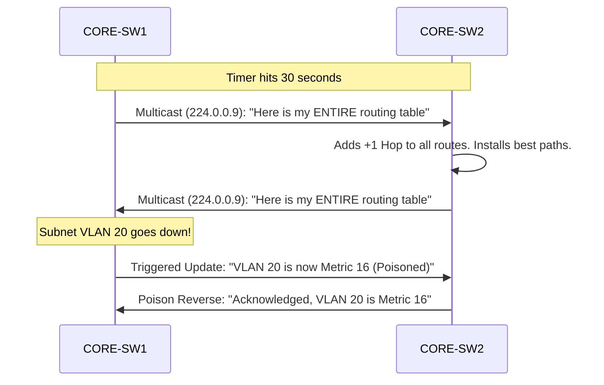

# `RIP`

## Index

1. [What is RIP?](#1-what-is-rip)
2. [Why do we need it? (The Problem it Solves)](#2-why-do-we-need-it-the-problem-it-solves)
3. [How it relates to the broader network](#3-how-it-relates-to-the-broader-network)
4. [Key Component 1 — Hop Count Metric](#4-key-component-1--hop-count-metric)
5. [Key Component 2 — Distance-Vector (Routing by Rumor)](#5-key-component-2--distance-vector-routing-by-rumor)
6. [Key Component 3 — Loop Prevention Mechanisms](#6-key-component-3--loop-prevention-mechanisms)
7. [Safety & Security Features](#7-safety--security-features)
8. [Who created it / Standards](#8-who-created-it--standards)
9. [Types / Variations](#9-types--variations)
10. [Flow of Phases / How it Works](#10-flow-of-phases--how-it-works)
11. [States and Timers](#11-states-and-timers)
12. [Advanced / Extra Features](#12-advanced--extra-features)
13. [Configuration & Troubleshooting Workflow](#13-configuration--troubleshooting-workflow)

---

## 1. What is RIP?

- **RIP (Routing Information Protocol)** is a legacy, **Distance-Vector** interior gateway protocol (IGP).
- It determines the best path to a destination based strictly on the number of routers the packet must pass through (Hops).
- **Analogy** 🗣️: RIP is like **asking for directions by rumor**. You stand at an intersection and ask the person next to you, "How far to the library?" They reply, "It's 3 blocks that way." You don't have a map; you just trust them, add 1 block for yourself, and tell the next person, "It's 4 blocks that way."

## 2. Why do we need it? (The Problem it Solves)

- Before OSPF and EIGRP existed, networks needed a way to dynamically share routes without manually typing static routes on every device.
- Solves:
  - **Extreme Simplicity** → It is incredibly easy to configure. No areas, no ASNs, no complex neighbor adjacencies.
  - **Low Resource Usage** → Requires almost zero CPU or RAM, making it viable for ancient or extremely low-end hardware.

## 3. How it relates to the broader network

- In your Collapsed Core lab (`CORE-SW1/2`), you would **not** use RIP for production traffic because it does not understand link speeds (bandwidth).
- However, learning RIP is critical because the loop-prevention mechanisms it introduced (Split Horizon, Route Poisoning) are foundational concepts used by advanced protocols like EIGRP and BGP.

## 4. Key Component 1 — Hop Count Metric

- RIP uses **Hop Count** as its one and only metric.
- 1 Router = 1 Hop.
- **The fatal flaw:** RIP will choose a 10 Mbps copper link (1 hop) over a 100 Gbps fiber-optic backbone (2 hops) because it is entirely blind to bandwidth.
- **Maximum Hops:** RIP has a hard limit of **15 hops**. A metric of **16 is considered "Infinite" (Unreachable)**. This prevents packets from looping forever but limits RIP to very small networks.

## 5. Key Component 2 — Distance-Vector (Routing by Rumor)

- RIP routers do not build a topology map. They simply broadcast their *entire routing table* out of all active interfaces every 30 seconds.
- When a router receives an update, it adds +1 to the hop count and installs the route if it's better than what it currently has.

## 6. Key Component 3 — Loop Prevention Mechanisms

Because RIP routes by rumor, it is highly susceptible to routing loops. It uses three strict rules to prevent them:
- **Split Horizon:** "Never advertise a route back out the interface you learned it from." (If Router A tells Router B about a subnet, Router B won't echo that subnet back to Router A).
- **Route Poisoning:** When a subnet goes down, the router doesn't just delete it. It advertises the subnet with a metric of **16 (Infinite)** to actively tell all neighbors the route is dead.
- **Poison Reverse:** The one exception to Split Horizon. When a router receives a poisoned route (metric 16), it *does* send it back out the receiving interface to confirm, "I acknowledge this route is dead."

## 7. Safety & Security Features

- **RIPv2 Authentication:** RIPv2 supports plain-text and MD5 cryptographic authentication to ensure it only accepts routing updates from trusted neighbors.
- **Passive-Interface:** Crucial in RIP. Because RIP blindly broadcasts its routing table every 30 seconds, you must make edge VLANs (20, 30, 40) passive so you don't broadcast your network topology to end-user PCs.

## 8. Who created it / Standards

- Based on the **Bellman-Ford algorithm**.
- Originally developed at Xerox (as GWINFO) in the 1970s.
- **RIPv1:** RFC 1058 (1988).
- **RIPv2:** RFC 2453 (1998).

## 9. Types / Variations

| Version | Characteristics |
|---------|-----------------|
| **RIPv1** | Legacy. **Classful** (does not send subnet masks). Broadcasts to `255.255.255.255`. No authentication. |
| **RIPv2** | Modern standard. **Classless** (sends subnet masks, supports VLSM). Multicasts to `224.0.0.9`. Supports authentication. |
| **RIPng** | "Next Generation." The IPv6 version of RIP. Multicasts to `FF02::9`. |

## 10. Flow of Phases / How it Works



## 11. States and Timers

RIP is entirely timer-driven. If a timer misfires, the network destabilizes.
| Timer | Default | Description |
|-------|:---:|-------------|
| **Update** | 30s | How often the router sends its full routing table. |
| **Invalid** | 180s | If no update is heard for a route, it is marked invalid (put into hold-down). |
| **Hold-down** | 180s | The router freezes the route and refuses to accept worse metrics for it, preventing loops while the network stabilizes. |
| **Flush** | 240s | The route is permanently deleted from the routing table. |

## 12. Advanced / Extra Features

- **Auto-Summary:** By default, RIPv2 summarizes subnets to their classful boundaries (e.g., `10.1.1.0/24` becomes `10.0.0.0/8`) when crossing major network boundaries. In modern networks, this causes catastrophic routing black holes. **You must always type `no auto-summary`.**

---

## 13. Configuration & Troubleshooting Workflow

> ⚙️ **Note:** In this workflow, we will configure RIPv2 on `CORE-SW1` to share routes with `CORE-SW2`.

### Phase 1: Port Selection & Preparation
- Target the Layer 3 transit link between the cores (e.g., `GigabitEthernet1/1`).
```
CORE-SW1> enable
CORE-SW1# configure terminal
CORE-SW1(config)# interface GigabitEthernet1/1
CORE-SW1(config-if)# description ** L3 RIP Transit to CORE-SW2 **
CORE-SW1(config-if)# no switchport
CORE-SW1(config-if)# ip address 10.0.0.1 255.255.255.252
CORE-SW1(config-if)# no shutdown
CORE-SW1(config-if)# exit
```

### Phase 2: Base Configuration
- Enable the RIP process, force Version 2, turn off auto-summarization, and advertise the networks.
- *Note:* The RIP `network` command is classful. If you type `network 192.168.20.0`, it covers all interfaces starting with `192.168.20.x`.
```
CORE-SW1(config)# router rip
CORE-SW1(config-router)# version 2
CORE-SW1(config-router)# no auto-summary
! Advertise the transit link
CORE-SW1(config-router)# network 10.0.0.0
! Advertise the SVIs (VLAN 20, 30, 40)
CORE-SW1(config-router)# network 192.168.20.0
CORE-SW1(config-router)# network 192.168.30.0
CORE-SW1(config-router)# network 192.168.40.0
```

### Phase 3: Hardening & Security
- Make the SVIs **Passive Interfaces** so you don't broadcast your routing table to the PCs.
- Apply MD5 Authentication to the transit link.
```
CORE-SW1(config)# router rip
CORE-SW1(config-router)# passive-interface default
CORE-SW1(config-router)# no passive-interface GigabitEthernet1/1
CORE-SW1(config-router)# exit

! Create the Key Chain
CORE-SW1(config)# key chain RIP_KEYS
CORE-SW1(config-keychain)# key 1
CORE-SW1(config-keychain-key)# key-string Cisco123!
CORE-SW1(config-keychain-key)# exit
CORE-SW1(config-keychain)# exit

! Apply to the interface
CORE-SW1(config)# interface GigabitEthernet1/1
CORE-SW1(config-if)# ip rip authentication mode md5
CORE-SW1(config-if)# ip rip authentication key-chain RIP_KEYS
```

### Phase 4: Verification Flow
Run these `show` commands **in this order**:

```
CORE-SW1# show ip protocols
CORE-SW1# show ip route rip
CORE-SW1# show ip rip database
```

- **What to look for:**
  - `show ip protocols` → Verifies RIP is running, sending/receiving Version 2, and confirms which interfaces are passive. It also shows the strict 30/180/180/240 timers.
  - `show ip route rip` → Look for routes marked with **"R"**. The metric inside the brackets `[120/1]` means Administrative Distance is 120, and the Hop Count is 1.

### Phase 5: Advanced Debugging
- If routes are missing or traffic is looping:
```
CORE-SW1# clear ip route *
CORE-SW1# debug ip rip
CORE-SW1# show ip interface brief
```
- **Troubleshooting logic:**
  - **Routes are missing** → Unlike OSPF/EIGRP, RIP has no "neighbor table." If routes are missing, run `debug ip rip` to watch the live 30-second updates. If you see "ignored" messages, authentication is failing or version numbers mismatch (v1 vs v2).
  - **Subnets are merged/wrong (e.g., 192.168.0.0/16 instead of /24)** → You forgot to type `no auto-summary`. RIPv2 is summarizing your networks at the classful boundary.
  - **Metric is 16** → The route is poisoned. The upstream router lost the connection to that subnet and is actively telling you it is dead.
  - **Traffic taking a slow 10Mbps link instead of the 1Gbps link** → This is RIP working as designed. RIP only counts hops. If the 10Mbps link is 1 hop, and the 1Gbps link is 2 hops, RIP will always choose the slow 10Mbps link. Migrate to OSPF or EIGRP.

---