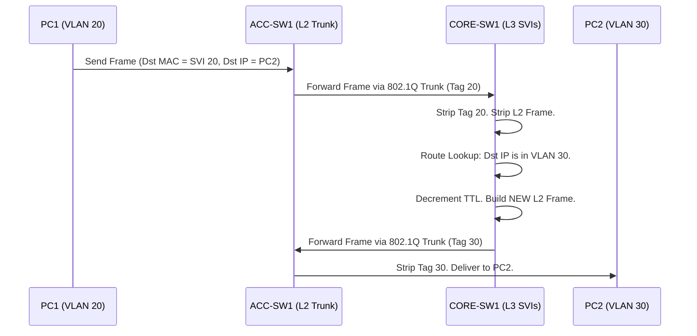

# `Inter-VLAN Routing`

## Index

1. [What is Inter-VLAN Routing?](#1-what-is-inter-vlan-routing)
2. [Why do we need it? (The Problem it Solves)](#2-why-do-we-need-it-the-problem-it-solves)
3. [How it relates to the broader network](#3-how-it-relates-to-the-broader-network)
4. [Key Component 1 — Switch Virtual Interfaces (SVIs)](#4-key-component-1--switch-virtual-interfaces-svis)
5. [Key Component 2 — Router-on-a-Stick (ROAS)](#5-key-component-2--router-on-a-stick-roas)
6. [Key Component 3 — The MAC Rewrite Process](#6-key-component-3--the-mac-rewrite-process)
7. [Safety & Security Features](#7-safety--security-features)
8. [Who created it / Standards](#8-who-created-it--standards)
9. [Types / Variations](#9-types--variations)
10. [Flow of Phases / How it Works](#10-flow-of-phases--how-it-works)
11. [States and Timers](#11-states-and-timers)
12. [Advanced / Extra Features](#12-advanced--extra-features)
13. [Configuration & Troubleshooting Workflow](#13-configuration--troubleshooting-workflow)

---

## 1. What is Inter-VLAN Routing?

- **Inter-VLAN Routing** is the process of forwarding Layer 3 IP packets between different Layer 2 broadcast domains (VLANs).
- It requires a Layer 3 device (a router or a multilayer switch) to act as the default gateway for each VLAN.
- **Analogy** 🛂: VLANs are like **different countries**. You cannot cross the border directly. You must go to **Passport Control (the Default Gateway)**, where an official (the Router) checks your destination, stamps your passport (rewrites your MAC address), and lets you into the new country.

## 2. Why do we need it? (The Problem it Solves)

- By definition, VLANs isolate traffic. A broadcast or unicast frame in VLAN 20 will **never** reach VLAN 30 at Layer 2.
- Solves:
  - **Connectivity** → Allows PCs in Data VLAN 20 to communicate with servers in Data VLAN 30.
  - **Centralized Gateway** → Provides a single point (the Core switch) for endpoints to send off-subnet traffic.
  - **Security Chokepoint** → Forces inter-departmental traffic through a routing engine where Access Control Lists (ACLs) can be applied.

## 3. How it relates to the broader network

- In your Collapsed Core lab, `CORE-SW1` and `CORE-SW2` are **Multilayer Switches**. They perform this routing internally at wire-speed.
- The Access switches (`ACC-SW1-4`) remain purely Layer 2. They simply forward frames up the 802.1Q trunks to the Core, where the inter-VLAN routing actually happens.

## 4. Key Component 1 — Switch Virtual Interfaces (SVIs)

- An **SVI** is a logical, virtual Layer 3 interface created inside a multilayer switch (e.g., `interface vlan 20`).
- It acts as the default gateway for all hosts in that specific VLAN.
- Because it exists in the switch's hardware (ASIC), routing between SVIs is incredibly fast (millions of packets per second) compared to a traditional physical router.

## 5. Key Component 2 — Router-on-a-Stick (ROAS)

- **ROAS** is the legacy/alternative method for inter-VLAN routing.
- Instead of a multilayer switch, you use a **physical router** connected to a Layer 2 switch via a single 802.1Q trunk link.
- The router uses **Subinterfaces** (e.g., `Gig0/0.20`, `Gig0/0.30`) to tag and untag traffic as it enters and leaves the single physical cable.
- *Note: Your lab uses SVIs, which are vastly superior to ROAS in performance and scalability.*

## 6. Key Component 3 — The MAC Rewrite Process

- When a packet moves from VLAN 20 to VLAN 30, the Layer 3 IP addresses **do not change**.
- However, the Layer 2 Ethernet frame is **destroyed and rebuilt**.
  - **Ingress:** The frame arrives at the SVI with the PC's Source MAC and the SVI's Destination MAC.
  - **Egress:** The switch builds a new frame with the SVI's Source MAC and the destination PC's Destination MAC.
- The **TTL (Time to Live)** in the IP header is decremented by 1.

## 7. Safety & Security Features

- **RACLs (Router ACLs):** Standard or Extended ACLs applied to the SVI (e.g., `ip access-group 100 in`) to block specific subnets from talking to each other.
- **VACLs (VLAN ACLs):** Applied to all traffic *within* a VLAN, bridging the gap between L2 and L3 security.
- **SVI Autostate Exclude:** Prevents a specific port from keeping an SVI "up" if you don't want it to influence the routing table.

## 8. Who created it / Standards

- Relies on **IEEE 802.1Q** for the VLAN tagging on trunks.
- Relies on **IETF RFC 791 (IPv4)** for the routing logic.
- SVIs are a hardware implementation popularized by Cisco (originally on the Catalyst 5000/6000 series).

## 9. Types / Variations

| Method | Hardware Used | Speed | Use Case |
|--------|---------------|-------|----------|
| **SVI (Multilayer)** | L3 Switch | Wire-speed (ASIC) | Enterprise Campus / Core (Your Lab) |
| **Router-on-a-Stick** | Physical Router | CPU-limited | Small branch offices with cheap L2 switches |
| **Physical Routed Ports** | L3 Switch / Router | Wire-speed | Point-to-point links (e.g., Core to Firewall) |

## 10. Flow of Phases / How it Works



## 11. States and Timers

- **SVI Autostate:** An SVI will only show `up/up` if:
  1. The VLAN exists in the L2 VLAN database (`vlan.dat`).
  2. At least one L2 port (access or trunk) assigned to that VLAN is in the `up/up` and STP forwarding state.
- **ARP Timer:** The SVI caches the MAC addresses of endpoints for 4 hours by default.

## 12. Advanced / Extra Features

- **FHRP (HSRP/VRRP):** In your lab, `CORE-SW1` and `CORE-SW2` can both have SVIs for VLAN 20. HSRP allows them to share a single "Virtual IP" to provide redundant default gateways to the PCs.
- **Anycast Gateway:** Used in modern VXLAN data centers where *every* leaf switch holds the exact same SVI IP and MAC, allowing VMs to move anywhere without changing gateways.

---

## 13. Configuration & Troubleshooting Workflow

> ⚙️ **Note:** This workflow configures Multilayer Switching (SVIs) on `CORE-SW1` to route between your Data and Voice VLANs.

### Phase 1: Port Selection & Preparation
- Ensure `ip routing` is enabled on the Core switch.
- Ensure the Layer 2 VLANs exist. If they don't, the SVIs will remain down.
```
CORE-SW1> enable
CORE-SW1# configure terminal
CORE-SW1(config)# ip routing
CORE-SW1(config)# vlan 20,30,40
CORE-SW1(config-vlan)# exit
```

### Phase 2: Base Configuration
- Create the SVIs and assign the default gateway IP addresses from your schema.
```
CORE-SW1(config)# interface vlan 20
CORE-SW1(config-if)# description ** Gateway for DATA-A **
CORE-SW1(config-if)# ip address 192.168.20.1 255.255.255.0
CORE-SW1(config-if)# no shutdown

CORE-SW1(config)# interface vlan 30
CORE-SW1(config-if)# description ** Gateway for DATA-B **
CORE-SW1(config-if)# ip address 192.168.30.1 255.255.255.0
CORE-SW1(config-if)# no shutdown

CORE-SW1(config)# interface vlan 40
CORE-SW1(config-if)# description ** Gateway for VOICE **
CORE-SW1(config-if)# ip address 192.168.40.1 255.255.255.0
CORE-SW1(config-if)# no shutdown
```

### Phase 3: Hardening & Security
- Prevent Data VLAN 30 from initiating connections to Voice VLAN 40 to protect phone systems from data-segment malware.
```
CORE-SW1(config)# ip access-list extended PROTECT_VOICE
CORE-SW1(config-ext-nacl)# deny ip 192.168.30.0 0.0.0.255 192.168.40.0 0.0.0.255
CORE-SW1(config-ext-nacl)# permit ip any any
CORE-SW1(config-ext-nacl)# exit

CORE-SW1(config)# interface vlan 40
CORE-SW1(config-if)# ip access-group PROTECT_VOICE out
```

### Phase 4: Verification Flow
Run these `show` commands **in this order**:

```
CORE-SW1# show ip interface brief | exclude unassigned
CORE-SW1# show vlan brief
CORE-SW1# show ip route connected
PC1> ping 192.168.30.10
```

- **What to look for:**
  - `show ip interface brief` → The SVIs (`Vlan20`, `Vlan30`, `Vlan40`) must show **Status: up** and **Protocol: up**.
  - `show ip route connected` → You should see the `192.168.20.0/24`, `30.0/24`, and `40.0/24` subnets actively installed in the routing table.
  - `ping` → PC1 in VLAN 20 should successfully ping PC2 in VLAN 30.

### Phase 5: Advanced Debugging
- If inter-VLAN pings fail:
```
CORE-SW1# show ip interface brief
CORE-SW1# show interfaces trunk
CORE-SW1# show ip arp
```
- **Troubleshooting logic:**
  - **SVI is "up/down"** → The VLAN exists, but no active ports are forwarding it. Check the trunk links to `ACC-SW1-4`. Ensure the trunk `allowed vlan` list includes 20, 30, and 40.
  - **SVI is "down/down"** → The VLAN does not exist in the L2 database. Type `vlan 20` in global config to create it.
  - **PC can ping gateway, but not the other subnet** → You forgot to type `ip routing` in global configuration mode. The switch is acting as a host, not a router.
  - **ARP fails** → Check the PC's IP config. If PC1 has a `/16` mask instead of a `/24`, it will think VLAN 30 is on its local subnet and will never send the packet to the Default Gateway.
