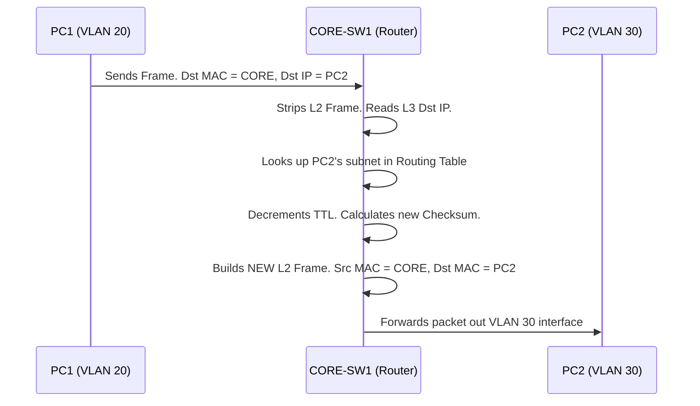

# 📄 `Routing Overview`

## 📑 Index

1. [What is Layer 3 Routing?](#1-what-is-layer-3-routing)
2. [Why do we need it? (The Problem it Solves)](#2-why-do-we-need-it-the-problem-it-solves)
3. [How it relates to the broader network](#3-how-it-relates-to-the-broader-network)
4. [Key Component 1 — The Routing Table (RIB)](#4-key-component-1--the-routing-table-rib)
5. [Key Component 2 — The Multilayer Switch / Router](#5-key-component-2--the-multilayer-switch--router)
6. [Key Component 3 — The IP Packet & TTL](#6-key-component-3--the-ip-packet--ttl)
7. [Safety & Security Features](#7-safety--security-features)
8. [Who created it / Standards](#8-who-created-it--standards)
9. [Types / Variations](#9-types--variations)
10. [Flow of Phases / How it Works](#10-flow-of-phases--how-it-works)
11. [States and Timers](#11-states-and-timers)
12. [Advanced / Extra Features](#12-advanced--extra-features)
13. [Configuration & Troubleshooting Workflow](#13-configuration--troubleshooting-workflow)

---

## 1. What is Layer 3 Routing?

- **Routing** is the process of moving data packets between **different networks or subnets** (e.g., from VLAN 20 to VLAN 30) using logical IP addresses rather than physical MAC addresses.
- It operates at the **Network Layer (Layer 3)** of the OSI model.
- **Analogy** ✈️: If Layer 2 switching is navigating the **local streets** of your own neighborhood, Layer 3 routing is the **airport control tower** that figures out how to fly you to an entirely different city.

## 2. Why do we need it? (The Problem it Solves)

- Layer 2 broadcasts and MAC addresses **cannot cross VLAN boundaries**. A PC in VLAN 20 is completely isolated from a PC in VLAN 30 at Layer 2.
- Routing solves:
  - **Inter-VLAN Communication** → Allows isolated broadcast domains to talk to each other.
  - **Path Selection** → Finds the best path to remote networks (like the Internet or a remote branch).
  - **Broadcast Containment** → Routers drop Layer 2 broadcasts, preventing network-wide broadcast storms.

## 3. How it relates to the broader network

- In your lab, routing happens on the **Collapsed Core** (`CORE-SW1` and `CORE-SW2`).
- These are **Multilayer Switches** — they perform Layer 2 switching for traffic *within* a VLAN, and Layer 3 routing for traffic crossing *between* VLANs (20, 30, 40).
- Without routing, your Data and Voice VLANs would be permanently cut off from one another.

## 4. Key Component 1 — The Routing Table (RIB)

- The **Routing Information Base (RIB)** is the router's map of the world. 
- It contains a list of known destination networks, the "next hop" IP address to reach them, and the exit interface.
- If a destination network is **not** in the routing table (and there is no default route), the router instantly **drops the packet**.

## 5. Key Component 2 — The Multilayer Switch / Router

- A traditional router has physical interfaces for each network. A **Multilayer Switch** (like your Core switches) uses virtual interfaces called **SVIs (Switch Virtual Interfaces)** to route between VLANs internally at wire-speed.
- It rewrites the Layer 2 Ethernet frame at every hop (changing the Source and Destination MAC) while keeping the Layer 3 IP Packet intact.

## 6. Key Component 3 — The IP Packet & TTL

- The Layer 3 Protocol Data Unit (PDU) is the **IP Packet**.
- It contains the **Source IP** and **Destination IP** (which never change end-to-end, unlike MAC addresses).
- It contains a **TTL (Time to Live)** field. Every time a router processes the packet, it subtracts 1 from the TTL. If TTL hits 0, the packet is dropped (preventing infinite Layer 3 routing loops).

## 7. Safety & Security Features

- **Access Control Lists (ACLs)** → The primary security tool at Layer 3. You can apply ACLs to your SVIs to allow VLAN 20 to talk to VLAN 30, but block VLAN 30 from talking to the Voice VLAN 40.
- **Route Filtering** → Prevents the router from learning or advertising unauthorized networks.
- **uRPF (Unicast Reverse Path Forwarding)** → Drops packets if the source IP address is spoofed.

## 8. Who created it / Standards

- The Internet Protocol (IPv4) was developed by DARPA and standardized by the **IETF (Internet Engineering Task Force)** in **RFC 791** (1981).
- Routing protocols (OSPF, BGP, etc.) have their own specific RFCs.

## 9. Types / Variations

| Routing Type | How it populates the Routing Table | Use Case |
|--------------|------------------------------------|----------|
| **Connected** | Automatically added when an interface (SVI) is given an IP and brought `up`. | Local VLANs (Your lab). |
| **Static** | Manually typed by the administrator. | Small networks, Default routes to the ISP. |
| **Dynamic** | Learned automatically via protocols (OSPF, EIGRP, BGP). | Large, changing networks. |

## 10. Flow of Phases / How it Works



## 11. States and Timers

- **ARP Cache Timer:** ~4 hours. The router must map the next-hop IP to a MAC address to build the new Layer 2 frame.
- **Routing Protocol Timers:** If using dynamic routing (like OSPF), Hello and Dead timers dictate how fast the router reacts to a path failure.

## 12. Advanced / Extra Features

- **CEF (Cisco Express Forwarding):** Modern Cisco switches do not use the CPU to route every packet. CEF builds a hardware-based **FIB (Forwarding Information Base)** and **Adjacency Table**, allowing routing to happen in the ASIC chip at millions of packets per second.
- **VRF (Virtual Routing and Forwarding):** Allows a single physical switch to maintain multiple, completely isolated routing tables (like VLANs, but for Layer 3).

---

## 13. Configuration & Troubleshooting Workflow

> ⚙️ **Note:** By default, Cisco Catalyst switches act as pure Layer 2 devices. You must explicitly tell them to act as a router.

### Phase 1: Port Selection & Preparation
- Target your Collapsed Core switches (`CORE-SW1` and `CORE-SW2`).
- Ensure the VLANs exist in the L2 database first.
```
CORE-SW1> enable
CORE-SW1# configure terminal
CORE-SW1(config)# vlan 20,30,40
CORE-SW1(config-vlan)# exit
```

### Phase 2: Base Configuration
- **Crucial Step:** Enable the routing engine globally.
- Create the SVIs (Connected Routes).
```
CORE-SW1(config)# ip routing
CORE-SW1(config)# interface vlan 20
CORE-SW1(config-if)# ip address 192.168.20.1 255.255.255.0
CORE-SW1(config-if)# no shutdown
CORE-SW1(config)# interface vlan 30
CORE-SW1(config-if)# ip address 192.168.30.1 255.255.255.0
CORE-SW1(config-if)# no shutdown
```

### Phase 3: Hardening & Security
- Apply a basic ACL to restrict traffic (e.g., prevent VLAN 30 from accessing the Voice VLAN 40).
```
CORE-SW1(config)# ip access-list extended BLOCK_VOICE
CORE-SW1(config-ext-nacl)# deny ip 192.168.30.0 0.0.0.255 192.168.40.0 0.0.0.255
CORE-SW1(config-ext-nacl)# permit ip any any
CORE-SW1(config-ext-nacl)# exit
CORE-SW1(config)# interface vlan 30
CORE-SW1(config-if)# ip access-group BLOCK_VOICE in
```

### Phase 4: Verification Flow
Run these `show` commands **in this order**:

```
CORE-SW1# show ip routing
CORE-SW1# show ip interface brief
CORE-SW1# show ip route
CORE-SW1# show ip cef
```

- **What to look for:**
  - `show ip routing` → Should confirm routing is enabled (if it throws an error, you forgot the `ip routing` command).
  - `show ip interface brief` → SVIs must be `up/up`.
  - `show ip route` → You must see the **"C" (Connected)** and **"L" (Local)** codes for your 192.168.20.0 and 30.0 networks.

### Phase 5: Advanced Debugging
- If inter-VLAN routing is failing:
```
CORE-SW1# show ip route 192.168.30.10
CORE-SW1# debug ip packet detail
CORE-SW1# show access-lists
```
- **Troubleshooting logic:**
  - **No "C" route in the table** → The SVI is `down/down`. A VLAN interface only goes `up` if the VLAN exists in the database AND at least one active port (or trunk) is carrying that VLAN.
  - **PC can ping the gateway, but not the other PC** → `ip routing` is disabled, or an ACL is blocking the traffic.
  - **Route exists, but ping fails** → Check the PC's network adapter. Does it have the correct Default Gateway configured? (A PC cannot reply to a different subnet if it doesn't know where its gateway is).
