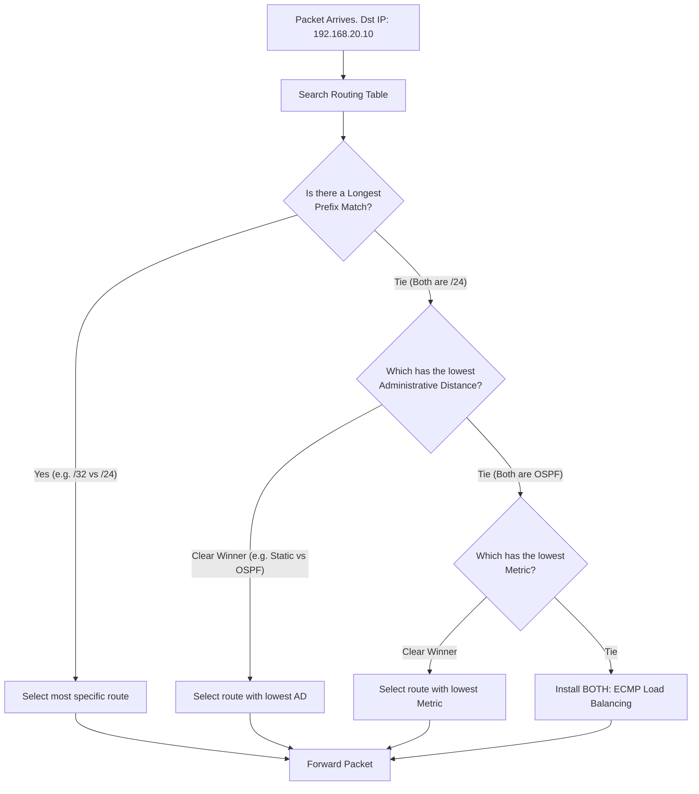

# `Routing Table Path Selection`

## Index

1. [What is Routing Table Path Selection?](#1-what-is-routing-table-path-selection)
2. [Why do we need it? (The Problem it Solves)](#2-why-do-we-need-it-the-problem-it-solves)
3. [How it relates to the broader network](#3-how-it-relates-to-the-broader-network)
4. [Key Component 1 — Longest Prefix Match (LPM)](#4-key-component-1--longest-prefix-match-lpm)
5. [Key Component 2 — Administrative Distance (AD)](#5-key-component-2--administrative-distance-ad)
6. [Key Component 3 — Metric](#6-key-component-3--metric)
7. [Safety & Security Features](#7-safety--security-features)
8. [Who created it / Standards](#8-who-created-it--standards)
9. [Types / Variations](#9-types--variations)
10. [Flow of Phases / How it Works](#10-flow-of-phases--how-it-works)
11. [States and Timers](#11-states-and-timers)
12. [Advanced / Extra Features](#12-advanced--extra-features)
13. [Configuration & Troubleshooting Workflow](#13-configuration--troubleshooting-workflow)

---

## 1. What is Routing Table Path Selection?

- **Path Selection** is the strict, three-step algorithmic hierarchy a router uses to determine the absolute best path to forward an IP packet when multiple overlapping or competing routes exist in its memory.
- The hierarchy is always: **1. Prefix Length $\rightarrow$ 2. Administrative Distance $\rightarrow$ 3. Metric**.
- **Analogy** 🗺️: Imagine asking for directions to "123 Main St, Springfield". 
  - **LPM:** You trust the map that points to the exact *street address* over the map that only points to the *state*.
  - **AD:** If two maps point to the exact street, you trust the *official city map* over a *napkin drawn by a stranger*.
  - **Metric:** If you have two official city maps, you take the route with the *fewest traffic lights*.

## 2. Why do we need it? (The Problem it Solves)

- Routers learn routes from multiple sources simultaneously (Directly Connected, Static Routes, OSPF, BGP). These sources often conflict.
- Solves:
  - **Conflict Resolution** → Prevents the router from freezing or dropping packets when given contradictory directions.
  - **Traffic Engineering** → Allows engineers to explicitly design primary and backup paths.
  - **Loop Prevention** → Ensures deterministic, predictable forwarding behavior across the entire network.

## 3. How it relates to the broader network

- In your lab, `CORE-SW1` and `CORE-SW2` are your Layer 3 brains. 
- They know about VLAN 20 (`192.168.20.0/24`) because it is directly connected. But if you add a default route (`0.0.0.0/0`) pointing to an ISP, path selection dictates that local VLAN traffic stays local, while unknown traffic rides the default route.

## 4. Key Component 1 — Longest Prefix Match (LPM)

- **The absolute, unbreakable #1 rule of routing.** 
- The router compares the packet's destination IP against the routing table and selects the route with the **most specific subnet mask** (the highest `/` number).
- **Example:** Packet destined for `192.168.20.50`.
  - Route A: `192.168.20.0/24` (Matches 24 bits)
  - Route B: `192.168.20.50/32` (Matches 32 bits) $\leftarrow$ **WINS instantly.**
- *Note:* AD and Metric are **ignored** if one route has a longer prefix match. 

## 5. Key Component 2 — Administrative Distance (AD)

- If (and *only* if) the Prefix Length is an **exact tie**, the router looks at the **Administrative Distance**.
- AD is a measure of **trustworthiness** of the routing source. **Lower is better.**

| Routing Source | Default AD | Trust Level |
|----------------|:---:|-------------|
| **Connected** | 0 | Absolute (Physical interface) |
| **Static Route** | 1 | Very High (Admin manually typed it) |
| **eBGP** | 20 | High (External internet paths) |
| **EIGRP** | 90 | Medium-High (Cisco internal) |
| **OSPF** | 110 | Medium (Standard internal) |

## 6. Key Component 3 — Metric

- If the Prefix Length **AND** the Administrative Distance are identical (e.g., two OSPF routes to the exact same `/24` subnet), the router looks at the **Metric**.
- Metric is the "cost" to reach the destination, calculated by the specific routing protocol. **Lower is better.**
  - *OSPF Metric:* Based on interface bandwidth.
  - *EIGRP Metric:* Based on bandwidth and delay.
  - *Static Route Metric:* Not applicable (handled via AD).

## 7. Safety & Security Features

- **The Null0 Route (Blackhole):** A security technique using LPM. You route malicious traffic (or unused IP space) to the `Null0` interface (a virtual trash can). Because it's a specific route, LPM forces the bad traffic into the trash before it hits the default route.
- **Floating Static Routes:** Configuring a static route with a high AD (e.g., 200) so it stays hidden in the background, only injecting itself into the routing table if the primary dynamic route fails.

## 8. Who created it / Standards

- **LPM** is an inherent property of IPv4/IPv6 routing (Classless Inter-Domain Routing - CIDR, RFC 1519).
- **Administrative Distance** is a **Cisco-proprietary** concept and numbering scale. Other vendors have similar concepts (e.g., Juniper calls it "Route Preference" and uses different default numbers).

## 9. Types / Variations

| Scenario | Outcome |
|----------|---------|
| **ECMP (Equal-Cost Multi-Path)** | If Prefix, AD, *and* Metric are all identical, the router installs *both* routes and load-balances traffic across them. |
| **PBR (Policy-Based Routing)** | An advanced feature that **overrides** the routing table entirely, routing packets based on Source IP or port numbers instead of Destination IP. |

## 10. Flow of Phases / How it Works



## 11. States and Timers

- **RIB Update Time:** Immediate. When a link goes down, connected routes are instantly flushed, and the router immediately falls back to the next best route (e.g., a floating static route).
- **CEF FIB Synchronization:** The control plane (RIB) programs the data plane (FIB) in milliseconds, ensuring no packets are dropped during path recalculation.

## 12. Advanced / Extra Features

- **VRF (Virtual Routing and Forwarding):** Creates completely separate routing tables on the same switch. Path selection happens independently within each VRF.
- **BGP Best Path Selection:** BGP has its own massive 13-step path selection algorithm (Weight, Local Pref, AS-Path, etc.) that it runs *before* submitting its best route to the global RIB for AD comparison.

---

## 13. Configuration & Troubleshooting Workflow

> ⚙️ **Note:** In this workflow, we will configure a primary static route and a backup "Floating" static route on `CORE-SW1` to simulate path selection via Administrative Distance.

### Phase 1: Port Selection & Preparation
- Assume `CORE-SW1` has two uplinks to an external ISP or upstream router: `GigabitEthernet1/1` (Primary, fast) and `GigabitEthernet1/2` (Backup, slow).
- Ensure routing is enabled.
```
CORE-SW1> enable
CORE-SW1# configure terminal
CORE-SW1(config)# ip routing
```

### Phase 2: Base Configuration
- Configure the Primary Default Route pointing out the fast link. By default, a static route has an AD of 1.
```
CORE-SW1(config)# ip route 0.0.0.0 0.0.0.0 10.1.1.1
```
- Configure the Backup (Floating) Static Route pointing out the slow link. We artificially raise the AD to `200`.
```
CORE-SW1(config)# ip route 0.0.0.0 0.0.0.0 10.2.2.2 200
```

### Phase 3: Hardening & Security
- Implement a **Null0 Blackhole route** using Longest Prefix Match. 
- *Scenario:* We want to route all traffic to the internet, EXCEPT traffic destined for a known malicious subnet (`198.51.100.0/24`). Because `/24` is more specific than `/0`, LPM will force it to the trash.
```
CORE-SW1(config)# ip route 198.51.100.0 255.255.255.0 Null0
```

### Phase 4: Verification Flow
Run these `show` commands **in this order**:

```
CORE-SW1# show ip route
CORE-SW1# show ip route 0.0.0.0
CORE-SW1# show ip route 198.51.100.5
```

- **What to look for:**
  - `show ip route` $\rightarrow$ You will see the `S* 0.0.0.0/0 [1/0] via 10.1.1.1` route. You will **NOT** see the backup route (AD 200) because the RIB only displays the active best path.
  - `show ip route 198.51.100.5` $\rightarrow$ The router will explicitly tell you it is matching the `/24` Null0 route due to LPM, dropping the packet instead of sending it to the default route.

### Phase 5: Advanced Debugging
- If traffic is taking the wrong path:
```
CORE-SW1# show ip route <destination_ip>
CORE-SW1# traceroute <destination_ip>
CORE-SW1# show ip cef <destination_ip>
```
- **Troubleshooting logic:**
  - **Traffic ignoring your static route** $\rightarrow$ Check LPM. Is there a more specific route (e.g., an OSPF `/26` route) in the table? The `/26` OSPF route (AD 110) will **beat** a `/24` Static route (AD 1) every single time because **Prefix Length beats AD**.
  - **Floating route not taking over when primary fails** $\rightarrow$ The primary interface might still be physically "up/up" even though the ISP is dead. The router won't remove the primary route unless the interface drops or you use an **IP SLA tracking object** to ping the next hop.
  - **Load balancing unexpectedly** $\rightarrow$ You accidentally configured two routes to the exact same subnet with the exact same AD and Metric. The router is performing ECMP.
