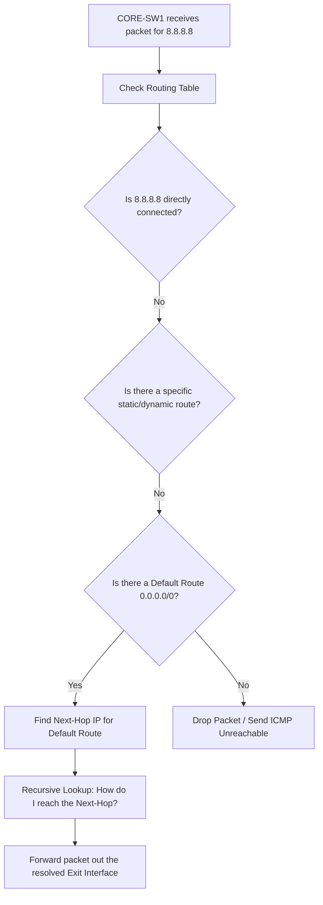

# `Static Routing`

## Index

1. [What is Static Routing?](#1-what-is-static-routing)
2. [Why do we need it? (The Problem it Solves)](#2-why-do-we-need-it-the-problem-it-solves)
3. [How it relates to the broader network](#3-how-it-relates-to-the-broader-network)
4. [Key Component 1 — The Destination Network](#4-key-component-1--the-destination-network)
5. [Key Component 2 — Next-Hop IP vs. Exit Interface](#5-key-component-2--next-hop-ip-vs-exit-interface)
6. [Key Component 3 — Administrative Distance (AD)](#6-key-component-3--administrative-distance-ad)
7. [Safety & Security Features](#7-safety--security-features)
8. [Who created it / Standards](#8-who-created-it--standards)
9. [Types / Variations](#9-types--variations)
10. [Flow of Phases / How it Works](#10-flow-of-phases--how-it-works)
11. [States and Timers](#11-states-and-timers)
12. [Advanced / Extra Features](#12-advanced--extra-features)
13. [Configuration & Troubleshooting Workflow](#13-configuration--troubleshooting-workflow)

---

## 1. What is Static Routing?

- **Static Routing** is the process where a network administrator manually types a route into the router's configuration, explicitly telling it exactly how to reach a specific destination network.
- It does not rely on routing protocols (like OSPF or BGP) to learn paths automatically.
- **Analogy** 🗺️: Instead of using a live GPS that recalculates based on traffic (Dynamic Routing), Static Routing is like **writing step-by-step driving directions on a piece of paper**. It is 100% predictable, but if a bridge is out, you won't automatically know a detour.

## 2. Why do we need it? (The Problem it Solves)

- Dynamic routing protocols require CPU, memory, and bandwidth to exchange constant updates. Static routes require zero overhead.
- Solves:
  - **Simplicity & Predictability** → Traffic always takes the exact path you specify.
  - **Security** → No routing protocol chatter is sent out the interface, preventing attackers from injecting fake routes.
  - **Gateway of Last Resort** → The standard way to point all unknown traffic toward an ISP (the Internet).

## 3. How it relates to the broader network

- In your lab, `CORE-SW1` and `CORE-SW2` handle inter-VLAN routing automatically because VLANs 20, 30, and 40 are *directly connected*.
- However, if `PC1` tries to ping `8.8.8.8` (the Internet), the Core switches won't know where that is. You must configure a **Static Default Route** on `CORE-SW1/2` pointing to an upstream WAN router or firewall.

## 4. Key Component 1 — The Destination Network

- The first part of a static route is the target. It consists of the **Network IP** and the **Subnet Mask**.
- You can route to an entire subnet (e.g., `10.50.0.0 255.255.0.0`), a single specific host (e.g., `10.50.1.100 255.255.255.255`), or absolutely everywhere (e.g., `0.0.0.0 0.0.0.0`).

## 5. Key Component 2 — Next-Hop IP vs. Exit Interface

- The second part of the route tells the router *how* to get there. You have two choices:
  - **Next-Hop IP:** The IP address of the neighboring router (e.g., `192.168.100.2`). This requires a **recursive lookup** (the router must check its table again to find out which interface connects to `192.168.100.2`).
  - **Exit Interface:** The physical port to push the packet out of (e.g., `GigabitEthernet1/1`). 
- *Best Practice:* On Ethernet networks, always use the Next-Hop IP (or both). Using only the Exit Interface on Ethernet forces the router to send ARP requests for every single destination IP on the internet, which will crash the router.

## 6. Key Component 3 — Administrative Distance (AD)

- By default, a static route has an **Administrative Distance of 1**, making it the most trusted route source aside from a directly connected interface (AD 0).
- You can manually change this number at the end of the command to create backup routes.

## 7. Safety & Security Features

- **Null0 Blackholing:** Routing malicious IPs or DDoS traffic to the `Null0` interface silently drops the packets without sending ICMP unreachable messages back to the attacker.
- **No Protocol Spoofing:** Because static routes don't listen to neighbor updates, an attacker cannot hijack traffic by advertising fake OSPF/EIGRP routes.

## 8. Who created it / Standards

- Static routing is a fundamental, vendor-neutral mechanism inherent to the **Internet Protocol (IPv4/IPv6)** defined by the IETF.

## 9. Types / Variations

| Type | Syntax Example | Use Case |
|------|----------------|----------|
| **Standard Static** | `ip route 10.1.1.0 255.255.255.0 192.168.1.2` | Reaching a specific remote branch. |
| **Default Route** | `ip route 0.0.0.0 0.0.0.0 203.0.113.1` | "Catch-all" for internet traffic. |
| **Floating Static** | `ip route 10.1.1.0 255.255.255.0 192.168.2.2 200` | Backup route (AD 200) if primary fails. |
| **Summary Route** | `ip route 172.16.0.0 255.255.0.0 10.0.0.1` | Grouping multiple smaller subnets into one route to save memory. |

## 10. Flow of Phases / How it Works



## 11. States and Timers

- **No Timers:** Static routes do not send hello packets or expire.
- **State Dependency:** A static route is only active in the routing table if the interface used to reach the Next-Hop IP is in an **Up/Up** state. If the interface goes down, the static route is instantly removed from the RIB.

## 12. Advanced / Extra Features

- **IP SLA Tracking:** A massive upgrade for static routes. Normally, a static route stays active as long as the local interface is up, even if the ISP router 3 hops away is dead. IP SLA continuously pings a remote IP; if the ping fails, it dynamically removes the static route, allowing a floating backup route to take over.

---

## 13. Configuration & Troubleshooting Workflow

> ⚙️ **Note:** In this workflow, we will configure `CORE-SW1` to route internet-bound traffic to a simulated upstream ISP Firewall.

### Phase 1: Port Selection & Preparation
- Identify the uplink port on `CORE-SW1` connecting to the ISP/Firewall (e.g., `GigabitEthernet1/1`).
- Configure the point-to-point IP address connecting your core to the firewall.
```
CORE-SW1> enable
CORE-SW1# configure terminal
CORE-SW1(config)# interface GigabitEthernet1/1
CORE-SW1(config-if)# description ** UPLINK TO ISP FIREWALL **
CORE-SW1(config-if)# no switchport
CORE-SW1(config-if)# ip address 203.0.113.2 255.255.255.252
CORE-SW1(config-if)# no shutdown
CORE-SW1(config-if)# exit
```

### Phase 2: Base Configuration
- Configure the **Static Default Route** pointing to the ISP Firewall's IP (`203.0.113.1`).
```
CORE-SW1(config)# ip route 0.0.0.0 0.0.0.0 203.0.113.1
```
- Configure a specific static route to a remote branch office (e.g., `10.50.0.0/16`) via a private WAN link on `GigabitEthernet1/2` (`10.255.255.2`).
```
CORE-SW1(config)# ip route 10.50.0.0 255.255.0.0 10.255.255.2
```

### Phase 3: Hardening & Security
- Add a **Floating Static Route** as a backup for the branch office over the internet VPN, assigning it an AD of `200`.
- Add a **Null0 route** to drop traffic destined for private IPs that shouldn't be routed to the internet (RFC 1918 leak prevention).
```
CORE-SW1(config)# ip route 10.50.0.0 255.255.0.0 203.0.113.1 200
CORE-SW1(config)# ip route 10.0.0.0 255.0.0.0 Null0
```

### Phase 4: Verification Flow
Run these `show` commands **in this order**:

```
CORE-SW1# show ip route static
CORE-SW1# show ip route 0.0.0.0
CORE-SW1# show ip route 10.50.1.50
CORE-SW1# ping 203.0.113.1
```

- **What to look for:**
  - `show ip route static` → Look for the `S*` (Static Default) route. You should see `10.50.0.0/16` pointing to the primary WAN. You will **not** see the floating backup route (AD 200) yet.
  - `show ip route 10.50.1.50` → Confirms that the router knows exactly which path to take for a specific host in the branch office.

### Phase 5: Advanced Debugging
- If traffic is not reaching the destination:
```
CORE-SW1# show ip interface brief
CORE-SW1# show ip route
CORE-SW1# debug ip packet detail
```
- **Troubleshooting logic:**
  - **Static route is missing from the routing table** → The interface connecting to the Next-Hop IP is `down/down`. A static route will hide itself if it cannot resolve the next hop.
  - **Configured Exit Interface instead of Next-Hop on Ethernet** → If you typed `ip route 0.0.0.0 0.0.0.0 Gi1/1`, the router will ARP for every internet IP. Change it to use the Next-Hop IP instead.
  - **Traffic taking the wrong path** → Check for a Longest Prefix Match (LPM) conflict. If a dynamic protocol learned a `/24` route, it will override your `/16` static route.
  - **Next-Hop is unreachable** → Ping the Next-Hop IP directly (`ping 203.0.113.1`). If the Core can't reach the next router, it can't forward traffic through it.
