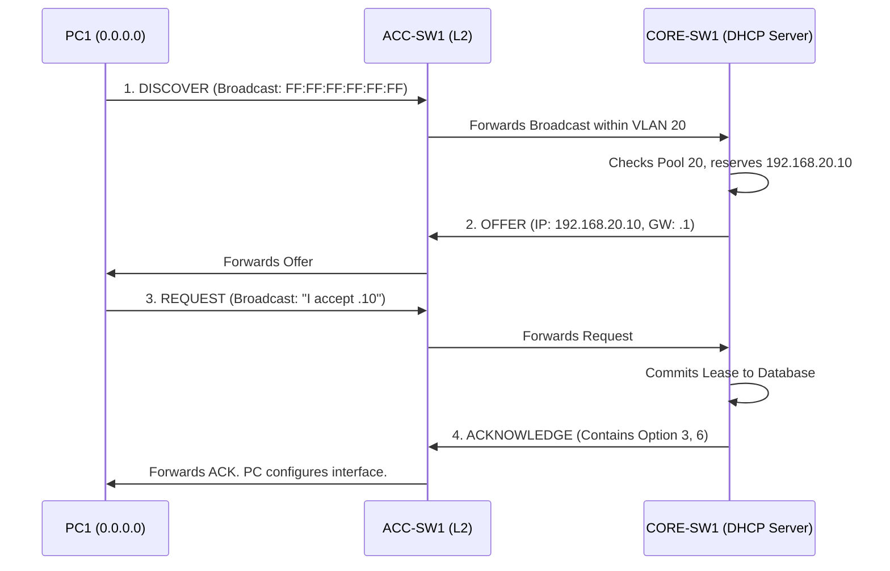

# `DHCP`

## Index

1. [What is DHCP?](#1-what-is-dhcp)
2. [Why do we need it? (The Problem it Solves)](#2-why-do-we-need-it-the-problem-it-solves)
3. [How it relates to the broader network](#3-how-it-relates-to-the-broader-network)
4. [Key Component 1 — The DORA Process](#4-key-component-1--the-dora-process)
5. [Key Component 2 — DHCP Relay (IP Helper)](#5-key-component-2--dhcp-relay-ip-helper)
6. [Key Component 3 — DHCP Options](#6-key-component-3--dhcp-options)
7. [Safety & Security Features](#7-safety--security-features)
8. [Who created it / Standards](#8-who-created-it--standards)
9. [Types / Variations](#9-types--variations)
10. [Flow of Phases / How it Works](#10-flow-of-phases--how-it-works)
11. [States and Timers](#11-states-and-timers)
12. [Advanced / Extra Features](#12-advanced--extra-features)
13. [Configuration & Troubleshooting Workflow](#13-configuration--troubleshooting-workflow)

---

## 1. What is DHCP?

- **DHCP (Dynamic Host Configuration Protocol)** is a client/server protocol that automatically assigns IP addresses, subnet masks, default gateways, and other network parameters (like DNS servers) to endpoints.
- It operates at the Application Layer (Layer 7) using **UDP ports 67 (Server) and 68 (Client)**.
- **Analogy** 🏨: Think of a **hotel front desk**. Instead of guests picking a random room and hoping it's empty (Static IP conflict), they go to the desk (DHCP Server). The desk checks the registry, hands them a room key with an expiration date (Lease), and gives them a map to the exit (Default Gateway).

## 2. Why do we need it? (The Problem it Solves)

- Manually configuring IP addresses on hundreds of PCs, phones, and printers is unscalable, error-prone, and leads to IP conflicts.
- Solves:
  - **Mobility** → Laptops moving between VLANs automatically get the correct IP for their new subnet.
  - **IP Conservation** → Addresses are leased; when a device leaves, the IP goes back into the pool to be reused.
  - **Centralized Management** → Changing a DNS server IP is done once on the server, not 500 times on individual PCs.

## 3. How it relates to the broader network

- In your lab, `CORE-SW1` will act as the DHCP Server for your Data VLANs (20, 30) and Voice VLAN (40).
- The Access switches (`ACC-SW1-4`) will act as Layer 2 transit, but they must implement **DHCP Snooping** to protect the process from rogue servers.
- Without DHCP, your IP Phones in VLAN 40 will never boot up, as they rely on DHCP to find the Call Manager.

## 4. Key Component 1 — The DORA Process

The four-step broadcast/unicast handshake used to obtain an IP:
- **Discover (Broadcast):** Client shouts, "Is there a DHCP server out there?"
- **Offer (Unicast/Broadcast):** Server replies, "Here is an IP you can use."
- **Request (Broadcast):** Client shouts, "I accept this IP!" (Broadcasted so other listening servers know their offers were rejected).
- **Acknowledge (Unicast/Broadcast):** Server confirms, "It's yours. Here is the lease time and DNS info."

## 5. Key Component 2 — DHCP Relay (IP Helper)

- DHCP Discover messages are **Layer 2 Broadcasts** (`255.255.255.255`). Routers **do not forward broadcasts**.
- If the DHCP server is on a different subnet than the client, the local router (Default Gateway) must use the `ip helper-address` command.
- This intercepts the broadcast, converts it to a Unicast packet, and forwards it directly to the centralized DHCP server. *(Note: In your lab, CORE-SW1 is both the gateway and the server, so IP Helper is not strictly required, but is a vital enterprise concept).*

## 6. Key Component 3 — DHCP Options

- DHCP provides more than just an IP. "Options" are extra pieces of data appended to the Acknowledge packet.
- **Option 3:** Default Gateway (Router).
- **Option 6:** DNS Server.
- **Option 150:** TFTP Server / Cisco Call Manager IP. **(Mandatory for your Voice VLAN 40)** so phones can download their firmware and dial plans.

## 7. Safety & Security Features

- **DHCP Snooping:** A Layer 2 security feature on access switches that blocks DHCP Offers from untrusted ports (preventing rogue DHCP servers from hijacking traffic).
- **DHCP Starvation Attacks:** An attacker spams thousands of fake MAC addresses to exhaust the DHCP pool. Mitigated by **Port Security** limiting MACs per port.
- **Option 82:** DHCP Snooping inserts the physical switch port ID into the DHCP request, allowing the server to assign IPs based on physical location.

## 8. Who created it / Standards

- Defined by the **IETF** in **RFC 2131** (IPv4) and **RFC 8415** (IPv6).
- Evolved from the older BOOTP (Bootstrap Protocol).

## 9. Types / Variations

| Type | Description |
|------|-------------|
| **Stateful DHCPv4/v6** | The server tracks every leased IP and MAC address in a binding database. |
| **Stateless DHCPv6** | The router gives the client the prefix (SLAAC), and DHCPv6 only hands out DNS info (no IP tracking). |
| **DHCP Relay** | Forwarding agent for remote subnets. |

## 10. Flow of Phases / How it Works

> *Opinion on Visuals: For dynamic protocol flows like the DHCP DORA process, Mermaid.js sequence diagrams are vastly superior to static images or ASCII art. They render natively in Markdown, scale perfectly across devices, and are easily version-controlled, whereas images go stale and ASCII art breaks on mobile screens.*



## 11. States and Timers

| Timer | Value | Description |
|-------|-------|-------------|
| **Lease Time** | Configurable (e.g., 8 days) | Total duration the client owns the IP. |
| **T1 (Renewal)** | 50% of Lease | Client unicasts the server asking to renew the lease. |
| **T2 (Rebinding)** | 87.5% of Lease | If original server is dead, client broadcasts asking *any* server to renew it. |
| **Conflict Detection** | Ping | Server pings the IP before offering it to ensure it isn't statically assigned elsewhere. |

## 12. Advanced / Extra Features

- **DHCP Failover:** Two Windows/Linux DHCP servers sync their leases. If one dies, the other takes over without IP conflicts.
- **Static Bindings (Reservations):** Forcing the DHCP server to always give the exact same IP to a specific MAC address (useful for printers).

---

## 13. Configuration & Troubleshooting Workflow

> ⚙️ **Note:** This workflow configures `CORE-SW1` as the DHCP server for your Data and Voice VLANs, and secures it using DHCP Snooping on `ACC-SW1`.

### Phase 1: Port Selection & Preparation
- DHCP requires the SVIs to be `up/up` so the server knows which pool belongs to which interface.
- Exclude the Default Gateway IPs and any static IPs from the pool *before* creating the pools.
```
CORE-SW1> enable
CORE-SW1# configure terminal
! Exclude the SVIs and first 9 IPs for static infrastructure
CORE-SW1(config)# ip dhcp excluded-address 192.168.20.1 192.168.20.9
CORE-SW1(config)# ip dhcp excluded-address 192.168.30.1 192.168.30.9
CORE-SW1(config)# ip dhcp excluded-address 192.168.40.1 192.168.40.9
```

### Phase 2: Base Configuration
- Create the DHCP pools for Data VLAN 20 and Voice VLAN 40.
```
! Data Pool
CORE-SW1(config)# ip dhcp pool DATA_VLAN20
CORE-SW1(dhcp-config)# network 192.168.20.0 255.255.255.0
CORE-SW1(dhcp-config)# default-router 192.168.20.1
CORE-SW1(dhcp-config)# dns-server 8.8.8.8
CORE-SW1(dhcp-config)# lease 7
CORE-SW1(dhcp-config)# exit

! Voice Pool (Requires Option 150)
CORE-SW1(config)# ip dhcp pool VOICE_VLAN40
CORE-SW1(dhcp-config)# network 192.168.40.0 255.255.255.0
CORE-SW1(dhcp-config)# default-router 192.168.40.1
CORE-SW1(dhcp-config)# option 150 ip 192.168.40.5
CORE-SW1(dhcp-config)# exit
```

### Phase 3: Hardening & Security
- Protect the network from rogue DHCP servers by configuring DHCP Snooping on the Access switch.
```
! --- On ACC-SW1 ---
ACC-SW1(config)# ip dhcp snooping
ACC-SW1(config)# ip dhcp snooping vlan 20,30,40
! Trust the uplink to the Core (where the real DHCP server lives)
ACC-SW1(config)# interface Port-channel1
ACC-SW1(config-if)# ip dhcp snooping trust
ACC-SW1(config-if)# exit
! Optional: Limit DHCP packets on edge ports to prevent starvation attacks
ACC-SW1(config)# interface range FastEthernet0/1 - 24
ACC-SW1(config-if-range)# ip dhcp snooping limit rate 10
```

### Phase 4: Verification Flow
Run these `show` commands **in this order**:

```
CORE-SW1# show ip dhcp binding
CORE-SW1# show ip dhcp pool
ACC-SW1# show ip dhcp snooping
ACC-SW1# show ip dhcp snooping binding
```

- **What to look for:**
  - `show ip dhcp binding` → Lists the exact IP assigned to PC1's MAC address and the lease expiration.
  - `show ip dhcp pool` → Shows total addresses, leased addresses, and excluded addresses.
  - `show ip dhcp snooping` → Confirms Snooping is active on VLANs 20/30/40 and lists the trusted ports (your uplinks).

### Phase 5: Advanced Debugging
- If PCs are getting `169.254.x.x` (APIPA) addresses instead of DHCP:
```
CORE-SW1# debug ip dhcp server packet
CORE-SW1# show ip interface brief
ACC-SW1# show interfaces status err-disabled
```
- **Troubleshooting logic:**
  - **SVI is down** → If `Vlan20` is down, the DHCP server will not hand out IPs for the `192.168.20.0` pool. Fix the L2 VLAN.
  - **PortFast is missing** → If `spanning-tree portfast` is not on the PC's switchport, the port takes 30 seconds to forward. The PC's DHCP request times out before the port comes up.
  - **DHCP Snooping blocking traffic** → If you forgot `ip dhcp snooping trust` on the uplink, the access switch will drop the DHCP Offers coming from the Core.
  - **Pool Exhaustion** → Check `show ip dhcp pool`. If all IPs are leased, check for a DHCP starvation attack or lower the lease time.
