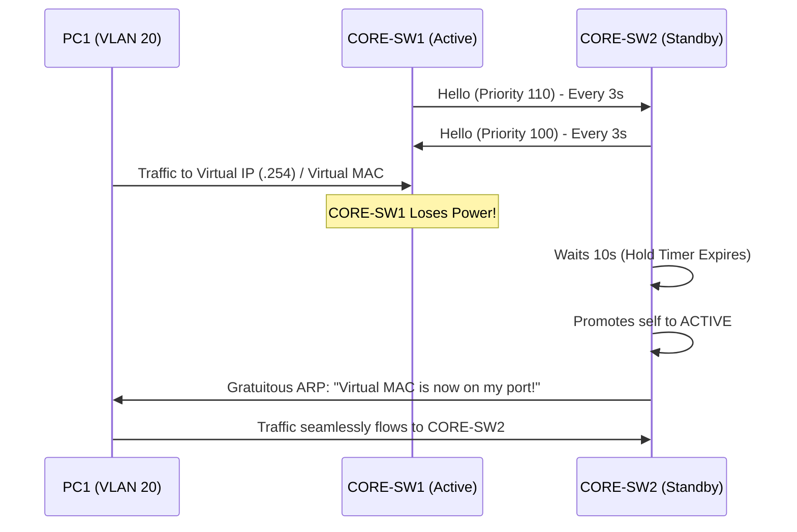

# `HSRP and VRRP`

## Index

1. [What are HSRP and VRRP?](#1-what-are-hsrp-and-vrrp)
2. [Why do we need it? (The Problem it Solves)](#2-why-do-we-need-it-the-problem-it-solves)
3. [How it relates to the broader network](#3-how-it-relates-to-the-broader-network)
4. [Key Component 1 — The Virtual IP and MAC](#4-key-component-1--the-virtual-ip-and-mac)
5. [Key Component 2 — Active and Standby Roles](#5-key-component-2--active-and-standby-roles)
6. [Key Component 3 — Preemption & Interface Tracking](#6-key-component-3--preemption--interface-tracking)
7. [Safety & Security Features](#7-safety--security-features)
8. [Who created it / Standards](#8-who-created-it--standards)
9. [Types / Variations](#9-types--variations)
10. [Flow of Phases / How it Works](#10-flow-of-phases--how-it-works)
11. [States and Timers](#11-states-and-timers)
12. [Advanced / Extra Features](#12-advanced--extra-features)
13. [Configuration & Troubleshooting Workflow](#13-configuration--troubleshooting-workflow)

---

## 1. What are HSRP and VRRP?

- **HSRP (Hot** and **VRRP (Virtual Router Redundancy Protocol)** are First Hop Redundancy Protocols (FHRPs).
- They allow two or more physical Layer Standby Router Protocol) 3 switches/routers to share a single **Virtual IP Address** and **Virtual MAC Address**, presenting themselves as a single default gateway to end hosts.
- **Analogy** 🎭: Think of a **Broadway play with a lead actor and an understudy**. The audience (the PCs) only knows the character's name (the Virtual IP). If the lead actor (Active Router) suddenly gets sick and falls off the stage, the understudy (Standby Router) instantly steps into the spotlight wearing the exact same costume (Virtual MAC). The audience barely notices the swap.

## 2. Why do we need it? (The Problem it Solves)

- End hosts (PCs, IP Phones) are typically configured with a single, static Default Gateway IP.
- If the physical switch holding that IP dies, the PCs lose all off-subnet communication, even if a secondary physical switch is perfectly healthy and ready to route.
- Solves:
  - **Single Point of Failure** → Decouples the default gateway IP from physical hardware.
  - **Seamless Failover** → Failover happens in seconds without requiring DHCP updates or manual PC reconfigurations.

## 3. How it relates to the broader network

- In your lab, `CORE-SW1` and `CORE-SW2` both have SVIs for VLAN 20, 30, and 40. 
- Without HSRP, half your PCs point to CORE-SW1 (`.1`) and half point to CORE-SW2 (`.2`). If CORE-SW1 dies, half the network goes down.
- With HSRP, both cores share a Virtual IP (e.g., `.254`). All PCs point to `.254`. If CORE-SW1 dies, CORE-SW2 assumes the `.254` IP instantly.

## 4. Key Component 1 — The Virtual IP and MAC

- The FHRP generates a virtual MAC address so that when a PC sends an ARP request for the Virtual IP, the Active router replies with the Virtual MAC.
- **HSRPv1 MAC format:** `0000.0c07.acXX` (where `XX` is the HSRP group number in hex).
- When a failover occurs, the new Active router sends a Gratuitous ARP (GARP) to the access switches, updating their CAM tables to point the Virtual MAC down the new physical path.

## 5. Key Component 2 — Active and Standby Roles

- **Active (Master in VRRP):** The router currently answering ARP requests and routing packets for the Virtual IP.
- **Standby (Backup in VRRP):** The router silently listening to Hellos. If Hellos stop, it promotes itself to Active.
- Election is based on **Priority** (Default is 100. Highest wins). Tiebreaker is the highest physical IP address.

## 6. Key Component 3 — Preemption & Interface Tracking

- **Preemption:** By default, if a failed Active router recovers, it does *not* take its job back (to prevent flapping). Enabling `preempt` forces the router with the highest priority to always seize the Active role.
- **Interface Tracking:** What if `CORE-SW1` is healthy, but its uplink to the ISP dies? It shouldn't be the Active gateway anymore! Tracking monitors the uplink; if it drops, HSRP dynamically lowers CORE-SW1's priority, forcing CORE-SW2 to take over.

## 7. Safety & Security Features

- **Authentication:** Both HSRP and VRRP support plaintext and MD5 authentication. This prevents a rogue switch plugged into the network from advertising a Priority of 255 and hijacking the default gateway (a devastating Man-in-the-Middle attack).
- **FHRP filtering:** You can use ACLs to restrict which IPs are allowed to participate in the HSRP group.

## 8. Who created it / Standards

- **HSRP:** Cisco proprietary (RFC 2281 - informational only). The default on Catalyst switches.
- **VRRP:** IEEE Open Standard (RFC 3768). Used in multi-vendor environments (e.g., Cisco peering with Juniper).

## 9. Types / Variations

| Protocol | Standard | Virtual MAC | Active/Standby Terms | Load Balancing |
|----------|----------|-------------|----------------------|----------------|
| **HSRPv1** | Cisco | `0000.0c07.acXX` | Active / Standby | Per-VLAN only |
| **HSRPv2** | Cisco | `0000.0C9F.FXXX` | Active / Standby | Per-VLAN only (IPv6 support) |
| **VRRP** | IETF | `0000.5e00.01XX` | Master / Backup | Per-VLAN only |
| **GLBP** | Cisco | `0007.b400.XXYY` | AVG / AVF | **True Load Balancing** (Round-robin ARP) |

## 10. Flow of Phases / How it Works

> *Opinion on Visuals: For state-machine transitions and failover timings, Mermaid.js sequence diagrams are best. They clearly illustrate the exact moment the Standby realizes the Active is dead and takes over the Virtual MAC.*



## 11. States and Timers

| State / Timer | Description |
|---------------|-------------|
| **Init** | HSRP is not running yet (interface is down). |
| **Listen** | Router knows the Virtual IP but is neither Active nor Standby. |
| **Speak** | Router is sending Hellos and participating in the election. |
| **Standby / Active** | Final operational states. |
| **Hello Timer** | 3 seconds (Default). |
| **Hold Timer** | 10 seconds (Default). Time before Standby assumes Active is dead. |

## 12. Advanced / Extra Features

- **HSRP & STP Alignment:** ⚠️ **CRITICAL DESIGN RULE:** The Active HSRP router MUST be the STP Root Bridge for that VLAN. If `CORE-SW1` is the STP Root, but `CORE-SW2` is the HSRP Active, traffic from the Access switches will cross the inter-core link unnecessarily, causing suboptimal routing.
- **msec Timers:** You can tune HSRP timers to milliseconds (e.g., `standby 1 timers msec 200 msec 750`) for sub-second failover, though BFD (Bidirectional Forwarding Detection) is preferred in modern networks.

---

## 13. Configuration & Troubleshooting Workflow

> ⚙️ **Note:** We will configure HSRP for VLAN 20. `CORE-SW1` will be Active (Priority 110) and `CORE-SW2` will be Standby (Priority 100). We will use `.254` as the Virtual IP.

### Phase 1: Port Selection & Preparation
- Target the SVIs on both Core switches. Ensure they have their physical IPs configured first.
```
! On CORE-SW1
CORE-SW1> enable
CORE-SW1# configure terminal
CORE-SW1(config)# interface vlan 20
CORE-SW1(config-if)# ip address 192.168.20.1 255.255.255.0

! On CORE-SW2
CORE-SW2> enable
CORE-SW2# configure terminal
CORE-SW2(config)# interface vlan 20
CORE-SW2(config-if)# ip address 192.168.20.2 255.255.255.0
```

### Phase 2: Base Configuration
- Configure the HSRP group, Virtual IP, Priority, and Preemption.
```
! On CORE-SW1 (The intended Active)
CORE-SW1(config-if)# standby 20 ip 192.168.20.254
CORE-SW1(config-if)# standby 20 priority 110
CORE-SW1(config-if)# standby 20 preempt

! On CORE-SW2 (The intended Standby)
CORE-SW2(config-if)# standby 20 ip 192.168.20.254
CORE-SW2(config-if)# standby 20 priority 100
CORE-SW2(config-if)# standby 20 preempt
```

### Phase 3: Hardening & Security
- Add MD5 authentication to prevent rogue gateway hijacking, and add interface tracking so `CORE-SW1` yields the Active role if it loses its internet uplink (`GigabitEthernet1/1`).
```
! On CORE-SW1
CORE-SW1(config-if)# standby 20 authentication md5 key-string CiscoHSRP!
! Track uplink. If Gi1/1 goes down, decrement priority by 20 (110 - 20 = 90).
! 90 is less than CORE-SW2's 100, forcing a failover.
CORE-SW1(config-if)# standby 20 track GigabitEthernet1/1 decrement 20

! On CORE-SW2
CORE-SW2(config-if)# standby 20 authentication md5 key-string CiscoHSRP!
```

### Phase 4: Verification Flow
Run these `show` commands **in this order**:

```
CORE-SW1# show standby brief
CORE-SW1# show standby
CORE-SW1# show ip arp
```

- **What to look for:**
  - `show standby brief` → Extremely useful. Shows Interface, Group, Priority, State (Active/Standby), Active IP, Standby IP, and Virtual IP.
  - `CORE-SW1` should show State: **Active**. `CORE-SW2` should show State: **Standby**.
  - `show standby` → Verifies preemption is enabled, authentication is active, and interface tracking is applied.

### Phase 5: Advanced Debugging
- If both switches think they are "Active" (Split-Brain scenario):
```
CORE-SW1# show standby brief
CORE-SW1# debug standby events
CORE-SW1# show interfaces trunk
```
- **Troubleshooting logic:**
  - **Both switches are Active** → This is a classic "Split-Brain." They cannot hear each other's multicast Hellos (`224.0.0.2`). Check the L2 trunk between the cores; if VLAN 20 is not allowed on the trunk, they cannot see each other.
  - **Switch won't take over after recovering** → You forgot the `standby 20 preempt` command. The recovered switch will stay Standby forever even if its priority is higher.
  - **Constant Flapping** → Timers are too aggressive, or STP is constantly recalculating and blocking the transit link. Ensure HSRP Active aligns with the STP Root Bridge!
  - **Tracking not working** → Ensure the tracked interface is actually going `down/down`. If it's connected to an unmanaged switch that stays powered on, the port stays up, and tracking never triggers. Use IP SLA tracking instead.
