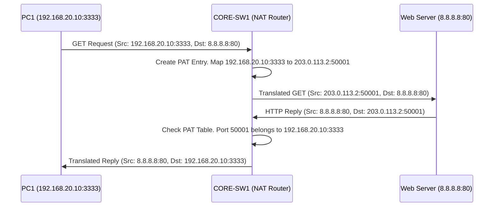

# `NAT`

## Index

1. [What is NAT?](#1-what-is-nat)
2. [Why do we need it? (The Problem it Solves)](#2-why-do-we-need-it-the-problem-it-solves)
3. [How it relates to the broader network](#3-how-it-relates-to-the-broader-network)
4. [Key Component 1 — Inside vs. Outside Terminology](#4-key-component-1--inside-vs-outside-terminology)
5. [Key Component 2 — Static vs. Dynamic NAT](#5-key-component-2--static-vs-dynamic-nat)
6. [Key Component 3 — PAT (NAT Overload)](#6-key-component-3--pat-nat-overload)
7. [Safety & Security Features](#7-safety--security-features)
8. [Who created it / Standards](#8-who-created-it--standards)
9. [Types / Variations](#9-types--variations)
10. [Flow of Phases / How it Works](#10-flow-of-phases--how-it-works)
11. [States and Timers](#11-states-and-timers)
12. [Advanced / Extra Features](#12-advanced--extra-features)
13. [Configuration & Troubleshooting Workflow](#13-configuration--troubleshooting-workflow)

---

## 1. What is NAT?

- **NAT (Network Address Translation)** is a process where a network device (usually a router or firewall) modifies the IP information in the packet headers while in transit, mapping private, non-routable IP addresses to public, internet-routable IP addresses.
- **Analogy** 🏢: Think of a **corporate office phone system**. Your desk phone has an internal extension (e.g., `x204` = Private IP). You can call other desks directly. But if you call a customer outside, the PBX system (the NAT Router) changes your Caller ID so it looks like the call is coming from the **main company phone number** (Public IP). When the customer calls back, the receptionist routes it back to your specific extension.

## 2. Why do we need it? (The Problem it Solves)

- **IPv4 Exhaustion:** There are only ~4.3 billion IPv4 addresses, which ran out years ago. We cannot give every PC and smartphone in the world a unique public IP.
- Solves:
  - **Address Conservation** → Allows an entire enterprise of 10,000 PCs to share a single public IP address.
  - **Routability** → RFC 1918 private IPs (`10.x.x.x`, `192.168.x.x`) are dropped by internet routers. NAT makes them routable.
  - **Topology Hiding** → Obfuscates your internal network structure from the outside world.

## 3. How it relates to the broader network

- In your lab, `CORE-SW1` (or a dedicated edge firewall) sits at the boundary between your internal network and the ISP.
- Your PCs in VLAN 20 (`192.168.20.10`) will send traffic to the Core. The Core will translate that source IP to its public WAN IP (e.g., `203.0.113.2`) before sending it to the internet.

## 4. Key Component 1 — Inside vs. Outside Terminology

Cisco NAT terminology can be confusing. It is based on *where* the device is, and *how* it is seen:
- **Inside Local:** The actual private IP of your PC (e.g., `192.168.20.10`).
- **Inside Global:** The public IP your PC is translated into when it hits the internet (e.g., `203.0.113.2`).
- **Outside Global:** The actual public IP of the destination web server (e.g., `8.8.8.8`).
- **Outside Local:** How the destination appears to your internal network (usually identical to Outside Global, rarely changed).

## 5. Key Component 2 — Static vs. Dynamic NAT

- **Static NAT:** A strict 1-to-1 mapping. `192.168.20.50` always translates to `203.0.113.5`. Used for hosting internal web servers that the public needs to reach.
- **Dynamic NAT:** A Many-to-Many mapping. You have a pool of 10 public IPs. The first 10 internal PCs to browse the web get one. The 11th PC is denied access until someone else's session times out. (Rarely used today).

## 6. Key Component 3 — PAT (NAT Overload)

- **PAT (Port Address Translation)**, also known as **NAT Overload**, is the most common form of NAT.
- It is a **Many-to-One** mapping. It translates thousands of private IPs to a *single* public IP by tracking the **Source TCP/UDP Port Numbers**.
- If PC1 and PC2 both browse Google, the router translates both to `203.0.113.2`, but assigns PC1 source port `50001` and PC2 source port `50002`. When the traffic returns, the router checks the port number to know which PC gets the packet.

## 7. Safety & Security Features

- **Implicit Firewall Effect:** Because PAT only translates outbound-initiated traffic, an attacker on the internet cannot initiate a connection to your internal PC. There is no translation table entry for inbound traffic unless you explicitly create a Static NAT (Port Forwarding) rule.
- **NAT Traversal (NAT-T):** Some protocols (like IPsec VPNs or SIP for VoIP) embed IP addresses inside the data payload, which NAT breaks. Application Layer Gateways (ALGs) or NAT-T are required to fix these packets in transit.

## 8. Who created it / Standards

- Defined by the **IETF** in **RFC 1631** (1994) as a temporary band-aid for IPv4 exhaustion until IPv6 was ready. (Decades later, it's still everywhere).
- Traditional NAT is defined in **RFC 3022**.

## 9. Types / Variations

| Type | Mapping | Use Case |
|------|---------|----------|
| **Static NAT** | 1:1 | Hosting a public web/email server. |
| **Dynamic NAT** | Many:Many | Legacy environments with large public IP blocks. |
| **PAT (Overload)** | Many:1 | Standard home and enterprise internet access. |
| **Port Forwarding** | 1:1 (Specific Port) | Allowing external RDP/SSH to a specific internal server on a specific port. |

## 10. Flow of Phases / How it Works



## 11. States and Timers

- **Translation Table Timeouts:** NAT entries consume router RAM. They must expire.
  - **TCP Timeout:** Typically 24 hours (since TCP has explicit FIN/RST teardowns).
  - **UDP Timeout:** Typically 5 minutes (since UDP is connectionless, the router just waits for silence).
  - **ICMP Timeout:** Typically 1 minute.

## 12. Advanced / Extra Features

- **NAT64:** Translates IPv6 addresses to IPv4 addresses, allowing modern IPv6-only networks to access legacy IPv4 internet resources.
- **Twice NAT:** Translates *both* the Source and Destination IPs simultaneously. Used when two companies merge and they both accidentally used the exact same `10.0.0.0/8` internal subnets (overlapping IP space).

---

## 13. Configuration & Troubleshooting Workflow

> ⚙️ **Note:** We will configure **PAT (NAT Overload)** on `CORE-SW1` so all internal VLANs can share the single public IP on the ISP uplink.

### Phase 1: Port Selection & Preparation
- You must explicitly define the "Inside" and "Outside" boundaries on your router interfaces.
- **Inside:** The SVIs facing your PCs.
- **Outside:** The physical routed port facing the ISP.
```
CORE-SW1> enable
CORE-SW1# configure terminal
! Define Inside Interfaces
CORE-SW1(config)# interface vlan 20
CORE-SW1(config-if)# ip nat inside
CORE-SW1(config)# interface vlan 30
CORE-SW1(config-if)# ip nat inside
CORE-SW1(config)# interface vlan 40
CORE-SW1(config-if)# ip nat inside

! Define Outside Interface
CORE-SW1(config)# interface GigabitEthernet1/1
CORE-SW1(config-if)# ip nat outside
CORE-SW1(config-if)# exit
```

### Phase 2: Base Configuration
- Create an Access Control List (ACL) to define the "interesting traffic" (which internal IPs are allowed to be translated).
- Apply the NAT Overload command tying the ACL to the Outside interface.
```
! Create the ACL for VLANs 20, 30, 40
CORE-SW1(config)# ip access-list standard NAT_TRAFFIC
CORE-SW1(config-std-nacl)# permit 192.168.20.0 0.0.0.255
CORE-SW1(config-std-nacl)# permit 192.168.30.0 0.0.0.255
CORE-SW1(config-std-nacl)# permit 192.168.40.0 0.0.0.255
CORE-SW1(config-std-nacl)# exit

! Enable PAT (Overload)
CORE-SW1(config)# ip nat inside source list NAT_TRAFFIC interface GigabitEthernet1/1 overload
```

### Phase 3: Hardening & Security
- Configure a **Static NAT (Port Forwarding)** rule to allow external users to SSH into an internal management server (`192.168.30.100`), without exposing the whole server.
```
! Map Public IP port 2222 to Internal IP port 22
CORE-SW1(config)# ip nat inside source static tcp 192.168.30.100 22 interface GigabitEthernet1/1 2222
```

### Phase 4: Verification Flow
Run these `show` commands **in this order**:

```
CORE-SW1# show ip nat translations
CORE-SW1# show ip nat statistics
CORE-SW1# show access-lists NAT_TRAFFIC
```

- **What to look for:**
  - `show ip nat translations` → You should see active sessions. Look at the **Inside local** (PC IP) and **Inside global** (Public IP) columns, along with the specific port numbers.
  - `show ip nat statistics` → Confirms which interfaces are inside/outside, and shows the number of successful hits/misses.
  - `show access-lists` → Check the hit counters on the ACL. If the counters are 0, traffic is not triggering the NAT rule.

### Phase 5: Advanced Debugging
- If PCs cannot reach the internet:
```
CORE-SW1# debug ip nat
CORE-SW1# show ip route 0.0.0.0
CORE-SW1# clear ip nat translation *
```
- **Troubleshooting logic:**
  - **No translations occurring** → Did you forget to apply `ip nat inside` to the SVIs or `ip nat outside` to the WAN link? This is the #1 mistake.
  - **ACL Mismatch** → The ACL doesn't match the PC's subnet. If the PC is `192.168.50.10` and the ACL only permits `20.0`, `30.0`, and `40.0`, the packet is routed out un-translated (and dropped by the ISP).
  - **Routing Issue** → NAT happens *after* routing. If the router doesn't have a default route (`ip route 0.0.0.0 0.0.0.0 Gi1/1`), it drops the packet before NAT even gets a chance to look at it.
  - **Asymmetric Routing** → Traffic leaves via `CORE-SW1` (gets translated), but returns via `CORE-SW2` (which doesn't have the translation table). The packet is dropped. Ensure stateful traffic paths are symmetric.
