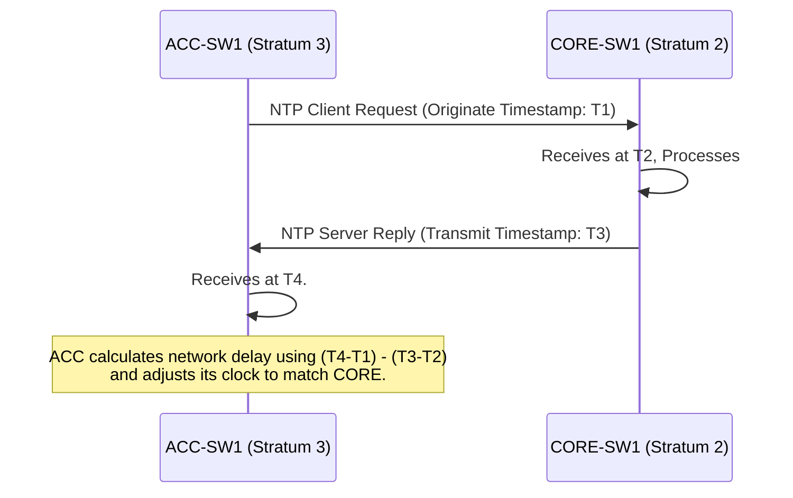

# `NTP`

## Index

1. [What is NTP?](#1-what-is-ntp)
2. [Why do we need it? (The Problem it Solves)](#2-why-do-we-need-it-the-problem-it-solves)
3. [How it relates to the broader network](#3-how-it-relates-to-the-broader-network)
4. [Key Component 1 — Stratum Levels](#4-key-component-1--stratum-levels)
5. [Key Component 2 — Slew vs. Step](#5-key-component-2--slew-vs-step)
6. [Key Component 3 — UDP Port 123](#6-key-component-3--udp-port-123)
7. [Safety & Security Features](#7-safety--security-features)
8. [Who created it / Standards](#8-who-created-it--standards)
9. [Types / Variations](#9-types--variations)
10. [Flow of Phases / How it Works](#10-flow-of-phases--how-it-works)
11. [States and Timers](#11-states-and-timers)
12. [Advanced / Extra Features](#12-advanced--extra-features)
13. [Configuration & Troubleshooting Workflow](#13-configuration--troubleshooting-workflow)

---

## 1. What is NTP?

- **NTP (Network Time Protocol)** is a networking protocol used to synchronize the clocks of computers, routers, and switches over variable-latency data networks.
- It operates at the Application Layer (Layer 7) using **UDP port 123**.
- **Analogy** ⌚: Imagine a **train station**. If every conductor's pocket watch is off by a few minutes, trains will crash or leave early. NTP is the **master clock on the wall** that every conductor looks at to synchronize their watches down to the millisecond, ensuring the entire system runs in perfect harmony.

## 2. Why do we need it? (The Problem it Solves)

- Hardware clocks drift over time due to temperature and battery degradation. If a switch reboots, it might think the year is 1993.
- Solves:
  - **Log Correlation** → If `ACC-SW1` says a port went down at 10:05 AM, but `CORE-SW1` says routing failed at 2:15 PM, you cannot troubleshoot the timeline. NTP ensures all syslogs match perfectly.
  - **Cryptography & Security** → Digital certificates (SSL/TLS, IPsec VPNs) have strict validity dates. If a router's clock is 5 years behind, it will reject valid security certificates as "not yet active."
  - **Time-based ACLs** → If you have a rule that blocks YouTube from 9 AM to 5 PM, the router must know the exact time.

## 3. How it relates to the broader network

- In your lab, `CORE-SW1` should sync its time to a highly accurate public internet time server (e.g., `pool.ntp.org`).
- To save internet bandwidth and secure the edge, `ACC-SW1-4` should NOT reach out to the internet. Instead, they sync their time directly from `CORE-SW1`.

## 4. Key Component 1 — Stratum Levels

- NTP uses a hierarchical system of clocks called **Stratums** to define the distance from the reference clock.
- **Stratum 0:** Atomic clocks, GPS clocks. (Devices cannot connect to these directly over a network).
- **Stratum 1:** A server directly connected to a Stratum 0 device via a serial cable.
- **Stratum 2:** A device (like your `CORE-SW1`) that syncs its time over the network from a Stratum 1 server.
- **Stratum 3:** A device (like your `ACC-SW1`) that syncs from a Stratum 2 server.
- *Limit:* The maximum valid stratum is **15**. Stratum **16** means the clock is unsynchronized/unreachable.

## 5. Key Component 2 — Slew vs. Step

- When a device realizes its clock is wrong, it has two ways to fix it:
  - **Step:** If the time is drastically wrong (e.g., off by hours or years), the device instantly "steps" (jumps) the clock to the correct time.
  - **Slew:** If the time is only off by a few seconds or milliseconds, the device "slews" (gradually speeds up or slows down its clock ticks) until it matches. This prevents sudden time jumps from breaking active database transactions or VoIP calls.

## 6. Key Component 3 — UDP Port 123

- NTP is connectionless. It sends a UDP packet containing a timestamp.
- The protocol's algorithm calculates the **Network Delay** (how long the packet took to travel) and **Jitter** (the variance in delay) to mathematically adjust the time with millisecond precision, compensating for network lag.

## 7. Safety & Security Features

- **NTP Authentication:** Uses MD5 or SHA hashes to ensure a router only accepts time updates from a trusted server. This prevents an attacker from injecting fake time to invalidate security certificates.
- **NTP Amplification Attacks:** Older NTP servers could be exploited in DDoS attacks using the `monlist` command. Modern best practice is to restrict which IPs are allowed to query your router for time using ACLs.

## 8. Who created it / Standards

- Created by **David L. Mills** at the University of Delaware in 1981, making it one of the oldest internet protocols still in use.
- Defined by the IETF in **RFC 5905** (NTPv4).

## 9. Types / Variations

| Protocol | Precision | Use Case |
|----------|-----------|----------|
| **NTPv4** | Milliseconds | Standard enterprise IT networks. |
| **SNTP** | Seconds | Simple NTP. Uses less CPU, but doesn't calculate network delay. Used by cheap IoT devices. |
| **PTP (IEEE 1588)** | Sub-Microsecond | Precision Time Protocol. Used in cellular towers, financial trading, and high-end video broadcasting. |

## 10. Flow of Phases / How it Works



## 11. States and Timers

- **Polling Interval:** NTP does not constantly spam the network. It starts polling every **64 seconds**. As the clock stabilizes and proves reliable, NTP automatically backs off, increasing the poll interval up to **1024 seconds** (about 17 minutes) to save CPU.
- **Dispersion:** The maximum estimated error of the clock. If dispersion gets too high, the router drops the time source.

## 12. Advanced / Extra Features

- **NTP Master:** A command (`ntp master`) that tells a router to act as an authoritative NTP server for the local network *even if it loses its connection to the internet*. It falls back to its own internal hardware clock.
- **NTP Peers:** Two core routers (`CORE-SW1` and `CORE-SW2`) can be configured as *peers* (`ntp peer`). They will compare clocks with each other to provide redundancy and sanity-check their upstream internet servers.

---

## 13. Configuration & Troubleshooting Workflow

> ⚙️ **Note:** In this workflow, we will configure `CORE-SW1` to sync with a public internet server, and configure `ACC-SW1` to securely sync its time from `CORE-SW1`.

### Phase 1: Port Selection & Preparation
- NTP relies on basic IP reachability. Ensure `CORE-SW1` can ping the internet, and `ACC-SW1` can ping `CORE-SW1`.
- Set the local timezone manually first, as NTP only provides UTC time.
```
CORE-SW1> enable
CORE-SW1# configure terminal
CORE-SW1(config)# clock timezone EST -5
CORE-SW1(config)# clock summer-time EDT recurring
```

### Phase 2: Base Configuration
- Configure `CORE-SW1` to point to an external public NTP server (e.g., `pool.ntp.org` or a specific IP like `8.8.8.8`).
- Configure `CORE-SW1` to act as a fallback master if the internet drops.
```
CORE-SW1(config)# ntp server 8.8.8.8
CORE-SW1(config)# ntp master 3
```
- Configure the Access switch to point to the Core switch's SVI IP.
```
ACC-SW1(config)# clock timezone EST -5
ACC-SW1(config)# ntp server 192.168.99.1
```

### Phase 3: Hardening & Security
- Enable NTP Authentication so `ACC-SW1` only accepts time from `CORE-SW1` if the password matches.
```
! --- On CORE-SW1 ---
CORE-SW1(config)# ntp authenticate
CORE-SW1(config)# ntp authentication-key 1 md5 CiscoTime!
CORE-SW1(config)# ntp trusted-key 1

! --- On ACC-SW1 ---
ACC-SW1(config)# ntp authenticate
ACC-SW1(config)# ntp authentication-key 1 md5 CiscoTime!
ACC-SW1(config)# ntp trusted-key 1
ACC-SW1(config)# ntp server 192.168.99.1 key 1
```

### Phase 4: Verification Flow
Run these `show` commands **in this order**:

```
CORE-SW1# show clock detail
CORE-SW1# show ntp status
CORE-SW1# show ntp associations
```

- **What to look for:**
  - `show clock detail` → Should show the correct local time and state "Time source is NTP".
  - `show ntp status` → Look for **"Clock is synchronized"** and verify the **Stratum** level is valid (e.g., Stratum 2 or 3).
  - `show ntp associations` → Look for an asterisk (`*`) next to the server IP. The `*` means this is the currently elected, active time source. `~` means it is configured but not syncing.

### Phase 5: Advanced Debugging
- If the clock refuses to synchronize:
```
ACC-SW1# show ntp associations detail
ACC-SW1# debug ntp packets
ACC-SW1# show access-lists
```
- **Troubleshooting logic:**
  - **Clock is unsynchronized / Stratum 16** → The router cannot reach the server, or the server is rejecting the request. Check routing and ensure UDP Port 123 is not blocked by an ACL.
  - **No asterisk (`*`) in associations** → NTP takes time! It can take **5 to 15 minutes** for the algorithm to calculate delay/jitter and officially sync. Be patient.
  - **Authentication failing** → Check `debug ntp packets`. If the keys don't match, the packets will be dropped. Ensure both `ntp authenticate` and `ntp trusted-key` are configured, as omitting either will break the sync.
  - **High Dispersion** → If the network is extremely congested, the packet delay varies too wildly (high jitter). NTP will refuse to sync because it cannot mathematically trust the timestamps.
