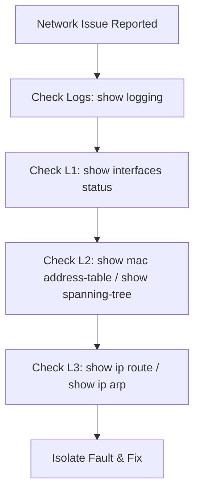

# 📄 `reference-guides/common-show-commands.md`

## 📑 Index

1. [What are Show Commands?](#1-what-are-show-commands)
2. [Why do we need them? (The Problem it Solves)](#2-why-do-we-need-them-the-problem-it-solves)
3. [How it relates to the broader network](#3-how-it-relates-to-the-broader-network)
4. [Key Component 1 — Layer 1 & 2 Verification](#4-key-component-1--layer-1--2-verification)
5. [Key Component 2 — Layer 3 Verification](#5-key-component-2--layer-3-verification)
6. [Key Component 3 — The Pipe (|) Operator](#6-key-component-3--the-pipe--operator)
7. [Safety & Security Features](#7-safety--security-features)
8. [Who created it / Standards](#8-who-created-it--standards)
9. [Types / Variations](#9-types--variations)
10. [Flow of Phases / How it Works](#10-flow-of-phases--how-it-works)
11. [States and Timers](#11-states-and-timers)
12. [Advanced / Extra Features](#12-advanced--extra-features)
13. [Configuration & Troubleshooting Workflow](#13-configuration--troubleshooting-workflow)

---

## 1. What are Show Commands?

- **Show commands** are read-only Cisco IOS commands used to view the operational state, configuration, and statistics of a router or switch.
- **Analogy** 🔍: If configuration mode is **writing the code**, `show` commands are the **debugger and the monitor**. You use them to observe what the machine is actually doing in real-time.

## 2. Why do we need them? (The Problem it Solves)

- You cannot troubleshoot a network by looking at the `running-config` alone. The config tells you what the switch is *supposed* to do; `show` commands tell you what it is *actually* doing.
- Solves:
  - **Verification** → Proves your configuration worked.
  - **Diagnostics** → Reveals dropped packets, err-disabled ports, and routing loops.

## 3. How it relates to the broader network

- These commands are your primary weapons for managing the `CORE-SW1/2` and `ACC-SW1-4` lab topology.

## 4. Key Component 1 — Layer 1 & 2 Verification

- `show interfaces status` → The absolute best command for a quick overview of port states, VLAN assignments, and duplex/speed.
- `show mac address-table` → Verifies if the switch is learning host MACs.
- `show interfaces trunk` → Confirms which ports are tagging traffic and which VLANs are allowed.
- `show spanning-tree` → The master command for finding the Root Bridge and blocked ports.

## 5. Key Component 2 — Layer 3 Verification

- `show ip interface brief` → The fastest way to see if SVIs and routed ports are `up/up`.
- `show ip route` → Displays the routing table (Connected, Static, OSPF, EIGRP).
- `show ip arp` → Verifies the L3 to L2 mapping (crucial if a PC can't ping its gateway).

## 6. Key Component 3 — The Pipe (|) Operator

- The pipe allows you to filter massive outputs.
- `show running-config | section ospf` → Shows only the OSPF configuration block.
- `show ip route | include 192.168.20` → Filters the routing table for a specific subnet.
- `show interfaces | exclude unassigned` → Hides ports without IP addresses.

## 7. Safety & Security Features

- `show port-security` → Reveals if a MAC address violation occurred.
- `show interfaces status err-disabled` → Instantly shows ports shut down by BPDU Guard or Port Security.
- `show logging` → Displays the system event buffer (syslog). **Always check this first during an outage.**

## 8. Who created it / Standards

- The `show` command hierarchy is a staple of the **Cisco IOS CLI**, which has become the de facto standard for network command-line interfaces (imitated by Arista, HP, and others).

## 9. Types / Variations

| Level | Command Type | Description |
|-------|--------------|-------------|
| **Exec** | `show version` | Basic system info (uptime, IOS version). |
| **Privileged** | `show running-config` | Requires `enable` mode. Shows the active config. |
| **Diagnostic** | `debug ip packet` | Real-time live packet capture (use with extreme caution, can crash the CPU). |

## 10. Flow of Phases / How it Works



## 11. States and Timers

- `show processes cpu sorted` → Checks if a routing loop or broadcast storm is maxing out the CPU (100% utilization).
- `show clock` → Ensures timestamps on your logs are accurate.

## 12. Advanced / Extra Features

- **`show tech-support`:** Dumps virtually every `show` command on the switch into one massive text block. Used when opening a TAC case with Cisco.

---

## 13. Configuration & Troubleshooting Workflow

> ⚙️ **Note:** This is your master cheat sheet for the Ultimate L2 Lab. Run these commands to verify the health of your Collapsed Core.

### Phase 1: Port Selection & Preparation
- Enter Privileged EXEC mode.
```
ACC-SW1> enable
```

### Phase 2: Base Configuration (Verification)
- **Verify L2 Access:**
```
ACC-SW1# show interfaces status
ACC-SW1# show mac address-table
```
- **Verify L2 Trunks & EtherChannel:**
```
ACC-SW1# show interfaces trunk
ACC-SW1# show etherchannel summary
```

### Phase 3: Hardening & Security (Verification)
- **Verify STP & Guards:**
```
ACC-SW1# show spanning-tree summary
ACC-SW1# show spanning-tree blockedports
ACC-SW1# show spanning-tree inconsistentports
ACC-SW1# show interfaces status err-disabled
```

### Phase 4: Verification Flow (Layer 3)
- **Verify Routing on the Core:**
```
CORE-SW1# show ip interface brief
CORE-SW1# show ip route
CORE-SW1# show ip ospf neighbor   (or eigrp/bgp)
```

### Phase 5: Advanced Debugging
- If standard `show` commands don't reveal the issue:
```
CORE-SW1# clear counters
CORE-SW1# show interfaces GigabitEthernet1/1 | include errors|CRC
```
- **Troubleshooting logic:**
  - Clearing counters resets the interface error statistics to zero. If you check again 30 seconds later and the CRC errors are rising, you have a bad physical cable or a duplex mismatch that `show running-config` will never reveal.

---
