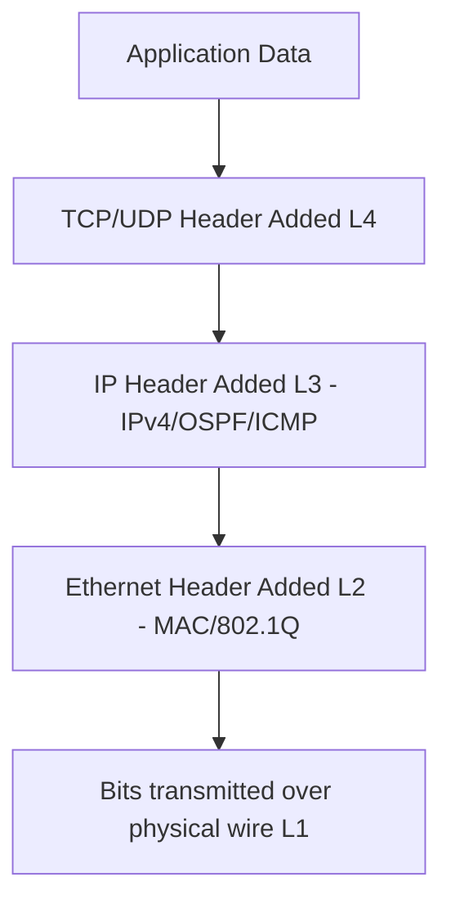

# `Network Protocols`

## Index

1. [What are Network Protocols?](#1-what-are-network-protocols)
2. [Why do we need them? (The Problem it Solves)](#2-why-do-we-need-them-the-problem-it-solves)
3. [How it relates to the broader network](#3-how-it-relates-to-the-broader-network)
4. [Key Component 1 — Layer 2 Protocols](#4-key-component-1--layer-2-protocols)
5. [Key Component 2 — Layer 3 & Routing Protocols](#5-key-component-2--layer-3--routing-protocols)
6. [Key Component 3 — Discovery & Management Protocols](#6-key-component-3--discovery--management-protocols)
7. [Safety & Security Features](#7-safety--security-features)
8. [Who created it / Standards](#8-who-created-it--standards)
9. [Types / Variations](#9-types--variations)
10. [Flow of Phases / How it Works](#10-flow-of-phases--how-it-works)
11. [States and Timers](#11-states-and-timers)
12. [Advanced / Extra Features](#12-advanced--extra-features)
13. [Configuration & Troubleshooting Workflow](#13-configuration--troubleshooting-workflow)

---

## 1. What are Network Protocols?

- **Network Protocols** are the strict, standardized sets of rules and formats that allow networking devices (switches, routers, PCs) to communicate with each other, regardless of their underlying hardware or operating system.
- **Analogy** 🗣️: Protocols are like **human languages and social etiquette**. If a switch speaks "Spanish" (Cisco proprietary) and a PC speaks "Japanese" (Windows), they cannot communicate. Protocols like IP and Ethernet act as the universal "English" that everyone agrees to use.

## 2. Why do we need them? (The Problem it Solves)

- Without protocols, a stream of electrical voltage on a copper wire has absolutely no meaning.
- Solves:
  - **Interoperability** → Allows a Dell PC to talk to a Cisco switch, which talks to a Juniper router.
  - **Error Handling** → Defines exactly what to do if a packet is lost or corrupted.
  - **Addressing** → Provides the logical (IP) and physical (MAC) naming schemes.

## 3. How it relates to the broader network

- Your entire Ultimate L2 Lab is a symphony of protocols working simultaneously. 
- `ACC-SW1` uses **802.1Q** to tag frames, **LACP** to bundle uplinks, **Rapid-PVST+** to prevent loops, and **CDP** to find `CORE-SW1`.

## 4. Key Component 1 — Layer 2 Protocols

These govern the local broadcast domain (MAC addressing, switching, and physical links):
- **Ethernet (802.3):** The base standard for wired LANs.
- **802.1Q:** The open standard for VLAN tagging on trunks.
- **STP / RSTP / MST:** Loop prevention protocols.
- **LACP / PAgP:** EtherChannel negotiation protocols.
- **DTP / VTP:** Cisco proprietary trunking and VLAN management protocols.

## 5. Key Component 2 — Layer 3 & Routing Protocols

These govern logical addressing and path selection across the enterprise:
- **IPv4 / IPv6:** The core logical addressing protocols.
- **ARP:** Maps Layer 3 IPs to Layer 2 MACs.
- **ICMP:** Used for diagnostics (Ping, Traceroute).
- **OSPF / EIGRP / RIP:** Interior Gateway Protocols (IGPs) for internal routing.
- **BGP:** Exterior Gateway Protocol (EGP) for internet routing.

## 6. Key Component 3 — Discovery & Management Protocols

These operate in the background to help administrators map and manage the network:
- **CDP (Cisco Discovery Protocol) / LLDP (Link Layer Discovery Protocol):** Layer 2 protocols that advertise device hostnames, IP addresses, and port numbers to directly connected neighbors.
- **SSH / Telnet:** Secure and insecure remote CLI access.
- **SNMP:** Simple Network Management Protocol for monitoring CPU, memory, and link states.

## 7. Safety & Security Features

- **Secure vs. Insecure Protocols:** Always prefer SSH over Telnet, SNMPv3 over SNMPv2c, and HTTPS over HTTP.
- **Protocol Spoofing:** Attackers can craft fake protocol packets (e.g., fake ARP replies or fake STP BPDUs). This is why features like **Dynamic ARP Inspection (DAI)** and **BPDU Guard** are mandatory.

## 8. Who created it / Standards

- **IEEE (Institute of Electrical and Electronics Engineers):** Creates physical and Layer 2 standards (e.g., 802.3, 802.1Q, 802.1w).
- **IETF (Internet Engineering Task Force):** Creates Layer 3+ standards via RFCs (e.g., IPv4, OSPF, BGP).
- **Cisco Systems:** Creates proprietary protocols (e.g., EIGRP, CDP, PAgP, PVST+) that often become industry benchmarks.

## 9. Types / Variations

| Category | Open Standard | Cisco Proprietary |
|----------|---------------|-------------------|
| **Discovery** | LLDP (802.1AB) | CDP |
| **Trunking** | 802.1Q | ISL |
| **EtherChannel** | LACP (802.3ad) | PAgP |
| **Spanning Tree** | RSTP (802.1w) | Rapid-PVST+ |
| **Routing** | OSPF | EIGRP |

## 10. Flow of Phases / How it Works



## 11. States and Timers

- Every dynamic protocol relies on **Hello/Keepalive** timers to maintain relationships.
- **Rule of Thumb:** If timers do not match between two devices (e.g., OSPF Hello timers), the protocol adjacency will fail.

## 12. Advanced / Extra Features

- **Protocol Encapsulation:** Protocols can be nested. For example, OSPF is encapsulated directly inside IPv4 (Protocol 89), whereas BGP is encapsulated inside TCP (Port 179), which is then encapsulated inside IPv4.

---

## 13. Configuration & Troubleshooting Workflow

> ⚙️ **Note:** This workflow shows how to quickly identify which protocols are actively running on your switches.

### Phase 1: Port Selection & Preparation
- Log into `CORE-SW1` to verify the active protocols.
```
CORE-SW1> enable
```

### Phase 2: Base Configuration
- Protocols are enabled via their respective commands (e.g., `router ospf 1`, `cdp run`, `spanning-tree mode rapid-pvst`).

### Phase 3: Hardening & Security
- Disable legacy or insecure protocols globally.
```
CORE-SW1(config)# no ip http server
CORE-SW1(config)# no ip http secure-server
CORE-SW1(config)# line vty 0 4
CORE-SW1(config-line)# transport input ssh
```

### Phase 4: Verification Flow
Run these `show` commands **in this order** to audit your protocols:

```
CORE-SW1# show ip protocols
CORE-SW1# show spanning-tree summary
CORE-SW1# show cdp neighbors
CORE-SW1# show etherchannel summary
```

- **What to look for:**
  - `show ip protocols` → Lists active routing protocols (OSPF, EIGRP, RIP, BGP) and their timers.
  - `show spanning-tree summary` → Confirms the exact STP protocol running (e.g., Rapid-PVST+).
  - `show cdp neighbors` → Verifies the Cisco Discovery Protocol is mapping the L2 topology.

### Phase 5: Advanced Debugging
- If a protocol is failing to communicate:
```
CORE-SW1# debug ip packet detail
CORE-SW1# show interfaces GigabitEthernet1/1
```
- **Troubleshooting logic:**
  - **Mismatched Standards** → You configured LACP on `ACC-SW1` and PAgP on `CORE-SW1`. The EtherChannel will never form.
  - **Blocked Protocols** → An ACL on the interface is blocking OSPF (Protocol 89) or BGP (TCP 179).

---
