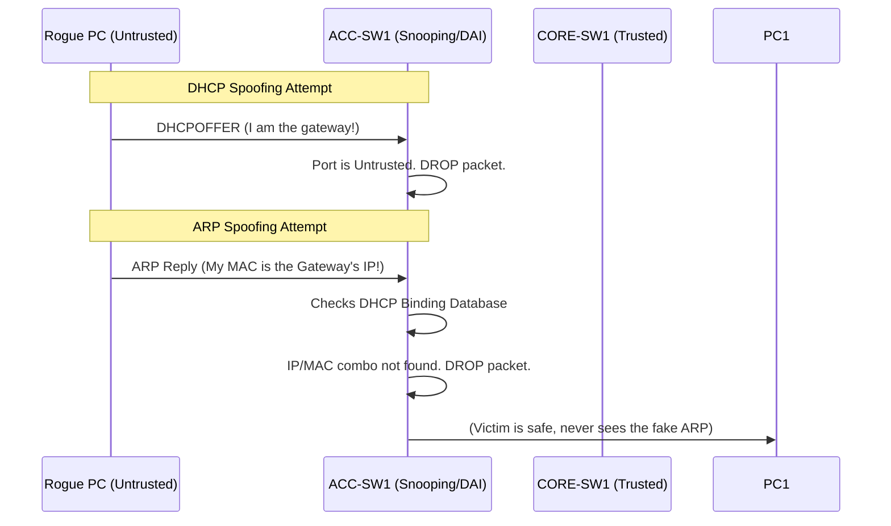

# `DHCP Snooping & DAI`

## Index

1. [What are DHCP Snooping & DAI?](#1-what-are-dhcp-snooping--dai)
2. [Why do we need it? (The Problem it Solves)](#2-why-do-we-need-it-the-problem-it-solves)
3. [How it relates to the broader network](#3-how-it-relates-to-the-broader-network)
4. [Key Component 1 — Trusted vs. Untrusted Ports](#4-key-component-1--trusted-vs-untrusted-ports)
5. [Key Component 2 — The Binding Database](#5-key-component-2--the-binding-database)
6. [Key Component 3 — Dynamic ARP Inspection (DAI)](#6-key-component-3--dynamic-arp-inspection-dai)
7. [Safety & Security Features](#7-safety--security-features)
8. [Who created it / Standards](#8-who-created-it--standards)
9. [Types / Variations](#9-types--variations)
10. [Flow of Phases / How it Works](#10-flow-of-phases--how-it-works)
11. [States and Timers](#11-states-and-timers)
12. [Advanced / Extra Features](#12-advanced--extra-features)
13. [Configuration & Troubleshooting Workflow](#13-configuration--troubleshooting-workflow)

---

## 1. What are DHCP Snooping & DAI?

- **DHCP Snooping** is a Layer 2 security feature that filters untrusted DHCP messages and builds a database of valid IP-to-MAC assignments.
- **DAI (Dynamic ARP Inspection)** is a companion feature that uses the DHCP Snooping database to intercept, log, and discard ARP packets with invalid IP-to-MAC bindings.
- **Analogy** 📋: **DHCP Snooping is the DMV**—it issues official ID cards (IP addresses) and records exactly who got which ID in a master database. **DAI is the bouncer at the club**—when someone shows up claiming to be "John" (an ARP reply), the bouncer checks the DMV's master database. If the ID is fake, the bouncer throws them out.

## 2. Why do we need it? (The Problem it Solves)

- Layer 2 networks inherently trust the payload of DHCP and ARP packets. Attackers exploit this blind trust to hijack traffic.
- Solves:
  - **Rogue DHCP Servers** → Prevents an attacker from plugging in a router and handing out fake Default Gateway IPs to steal traffic.
  - **ARP Spoofing / Poisoning** → Prevents an attacker from sending fake ARP replies claiming *their* MAC address owns the Default Gateway's IP (the classic Man-in-the-Middle attack).
  - **DHCP Starvation** → Stops attackers from spamming fake MACs to drain your DHCP pool.

## 3. How it relates to the broader network

- These features are configured strictly at the **Access Layer** (`ACC-SW1-4`).
- They protect the endpoints (`PCs 1-8` and IP Phones) in VLANs 20, 30, and 40 from attacking each other.
- The Core switches (`CORE-SW1/2`) act as the legitimate DHCP servers and Default Gateways that these features are designed to protect.

## 4. Key Component 1 — Trusted vs. Untrusted Ports

DHCP Snooping divides all switch ports into two categories:
- **Trusted Ports:** Allowed to send DHCP Server messages (DHCPOFFER, DHCPACK). You manually configure your uplinks (pointing to `CORE-SW1/2`) as trusted.
- **Untrusted Ports:** The default state for all ports. They are only allowed to send DHCP Client messages (DHCPDISCOVER, DHCPREQUEST). If an untrusted port sends a Server message, the switch drops it and logs a violation.

## 5. Key Component 2 — The Binding Database

- When a PC on an untrusted port successfully gets an IP from a trusted DHCP server, DHCP Snooping records the transaction.
- It logs the **MAC Address, IP Address, Lease Time, VLAN, and Port Number** into the DHCP Snooping Binding Database.
- This database becomes the absolute source of truth for the switch.

## 6. Key Component 3 — Dynamic ARP Inspection (DAI)

- DAI relies entirely on the DHCP Snooping Binding Database.
- When a PC sends an ARP packet, DAI intercepts it. It looks at the Sender IP and Sender MAC in the ARP payload.
- If that IP-to-MAC combination does *not* exist in the Binding Database, DAI drops the packet. The spoofed ARP never reaches the victim.

## 7. Safety & Security Features

- **Rate Limiting:** Attackers can overwhelm the switch CPU by spamming DHCP or ARP packets. You must apply rate limits (e.g., 15 packets per second) on edge ports. If the limit is exceeded, the port is `err-disabled`.
- **IP Source Guard (IPSG):** The third pillar of this security suite. While DAI validates ARP packets, IPSG validates regular IPv4 data packets against the binding database, dropping traffic from spoofed source IPs.

## 8. Who created it / Standards

- **Cisco-proprietary** innovations that became so critical they are now de facto industry standards, cloned by nearly every enterprise switch vendor.

## 9. Types / Variations

| Feature | Validates | Drops |
|---------|-----------|-------|
| **DHCP Snooping** | DHCP Packets | Rogue DHCPOFFERs from untrusted ports. |
| **DAI** | ARP Packets | ARP Replies where IP/MAC don't match the database. |
| **IP Source Guard** | IPv4 Data Packets | Data packets with spoofed Source IPs. |

## 10. Flow of Phases / How it Works



## 11. States and Timers

- **Lease Expiration:** If a PC's DHCP lease expires, its entry is removed from the Binding Database. If the PC tries to send an ARP packet after the lease expires, DAI will drop it until the PC renews its DHCP lease.
- **Database Storage:** The binding database lives in RAM. If `ACC-SW1` reboots, the database is wiped, and DAI will block all PCs until they request new IPs. *Best Practice:* Configure a database agent to back up the bindings to flash memory or a TFTP server.

## 12. Advanced / Extra Features

- **Option 82:** DHCP Snooping can inject "Option 82" into the DHCP request, tagging it with the exact switch hostname and port number. The DHCP server can use this to assign specific IPs based on physical location.
- **ARP ACLs:** If you have a server with a Static IP (which never uses DHCP), it won't be in the Binding Database. DAI will block it. You must create a static ARP ACL to manually whitelist static IPs.

---

## 13. Configuration & Troubleshooting Workflow

> ⚙️ **Note:** We will configure DHCP Snooping and DAI on `ACC-SW1` to protect VLANs 20, 30, and 40. We will trust the uplinks to `CORE-SW1/2` and rate-limit the edge ports.

### Phase 1: Port Selection & Preparation
- Identify your **Trusted Ports** (Uplinks to the Core: `GigabitEthernet0/1-2`).
- Identify your **Untrusted Ports** (Edge ports to PCs: `FastEthernet0/1-24`).
```
ACC-SW1> enable
ACC-SW1# configure terminal
```

### Phase 2: Base Configuration
- Enable DHCP Snooping globally and for your specific VLANs.
- Enable DAI globally for your specific VLANs.
```
! Enable DHCP Snooping
ACC-SW1(config)# ip dhcp snooping
ACC-SW1(config)# ip dhcp snooping vlan 20,30,40

! Enable Dynamic ARP Inspection
ACC-SW1(config)# ip arp inspection vlan 20,30,40
```

### Phase 3: Hardening & Security
- Configure the Uplinks as Trusted for both DHCP and ARP.
- Configure Rate Limiting on the Edge ports to prevent CPU exhaustion attacks.
```
! Trust the Uplinks
ACC-SW1(config)# interface range GigabitEthernet0/1 - 2
ACC-SW1(config-if-range)# ip dhcp snooping trust
ACC-SW1(config-if-range)# ip arp inspection trust
ACC-SW1(config-if-range)# exit

! Rate Limit the Edge Ports
ACC-SW1(config)# interface range FastEthernet0/1 - 24
! Max 10 DHCP packets per second
ACC-SW1(config-if-range)# ip dhcp snooping limit rate 10
! Max 15 ARP packets per second
ACC-SW1(config-if-range)# ip arp inspection limit rate 15
ACC-SW1(config-if-range)# exit
```

### Phase 4: Verification Flow
Run these `show` commands **in this order**:

```
ACC-SW1# show ip dhcp snooping
ACC-SW1# show ip dhcp snooping binding
ACC-SW1# show ip arp inspection vlan 20
ACC-SW1# show ip arp inspection statistics
```

- **What to look for:**
  - `show ip dhcp snooping` → Verify it is operational on VLANs 20/30/40 and that `Gi0/1-2` are listed as trusted.
  - `show ip dhcp snooping binding` → You MUST see the MAC addresses and IPs of your PCs here. If this is empty, DAI will block everything.
  - `show ip arp inspection statistics` → Look at the "Dropped" column. If it is incrementing rapidly, someone is spoofing ARP (or a device has a static IP and needs an ARP ACL).

### Phase 5: Advanced Debugging
- If PCs cannot communicate or ports are shutting down:
```
ACC-SW1# show interfaces status err-disabled
ACC-SW1# show logging | include ARP
ACC-SW1# clear ip dhcp snooping binding
```
- **Troubleshooting logic:**
  - **Port is Err-Disabled** → The PC exceeded the rate limit (e.g., sent more than 15 ARPs in a second). This is common when a PC boots up. Increase the `limit rate` or configure `errdisable recovery cause arp-inspection`.
  - **Valid PC is being blocked by DAI** → The PC has a Static IP. Because it didn't use DHCP, it's not in the binding database. You must create an `arp access-list` to permit its IP/MAC and apply it via `ip arp inspection filter`.
  - **Option 82 Issues** → By default, Cisco switches insert Option 82 into DHCP packets. Some non-Cisco DHCP servers drop packets with Option 82. If PCs aren't getting IPs, disable it with `no ip dhcp snooping information option`.
  - **Switch rebooted, nobody can connect** → The binding database was stored in RAM and wiped. PCs must do an `ipconfig /release` and `/renew` to rebuild the database, or you must configure a database agent to back it up to flash memory.
