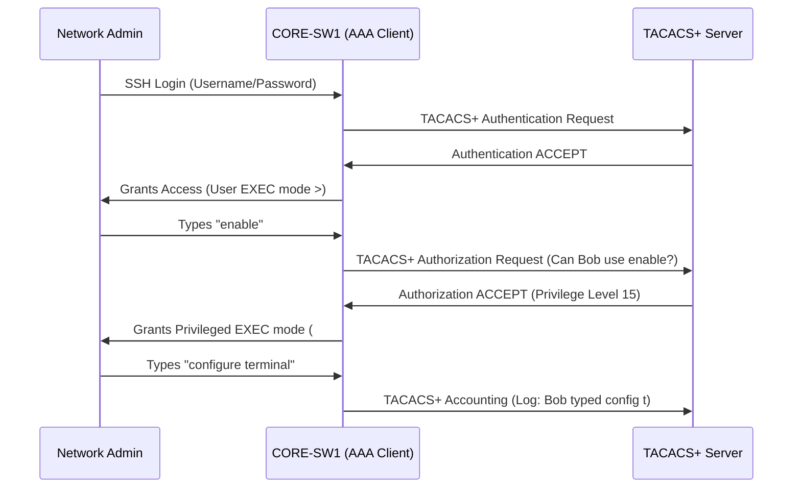

# 📄 `security/aaa.md`

## 📑 Index

1. [What is AAA?](#1-what-is-aaa)
2. [Why do we need it? (The Problem it Solves)](#2-why-do-we-need-it-the-problem-it-solves)
3. [How it relates to the broader network](#3-how-it-relates-to-the-broader-network)
4. [Key Component 1 — Authentication (Who are you?)](#4-key-component-1--authentication-who-are-you)
5. [Key Component 2 — Authorization (What can you do?)](#5-key-component-2--authorization-what-can-you-do)
6. [Key Component 3 — Accounting (What did you do?)](#6-key-component-3--accounting-what-did-you-do)
7. [Safety & Security Features](#7-safety--security-features)
8. [Who created it / Standards](#8-who-created-it--standards)
9. [Types / Variations](#9-types--variations)
10. [Flow of Phases / How it Works](#10-flow-of-phases--how-it-works)
11. [States and Timers](#11-states-and-timers)
12. [Advanced / Extra Features](#12-advanced--extra-features)
13. [Configuration & Troubleshooting Workflow](#13-configuration--troubleshooting-workflow)

---

## 1. What is AAA?

- **AAA (Authentication, Authorization, and Accounting)** is an architectural framework used to secure access to network devices and network resources.
- It shifts security from local, shared passwords stored on individual switches to a centralized, identity-based security model using external servers (like RADIUS or TACACS+).
- **Analogy** 🏦: Think of a **high-security bank vault**. 
  - **Authentication:** Swiping your ID badge at the front door to prove who you are.
  - **Authorization:** The system checks if your specific badge is allowed to open the vault door, or just the breakroom.
  - **Accounting:** A security camera and logbook record exactly what time you entered the vault and what you touched while inside.

## 2. Why do we need it? (The Problem it Solves)

- By default, Cisco switches use a single `enable secret` password. If 10 engineers share that password, and one leaves the company, you must manually change the password on 500 switches. If someone breaks the network, you don't know *which* of the 10 engineers did it.
- Solves:
  - **Identity Accountability** → Every engineer logs in with their own unique Active Directory credentials.
  - **Centralized Revocation** → If an engineer is fired, disabling their AD account instantly locks them out of all 500 switches.
  - **Role-Based Access Control (RBAC)** → Junior admins can run `show` commands, but only Senior admins can enter `configure terminal`.
  - **Audit Trails** → Every command typed by every user is logged to a central server.

## 3. How it relates to the broader network

- In your lab, you will configure AAA on `CORE-SW1/2` and `ACC-SW1-4` so that when you SSH into them, the switches ask a centralized server (like Cisco ISE) to verify your credentials before letting you in.

## 4. Key Component 1 — Authentication (Who are you?)

- The process of verifying identity.
- The switch prompts the user for a Username and Password.
- The switch packages these credentials and sends them to the AAA server (RADIUS or TACACS+). The server replies with an "Accept" or "Reject".
- *Fallback:* You can configure the switch to check the local database if the AAA server is unreachable.

## 5. Key Component 2 — Authorization (What can you do?)

- The process of granting or denying specific privileges.
- Once authenticated, what is the user allowed to do? 
- **EXEC Authorization:** Determines if the user drops into User EXEC mode (`>`) or Privileged EXEC mode (`#`).
- **Command Authorization:** Every time the user types a command, the switch asks the TACACS+ server, "Is Bob allowed to type `shutdown`?" If no, the command is rejected.

## 6. Key Component 3 — Accounting (What did you do?)

- The process of tracking and logging user activity.
- The switch sends records to the AAA server detailing when a user logged in, when they logged out, and exactly which commands they executed during their session.
- Crucial for compliance, forensics, and troubleshooting ("Who shut down the core uplink at 3 AM?").

## 7. Safety & Security Features

- **Fallback Methods:** The biggest risk of AAA is locking yourself out if the AAA server crashes. You must configure a fallback method (e.g., `group tacacs+ local`), which tells the switch: "Ask the server first. If it's dead, check my local username database."
- **Console Port Bypass:** It is best practice to apply AAA to the VTY (SSH) lines, but leave the physical Console port using local authentication so you can always recover the switch with a serial cable.

## 8. Who created it / Standards

- **RADIUS (Remote Authentication Dial-In User Service):** An open standard (RFC 2865) created by Livingston Enterprises in 1991.
- **TACACS+ (Terminal Access Controller Access-Control System Plus):** A Cisco-proprietary protocol (now an open standard, RFC 8907) designed specifically for device administration.

## 9. Types / Variations

| Feature | RADIUS | TACACS+ |
|---------|--------|---------|
| **Transport Protocol** | UDP (Ports 1812/1813) | TCP (Port 49) |
| **Encryption** | Only the password is encrypted. | The entire payload is encrypted. |
| **Architecture** | Authentication and Authorization are combined. | Auth, Authz, and Acct are strictly separated. |
| **Command Authorization** | Not supported. | Fully supported (per-command control). |
| **Best Use Case** | Network Access (802.1X, VPN users). | Device Administration (SSH to routers). |

## 10. Flow of Phases / How it Works



## 11. States and Timers

- **Dead-Server Timer:** If the switch sends a request to the TACACS+ server and receives no reply within a few seconds, it marks the server as "dead" and moves to the next server in the group, or falls back to the local database.

## 12. Advanced / Extra Features

- **802.1X (Network Access Control):** AAA isn't just for admins logging into switches. 802.1X uses RADIUS to authenticate the actual PCs plugging into the wall ports. If a PC fails authentication, the switchport stays blocked or drops them into a restricted Guest VLAN.

---

## 13. Configuration & Troubleshooting Workflow

> ⚙️ **Note:** We will configure `CORE-SW1` to use a TACACS+ server for SSH login authentication. We will configure a local fallback user so we don't lock ourselves out.

### Phase 1: Port Selection & Preparation
- AAA relies on IP reachability. Ensure the switch can ping the TACACS+ server.
- Create a local fallback username and password with full privileges (Level 15).
```
CORE-SW1> enable
CORE-SW1# configure terminal
CORE-SW1(config)# username admin privilege 15 secret CiscoLocal123!
```

### Phase 2: Base Configuration
- Turn on the AAA engine globally.
- Define the TACACS+ server IP and the shared secret key (which must match the server).
```
CORE-SW1(config)# aaa new-model
CORE-SW1(config)# tacacs server ISE_SERVER
CORE-SW1(config-server-tacacs)# address ipv4 10.0.99.100
CORE-SW1(config-server-tacacs)# key CiscoTacacsKey!
CORE-SW1(config-server-tacacs)# exit
```

### Phase 3: Hardening & Security
- Create an Authentication list named `SSH_LOGIN`. Tell it to check the TACACS+ server first. If the server is unreachable, check the `local` database.
- Apply this list to the VTY (SSH) lines.
```
! Create the Authentication List
CORE-SW1(config)# aaa authentication login SSH_LOGIN group tacacs+ local

! Apply the list to the VTY lines
CORE-SW1(config)# line vty 0 4
CORE-SW1(config-line)# login authentication SSH_LOGIN
CORE-SW1(config-line)# exit
```

### Phase 4: Verification Flow
Run these `show` commands **in this order**:

```
CORE-SW1# show aaa servers
CORE-SW1# show tacacs
CORE-SW1# test aaa group tacacs+ admin CiscoLocal123! legacy
```

- **What to look for:**
  - `show aaa servers` → Verifies the AAA engine is running and lists the configured servers.
  - `show tacacs` → Shows the IP of the TACACS+ server and the number of packets sent/received. If "Socket opens" is incrementing but "Socket closes" isn't, the server isn't replying.
  - `test aaa...` → Manually simulates a login attempt to the server to prove the connection and shared key are working without having to actually SSH into the box.

### Phase 5: Advanced Debugging
- If you are locked out of the switch or authentication is failing:
```
CORE-SW1# debug tacacs
CORE-SW1# debug aaa authentication
CORE-SW1# show run | section aaa
```
- **Troubleshooting logic:**
  - **Locked Out Completely** → You applied `aaa authentication login default group tacacs+` without a `local` fallback, and the TACACS+ server is down. You must connect via the physical Console cable (which bypasses VTY AAA) to fix it.
  - **Authentication Fails** → Check the Shared Secret Key. If the key on the switch doesn't perfectly match the key on the ISE/TACACS+ server, the server will silently drop the request.
  - **Routing Issue** → The switch is trying to reach the TACACS+ server using the wrong source IP. Use `ip tacacs source-interface vlan 99` to force the switch to use its management IP when talking to the server.
