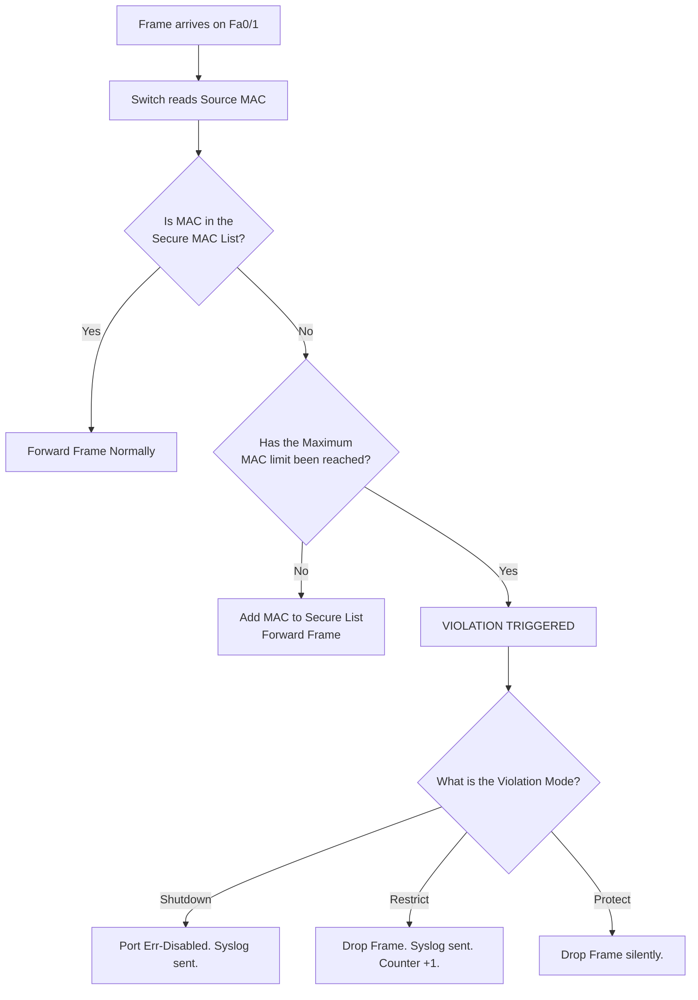

# `Port Security`

## Index

1. [What is Port Security?](#1-what-is-port-security)
2. [Why do we need it? (The Problem it Solves)](#2-why-do-we-need-it-the-problem-it-solves)
3. [How it relates to the broader network](#3-how-it-relates-to-the-broader-network)
4. [Key Component 1 — Secure MAC Addresses](#4-key-component-1--secure-mac-addresses)
5. [Key Component 2 — Maximum MAC Limit](#5-key-component-2--maximum-mac-limit)
6. [Key Component 3 — Violation Modes](#6-key-component-3--violation-modes)
7. [Safety & Security Features](#7-safety--security-features)
8. [Who created it / Standards](#8-who-created-it--standards)
9. [Types / Variations](#9-types--variations)
10. [Flow of Phases / How it Works](#10-flow-of-phases--how-it-works)
11. [States and Timers](#11-states-and-timers)
12. [Advanced / Extra Features](#12-advanced--extra-features)
13. [Configuration & Troubleshooting Workflow](#13-configuration--troubleshooting-workflow)

---

## 1. What is Port Security?

- **Port Security** is a Layer 2 access-layer defense mechanism that restricts a switch port so it will only forward frames from a specific, limited set of MAC addresses.
- **Analogy** 🚪: Think of a **bouncer at a private club**. The bouncer is told, "Only let the first two people who show up inside, and remember their faces." If a third person tries to sneak in, or if someone hands their ID to a stranger, the bouncer immediately blocks them and calls security.

## 2. Why do we need it? (The Problem it Solves)

- Without it, anyone can walk into a building, plug a 16-port unmanaged switch into a wall jack, and connect 15 unauthorized devices to your network.
- Solves:
  - **MAC Flooding Attacks** → Attackers use tools like `macof` to generate 100,000 fake MAC addresses per second, overflowing the switch's CAM table and turning it into a dumb hub (allowing them to sniff all traffic). Port Security stops this instantly.
  - **Rogue Devices** → Prevents employees from plugging in unauthorized home routers or switches.
  - **DHCP Starvation** → By limiting MACs, an attacker cannot request hundreds of IPs to exhaust your DHCP pool.

## 3. How it relates to the broader network

- Port Security is applied strictly at the **Access Layer** (`ACC-SW1-4`) on the edge ports facing `PCs 1-8` and IP Phones.
- It is **never** applied to trunk links between switches (like the uplinks to `CORE-SW1/2`), because trunks legitimately carry hundreds of different MAC addresses.

## 4. Key Component 1 — Secure MAC Addresses

The switch needs to know *which* MAC addresses are allowed. It learns them in three ways:
- **Static:** You manually type the exact MAC address of the PC into the CLI. (Highly secure, but an administrative nightmare to maintain).
- **Dynamic:** The switch learns the first MAC address it sees and stores it in RAM. If the switch reboots, it forgets the MAC and learns a new one.
- **Sticky:** The best of both worlds. The switch dynamically learns the first MAC it sees, but then "sticks" it into the `running-config` as if you typed it manually. If you save the config, it survives reboots.

## 5. Key Component 2 — Maximum MAC Limit

- You must define exactly how many MAC addresses are allowed on a single port.
- **Default:** 1
- **PC only:** Set to 1.
- **PC + IP Phone:** Set to 2 (or 3, to allow a tiny margin of error if a PC docking station has multiple MACs).

## 6. Key Component 3 — Violation Modes

What happens when an unauthorized MAC address tries to send a frame? You choose one of three actions:
- **Shutdown (Default):** The port is immediately put into an `err-disabled` state. The port LED turns off, traffic stops completely, and a syslog message is generated. Requires manual or auto-recovery.
- **Restrict:** The unauthorized frame is dropped. The authorized PC can still communicate. A syslog message is generated, and a violation counter goes up.
- **Protect:** The unauthorized frame is dropped silently. No logs are generated, and no counters go up. (Rarely used because it hides attacks from the admin).

## 7. Safety & Security Features

- **Err-disable Recovery:** If using the `shutdown` violation mode, you can configure the switch to automatically re-enable the port after a set time (e.g., 5 minutes) using `errdisable recovery cause psecure-violation`.
- **Aging:** You can tell the switch to "forget" secure MAC addresses after a certain amount of time (Absolute or Inactivity) so a new PC can be plugged in without requiring admin intervention.

## 8. Who created it / Standards

- Port Security is a **Cisco-proprietary** Layer 2 feature, though almost all enterprise switch vendors have cloned the functionality under different names (e.g., MAC Limiting).

## 9. Types / Variations

| Violation Mode | Drops Bad Traffic? | Forwards Good Traffic? | Generates Syslog/SNMP? | Increases Violation Counter? |
|----------------|:---:|:---:|:---:|:---:|
| **Shutdown** | Yes (Port Dies) | No (Port Dies) | Yes | Yes |
| **Restrict** | Yes | Yes | Yes | Yes |
| **Protect** | Yes | Yes | No | No |

## 10. Flow of Phases / How it Works



## 11. States and Timers

- **Aging Timer:** By default, secure MAC addresses never age out. If you enable aging (e.g., `switchport port-security aging time 60`), the switch will clear the MAC after 60 minutes, allowing a new device to connect.
- **Err-Disable Timer:** If auto-recovery is enabled, the default wait time before the switch attempts to bring the port back up is **300 seconds (5 minutes)**.

## 12. Advanced / Extra Features

- **Port Security with Voice VLANs:** When an IP Phone and a PC share a port, you must increase the maximum MAC limit to at least 2. The switch tracks which MAC belongs to the Voice VLAN and which belongs to the Data VLAN.
- **Sticky MACs in Config:** If you use Sticky MACs, your `running-config` will fill up with MAC addresses. You must issue `copy run start` to ensure they survive a power outage.

---

## 13. Configuration & Troubleshooting Workflow

> ⚙️ **Note:** In this workflow, we will configure Port Security on `ACC-SW1` for a port connected to an IP Phone and a PC. We will use Sticky learning and the `restrict` violation mode so the user isn't completely kicked off the network if they plug in a bad device.

### Phase 1: Port Selection & Preparation
- Target the edge ports on the Access switch. 
- **Crucial:** Port Security *cannot* be enabled on dynamic ports. You must hardcode the port as an access port first.
```
ACC-SW1> enable
ACC-SW1# configure terminal
ACC-SW1(config)# interface FastEthernet0/1
ACC-SW1(config-if)# description ** PC and IP Phone **
ACC-SW1(config-if)# switchport mode access
ACC-SW1(config-if)# switchport access vlan 20
ACC-SW1(config-if)# switchport voice vlan 40
```

### Phase 2: Base Configuration
- Enable Port Security (the master switch).
- Set the maximum MAC addresses to 3 (1 for PC, 1 for Phone, 1 for margin of error/docking station).
```
ACC-SW1(config-if)# switchport port-security
ACC-SW1(config-if)# switchport port-security maximum 3
```

### Phase 3: Hardening & Security
- Enable Sticky MAC learning so the switch remembers the devices.
- Set the violation mode to `restrict` (drops bad traffic, logs it, but keeps the port up for the good devices).
```
ACC-SW1(config-if)# switchport port-security mac-address sticky
ACC-SW1(config-if)# switchport port-security violation restrict
ACC-SW1(config-if)# exit
```

### Phase 4: Verification Flow
Run these `show` commands **in this order**:

```
ACC-SW1# show port-security
ACC-SW1# show port-security interface FastEthernet0/1
ACC-SW1# show port-security address
```

- **What to look for:**
  - `show port-security` → Gives a high-level overview of all secure ports, their max limits, current MAC count, and violation counts.
  - `show port-security interface Fa0/1` → Shows the exact status of the port. Look at **Port Status** (Secure-up), **Violation Mode** (Restrict), and **Security Violation Count** (Should be 0).
  - `show port-security address` → Lists the actual MAC addresses the switch has learned and "stuck" to the port.

### Phase 5: Advanced Debugging
- If a user complains they cannot access the network:
```
ACC-SW1# show interfaces status err-disabled
ACC-SW1# show port-security interface FastEthernet0/1
ACC-SW1# show logging | include SECURITY
```
- **Troubleshooting logic:**
  - **Port is Err-Disabled** → The violation mode was set to `shutdown` and the user plugged in an unauthorized device. Unplug the rogue device, go to the interface, type `shutdown`, then `no shutdown` to recover it.
  - **User cannot connect, but port is UP** → The violation mode is `restrict`. The user swapped their PC for a new one, but the switch still remembers the old Sticky MAC. The limit is maxed out.
  - **Fixing a Sticky MAC issue** → You must manually remove the old sticky MAC: `no switchport port-security mac-address sticky <old-mac-address>`, or simply default the interface and reconfigure it.
  - **Command Rejected** → If you type `switchport port-security` and get an error, the port is currently negotiating a trunk (DTP). You must type `switchport mode access` first.
